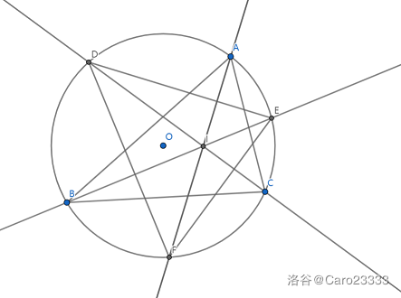
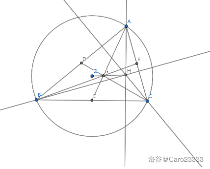
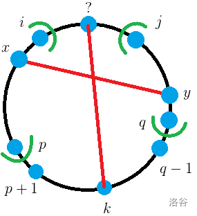
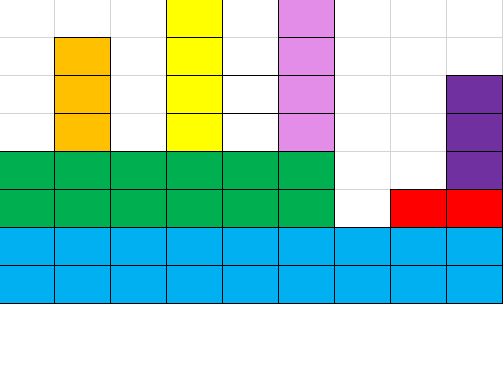

[TOC]

## [AT5160 [AGC037C] Numbers on a Circle](https://www.luogu.com.cn/problem/AT5160)

首先如果 $B_i<A_i$ 就直接输出 $-1$

正着做看上去很难做我们考虑倒着做，也即是 $B_i\leftarrow B_i-B_{i-1}-B_{i+1}$

那么我们现在 $B_i$ 有一个最大值，那么这个最大值两边都不能操作，直到比最大值变小才能可能可以操作。因此我们可以直接用最大值两边的和去减最大值直到不能减为止。如果最大值不能被减并且和 $a_i$ 不相等就无解。

一次至少能减小一半，用堆维护最大值，因此复杂度是 $\mathcal O(n\log n\log W)$ 

## [AT5161 [AGC037D] Sorting a Grid](https://www.luogu.com.cn/problem/AT5161)

题目没说要输出 $-1$ 因此我们可以认为一定有解。

然后我们可以一列一列构造，记 $x$ 的颜色为 $\lceil\frac xm\rceil$，然后一行向所有有的颜色连边，找出一个最大匹配就是这一列的值。把这一列扬了，后面一定仍然能够构造。跑 $m$ 次最大流即可。

## [AT5162 [AGC037E] Reversing and Concatenating](https://www.luogu.com.cn/problem/AT5162)

首先 $k=1$ 暴力就好了。

然后如果 $k>1$，不妨设最小的字母为 `A`，我们肯定希望开头连续的 `A` 尽可能多。那么我们的策略就是首先第一次选一段以尽可能多的 `A` 结尾的字符串，不妨设为 $sA$，然后下一次就是 $sAA$，再下一次是 $sAAAA$。但是最后一次是 $A\dots As_R$。由于 $SS_R$ 是回文串，于是就相当于找一段连续的 `A`，首先这一段 `A` 数量尽可能多，如果一样多就比较后面跟着的谁小。

## [AT5163 [AGC037F] Counting of Subarrays](https://www.luogu.com.cn/problem/AT5163)

/yun

首先判断一个序列是否合法，可以找到最小值 $x$，把 $x$ 的极长连续段 $[l_1,r_1],\dots,[l_k,r_k]$ 拎出来，然后如果 $r_i-l_i+1<m$ 那么肯定不合法，否则把这一段变成 $(r_i-l_i+1)/m$ 个 $x+1$。如果最后能变成一种数并且长度 $1$ 或这 $\ge l$ 就合法。

我们希望统计合法区间个数。不妨考虑一个“加强版”：$\sum_{i,j}L_iR_j[S_{i,j}\text{\ is\ good}]$，那么我们原来的问题就是 $L_i=R_i=1$。现在这样的好处是合并的时候可以把权值合并，比如 $1\ 1\ 1\ 1\ 1\ 1\ 1\ 1\ 1\ a\ b\ c\ d\ e$，其中 $a,b,c,d,e>1,l=3$，那么可以合并成 $2\ 2\ 2\ a\ b\ c\ d\ e$，那么取子串 $2\ 2\ a\ b\ c$，可以表示 $\overbrace{1 \ 1\dots\ 1\ 1}^{6\sim 8}\ a\ b\ c$，也就是说 $L'_2=L_2+L_3+L_4$。然后用栈维护即可。

至于为什么是对的小编也很想知道呢。

## [AT5200 [AGC038C] LCMs](https://www.luogu.com.cn/problem/AT5200)

爆推，记 $M=10^6,c_i=\sum_{1\le j\le n} [A_j=i]$，然后原始和 $\sum_{i=1}^n\sum_{j=1}^n\mathrm{lcm}(A_i,A_j)$ 显然就差了 $\sum_{i=1}^nA_i$ 再除以二，于是：
$$
\begin{aligned}
&\sum_{i=1}^n\sum_{j=1}^n\mathrm{lcm}(A_i,A_j)
\\=&\sum_{i=1}^M\sum_{j=1}^M\mathrm{lcm}(i,j)c_ic_j
\\=&\sum_{d=1}^M\sum_{i=1}^{\lfloor\frac Md\rfloor}\sum_{j=1}^{\lfloor\frac Md\rfloor}\frac{id\times jd}{d}c_{id}c_{jd}[\gcd(i,j)=1]
\\=&\sum_{d=1}^M\sum_{i=1}^{\lfloor\frac Md\rfloor}\sum_{j=1}^{\lfloor\frac Md\rfloor}i\times j\times d\times c_{id}\times c_{jd}\sum_{x|i,x|j}\mu(x)
\\=&\sum_{d=1}^M\sum_{x=1}^{\lfloor\frac Md\rfloor}\mu(x)\sum_{i=1}^{\lfloor\frac M{dx}\rfloor}\sum_{j=1}^{\lfloor\frac M{dx}\rfloor}ix\times jx\times d\times c_{idx}\times c_{jdx}
\\=&\sum_{T=1}^MT\left(\sum_{x|T}\mu(x)\times x\right)\left(\sum_{i=1}^{\lfloor\frac MT\rfloor}i\times c_{iT}\right)^2
\end{aligned}
$$

## [AT5201 [AGC038D] Unique Path](https://www.luogu.com.cn/problem/AT5201)

其实本质就是构造题。

首先对 $c_i=0$，把 $a_i,b_i$ 连起来，最后得到若干个连通块。只有一条路径就意味着这些连通块都是树。

然后如果 $c_i=1$，$a_i,b_i$ 在同一个连通块内就无法构造。

然后手玩一下发现每个树上只有一个点可以向外连边，连通块个数为 $k$，现在还需要连 $m-n+k$ 条边。然后讨论有没有 $c_i=1$ ：

- 如果没有，那么 $k-1\le m-n+k\le \binom k2$ 就一定能构造
- 如果有，那么 $k\le m-n+k\le\binom k2\land k>2$ 就一定能构造

## [AT5202 [AGC038E] Gachapon](https://www.luogu.com.cn/problem/AT5202)

感觉如果做过类似的题目很容易想到 $\min-\max$ 反演：
$$
E(\max(S))=\sum_{T\subseteq S,T\ne\varnothing}(-1)^{|T|+1}E(\min(T))
$$
然后考虑钦定了 $T$ 如何去计算 $E(\min(T))$，记 $W(T)=\sum_{i\in T}A_i$，$S=W(\{1,2,\dots,n\})$。现在不在 $T$ 里面的我们已经不用管了，只考虑 $T$ 的期望步数如果是 $x$，走一步恰好在 $T$ 的概率是 $W(T)/S$，因此期望是 $S/W(T)\times x$ 步。于是我们现在只考虑 $T$ 内部。然后期望有一种众所周知的转化是 $E(X)=\sum_{i=0}P(X>i)$，所以我们不妨枚举 $k$ 步还没有走完，也就是枚举 $\sum_{i\in T}c_i=k$，$\forall i\in T,c_i< b_i$，那么这一组 $c_i$ 对答案的贡献是：
$$
\prod_{i\in T}\left(\frac{A_i}{W(T)}\right)^{c_i}\frac{k!}{\prod_{i\in T}c_i!}
$$
然后比较经典地把每一个 $i$ 的贡献提出来：
$$
k!W(T)^{-k}\prod_{i\in T}\frac{A_i^{c_i}}{c_i!}
$$
于是计算 $T$ 就是：
$$
S/W(T)\sum_{k=0}k!\times W(T)^{-k}\times\sum_{\sum_{i\in T}{c_i}=k,\forall i\in T,c_i<b_i}\prod\frac{A_i^{c_i}}{c_i!}
$$
最后的答案就是：
$$
\sum_{T}{\color{red}{(-1)^{|T|+1}}}\sum_{k=0}S\times k!\times W(T)^{-k-1}\times \color{red}{\sum_{\sum_{i\in T}{c_i}=k,\forall i\in T,c_i<b_i}\prod\frac{A_i^{c_i}}{c_i!}}
$$
虽然这个式子看上去又臭又长，复杂度爆炸，但是确实可以做了，设 $f_{i,j,k}$ 表示考虑了前 $i$ 个数， $W(T)=j$，$\sum c_i=k$，红色部分的贡献和，转移就考虑 $i$ 在不在 $T$ 里，$c_i$ 是多少，即：
$$
f_{i,j,k}=f_{i-1,j,k}-\sum_{l=0}^{b_i-1}f_{i-1,j-a_i,k-l}\times\frac{A_i^l}{l!}
$$
 然后答案是：
$$
\sum_{j}\sum_{k}S\times k!\times j^{-k-1}\times f_{n,j,k}
$$
因为 $\sum B_i$ 是 $\mathcal O(n)$ 级别的所以复杂度是 $\mathcal O(n^3)$ 的。

## [AT5203 [AGC038F] Two Permutations](https://www.luogu.com.cn/problem/AT5203)

手玩一下，发现对于一个环，要么都是 $i$，要么都是 $P_i$。然后我们求出 $i$ 所在的环 $p_i$ 和 $q_i$，每个环可以旋转或不旋转，考虑 $A_i=B_i$ 的条件：

- 如果 $P_i=Q_i=i$，那么一定
- 如果 $P_i=i,Q_i\ne i$，当且当且仅当 $q_i$ 不旋转
- 如果 $P_i\ne i,Q_i=i$，那么当且仅当 $p_i$ 不旋转
- 如果 $P_i\ne i,Q_i\ne i,P_i\ne Q_i$，那么当且仅当 $p_i$ 和 $q_i$ 都不旋转
- 如果 $P_i=Q_i\ne i$，那么当且仅当 $p_i$ 和 $q_i$ 状态相同

于是就可以网络流了，$S\to p_i$ 联通表示旋转，$q_i\to T$ 联通表示旋转，如果割掉表示不旋转，要付出代价，具体是：

- 没有
- $q_i\to T$ 的代价增加 $1$
- $S\to p_i$ 代价增加 $1$
- 如果都不旋转那么 $S\to q_i,p_i\to T$ 是联通的，那么就要割掉 $q_i\to p_i$ 付出 $1$ 的代价
- 都旋转是 $p_i\to q_i$ 付出 $1$ 的代价，都不旋转是 $q_i\to p_i$ 付出 $1$ 的代价

然后就可以做到 $\mathcal O(n\sqrt n)$ 了。

 ## [AT5617 [AGC039C] Division by Two with Something](https://www.luogu.com.cn/problem/AT5617)

首先有一个结论是一次操作就相当于把这个 $n$ 位二进制数最后一位取反移到最高位。

然后就相当于把 $a$ 和 $\lnot a$ 拼起来得到 $b$，每次把 $b$ 的最低位移到最高位，问多少次才能回到原来。也就是循环节。

然后考虑循环节 $T$ 有什么性质，首先 $T|2n$ 是肯定的，又因为我们刚才的定义所以 $n$ 不是循环节所以 $T\not| n$。

然后我们可以断言 $\frac{2n}T$ 一定是奇数，也就是把整个串分成了奇数段。然后设循环节前 $\frac T2$ 是 $p$ 后 $\frac T2$ 是 $q$ 那么前半个串就是 $\overline{pq\dots qp}$，后半个串是 $\overline{qp\dots pq}$。

现在我们还有 $x$ 的限制，不妨先枚举 $T$，然后前 $\frac T2$ 位是 $s$，如果 $\overline{s\lnot ss\lnot s\dots}$ 是合法的话就有 $s+1$ 否则只有 $s$

然后我们这个是钦定循环节是 $T$，可能循环节实际上是 $T$ 的因数，所以还需要减去那些值，才是恰好为 $T$。

## [AT5618 [AGC039D] Incenters](https://www.luogu.com.cn/problem/AT5618)

首先把三条角平分线画出来：

然后 $I$ 就是我们要求的点。可以证明 $I$ 是垂心。然后只看 $\triangle DEF$：

然后 $G$ 是重心，$H$ 是垂心，根据某典中典我们知道 $\vec{OH}=3\vec{OG}$，所以重心的坐标乘三就是垂心的坐标。

于是我们只要求出三个弧中点的和的期望就可以了，然后就只需要对每一个中点计算对答案的贡献即可。

## [AT5619 [AGC039E] Pairing Points](https://www.luogu.com.cn/problem/AT5619)

首先让 $n=2N$，我们枚举 $1$ 和谁连接，那么分成了两个区间。

然后我们发现对于区间 $[i,j]$，连边大概是这样的：

有且仅有一条出边，那么为了连成树，必须有一条从 $[i,k)\to(k,j]$。于是枚举最上面的一条 $x\to y$。那么找到  $[i,p]$ 满足除了 $x$ 没有向外的边 $[q,j]$ 同理。于是我们设 $\rm dp$ 数组 $f_{l,i,r}$ 表示 $[l,r]$ 留出 $i$ 向外连边的合法方案数，那么有转移：
$$
f_{l,i,r}=\sum f_{l,x,p}f_{p+1,i,q-1}f_{q,y,r}[A_{x,y}]
$$
然后直接做这个复杂度是 $\mathcal O(n^7)$ 的，因为常数很小所以是可以过的。发现当 $p,q$ 固定时， $\sum$ 内部的东西除了 $f_{p+1,i,q-1}$ 都是和 $i$ 无关的，于是可以一起计算。$f_{p+1,i,q-1}\sum f_{l,x,p}f_{q,y,r}[A_{x,y}]$。令 $g_{l,k,p}=\sum f_{l,j,p}[A_{j,k}]$，那么后面的就是 $\sum g_{l,k,p}f_{q,k,r}$，计算 $f$ 的时候顺便计算 $g$ 就可以做到 $\mathcal O(n^5)$。

## [AT5660 [AGC040B] Two Contests](https://www.luogu.com.cn/problem/AT5660)

首先可以有每个区间最大左端点 $L=\max l_i$， 和最小右端点 $R=\min r_i$，那么如果 $L,R$ 是一条线段贡献的，那么这条线段所在集合一定是 $[L,R]$，另一个集合选最长那条即可。当然如果 $n=2$ 只有一种情况。

然后剩下的情况是两种：

- 如果 $[L,?]$ 和 $[?,R]$ 在同一个集合，那么这个集合的交一定是 $[L,R]$，另一个集合选最长
- 否则在不同集合，如果 $[l_i,r_i]$ 和 $[L,?]$ 在同一个集合，那么这个集合的长度就要 $\mathrm{chkmin}(\max(0,r_i-L+1))$，如果和 $[?,R]$ 在同一个集合那么就要 $\mathrm{chkmin}(\max(0,R-l_i+1))$。于是就变成一些点，每个点有两个参数 $(a,b)$，第一个集合的和是第一维的最小值，第二个集合是第二个的最小值，按第一位排序，枚举到一个 $a$ 时 $(<a)$ 的 $b$ 的最小值就是此时第二个集合的权值。

## [AT5661 [AGC040C] Neither AB nor BA](https://www.luogu.com.cn/problem/AT5661)

考虑一个转换是对一个 $s$，把 $s$ 奇数位上的 `A` 和 `B` 反转，那么不能删的就变成了 `AA` 和 `BB`。这显然是一个双射。

不能删 `AA` 和 `BB` 那么需要 `A` 和 `B` 的数量不大于 $\lfloor\frac n2\rfloor$。首先这个是必要的。然后可以归纳地证明是充分的。

然后就不难计数了，首先随便填，然后减去非法的即可。

## [AT5662 [AGC040D] Balance Beam](https://www.luogu.com.cn/problem/AT5662)

首先如果顺序固定，我们可以把 Alice 和 Bob 的折线（位移-时间图像）画下来，然后交点就是他们相遇的地方。不妨设 $\sum A_i=suma$，那么 Alice 折线的终点就是 $(n,suma)$。

然后我们现在要算概率。其实这个概率非常假，因为合法的是连续的一段区间（显然越远越难追到）。具体的计算方式是下移 Bob 的折线直到恰好有交点，再往下就没有交点，然后这时 Bob 的折线会和坐标轴有一个交点 $(k,0)$，也就是最远距离。然后 $k/n$ 就是我们要求的概率。

但是现在方案没有给我们。有一个求法是计算 $(k,0)$ 出自那一块砖，不妨设为 $(A_i,B_i)$，那么 $\lceil k\rceil$ 的纵坐标至少为 $B_i$，我们希望最小化后面的线段数量。然后后面的折线观察肯定是先往上走 Bob 的折线，有交点，然后走 Alice 的折线，于是一块砖最大的贡献是 $\max (a_i,b_i)$，我们把斜率尽可能大的放在 $(A_i,B_i)$ 这块砖右边就可以保证后面的砖尽可能少了。然后我们需要证明一定可以取到。其实只需要按照 $a_i-b_i$ 从小到大摆放即可。

于是就很清楚了，用一个分数表示答案，我们枚举砖，然后二分后面需要多少块，得到有多少块之后可以得到具体的坐标，对所有坐标取最大值即可。

p.s. 为了实现方便可以先存到 $n$ 距离的最小值。

## [AT5663 [AGC040E] Prefix Suffix Addition](https://www.luogu.com.cn/problem/AT5663)

这道题也比较演。首先其实这个前缀加、后缀加都是唬人的，因为我们可以补 $0$ 来做到任意一段加不降子序列、不升子序列。

然后如果只有一种是很好做的，比如只有不降那么总数就是 $\sum_{i=0}^n [A_i>A_{i+1}]$。但是有两种就比较麻烦，我们需要 $\rm dp$。然后有一个很显然的 $\rm dp$ 是 $f_{i,j}$ 表示 $i$ 有 $j$ 分配给了不降，剩下 $A_i-j$ 分配给了不升。那么转移是 $f_{i+1,j}\leftarrow f_{i,k}+[k>j]+[A_i-k<A_{i+1}-j]$，后面化简一下是 $[k-j>0]+[k-j>A_{i+1}-A_i]$。于是我们的 $f_{i,j}$ 相同时希望 $j$ 越大肯定是最优的。然后我们还发现 $f_{i,*}$ 的极差不会超过 $2$，因为最差顶多增加 $2$，于是我们只需要记录取最小值时最优的 $j$，取次小值时最优的 $j$ 即可。

状态数是 $\mathcal O(n)$ 的。

## [AT5664 [AGC040F] Two Pieces](https://www.luogu.com.cn/problem/AT5664)

神仙计数。

还是先转化，为了防止操作重复，我们当距离为 $1$ 的时候只能使用瞬移而不是移动后一颗棋子，那么可以发现两个操作序列不同的每一步位置的序列也一定不同。现在就只需要对操作计数即可。

我们把前面的棋子叫做 $b$，后面的棋子叫做 $a$，那么 $b$ 操作向前的次数一定是 $B$，但是 $a$ 操作的次数不一定，我们假设向前次数是 $k$。

如果没有瞬移操作，那么这个是容易计数的，看成一个点 $(b\text{的坐标},a\text{的坐标})$，那么一次上移一步或左移一步，除了 $(0,0)$ 不能碰到 $x=y$ 这条线，最终的目标是 $(B,k)$。这个方案数计数非常经典如果碰到了就翻转路线，也就是 $\binom{B+k-1}{B-1}-\binom{B+k-1}{k-1}$。

然后考虑插入瞬移操作。首先最后一个瞬移操作的位置是确定的，我们要把 $(B,k)$ 上移到 $(B,A)$，然后折线会和 $x=y$ 有交点，最后一个交点就一定是我们最后一次瞬移。

然后不考虑这一次瞬移，前面的瞬移能操作当且仅当目前距离为 $d_i$，$j>i$，都满足 $d_j>d_i$，否则就撞到线上去了。然后分析一波可以选的 $d_i\in [0,A-k]$，于是 $A-k+1$ 个变量和为 $n-B-k-1$，随便组合数一波即可。

复杂度 $\mathcal O(n)$。

## [AT5695 [AGC041D] Problem Scores](https://www.luogu.com.cn/problem/AT5695)

首先这个要求三是最难处理的，我们先考虑这个约束。因为要对任意满足，所以 $S$ 取后 $k$ 个，$T$ 取前 $k+1$ 个。然后我们记 $\Delta = \sum_{x=1}^{k+1} A_x-\sum_{x=n-k+1}^n A_y$。然后考虑 $k\leftarrow k+1$，那么 $\Delta$ 的改变量是 $A_{k+2}-A_{n-k}$，所以 $k=\lfloor\frac n2\rfloor$ 时 $\Delta$ 是最小的，我们只需要让这个时候是 $\Delta>0$ 即可。

然后考虑这个不降子序列，然后 $1\le A_n\le n$ 的限制，我们可以每次选一个前缀全部 $-1$，然后这样得到的一定是不降的。对每一个前缀，$\Delta$ 的减小量也是固定的，于是就相当于有 $n$ 个物品，每个可以取无限个，要求重量和不超过 $n-1$。简单 $\rm dp$ 即可。

## [AT5697 [AGC041F] Histogram Rooks](https://www.luogu.com.cn/problem/AT5697)

牛逼计数

图大概是这样的：

首先这个完全覆盖我们考虑容斥，钦定若干个不被覆盖，剩下的随意，然后就可以发现和这些钦定的同一行、同一列的联通的都不能放車。容斥系数显然是 $(-1)^k$，其中 $k$ 表示钦定不被覆盖的个数。

然后考虑一个非常 $\rm Naive$ 的 $\rm dp$ 就是像上图一样分割成笛卡尔树的形式，一个点被钦定不选那么同一行是不能放車了，并且这一列也不能放車，因此我们 $\rm dp$ 的时候记下当前有多少列是不能放车的，然后合并就是一个背包，因为在笛卡尔树上复杂度是 $\mathcal O(n^2)$ 的。

然后考虑现在加入新的一行。我们之前已经有 $p$ 列不能放車，现在的长度是 $len$，那么两种情况：

- 这一行没有車，那么系数就是 $2^{len-p}$
- 这一行有車，那么系数就是 $\sum_{i=1}^p \binom{p}i(-1)^i=-[p>0]$

但是这样还有一个问题就是我们有 $p$ 列不能放車，但是这 $p$ 列不一定有钦定的点，我们还需要再上一个容斥，钦定若干列是不能放車但是有钦定的点，假设被钦定的有 $q$ 列。于是我们重新考虑两类系数：

- 没有車显然是 $2^{len-p}$
- 有车显然是 $-[p>q]$

于是就可以 $\rm dp$ 了，随便分析一下就知道是 $\mathcal O(n^2)$ 的。因为我比较菜写了 $\log$。

## [AT5800 [AGC043C] Giant Graph](https://www.luogu.com.cn/problem/AT5800)

谁能想到这是博弈论/yun

首先一个结论是 $10^{18}$ 很大，因此我们肯定是按照 $x+y+z$ 从大往小选。

于是我们可以连有向边，从小的往大的连边，于是一个点被选当且仅当没有后继或所有后继都不选。

这个看上去和博弈论很像。其实就是一个博弈论，答案是所有必败点的权值和。

然后根据某经典结论三个游戏是独立的，$\rm SG$ 函数就是分别在三张图的 $\rm SG$ 函数的异或和，于是我们设三张图的 $\rm SG$ 函数分别是 $f(x),g(x),h(x)$，于是就相当于：
$$
\sum_{f(x)\oplus g(y)\oplus h(z)}10^{18(x+y+z)}
$$
因为 $\rm SG$ 函数值域是 $\mathcal O(\sqrt m)$ 的所以我们可以直接枚举 $f(x),g(y)$ 的值，然后乘起来，复杂度 $\mathcal O(m)$。

## [AT5801 [AGC043D] Merge Triplets](https://www.luogu.com.cn/problem/AT5801)

首先一个观察是不可能出现 $a_i$ 满足 $a_i>a_{i+1,i+2,a+3}$，不然分析一波根本不可能选 $a_i$

然后这个是一个必要条件，但是不够充分。考虑前缀最大值把整个序列划分成了若干段，刚刚的条件意味着每一段长度都 $\le 3$。

分析一个长度为 $3$ 的块，要么是变成 $3$ 的段一次选完，要么是 $1$ 和 $2$，要么是 $3$ 个长度为 $1$ 的。于是必定有长度为 $1$ 的段的数量 $\ge$ 长度为 $2$ 的段。

于是就可以 $\rm dp$ 了，按这个段 $\rm dp$，顺便记录一个长度为 $1$ $-$ 长度为 $2$ 的值即可。

复杂度 $\mathcal O(n^2)$。

## [AT5802 [AGC043E] Topology](https://www.luogu.com.cn/problem/AT5802)

绕绳子一不小心把自己绕进去了/dk

首先考虑 $\rm SPJ$ 怎么写。你要把绳子拉出去，那么一定有可以拉的地方。官方题解给出了一种很高妙的方法是对于一个点 $(i+0.5,0.5)$，顺着绳子有一圈，如果从上面经过那么记录下 $u_i$，从下面经过记录下 $d_i$，得到一个字符串，如果这个字符串有相邻的两位是相同的，就消去，也就意味着把绳子拉过来。如果最后能消完，也就意味着能取出，否则一定不能取出。而有了一个串我们也很容易构造出对应的绳子。

然后知道了这个之后我们考虑一种极其特殊的情况 `111...1110`，也就只有全部满的是不行的，否则一定可以拿出。这个看上去非常难构造。考虑一下方法：

假装有 $n$ 个点我们已经构造出了一个合法的串 $f_n$，现在我们在最前面加入了一个 $0$，我们还希望是合法的，那么我们先把 $f_n$ 里所有的标号加 $1$，比如 $u_i\to u_{i+1}$，变成 $a$，记 $a$ 的翻转为 $a'$，那么 $u_0\ a\ u_0\ d_0\ a'\ d_0$ 是一个符合条件的 $f_{n+1}$，如果你去掉的是 $0$ 那么 $a$ 和 $a'$ 中间两个一定是一样的肯定可以消空，否则不是的话可以先把 $a$ 和 $a'$ 消空，然后 $u_0$ 消掉，$d_0$ 消掉。

一个显然的观察是点越多越难拉出来，因此如果 $S$ 可以拉出来但是 $S\subset T$ 却不能拿出来就一定是不合法的。然后没有这种情况就一定合法，考虑给出构造：

找到一个 $S$ 满足 $S$ 不能拿出来但是 $T\subset S$ 都能拿出来，也就意味着这个就是上面说的情况，直接按照上面的构造即可。

但是这样极小的 $S$ 可能不唯一，把所有构造出来的绳子缝合起来即可。

上界很松随便写一写就过了。

## [AT5803 [AGC043F] Jewelry Box](https://www.luogu.com.cn/problem/AT5803)

首先因为要满足差分约束，所以重量交叉肯定是不优的，由此我们知道同一家店的珠宝是按照重量排序的。

然后我们设 $X_{i,j}$ 表示 $(i,1)\dots(i,j)$ 的购买数量，那么：

- $0=X_{i,0}\le X_{i,1}\le\dots\le X_{i,k_i}=A$
- $X_{i,j+1}-X_{i,j}\le C_{i,j}$
- 对于限制 $(u,v,w)$ 和珠宝 $(v,j)$，假设 $k$ 是最小的满足 $S_{u,k}+w\ge S_{v,j}$ 的值，那么限制就等价于 $X_{u,k-1}\le X_{v,j-1}$

于是我们可以写长如下的形式：
$$
\min\left\{\sum_{i,j}(\infty\max(X_{i,j}-X_{i,j+1},0)+\infty\max(X_{i,j+1}-X_{i,j}-C_{i,j},0)+P_{i,j}\max(X_{i,j+1}-X_{i,j},0))+\sum_{u,v,w,j}\infty\max(X_{u,j}-X_{v,k},0)+\sum_i(\infty X_{i,0}+\infty\max(X_{i,0}-X_{i,k_i}+A,0))\right\}
$$
这个东西对偶再取反是一个费用流，我们设原点是所有 $X_{i,0}$ 没有任何流量限制，汇点是 $X_{i,k_i}$，然后对于一条 $c \max(X_v-X_u-w)$，我们看做是从 $u$ 到 $v$ 连一条流量为 $c$ 费用为 $w$ 的边。

然后这个就是一组数据的情况，考虑这个 $A$ 变化时费用是 $C-AF$，其中 $C$ 是吧 $A$ 当成 $0$ 的费用，$F$ 是流量，取反后是 $AF-C$，然后就相当于求 $\min\{AF-C\}$，我们可以求费用流的时候顺便求出每一对 $(F,C)$，因为最短路长度是变大的，因此当最短路超过 $A$ 时费用就变成正的了显然不优，于是我们找到长度最长但是不超过 $A$ 的对应的 $(F,C)$ 输出 $AF-C$ 即可。

