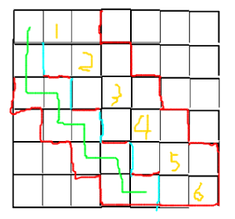

- [P3822 \[NOI2017\] 整数](#p3822-noi2017-整数)
- [P4898 \[IOI2018\] seats 排座位](#p4898-ioi2018-seats-排座位)
- [P3665 \[USACO17OPEN\]Switch Grass P](#p3665-usaco17openswitch-grass-p)
- [P1224 \[NOI2013\] 向量内积](#p1224-noi2013-向量内积)
- [P5155 \[USACO18DEC\]Balance Beam P](#p5155-usaco18decbalance-beam-p)
- [CF1083C Max Mex](#cf1083c-max-mex)
- [P4687 \[IOI2008\] Pyramid Base](#p4687-ioi2008-pyramid-base)
- [CF1267H Help BerLine](#cf1267h-help-berline)
- [CF1208H Red Blue Tree](#cf1208h-red-blue-tree)
- [ZROI#2187. \[22省选第一轮集训\]神必的集合](#zroi2187-22省选第一轮集训神必的集合)
- [ZROI#2188. \[22省选第一轮集训\]法阵](#zroi2188-22省选第一轮集训法阵)
- [ZROI#2189. \[22省选第一轮集训\]旅行](#zroi2189-22省选第一轮集训旅行)
- [ZROI#2184. 【2022省选十连测 Day 4】回路](#zroi2184-2022省选十连测-day-4回路)
- [ZROI#2185. 【2022省选十连测 Day 4】图](#zroi2185-2022省选十连测-day-4图)
- [ZROI#2192. 稳王](#zroi2192-稳王)
- [ZROI#2008. 【2021提高组十连测day2】拓扑](#zroi2008-2021提高组十连测day2拓扑)
- [ZROI#2014. \[zr联赛十连测day3\] 修建道路](#zroi2014-zr联赛十连测day3-修建道路)
- [P4823 \[TJOI2013\]拯救小矮人](#p4823-tjoi2013拯救小矮人)
- [CF566C Logistical Questions](#cf566c-logistical-questions)
- [P7831 \[CCO2021\] Travelling Merchant](#p7831-cco2021-travelling-merchant)
- [P6944 \[ICPC2018 WF\]Gem Island](#p6944-icpc2018-wfgem-island)
- [P1758 \[NOI2009\] 管道取珠](#p1758-noi2009-管道取珠)
- [P2508 \[HAOI2008\]圆上的整点](#p2508-haoi2008圆上的整点)
- [P6672 \[清华集训2016\] 你的生命已如风中残烛](#p6672-清华集训2016-你的生命已如风中残烛)
- [P2490 \[SDOI2011\]黑白棋](#p2490-sdoi2011黑白棋)
- [P4899 \[IOI2018\] werewolf 狼人](#p4899-ioi2018-werewolf-狼人)
- [CF585F Digits of Number Pi](#cf585f-digits-of-number-pi)
- [P4689 \[Ynoi2016\] 这是我自己的发明](#p4689-ynoi2016-这是我自己的发明)
- [P2444 \[POI2000\]病毒](#p2444-poi2000病毒)
- [P5339 \[TJOI2019\]唱、跳、rap和篮球](#p5339-tjoi2019唱-跳-rap和篮球)
- [P5223 Function](#p5223-function)
- [P2414 \[NOI2011\] 阿狸的打字机](#p2414-noi2011-阿狸的打字机)
- [SP8406 TEMPLEQ - Temple Queues](#sp8406-templeq-temple-queues)
- [P4630 \[APIO2018\] Duathlon 铁人两项](#p4630-apio2018-duathlon-铁人两项)
- [CF715D Create a Maze](#cf715d-create-a-maze)
- [CF538H Summer Dichotomy](#cf538h-summer-dichotomy)
- [P4647 \[IOI2007\] sails 船帆](#p4647-ioi2007-sails-船帆)
- [P5313 \[Ynoi2011\] WBLT](#p5313-ynoi2011-wblt)
- [ZROI.#2203. b](#zroi2203-b)
- [P5050 【模板】多项式多点求值](#p5050-模板多项式多点求值)
- [ZROI.#2204. c](#zroi2204-c)
- [P4004 Hello world!](#p4004-hello-world)
- [CF526F Pudding Monsters](#cf526f-pudding-monsters)
- [CF997E Good Subsegments](#cf997e-good-subsegments)

## [P3822 \[NOI2017\] 整数](https://www.luogu.com.cn/problem/P3822)

首先根据某个神秘结论我们知道暴力进位复杂度是均摊 $\mathcal O(1)$ 的。

然后我们把 $64$ 位压成一个 `unsigned long long` 暴力进位复杂度是正确的。

但是又有加法又有减法上面的分析就挂了，考虑让加法和减法分开来考虑，然后我们的目的就是会不会借位就可以了。这个借位也就是比较后面的位的大小，就直接比较第一个加和减不同的位即可。可以用 `set` 维护这个第一个不同的位。

## [P4898 \[IOI2018\] seats 排座位](https://www.luogu.com.cn/problem/P4898)

首先观察 $H=1$ 的情况有一个非常经典的结论是点数 \- 边数 = 联通块数量，所以就维护一下加入点的时候联通块数量的变化就好了。可以用线段树维护然后记录前缀和最小值的个数即可。

但是这个方法没有办法扩展到二维的情况。考虑另一种理解，加入点时的边界数量的变化，如果边界数量是 $2$ 那么就是一个联通块否则不是。然后这个可以扩展到二维的情况，就可以维护加入一个点时角的数量。注意这里的**角**可以是 $90\degree$ 和 $270\degree$。然后是一个矩形当且仅当角的数量为 $4$。

然后暴力维护一下改变时周围的点的变化扔进线段树就好了。

## [P3665 \[USACO17OPEN\]Switch Grass P](https://www.luogu.com.cn/problem/P3665)

首先一个结论是这条最短的异色边一定在最小生成树上，证明就考虑最小生成树kruskal生成的时候第一条异色的边就是我们希望的答案。

然后现在就是一棵树了，对每一个节点维护所有儿子的最小值。一次操作只会更改两个的最小值。

然后对每个节点维护每一个颜色的边，然后维护每一个颜色的最小值，然后就可以找到最小的边，然后用一个全局的 `multiset` 维护最小值就好了。

## [P1224 \[NOI2013\] 向量内积](https://www.luogu.com.cn/problem/P1224)

首先把暴力打满好像就可以得到不错的分数了。

然后把 $k=2$ 打一个 `bitset` 然后就会发现 $\mathcal O(\frac{n^2d}w)$ 可以通过 $85$ 分。

~~然后场上 $85$ 就可以跑路了。~~然后套上随机化，我们发现如果 $A\cdot B\not\equiv 0\bmod 3$， 那么 $(A\cdot B)^2\equiv 1\bmod 3$，然后我们可以维护一个前缀的 $A\times A^T$ 的和，然后暴力乘就可以得到 $\sum _{1\le j<i}A_{j}\cdot A_i$ 的和了，然后如果不是 $(i-1)\mod 3$ 那么 $i$ 就一定是可行的，暴力找一找前面合法的就好了。

复杂度是 $\mathcal O(nd^2)$，多随机几次就可以过了。

## [P5155 \[USACO18DEC\]Balance Beam P](https://www.luogu.com.cn/problem/P5155)

首先由一个非常 $\rm Naive$ 的 $\rm dp$ 是 $dp_{i}=\max(f(i),(dp_{i-1}+dp_{i+1})/2)$，看上去就非常不好做。

但是你发现如果把一个 $dp_i$ 看做是点 $(i,dp_{i})$，那么 $\max$ 后一项就是两个点的中点。经过一些高妙的分析就可以发现最后一定形成一个凸包，所以只需要把所有 $(i,f(i))$ 跑一遍凸包就可以得到这个位置最后的 $dp_i$ 是多少了。

## [CF1083C Max Mex](https://www.luogu.com.cn/problem/CF1083C)

感觉这个东西挺套路的，首先显然满足可二分性的，然后只需要二分 $\le x$ 的数字能不能构成一条链就好了。这个**构成链**是可合并的，可以把 $[a,b]$ 和 $[b+1,c]$ 的链合并起来得到一条更大的链。

然后这个就是 $\mathcal O(n\log^3n)$ 的了。然后把二分改成线段树上二分就是 $\mathcal O(n\log^2n)$，用 `ST` 表做到 $\mathcal O(1)$ 的 $\rm LCA$ 就是一只 $\log$ 但是好像没什么必要。

## [P4687 \[IOI2008\] Pyramid Base](https://www.luogu.com.cn/problem/P4687)

首先如果 $B\ne 0$ 就直接二分大小 $P\log P\log N$ 显然是能过的。

如果 $B=0$ 那么一个都不能出现，所以可以用 $\rm two-pointers$ 维护一个左，一个右，如果最长的没有被覆盖的段长度不够，就移动左指针直到够。经过高超的复杂度分析可以知道是一只 $\rm log$ 的。

## [CF1267H Help BerLine](https://www.luogu.com.cn/problem/CF1267H)

首先这个 $24$ 应该是一个 $\log$ 级别的，所以我们可以考虑用一种颜色把问题缩小到一个更小的规模然后继续求解。

考虑现在的这种颜色需要满足什么性质，首先要满足任何时刻不能有两个相邻的颜色相同。然后我们发现如果满足这个条件，忽略这些点，然后如果剩下的点始终是合法的，那么加上这些点也同样是合法的。

然后我们考虑我们最多选出多少点，看上去是一个最大独立集问题，但是我们不需要最大，因此可以贪心。考虑时间从后往前跑，如果一个点没有被标记过，那么选中，并标记掉当前的前驱和后继。不难发现这样构造一定满足任何时刻相同颜色不相邻，并且一个点最多标记两个点，因此至少能选中 $\lceil\frac n3\rceil$ 个点。

于是我们能够用一种颜色，把问题缩小到 $\lfloor\frac23n\rfloor$ 的规模，颜色种数应当是 $\log_{\frac32}n$ 的。

邓老师说这题可以做到 $n=12100,k=23$，也就是 $\overbrace{\lceil\dots\lceil\lceil1}^{22}\times 1.5\rceil\times1.5\rceil\times1.5\dots\rceil=12137$，所以说原题还是蛮松的。

## [CF1208H Red Blue Tree](https://www.luogu.com.cn/problem/CF1208H)

虽然是 $*3500$ 但是不是特别绕，只是代码有一点难写，蒟蒻写了 $114514$ 分钟才写完。

考虑如果没有叶子颜色的变化，那么随着 $k$ 的增加，感性理解一下发现一个节点变红更加容易。因此，对于一个节点 $u$，我们可以处理出刚刚好变成红色的时的 $k_u$，然后只需要用当前的 $k$ 与 $k_u$ 比较大小就可以得到颜色了。

求 $k_u$ 有一个比较 $\rm Naive$ 的做法是二分，然后看 $|son_u|-2\sum_{v\in son_u}[k_v\le k_u]<k_u$ 也就是 $k_u+2\sum_{v\in son_u}[k_v\le k_u]>|son_u|$ 能否满足，但是求一次是 $\mathcal O(n\log n)$ 的，并且更改之后不容易方便地维护。考虑开一棵权值线段树，然后再权值线段树上二分，就可以 $\mathcal O(\log n)$ 的时间更改一个 $k_v$，$\mathcal O(\log n)$ 计算现在的 $k_u$。

然后再加上更改操作，看上去感觉很像 $\rm DDP$，那么我们先树链剖分再说。于是一个点有了轻儿子和重儿子，考虑如何将信息合并。首先我们不考虑重儿子得到一个 $k$，然后考虑重儿子的权值是 $x$ 想要加入，此时 $\rm{LHS}-\rm{RHS}=\Delta>0$，$\sum_{v\in lightson_u}[k_v=k]=cnt_0$，情况非常有限：

- $x>k$
    
    - $\Delta=1$，那么右边增加 $1$ 之后 $\Delta'=0$，为了仍然满足等式 $k' = k+1$
    - $\Delta>1$，那么右边增加 $1$ 后大于号仍然成立，并且 $k$ 不可能减小，所以 $k'=k$
- $x=k$
    
    - 显然 $k'=k$ 是可行的，左边加 $2$ 右边加 $1$ 是满足的。然后再分析一下如果 $k'<k$，那么原来就不行，现在右边变大了就更不行
- $x<k$
    
    - 这个就比较麻烦了。首先分析一下发现 $k'<k-1$ 是一定不行的，考虑加入重儿子如果 $k-2$ 可行那么不考虑重儿子就直接选 $k-1$ 了，推出了矛盾。那么 $k'=k-1$ 可行的条件就是 $\Delta-1-2cnt_0+2>1$
    - 如果那个条件不满足就 $k'=k$

于是这个函数只有三段区间，我们把这个转移写成 $k'_u=f_u(heavyson_u)$，这个函数可以比较方便地合并，于是写一棵平衡树或线段树就可以较快地转移了。函数 $f_u(x)$ 就直接在权值线段树上模拟上面的过程就好了。

发现更改轻儿子的复杂度是 $\mathcal O(\log n)$ 的，每一次最多更改 $\mathcal O(\log n)$ 个轻儿子，一条重链更改平衡树的复杂度是 $\mathcal O(\log n)$ 的，最多更改 $\mathcal O(\log n)$ 条，所以复杂度是 $\mathcal O(q\log^2n)$ 的。

## [ZROI#2187. \[22省选第一轮集训\]神必的集合](http://zhengruioi.com/contest/1092/problem/2187)

枚举最简线性基的大小为 $d$，那么考虑从低到高分别标号为 $0,\dots,d-1$，那么第 $x$ 小的数就是 $x-1$ 表示成二进制后为 $1$ 的那些位在线性基里对应的位的异或值。

所以题目的限制变成限定若干个数的异或和为指定的数。考虑从低到高枚举，然后 $dp[i][j]$ 表示到第 $i$ 为已经有 $j$ 个数的方案数。转移的时候考虑是主元还是自由元，如果是主元的话，线性基需要新加一个数，当前位只有这个数在这一位上是 $1$，所以所有这一位是 $1$ 的 $y$ 对应的 $x-1$ 这一个数也是 $1$。然后如果是自由元的话，那么下一个数到最后一个数的那些位都可以 $01$ 任意填，限制是一些位异或和为 $0$ 或 $1$。相当于求一个线性方程解得个数，直接高斯消元后求解得个数，显然就是 $2^{\text{自由元个数}}$。高斯消元可以压位优化，复杂度 $\mathcal O(n^5m/\omega)$

然后我们不需要枚举基底的大小，于是我们设 $mx=\max x_i$，求出最小的 $d$ 使得 $2^d\ge x$，那么基底的大小必然 $\ge d$ 并且编号 $\ge d$ 的分量没有任何的限制可以任意填。于是最后把这些任意填的方案数乘上即可。复杂度 $\mathcal O(n^4m/\omega)$

## [ZROI#2188. \[22省选第一轮集训\]法阵](http://zhengruioi.com/problem/2188)

首先一个结论是 $(l,r)$ 并且 $a_l> a_{l+1,\dots,r-1},a_r>a_{l+1,\dots,r-1}$ 的二元组只有 $\mathcal O(n)$ 个，因为单调栈的复杂度是 $\mathcal O(n)$ 的。

然后还有一个结论是对于 $(x,y)$ 如果存在 $z\in(x,y),a_z\ge a_x$ 或 $a_x\ge a_y$，那么这个 $z$ 换成 $x$ 或 $y$ 显然不会更劣。所以能成为 $x,y$ 只有上面的二元组。

然后我们就可以按照询问的左端点从大到小排序，然后对于一个 $(x,y)$，就相当于让 $[2y-x,n]$ 的 $i$ 都变成 $\max(a_i+a_x+a_y)$，可以使用线段树维护。

然后查询就是查询 $[l+2,r]$ 最大值。

## [ZROI#2189. \[22省选第一轮集训\]旅行](http://zhengruioi.com/problem/2189)

如果做过 \[NOI2019\] 弹跳 看到这种一个点出发价格相同的点一个很显然的思路就是把 距离 加上 价格 塞进优先队列里，然后一个点只会被更新一次，所以我们只需要快速拿出没有被更新过的距离 $\le d_i$ 的点这道题实际上就做完了。

首先考虑树的情况，我们建立点分树，然后再每个节点存下子树内所有点到这个点的距离，然后从小到大排序，然后查找的时候就用一个指针指向当前的位置，因为前面被更新过指针肯定不断后移最后复杂度可以做到 $\mathcal O(n\log n)$。当然懒得写 $\mathcal O(1)$ 的 $\rm LCA$ 两只 $\log$ 也是可以过的。

现在的问题就多了 $51$ 条边，我们在每条边上拿出一个端点，如果是从这些边上走过去的必然会经过一个端点，然后处理从这个端点出发的最短路，利用上面的方法做即可，复杂度仍然是正确的。

## [ZROI#2184. 【2022省选十连测 Day 4】回路](http://zhengruioi.com/problem/2184)

被诈骗了/fn

就bfs一遍，然后如果你碰到了之前的点并且不是前驱就一定是一条非平凡回路。

然后因为碰到一个不是前驱就退出所以一个点复杂度是 $\mathcal O(n)$ 的总的复杂度是 $\mathcal O(n^2)$

## [ZROI#2185. 【2022省选十连测 Day 4】图](http://zhengruioi.com/contest/1083/problem/2185)

阴间计数。考虑一个 $n$ 元生成函数：

$$
[x_1^2x_2^2\dots x_n^2]\prod_{i=1}\left(\sum_{1\le a<b\le n}x_ax_b-x_{p_i}\sum_{i\ne p_i}x_i\right)

$$

这个是对的，但是复杂度高得离谱。有一个容斥是钦定若干个违反规则，也就是和 $p_i$ 连边，那么 $S_1$ 里的 $p_i$ 是和被钦定违反了一次，$S_2$ 里的 $p_i$ 是被钦定违反了两次，那么现在的答案就变成了：

$$
[x_1^2x_2^2\dots x_n^2]\sum_{S_1,S_2}(-1)^{2|S_2|+|S_1|}\left(\prod_{v\in S_2}\left(x_v\sum x_j\right)^2\right)\left(\prod_{v\in S_1}x_v\left(\sum x_j-x_v\right)\right)\left(\frac{(\sum x_j)^2-\sum x_j^2}{2}\right)^{n-2|S_2|-|S_1|}

$$

然后拆一拆：

$$
[x_1^2x_2^2\dots x_n^2]
\sum_{S_1,S_2}(-1)^{|S_1|}
\left(\prod_{v\in S_2} x_v^2\right)\left(\sum x_j\right)^{2|S_2|}
\left(\prod_{v\in S_1}x_v\right)
\left(\prod_{v\in S_1} \sum x_j-x_v\right)
\left(\frac{(\sum x_j)^2-\sum x_j^2}{2}\right)^{n-2|S_2|-|S_1|}

$$

然后我们再把 $\prod_{v\in S_1}\sum x_j-x_v$ 拆了，具体方法是枚举 $S_1'\subseteq S_1$，这部分取 $-x_v$ 其他的取 $\sum x_j$

$$
[x_1^2x_2^2\dots x_n^2]
\sum_{S_1,S_2}(-1)^{|S_1|}
\left(\prod_{v\in S_2} x_v^2\right)
\sum_{S_1'\subseteq S_1}
(-1)^{|S_1'|}
\left(\prod_{v\in S_1}x_v\right)
\left(\prod_{v\in S_1'}x_v\right)
\left(\frac{(\sum x_j)^2-\sum x_j^2}{2}\right)^{n-2|S_2|-|S_1|}
\left(\sum x_j\right)^{2|S_2|+|S_1|-|S_1'|}

$$

然后二项式定理拆一波：

$$
[x_1^2x_2^2\dots x_n^2]
\sum_{S_1,S_2}
\frac{(-1)^{|S_1|}}{2^{n-2|S_2|-|S_1|}}
\left(\prod_{v\in S_2} x_v^2\right)
\sum_{S_1'\subseteq S_1}
(-1)^{|S_1'|}
\left(\prod_{v\in S_1}x_v\right)
\left(\prod_{v\in S_1'}x_v\right)
\left((\sum x_j)^2-\sum x_j^2\right)^{n-2|S_2|-|S_1|}
\left(\sum x_j\right)^{2|S_2|+|S_1|-|S_1'|}\\
=
[x_1^2x_2^2\dots x_n^2]
\sum_{S_1,S_2}
\frac{(-1)^{|S_1|}}{2^{n-2|S_2|-|S_1|}}
\left(\prod_{v\in S_2} x_v^2\right)
\sum_{S_1'\subseteq S_1}
(-1)^{|S_1'|}
\left(\prod_{v\in S_1}x_v\right)
\left(\prod_{v\in S_1'}x_v\right)
%\left((\sum x_j)^2-\sum x_j^2\right)^{n-2|S_2|-|S_1|}
\sum_{k=0}^{n-2|S_2|-|S_1|}(-1)^k\binom{n-2|S_2|-|S_1|}{k}
\left(\sum x_j^2\right)^k
\left(\sum x_j\right)^{2|S_2|+|S_1|-|S_1'|+2(n-2|S_2|-|S_1|-k)}\\
=
[x_1^2x_2^2\dots x_n^2]
\sum_{S_1,S_2}
\frac{(-1)^{|S_1|}}{2^{n-2|S_2|-|S_1|}}
\left(\prod_{v\in S_2} x_v^2\right)
\sum_{S_1'\subseteq S_1}
(-1)^{|S_1'|}
\left(\prod_{v\in S_1}x_v\right)
\left(\prod_{v\in S_1'}x_v\right)
%\left((\sum x_j)^2-\sum x_j^2\right)^{n-2|S_2|-|S_1|}
\sum_{k=0}^{n-2|S_2|-|S_1|}(-1)^k\binom{n-2|S_2|-|S_1|}{k}
\left(\sum x_j^2\right)^k
\left(\sum x_j\right)^{2n-|S_1|-2|S_2|-|S_1'|-2k}

$$

这个有一个最大的好处是现在之和 $S_1,S_2,S_1'$ 的大小有关，而和具体是什么无关。我们可以很容易地通过 $\mathcal O(n^3)$ 的 $\rm dp$ 求出 $f_{i,j}$ 表示 $|S_1|=i,|S_2|=j$ 的方案数。不妨枚举 $|S_1|=i,|S_2|=j,|S_1'|=t$，现在 $S_2$ 里的次数已经是 $2$ 次了，$S_1'$ 里面的也已经是 $2$ 次了，而 $S_1\setminus S_1'$ 还只有一次。因此我们求得就是从 $\sum_k$ 开始，有 $n-i-j$ 个两次，$i-t$ 个一次的系数是多少。再回到组合意义，$\left(\sum x_j^2\right)^k$ 表示选还有两次的，于是就是 $\binom{n-i-j}kk!$。然后后面的表示从剩下的 $2n-i-2j-t-2k$ 里面选，那么就是 $(2n-i-2j-t-2k)!$，然后因为有 $n-i-j-k$ 个任然是两次所以还要除以 $2^{n-i-j-k}$，于是最后就是：

$$
\sum_{i=0}^n\sum_{j=0}^nf_{i,j}\frac{(-1)^i}{2^{n-i-2j}}\sum_{t=0}^i(-1)^t\binom it\sum_{k=0}^{n-i-2j}(-1)^k\binom{n-i-2j}k\binom{n-i-j}kk!\frac{(2n-2j-i-t-2k)!}{2^{n-i-j-k}}

$$

然后可以交换求和顺序把 $t$ 拿到前面来：

$$
\sum_{i=0}^n\sum_{j=0}^nf_{i,j}(-1)^i\binom it\sum_{k=0}^{n-i-2j}(-1)^k\binom{n-i-2j}k\binom{n-i-j}kk!\frac{1}{2^{2n-2i-3j-k}}\sum_{t=0}^i(-1)^t(2n-2j-i-t-2k)!

$$

后面的只和 $i,2n-2j-i-2k$ 有关，对对每一组 $(i,j)$ 求出 $\sum_t (-1)^t\binom it(j-i)!$ 即可。复杂度 $\mathcal O(n^3)$。

## [ZROI#2192. 稳王](http://zhengruioi.com/problem/2192)

最优策略肯定是可以秒杀boss之后出牌

然后就可以写一个 $\mathcal O(n^3)$ 的 $\rm dp$

有一个思路是毒、复读、火球都有时，一个毒的贡献是 $1$，火球贡献 $3$，复读贡献 $4$。这个看上去是可以 $\rm dp$ 的。

然后一个很菜的思路是矩阵快速幂然后 $\rm TLE$ 了。

但是用 Berlekamp–Massey 求出递推式就可以过了。

好处是过了这道题坏处是什么也没学到（

## [ZROI#2008. 【2021提高组十连测day2】拓扑](http://zhengruioi.com/problem/2008)

直接 $\rm dp$ 即可，设 $f_{i,j}$ 表示下面到 $i$ 上面到 $j$ 的方案数，然后已经自由的下面挂着的东西已经确定了的方案数。然后转移就是分类讨论：

- 如果 $i=j$，那么只能转移到 $f_{i,j+1}$，然后 $i$ 下面挂的就自由了，枚举选 $i$ 之后下面的选了多少个之后选 $j+1$，设为 $k$，乘上方案数然后再乘上后面选 $2n-k$ 的方案数
- 如果 $i<j$
    - 上面的移动一格，不会产生新的自由，就直接转移到 $f_{i,j+1}$ 系数为 $1$
    - 下面的移动又要分类讨论
        - 如果 $i+1<j$ 会产生一个新的自由，乘上系数
        - 否则这个任然是不自由的，系数为 $1$

## [ZROI#2014. \[zr联赛十连测day3\] 修建道路](http://zhengruioi.com/problem/2014)

首先一个结论是不同的 $f_i$ 的个数就是边双连通分量的个数。

然后一个 $\rm Naive$ 的想法是 $f_{u,i,j}$ 表示节点 $i$ 的子树，当前联通块的大小为 $j$ 的方案数。

这个转移显然就是一个树上背包。但是我们发现这个最麻烦的地方就在于无法恰好让当前的块是边双。那么考虑 $g_i$ 是恰好有 $i$ 个边双的方案数，$f_i$ 表示现在的 $f_{1,i,0}$，那么就相当于说本来有 $j$ 个联通块 $j-1$ 条割边，变成了 $i$ 个联通块 $i-1$ 条割边，于是 $f_i=\sum_{j\ge i}\binom {j-1}{i-1}f_j$，然后就可以二项式反演了。

但是现在复杂度是 $\mathcal O(n^4)$ 的。然后我们发现可以用生成函数 $F_{u,j}(x)=\sum_{i}f_{u,i,j}x^i$，那么只需要带入 $n$ 个 $x$，然后你跑背包的时候就只需要枚举一维就好了，最后再高斯消元，复杂度是 $\mathcal O(n^3)$。

## [P4823 \[TJOI2013\]拯救小矮人](https://www.luogu.com.cn/problem/P4823)

首先一个很 $\rm Naive$ 的策略是定一个 $n$ 的排列，然后一个一个放出去看能放出去多少。

然后可以用exchange arguement证明肯定是 $a_i+b_i$ 比较小的先放出去比较好。于是先对这个排序。然后记 $f_{i,j}$ 表示前 $i$ 个钟放走了 $j$ 个最多还剩下的高度，那么可以从 $f_{i-1,j-1}$ 转移过来，条件是 $f_{i-1,j-1}+b_i\ge h$。

然后就是 $\mathcal O(n^2)$ 了。

## [CF566C Logistical Questions](https://www.luogu.com.cn/problem/CF566C)

一个比较神秘的结论是如果可以取边上任一点，然后这个 $x^{\frac32}$ 是下凸的，所以找到重心往外面走一定是变大的，然后只要不停往变小的方向走就是重心了。

但是这个还是 $\mathcal O(n^2)$ 的，然后就可以用点分治的方法，每次从重心开始走，看那边是减小的。判断减小的一个比较简单的做法是计算导数，如果距离为 $x$，那么导数就是 $1.5\sqrt x$。然后导数 $\le0$ 的方向不停走就可以得到这个重心了。

复杂度是 $\mathcal O(n\log n)$

## [P7831 \[CCO2021\] Travelling Merchant](https://www.luogu.com.cn/problem/P7831)

首先一个对于出度为 $0$ 的点是没有前途的，剩下所有点都有出度就一定有解。

然后我们拎出边权最大的边 $(u,v,r,p)$，那么 $u$ 只要有 $r$ 就一定可以了，也就是 $\mathrm{chkmin}(ans_u,r)$

然后删掉这条边，如果还有别的出边，那么还可以继续，否则这个就是答案了。

然后一个没有出边的点的答案可以更新所有到这个点的点，然后把这些点删除。

类似拓扑排序做一下就好了。

## [P6944 \[ICPC2018 WF\]Gem Island](https://www.luogu.com.cn/problem/P6944)

首先考虑如果最后的宝石数量是 $\{a_i\}$，那么方案数是什么：

- 首先我们分配多出来的这些宝石是在那些天多出来的，也就是
    
    $$
    \prod_{i=1}^n\binom{d-\sum_{j=1}^{i-1}(a_j-1)}{a_i-1}=\frac{d!}{\prod_{i=1}^n(a_i-1)!}
    
    $$
    
- 然后再分配选到这个人的时候是那一颗宝石，第一次选方案数只有 $1$，第二次是 $2$，也就是
    
    $$
    \prod_{i=1}^n (a_i-1)!
    
    $$
    

然后我们发现所有的 $\{a_i\}$ 得到的结果都是相同的，也就是说概率相同。于是我们只需要分配 $n+d$ 个数到 $n$ 个位置，每个数大于 $0$，求前 $k$ 打的方案数了。

然后这个是可以 $\rm dp$ 的，我们可以像下面一样画出一张图

```
  *
  *
 ** *
 ** *  *
*** ** *
********
```

一副这样的图就对应一个 $\{a_i\}$，然后权值就是每一层的个数与 $r$ 取 $\min$ 的和，然后我们就可以用 $f_{i,j}$ 表示除了第一层用了 $i$ 个，现在有 $j$ 列，而 $g_{i,j}$ 表示 $i$ 个 $j$ 列的期望和，于是有转移：

$$
f_{i+k,k}\leftarrow f_{i,j}\times \binom jk\\
g_{i+k,k}\leftarrow (g_{i,j}+f_{i,j}\times \min(k,r))\times \binom jk

$$

于是直接用 `double` 来做 $\rm dp$ 就好了，最后的答案显然是：

$$
\frac{\sum_{i=1}^n g_{d,i}}{\sum_{i=1}^n f_{d,i}}

$$

## [P1758 \[NOI2009\] 管道取珠](https://www.luogu.com.cn/problem/P1758)

首先转化乘选两个序列然后相同的方案数。

然后就很简单了，就直接 $f_{i,j,k}$ 表示两对管道，第一对上面取了 $i$ 个，下面取了 $j$ 个，第二对上面取了 $k$ 个下面取了 $i+j-k$ 并且当前序列相同的方案数，随便转移一下即可，

## [P2508 \[HAOI2008\]圆上的整点](https://www.luogu.com.cn/problem/P2508)

就是求 $y^2=r^2-x^2=(r-x)(r+x)$ 的解数，不妨令 $x>0,y>0$

然后记 $\gcd(r-x,r+x)=d$，设 $r-x=ud,r+x=vd$，那么 $\gcd(u,v)=0$ 并且 $uv$ 是完全平方数。不妨设 $u=s^2,v=t^2$，那么 $y=std,x=(t^2-s^2)d/2,r=(s^2+t^2)d/2$，那么我们只需要枚举 $d$ 是 $2r$ 的因数，然后再枚举 $s\le\sqrt {2r/d}$ 即可。

复杂度看上去有点高但是可以过。

## [P6672 \[清华集训2016\] 你的生命已如风中残烛](https://www.luogu.com.cn/problem/P6672)

首先就把这个序列全部减去 $1$，现在的和是 $0$，我们的要求是每个前缀和都是非负数。

然后翻转一下，我们发现这个等价于所有都是非正数，然后在最前面加一个 $-1$ 就相当于所有都是负数。然后取反就相当于全部都是正数并且和为 $1$。

然后就直接用Raney引理一个环就只有 $1$ 种方案，并且一定是一个 $1$ 开头的。然后环的个数是 $m!$，必须是我们钦定的那个开头，要除掉 $n-m+1$，所以最后的答案就是：

$$
\frac{m!}{n-m+1}

$$

## [P2490 \[SDOI2011\]黑白棋](https://www.luogu.com.cn/problem/P2490)

首先我们转化成 $\frac k2$ 堆石子每次可以取 $1\sim d$ 堆。

根据 k-nim 的结论我们知道必败态是每一位的 $1$ 的个数都是 $d+1$ 的倍数。

然后就直接背包即可。枚举第 $i$ 位是 $x(d+1)\times 2^i$，转移系数是 $\binom{k/2}x$

最后再插个板把石头放到棋盘上即可。

## [P4899 \[IOI2018\] werewolf 狼人](https://www.luogu.com.cn/problem/P4899)

首先可以建重构树

然后你发现就是求两棵树上的两个子树有没有交集

一个比较菜的方案就是直接线段树合并，记录在第二棵树上的子树内所有的点在第一棵子树内的 $\rm dfs$ 序，那么就相当于判断范围内有没有值即可。

看上去复杂度是 $\mathcal O(n\log n)$ 级别的。

## [CF585F Digits of Number Pi](https://www.luogu.com.cn/problem/CF585F)

就把 $s$ 所有长度为 $\lfloor\frac d2\rfloor$ 的子串扔进AC自动机然后跑数位dp即可。

就在普通的数位dp上多加一维表示现在在那个节点了即可

## [P4689 \[Ynoi2016\] 这是我自己的发明](https://www.luogu.com.cn/problem/P4689)

首先这个换根很废，因为你分析一波发现要么是一棵子树要么是一棵全部抠掉一棵子树。然后用 $\rm dfs$ 序我们就可以转变成 $\mathcal O(1)$ 个区间算这个东西了。

理论上直接用 [P5268](https://www.luogu.com.cn/problem/P5268) 就可以了。这里采用了一种不同的非莫队的方法。具体就是对出现的次数根号分治，对于次数 $\ge\sqrt n$ 的，那么只有 $\le \sqrt n$ 个可以直接暴力计算。对于次数 $<\sqrt n$ 的 $\sum cnt(i)^2=\mathcal O(n\sqrt n)$，所以把所有的合法点对存下来就变成了二维数点。因为更改次数是 $n^{1.5}$ 级别的因此我们采用 $O(\sqrt n)$ 查询 $\mathcal O(1)$ 更改的分块即可。

## [P2444 \[POI2000\]病毒](https://www.luogu.com.cn/problem/P2444)

就先建 AC 自动机，然后把所有危险的标记出来。

然后就是看有没有环。找环可以 tarjan 但是直接 $\rm dfs$ 也是可以过的。

## [P5339 \[TJOI2019\]唱、跳、rap和篮球](https://www.luogu.com.cn/problem/P5339)

首先一个比较显然的想法是先容斥钦定 $k$ 个连续，然后插板到整个序列里，就是 $(-1)^k\binom{n-3k}k$。

于是我们现在只需要求出在 $n-4k$ 个格子里面放个数分别为 $a-k,b-k,c-k,d-k$ 的四种球。我们不妨记 $F_n(x)=\sum_{i=0}^n\frac{x^i}{i!}$，答案很显然就是 $(n-4k)![x^{n-4k}]F_{a-k}(x)F_{b-k}(x)F_{c-k}(x)F_{d-k}(x)$

这个直接暴力 NTT 好像是艹得过去的但是不好。我们考虑分成两部分，那么从 $F_a(x)F_b(x)$ 我们可以直接在 $\mathcal O(n)$ 的复杂度内推出 $F_{a+1}(x)F_{b+1}(x)$，直接暴力即可。然后两部分的卷积我们只需要知道一项所以可以 $\mathcal O(n)$ 暴力卷。

复杂度 $\mathcal O(n^2)$

## [P5223 Function](https://www.luogu.com.cn/problem/P5223)

如果 $n\le k$ 直接暴力就好了

如果 $n>k$ 我们只在乎前 $k$ 项，不妨记第 $i$ 行的前 $k$ 项的生成函数是 $F_i(x)$，那么就有 $F_{i+1}(x)=xF_{i+1}(x)+F_i(x)+xF_i(x)$，也就是乘 $\frac{1+x}{1-x}$，直接快速幂就好了。

## [P2414 \[NOI2011\] 阿狸的打字机](https://www.luogu.com.cn/problem/P2414)

首先就是建 tire

建完之后发现就是问 $0\sim y$ 这条链上有多少在fail树上的 $x$ 的子树内。可以在fail树上求dfs序，然后就是求一段有多少。如果在线可以主席树当然离线就更简单了。

## [SP8406 TEMPLEQ - Temple Queues](https://www.luogu.com.cn/problem/SP8406)

首先我们不妨对所有 $a_i$ 排序，然后记下第 $i$ 个数原来的标号是 $id_i$，原来第 $i$ 个数现在变成到了 $pos_i$。

然后发现除了第1种操作以外都不会改变排序后的相对顺序，也就是说原来序列是单调不降的，现在仍然是单调不降的。既然这样那么我们可以直接在线段树上二分得到 $\ge x$ 的第一个位置，然后区间打标记就可以做到 $-1$。

然后现在加上操作1，我们发现如果这个数和后面的数不同，那么加 $1$ 之后仍然满足不降。但是如果和后面的数相同，我们可以先把这个数换到所有相同的数的最后面，然后直接加就好了。

复杂度看上去是 $\mathcal O(q\log n)$。

## [P4630 \[APIO2018\] Duathlon 铁人两项](https://www.luogu.com.cn/problem/P4630)

首先先建圆方树。

然后对于一对 $(s,t)$，所有在路径上的方点连接的圆点都是可以成为中转点。

然后一个方点的权值是 $\deg_i$，一个圆点的权值是 $-1$，那么权值和就是可行的点数。

然后我们对每一个的权值计算贡献即可。复杂度 $\mathcal O(n)$

## [CF715D Create a Maze](https://www.luogu.com.cn/problem/CF715D)

这么大的数只给 $50\times 50$ 那么考虑进制拆分。如果是二进制就像下图一样：



把蓝色的先删掉就相当于方案数 $+1$。

但是只给了 $50$ 这样直接用 $2$ 进制构造显然就直接寄了。可以把基础单元改成 $3\times 3$，也就是 $\binom 63=6$ 进制构造，像下图：

```
  _ _ _
 |     |  _ _
 |     |_ _
 |_ _      |  _ _
     |     |_
   |  _ _      |  _
   |     |     |_ _
       |  _ _
       |
           | |
```

对于每一个基础单元，可以通过打开旁边的做到 $+1,+1,+3,+3$，所以是可以做的。于是我们 $50$ 就可以做到 $6^{24}$ 然后就可以通过了。

## [CF538H Summer Dichotomy](https://www.luogu.com.cn/problem/CF538H)

首先我们不妨记 $n_1=\min\{r_i\},n_2=\max\{l_i\}$。

如果 $n_1\ge n_2$，每个老师都可以随便选

如果 $n_1<n_2$，那么 $n_1$ 增大或者 $n_2$ 减小都会使得有老师选不了

所以 $n_1$ 只能减小，$n_2$ 只能增大。

于是我们得出一组最优的 $n_1,n_2$ 之后直接二分图染色即可。

## [P4647 \[IOI2007\] sails 船帆](https://www.luogu.com.cn/problem/P4647)

首先这个和顺序显然是无关的所以我们先高度从小到大排序。

然后每一次贪心地把最小 $k$ 个的次数全部加 $1$

然后就是对的。随便写一个线段树即可。

## [P5313 \[Ynoi2011\] WBLT](https://www.luogu.com.cn/problem/P5313)

麻了 `m` 打成 `n` 调了114514分钟

首先考虑一个比较 Naive 的方法是用一个 `bitset` 维护所有的数，然后就问 $\frac Vb$ 块与到多少块会不存在 $1$，复杂度看上去是 $\frac bw\times \frac Vb=\frac Vw$ 的。

看上去挺对的。但是这个有一个问题是如果 $b$ 很小这个复杂度就和暴力一样了。那么我们只需要处理 $b\le w$ 的情况即可，枚举 $b$，对每一个剩余类开一个 `bitset` 然后查询即可，复杂度仍然是 $\frac Vw$

最后的复杂度是 $\mathcal O(n\sqrt m+\frac{Vm}w)$

随手写了一发就最优解了/jy

## [ZROI.#2203. b](http://zhengruioi.com/problem/2203)

首先因为是随机的所以把 $l_1$ 从小到大排序后 $r_1$ 可以分成期望 $\sqrt n$ 个子序列每一个子序列都是单调不降的。

然后每一次都是单调不降所以直接吉司机扩大区间即可。

如果只有90分一个方法是从小到大 $\rm chkmin$

据说回滚莫队也可以过。

## [P5050 【模板】多项式多点求值](https://www.luogu.com.cn/problem/P5050)

一个新的方法

记 $\mathrm{MULT}(F(x),G(x))$ 表示差卷积，也就是 $[x^i]\mathrm{MULT}(F(x),G(x))=\sum f_{i+j}\times g_j$

这个差卷积是一个比较经典的东西就直接翻转 $g$ 卷即可。

然后我们发现 $[x^0]\mathrm{MULT}(F(x),\frac{1}{1-ax})=F(a)$

我们还发现 $\mathrm{MULT}(F(x),G(x)H(x))=\mathrm{MULT}(\mathrm{MULT}(F(x),G(x)),H(x))$

我们不妨记 $p_{l,r}(x)=\prod_{i=l}^r 1-a_ix$，$f_{l,r}(x)=\mathrm{MULT}(F(x),p_{l,r}(x)^{-1})\bmod x^{r-l+1}$，那么我们就可以得到 $f_{l,mid}(x)$ 和 $f_{mid+1,r}(x)$ 了。

不用多项式取模，代码好写，比原来的方法不知道高到哪里去了。

## [ZROI.#2204. c](http://zhengruioi.com/problem/2204)

首先由一个很菜的方法就是记 $H(x)$ 为计数集合幂级数，$F_i(x)$ 表示有顺序地选 $i$ 个的集合幂级数，那么 $F_{i}(x)=H(x)\times F_{i-1}(x)-(n-i+2)(i-1)F_{i-2}(x)$，也就是说枚举新加入的数，减去这个数和之前重复的方案数。乘法当然是异或意义下的。

然后对 $H(x)$ 进行一次 $\rm FWT$ 之后每一位就独立了。最终的值 $[x^m]\mathrm{FWT}(F_m(x))$ 和 $a=[x^i]\mathrm{FWT}(H(x))$ 显然是一个 $m$ 次的多项式关系。这个多项式可以两只 $\log$ 求出来，也就是要么选 $a$ 跳一步次数 $+1$，要么跳两步乘一个数。那么这个乘的数不能相邻，我们还需要记录次数，所以可以分治 $\rm NTT$ 得到。得到这个多项式之后就可以多项式多点求值了。因为是两只 $\log$ 并且常数比较大实现很菜所以是过不去的。

考虑另外一种方法，实际上就是选 $m$ 个多项式相乘再加起来，然后进行 $\rm FWT$ 之后每一位就独立了，然后选 $a_i$ 要么对第 $j$ 位 $+1$ 要么对第 $j$ 位 $-1$，不妨设 $a$ 个是加的剩下 $n-a$ 个是减的，那么也就意味着最后第 $i$ 位的值是 $[x^m](1+x)^a(1-x)^{n-a}$。

这样简单的形式就随便做就彳亍了，首先拆开来是 $\sum_{i=0}^m\binom ai\binom{n-a}{m-i}(-1)^{m-i}$，记 $A_i=\frac1{i!(n-m-i)!},B_i=\frac{(-1)^{m-i}}{i!(m-i)!}$，那么就是 $a!(n-a)!\sum_{i=0}^mA_{a-i}B_i$，一遍 $\rm NTT$ 完事，复杂度只有一只 $\log$ 随便过。

## [P4004 Hello world!](https://www.luogu.com.cn/problem/P4004)

口胡5分钟写题2小时

首先一个数只能被操作 $\log\log a_i$ 次

首先我们设置一个阈值 $B$，对于 $> B$ 的我们暴力跳，$<B$ 的我们用数据结构维护。

我们开 $B$ 个数据结构，第 $i$ 个数据结构内有 $i$ 棵数，第 $j$ 棵表示只考虑深度膜 $i$ 为 $j$ 构成的数，然后我们就可以比较方便地使用树状数组进行子树更改。

然后差不多就做完了。

## [CF526F Pudding Monsters](https://www.luogu.com.cn/problem/CF526F)

比较巧妙的数据结构。不妨设 $p_i$ 表示第 $i$ 行的在那一列，那么区间 $[l,r]$ 合法就相当于是 $\max-\min-len=-1$，于是我们加入一个新的数时，用单调栈维护每个左端点的 $\max$、每个左端点的 $\min$ 以及每个左端点的 $len$，区间加即可维护。

然后我们就相当于文最小值的个数，再 $\rm pushup$ 的时候顺便记录一下。

## [CF997E Good Subsegments](https://www.luogu.com.cn/problem/CF997E)

只需要在上一题线段树基础上加上所有最小值的位置 $+1$ 的功能即可。