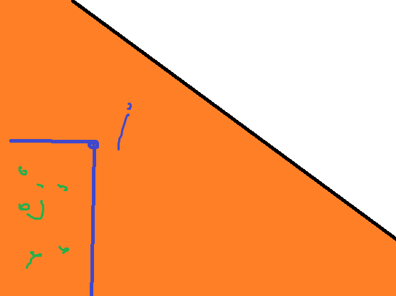
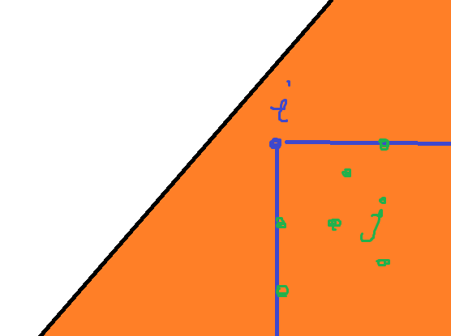
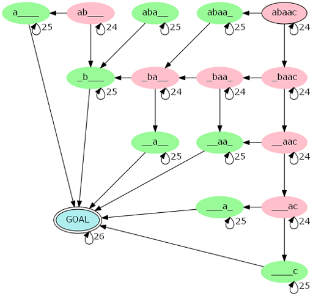
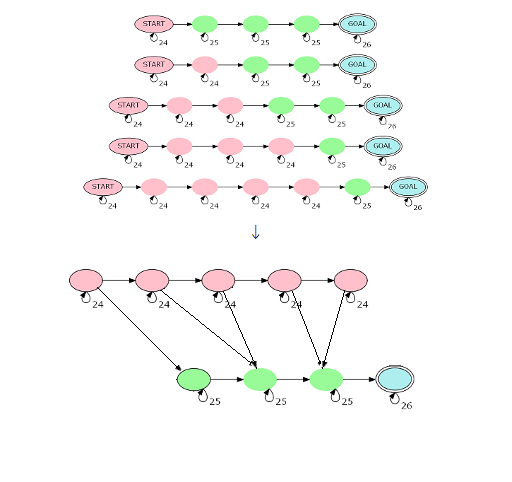

[TOC]

## [P3638 [APIO2013]机器人](https://www.luogu.com.cn/problem/P3638)

可能就是把斯坦纳树的集合改成了区间。

首先我们可以预处理出从 $(i,j)$ 往 $k$ 方向走最后能走到哪里。这个可以 $\rm dfs$ 加上记忆化解决，如果遇到了环就直接寄因为其他机器人都动不了了。

然后我们不妨记 $f_{i,j,k}$ 表示缝合机器人 $(i,j)$ 到点 $k$ 的最少步数，那么就有：
$$
f_{i,j,k}\leftarrow  f_{i,w,k}+f_{w+1,j,k}\\
f_{i,j,v}\leftarrow f_{i,j,u}+1\ \text{when}\ u\to v\ \text{has\ edge}
$$
 然后就直接转移就好了。

可能直接dij跑不过，两个队列维护后一个转移，一个队列存的是原有的，另一个是新增的，两个队列都是单调不降的，每次取最小的更新即可。

## [P8079 [WC2022] 猜词（民间数据）](https://www.luogu.com.cn/problem/P8079)

有这样一个估价函数：
$$
E(\text{word})=\epsilon\times[\text{word\ 符合之前约束}]+ \sum_{x\in 3^5\text{种返回值}}-p(x)\log p(x)
$$
然后取估价最高的即可通过本题。

## [CF838D Airplane Arrangements](https://www.luogu.com.cn/problem/CF838D)

首先我们考虑 $n=m$ 的情况，时光倒流，让每个人按顺序从位置上回去。那么如果我们当前让某个位置的人回去了，那么考虑他原来想要的位置可以是那些。分析一波发现一定要在同一个连续段内，而方案数考虑两个方向恰好就是这个连续段的长度 $+1$。然后我们就可以 $\rm dp$ 了，记 $f_i$ 表示长度为 $i$ 的连续段走人走到空的方案数，不妨枚举走的是 $j$，那么变成两个不相干的连续段，一共还要走 $i-1$ 人，分配顺序就是 $\binom{i-1}{j-1}$，也就是：
$$
f_{i}=(i+1)\times \sum_{j=1}^{i}\binom{i-1}{j-1} f_{j-1}\times f_{i-j}
$$
边界是 $f_0=1$。但是这个 $\rm dp$ 是 $\mathcal O(n^2)$ 的。但是通过一些人(O)类(E)智(I)慧(S)我们可以得到 $f_i=2(2i+2)^{i-1}$。

我们现在已经成功解决 $n=m$ 的情况了，但问题是不一定最后的局面是连续的。我们首先枚举最后有 $k$ 段，那么每一段都是独立的。那么我们有 $k-1$ 个间隔，必须大于 $0$，还有开头和结尾的两端可以为 $0$，于是就相当于 $n-m+2$ 分给 $k+1$ 个大于 $0$ 的变量，方案数是 $\binom{n-m+1}k$。记 $F(x)$ 为 $\{f_1,f_2,\dots\}$ 的 $\mathrm{EGF}$，那么答案就是

$$
m![x^m]\sum_{k=0}\binom{n-m+1}{k}F^k(x)=m+1)^{n-m+1}
$$

如果直接多项式快速幂显然是过不了的，更何况模数是 $10^9+7$，我们还得继续推柿子。

记 $n'=n-m+1$，然后稍微化一点：
$$
m![x^m]\left(\sum_{i=0}\frac{2(2i+2)^{i-1}}{i!}x^i\right)^{n'}=2^m\times m![x^m]\left(\sum_{i=0}\frac{(i+1)^{i-1}}{i!}x^i\right)^{n'}
$$
然后好像我就不会了，只好打表找规律力。把 $m![x^m]\text{后面一坨}$ 放进表格里：

|       | $n'=1$ | $n'=2$ | $n'=3$  | $n'=4$  | $n'=5$  | $n'=6$  | $n'=7$   | 插值多项式 |
| ----- | ------ | ------ | ------- | ------- | ------- | ------- | -------- | ---------- |
| $m=1$ | $1$    | $2$    | $3$     | $4$     | $5$     | $6$     | $7$      | $n$        |
| $m=2$ | $3$    | $8$    | $15$    | $24$    | $35$    | $48$    | $63$     | $n(n+2)$   |
| $m=3$ | $16$   | $50$   | $108$   | $196$   | $320$   | $486$   | $700$    | $n(n+3)^2$ |
| $m=4$ | $125$  | $432$  | $1029$  | $2048$  | $3645$  | $6000$  | $9317$   | $n(n+4)^3$ |
| $m=5$ | $1296$ | $4802$ | $12288$ | $26244$ | $50000$ | $87846$ | $145152$ | $n(n+5)^4$ |

我们大胆猜测 $m$ 对应的多项式是 $n(n+m)^{m-1}$，于是答案就是：
$$
2^m\times n'\times(n'+m)^{m-1}
$$

## [P4769 [NOI2018] 冒泡排序](https://www.luogu.com.cn/problem/P4769)

首先一个结论是不能有长度超过 $2$ 的下降子序列，否则如果出现了 $a,b,c,a>b>c$，那么 $b$ 一定会走回头路然后就取不到下界了。根据一些证明我们可以知道如果不存在就一定可行。

然后我们考虑没有字典序的约束怎么做，考虑 $f_{i,j}$ 表示长度为 $i$ 的排列第一位为 $j$ 的合法排列个数，那么分类讨论：

- 如果 $j=1$，那么不会造成贡献，后面 $i+1$ 位直接转移即可。
- 如果 $j\ne 1$，设下一个数是 $k$
  - 如果 $k>j$，那么后面合法整个就合法
  - 如果 $1<k<j$，那么 $(j,k,1)$ 构成了一个下降子序列就寄了
  - 如果 $k=1$ 那么这个 $1$ 不会进入下降子序列所以把所有数减 $1$

综上，转移是：
$$
f_{i,j}=\sum_{k=j-1}^i f_{i-1,k}
$$
然后我们考虑有了字典序的限制，那么我们钦定前缀 $[1,i-1]$ 是相同的，在第 $i$ 位上现在的严格大于给定的。然后这个 $i$ 的位置是肯定不肯能填后缀最小值的因为如果填了字典序就一定不满足。既然不能填最小值如果这个值再比最大值小就形成了长度为 $3$ 的下降序列 前缀最大值，$i$，后缀最小值，所以这个位置一定是比 $\max(q_i,\text{prefix max})$ 要大的，于是使用树状数组我们就可以得到至少的排名了。然后就是一个对 $f_{i,j}$ 后缀求和的形式。

记 $S(n,m)=\sum_{j=0}^mf_{n,n-j}$，那么不难发现 $S(n,m)=S(n-1,m)+S(n,m-1)$，所以就相当于从 $(0,0)$ 出发到 $(n,m)$ 不能越过 $y=x$，典中点翻折减去不合法即可。

于是就做完了。

## [AT1976 [ARC058D] 文字列大好きいろはちゃん / Iroha Loves Strings](https://www.luogu.com.cn/problem/AT1976)

首先有一个很菜的 $\rm dp$ 就是设 $f_{i,j}$ 表示前 $i$ 个构成长度为 $j$ 的最小是多少。

然后如果 $[i+1,n]$ 是无法组成 $k-j$ 那么 $f_{i,j}$ 就是没有用的。这个可以用 `bitset` 在 $\mathcal O(nk/w)$ 的时间求出

然后剩下的中如果存在 $f_{i,j_1}<f_{i,j_2}$ 并且不是前缀关系，那么我们只需要 $f_{i,j_1}$。所以所有有用的状态我们只需要存一个最长的剩下的都是这个最长的前缀，不妨记为 $t_i$。

然后现在来考虑转移，可以认为是 $t_{i-1}$ 取一段前缀，$s_i$ 取全部或不取，然后用一个二元组 $(x,y)$ 表示在第一个取了长度为 $x$ 第二个取了长度为 $y$，可以通过 $\rm Z$ 函数快速比较。

然后对所有 $(x,y)$ 放进单调栈里，把大于的弹出，现在的都是前缀关系，直接取最后一个当做 $t_i$ 就可以了。

最后的答案就是 $t_n$。

## [CF1098F Ж-function](https://www.luogu.com.cn/problem/CF1098F)

首先我们翻转序列，翻转询问，建出后缀自动机和link树。

然后记树上的节点 $x$ 对应原来串的位置是 $pos_x$，原来的位置为 $x$ 在树上是 $rev_x$，那么询问实际上就是：
$$
\sum_{pos_x\in[l,r]}\min(pos_x-l+1,len_{\mathrm{lca}(x,rev_r)})
$$
大概就是这样一个东西。然后就可以 DSU on tree硬上了。

我们枚举 $t$ 为 $\mathrm{lca}(x,rev_r)$

1. $rev_r$ 在轻儿子内，那么我们可以直接枚举所有这样的询问

   1. $pos_x-l\ge len_t$，那么取的值就是 $len_t$。求的是 $pos_x\in[l+len_t,r]$ 且不和 $x$ 在同一子树内的个数
   2. $pos_x-l<len_t$ 那么取得是 $pos_x-l+1$，那么就问 $pos_x\in[l,\min(l+len_t-1,r)]$ 的和和个数

   统计可以直接用树状数组复杂度是 $O(n\log^2n)$

2. $rev_r$ 在重儿子内，我们只能考虑每一个 $x$ 对他的贡献。不妨把所有询问挂在节点上然后类似dfs序地标号，那么一棵子树内所有的询问都是连续的

   1. $l\le pos_x-len_t,r\ge pos_x$ 的询问要加 $len_t$
   2. $pos_x-len_t<l\le pos_x,r\ge pos_x$ 的询问要加 $pos_x-l+1$

   于是这个贡献就是一个三维偏序的形式，因为 $(x,t)$ 对数是 $\mathcal O(n\log n)$ 级别的所以复杂度是 $\mathcal O(n\log^3n)$ 的。

## [P5644 [PKUWC2018]猎人杀](https://www.luogu.com.cn/problem/P5644)

首先有一个结论是说一个猎人挂了仍然可以被打，每一枪就是打到第一个没有挂的猎人，这样所有没有挂的猎人挨枪子的概率是和原来一样的。

这样就好办很多了。直接容斥，设 $P(T)$ 表示钦定 $T$ 这些人在 $1$ 之后挂，那么答案就是:
$$
\sum_{T\subseteq\{2,3,\dots,n\}}(-1)^{|T|}P(T)
$$
那么 $P(T)$ 怎么求也很简单，就是枚举 $1$ 第几轮被打中，之前只能打在不是 $T$ 也不是 $1$ 的人，记 $W_t=\sum_{i\in T}W_i,S=W_{\{1,2,\dots,n\}}$，所以就是：
$$
P(T)=\sum_{i=1}^{+\infty}\frac{W_1}S\left(1-\frac{S-W_1-W_T}{S}\right)^{i-1}=\frac{W_1}{W_1+W_T}
$$
然后就好做了，直接分治 $\rm NTT$ 算出是的和为 $i$ 的方案权值和，所以答案就是：
$$
\sum_{i=0}^{S-W_1}\left([x^i]\prod_{j=2}^n\left(1-x^{W_j}\right)\right)\times\frac{W_1}{W_1+i}
$$
然后可能就做完了。

## [P5292 [HNOI2019]校园旅行](https://www.luogu.com.cn/problem/P5292)

一个 比较 $\rm Naive$ 的做法是一个 $\mathcal O(m^2)$ 的 $\rm dp$，$f_{i,j}$ 表示从 $i$ 到 $j$ 能不能组成回文，那么转移就是枚举 $i,j$ 的出边，并且颜色相同。

然后就 $\rm T$ 飞了，考虑我们可不可以减少边数来达到同样的效果。分析一波发现是可以的，首先如果一条边连接的是异色的点，把所有的这些边拉出来是，只保留生成树转移任然能成立，因为如果 $f_{i,j}$ 能不断跳异色边到 $f_{x,y}$，那么在保留的生成树上仍然能跳到。

然后就是同色的边同样只需要保留生成树。但是如果不是二分图那么一位着也可以跳奇数条边，我们可以通过连接自环来达到这样的效果。

于是边数就变成 $\mathcal O(n)$ 的了，最终的复杂度是 $\mathcal O(n^2)$。

## [CF932G Palindrome Partition](https://www.luogu.com.cn/problem/CF932G)

首先这个划分让人很不爽我们转化一下让原串的前 $\frac n2$ 和后 $\frac n2$ 的反串交错，那么就相当于划分成若干个长度为偶数的回文串。

那么这个有一个用处就是我们可以比较方便地（？）进行 $\rm dp$ 了，就是 $f_i$ 表示到 $i$ 的划分数，$i$ 是偶数 $f_i$ 才有值，然后 $f_i$ 可以从 $f_{j-1}$ 转移当且仅当 $s[j:i]$ 是回文串。

然后我们就可以在PAM上不停地跳 $\rm fail$ 来找所有的 $j$ 使得 $s[j,i]$ 是回文串，但是这个很明显来一个全部一样的就会挂了。

但是有一个结论，记 $d_i=len_i-len_{fail_i}$，那么从一个点往上跳最多只有 $\log n$ 个不同的 $d_i$，大概长这样：

```
xxx--------xxx
   xxx-----xxx
      xxx--xxx
         --xxx
```

所以不停地消一样的至少长度除以 $2$。然后对从 $i$ 开始往 $\rm fail$ 跳 $d_i$ 相同的一段维护和即可。

## [P6673 [清华集训2016] 石家庄的工人阶级队伍比较坚强](https://www.luogu.com.cn/problem/P6673)

首先定义三进制不进位减法 $\ominus_3$，如果 $x\ominus_3y=1$ 就是 $x$ 赢，$2$ 就是 $x$ 输，否则就是平局。我们构造数组 $g_i=b[\mathrm{popcount}_1(i)][\mathrm{popcount}_2(i)]$，那么就是要求：
$$
f_{i,x}=\sum f_{i-1,y}\times g_{x\ominus_3 y}\iff f_{i,x}=\sum_{y\oplus_3 z=x}f_{i-1,y}\times g_{z}
$$
这个就是所谓高维 $\rm DFT$ 了，对 $f_{0}$ 和 $g$ 做一次高维 $\rm DFT$ 之后，快速幂再 $\rm IDFT$ 回去即可。然后因为 $\omega_3$ 不一定存在所以我们扩域，用 $x+y\times \omega_3$ 来表示一个数即可。因为 $p$ 的性质一定有 $n$ 的逆元。然后就做完了。

## [CF1103E Radix sum](https://www.luogu.com.cn/problem/CF1103E)

和上面一题一模一样，顶多这题单位根是 $\omega_{10}$

首先因为最后要除 $10^5$，显然 $5$ 是有逆元的但是 $2$ 没有，所以我们可以设置模数为 $2^{64}$ 也就是 `unsigned long long` 自然溢出，最后就可以除 $2^5$ 了。

这时候我们扩域需要把一个数表示为 $a + b\times\omega_{10}+c\times \omega_{10}^2+d\times \omega_{10}^3$，然后我们能够发现 $\omega_{10}^4=-1+\omega_{10}-\omega_{10}^2+\omega_{10}^3,\omega_{10}^i=-\omega_{10}^{i-5}$，所以这个可以表示所有的数。

然后直接跑 $\rm FWT$ 即可。

## [P4775 [NOI2018] 情报中心](https://www.luogu.com.cn/problem/P4775)

考虑把询问的 $v_i$ 改成 $\mathrm{dis}(x_i,y_i)-2v_i$，那么两个询问的答案的两倍就是：
$$
v_1+v_2+\mathrm{dis}(x_1,x_2)+\mathrm{dis(y_1,y_2)}
$$
然后我们可以枚举 $\mathrm{lca}(x_1,x_2)=t$，那么对于一个询问 $(x,y,v)$，这个 $t$ 可以是 $[x,\mathrm{lca}(x,y)),[y,\mathrm{lca}(x,y))$，我们可以通过树上差分实现。

然后我们枚举 $t$ 之后需要计算的就变成了 $(v_1+\mathrm{dis}(x_1))+(v_2+\mathrm{dis}(x_2))+\mathrm{dis}(y_1,y_2)-2\mathrm{dis}(x_1,x_2)$ 的最大值，前面的两个可以理解成是树上代权最远点对。众所周知 $S_1+S_2=S,\mathrm{diam}(S)=\mathrm{diam}(\mathrm{diam}(S_1)\cup\mathrm{diam}(S_2))$，所以我们可以用线段树快速维护这个最远点对。

用 $\mathcal O(1)$ 的 $\mathrm{lca}$ 即可做到 $\mathcal O(n\log n)$

## [ZROI#2217. 赫露艾斯塔](http://zhengruioi.com/problem/2217)

认识到了减少cache miss的重要性

首先考虑如果半平面是这样的：




那么如果原来 $i$ 有 $cnt$ 个使得 $x_j<x_i,y_j<y_i$，那么现在还是 $cnt$ 个，于是就等价于一个半平面求和。

然后如果半平面是这样的：




那么考虑不合法的情况 $i\ne j,x_j\ge x_i,y_j\le y_i$，用总的情况数 $\binom{tot}2$ 减去不合法即可。

其他的情况同理。于是现在就等价于 $4$ 种情况半平面求和，比较显然的想法就是 $\rm KDT$，可能需要轻微卡常，比如在把所有同一棵树上的查询全部一起查可以显著减少cache miss

## [ZROI#2215. 路人女主](http://zhengruioi.com/problem/2215)

首先 $(s_i,s_{i+1})$ 与 $(t_i,t_{i+1})$ 至少能匹配一对，所以最短是 $n$，所以限制还是满紧的。

注意到势不两立的 $(s,t)$ 与下面两种情况**本质相同**：

1. $s=\texttt{ABABABABA},t=\texttt{C*C*C*C*C}$
2. $s=\texttt{ACACBCBCBCB},t=\texttt{BCBCACACACA}$，也就是偶数为是 $\texttt{A}$，前 $k$ 个奇数位 $s$ 是 $\texttt{A}$ $t$ 是 $\texttt{B}$  后 $n+1-l$ 个奇数位则相反。

然后如果观察出来这题就完了。

如果没有观察出来又不会dp套dp这题也完了。

## [ZROI#2216. 铃原露露](http://zhengruioi.com/problem/2216)

首先这棵树给出方式非常阴间，我们还是先改成正常的方式，然后把询问改成 $L\le x\le y\le R$ 并且 $L\le z=\mathrm{lca}(x,y)\le R$

然后一个结论是对于确定的 $(x,y,z)$，如果 $x\le y<z$，那么 $L\in[1,x],R\in[y,z)$ 的都是不可行的，如果 $z<x\le y$ 那么 $L\in(z,x],R\in[y,n]$ 的都是不可行的。

然后一个结论是有效的 $(x,y,z)$ 只有 $\mathcal O(n\log n)$ 个，大概就是你 $\rm DSU-on-tree$，然后对于确定的 $\rm lca$ 只需要枚举所有在轻子树内的点的前驱和后继。于是这个的有效对数就只有一只 $\rm log$ 了。

那么现在就相当于一个平面上覆盖了若干矩形，现在要查询一个矩形内没有被覆盖的个数。矩形覆盖我们可以很容易地用扫描线解决，然后我们还需要把所有可行的左端点加 $1$，这个也是线段树经典套路了。

最后复杂度就是 $\mathcal O(n\log^2n)$。

## [P5287 [HNOI2019]JOJO](https://www.luogu.com.cn/problem/P5287)

比较阴间的 $\rm KMP$

首先要求的显然就是所有 $\mathrm{next}(i)$ 的和，但是字符串太长还有回滚是过不去的。

我们首先建成一棵树，然后一条边 $(x,y)$ 表示加入了 $y$ 个 $x$ 字符，然后在树上 $\rm dfs$ 到这个点的路径上的字符串就是这个点代表的字符串。

然后我们发现两个串能匹配除了开头结尾必须相同。然后我们还发现如果当前指针在中间是没有办法继续往下匹配的，所以就相当于求除了开头可以不同其他必须相同的 $\rm next$ 数组。

$\rm KMP$ 的复杂度是均摊的但是现在放在树上可能就过不去了~~当然数据水其实是过得去的~~

然后我们考虑一个 $\rm KMP$ 自动机，也就是用 $f_{i,x,c}$ 表示在 $i-1$ 的基础上来了 $x$ 个 $c$ 会跳到哪里，那么 $f_{i}$ 实际上就是在 $f_{\mathrm{next}(i-1)+1}$  的基础上把加入 $x$ 个 $c$ 跳到 $i$ 其他都不变。还可以用类似的方法维护一个 $g_{i,x,c}$ 表示跳到的位置对应的长度，然后就可以比较方便地维护这个连续段所有的 $\rm next$ 的和了。

时空显然都是 $\mathcal O(n\log n)$ 的。

## [P4632 [APIO2018] New Home 新家](P4632 [APIO2018] New Home 新家)

首先可以用扫描线来处理时间，然后现在只需要解决没有时间的问题即可。

然后我们二分一个距离 $d$，那么就以为着 $[l-d,l+d]$ 里面有所有颜色。但是这个不是很好做。

考虑 $[l,r]$ 如果全部颜色都有，那么 $(r,+\infty]$ 的每个颜色的前驱都不能 $<l$ 否则就以为这这一种颜色没有。所以维护一颗线段树来记录后缀的前驱最小值就可以 $\mathcal O(\log n)$ 判断了。

最后再套上二分就是 $\mathcal O(n\log^2n)$。

据说可以线段树二分做到一只 $\log$ 但是细节巨多我不太会。

## [CF827F Dirty Arkady's Kitchen](https://www.luogu.com.cn/problem/CF827F)

首先如果有边 $(u,v,l,r)$，如果我们在 $t$ 时刻到 $u$ 那么如果还没有消失就可以在 $t+1,t+3,\dots$ 时刻到 $v$

然后把一个点拆成奇点和偶点，那么边在奇点和偶点之间，边也可以拆成有向边。然后我们按照出现时间从小到大排序。按顺序加入。

设 $f_{u,0/1}$ 表示到 $(u,0/1)$ 最晚的时间，然后当前如果加入的边 $l\le f_{u,0/1}$ 也就意味着 $f_{v,1/0}\leftarrow r+1$，否则就挂在 $u,0/1$ 上等什么时候 $u,0/1$ 被更新了再把这些边拿出来。

一条边最多两次进堆所以复杂度是 $\mathcal O(m\log m)$ 

## [P3776 [APIO2017]斑斓之地](https://www.luogu.com.cn/problem/P3776)

事实上就是问联通块个数

然后我比较逊只会树是边数减点数 $=1$，但是这个联通块不一定是树然后就不会了。

事实上根据平面图的欧拉公式我们知道 $|V|-|E|+|F|=1$，于是我们只需要计算 $|V|,|E|,|F|$ 即可。

直接计算不好算但是可以算补集大小然后再减掉

补集大小就很好算了，随便写一个扫描线即可。

## [ZROI#2219. Prob](http://zhengruioi.com/problem/2219)

不会复数被打爆了/ll

现在 $X$ 和 $Y$ 是关联的就非常麻烦非常难做非常牛马

但是这个距离的形式让我们想到了复数的模的平方等于复数乘他的共轭复数

于是 $((X-x_i)^2+(Y-y_i)^2)=|x+y\mathrm i-X-Y\mathrm i|^2=(x+y\mathrm i-X-Y\mathrm i)\times (x-y\mathrm i-X+Y\mathrm i)$。

这样的一个好处就是 $X+Y\mathrm i$ 和 $X-Y\mathrm i$ 是独立的，先算出 $\mathrm i=139302\bmod P$，然后可以算出 $a_i=x+y\mathrm i\bmod P,b_i=x-y\mathrm i\bmod P$，于是就是要算：
$$
\prod_{i=1}^n(a_i-A)\prod_{i=1}^n(b_i-B)=Z\bmod P
$$
的方案数，$A,B$ 的范围都是 $[0,P)$。这个就非常阳间了，先分别对两边求出恰好是 $i$ 的方案数，然后积卷积就是先转化成原根 $5$ 的若干次就是和卷积了。

## [P5044 [IOI2018] meetings 会议](https://www.luogu.com.cn/problem/P5044)

首先有一个很 $\rm Naive$ 的 $\rm dp$ 就是说 $f_{i,j}$ 表示 $[i,j]$ 这段区间的答案，记 $mid$ 为 $[i,j]$ 中最大值所在的位置，那么转移显然就是：
$$
f_{i,j}=\min\{f_{i,mid-1}+(r-mid+1)\times h_{mid},f_{mid+1,r}+(mid-l+1)\times h_{mid}\}
$$
然后就有19pts了（

考虑优化这个 $\rm dp$，这个与最大值有有关的转移方程让我们联想到笛卡尔树，所以我们先把笛卡尔树建出来。然后考虑这个询问放到笛卡尔树上，那么一定有一个节点 $x$，使得 $x\in [l,r],[l,r]\subseteq [L_x,R_x]$，显然这个 $x$ 就是 $[l,r]$ 中的最大值，如果我们求出 $[l,x-1]$ 和 $[x+1,r]$ 的答案就可以合并了。然后两个显然是等价的我们只需要计算一个即可。

考虑 $[x+1,r]$，这个形式还是非常好的，因为这个是一个节点的前缀。那么考虑我们可不可以快速维护前缀，假设当前节点是 $mid$ 区间是 $[l,r]$：

- 区间为 $[l,x],x<mid$ 直接从 $[l,mid-1]$ 继承即可

- 区间为 $[l,mid]$，那么就是 $[l,mid-1]$ 的答案加上 $h_{mid}$

- 区间为 $[l,x],x>mid$，那么转移是：
  $$
  \min\{f_{l,mid-1}+(x-mid+1)\times h_{mid},f_{mid+1,r}+(mid-l+1)\times h_{mid}\}
  $$
  第一项每次加 $h_{mid}$，第二项每次加的不会超过 $h_{mid}$，所以第一个的增长更快，存在一个点 $p$ 第一个超过了第二个，那么 $x\in[mid+1,p-1]$ 取第一项，$[p,r]$ 取第二项，所以需要支持区间一次函数覆盖、区间加、二分第一个点超过某个一次函数，可以比较简单（？）地实现

然后就在 $\mathcal O(n\log n)$ 的时间解决了这道 IOI D2T3

## [CF1305G Kuroni and Antihype](https://www.luogu.com.cn/problem/CF1305G)

首先我们加入一个点 $a_{n+1}=0$ 一开始就在群里，那么所有人都是被拉进去的。

然后如果 $u$ 把 $v$ 拉进去那么就在 $u,v$ 之间连一条边，边权为 $a_u+a_v$，那么最后边权和减去 $\sum a_i$ 就是答案了。

然后现在就是要求最大生成树，对于 $a_i\land a_j=0$ 有权值为 $a_i+a_j$ 的边。然后众所周知有一个B开头的算法，我们只需要跑 $\log n$ 轮，每轮在每一个联通块内找到最大的可以连的边。这个看上去不是很方便用数据结构维护，有一个比较高妙的方法是 $\rm dp$ 出 $S$ 的子集中最大值以及所在联通块，和最大值不在同一个联通块内的最大值，然后就可以找到每一个联通块往外最大的边了。

复杂度 $\mathcal O(18\times 2^{18}\times \log n)$

## [P4156 [WC2016]论战捆竹竿](https://www.luogu.com.cn/problem/P4156)

首先你发现如果有一个长度为 $len$ 的 $\rm border$，也就是一个长度为 $n-len$ 的 $\rm period$，那么你的长度就可以任意加上 $n-len$。

然后 $w$ 很大我们考虑一个同余最短路，但是边数很明显可以达到 $\mathcal O(n^2)$ 级别然后就寄了。

但是有一个结论是所有的 $\rm border$ 的长度可以划分成 $O(\log n)$ 个等差数列，证明可以考虑Weak Periodicity Lemma的一个推论不难得到。

然后现在我们有一些等差数列，要求计算能构造出 $[n,w]$ 里面多少数。考虑我们现在对 $x,x+d,x+2d\dots,x+l\times d$ 跑同余最短路，在 $f_i$ 表示 $\equiv i\bmod x$ 的最小的值，那么一个点 $y$ 肯定是向 $(y+d)\bmod x$ 连边，于是就构成了 $\gcd(x,d)$ 个环，每个环显然是独立的。

考虑在一个环上转移，毛估估就发现不会跨过最小值，所以先断环为链，然后从第 $a$ 个转移到第 $b$ 个的贡献就是 $dis_a-a\times d+b\times d+x$，用单调队列维护找到最优的 $a$ 转移即可。

然后还有一个问题是要转换同余最短路的模数，原来是 $lst$ 现在是 $now$，那么 $f_i$ 实际表示的是 $f_i+k\times lst$，于是就相当于在新的同余最短路上往后连一条边权为 $lst$ 的边，初始值是 $g_{f_i\bmod now}=f_i$。

感觉复杂度是 $\mathcal O(Tn\log n)$  但是不知道为什么uoj上会T/kk

## [P3206 [HNOI2010]城市建设](https://www.luogu.com.cn/problem/P3206)

首先我们cdq分治，然后如果当前的区间是 $[L,R]$，对于这个区间内更改的边：

- 全部设成 $-\infty$，跑最小生成树，现在出现在最小生成树上的边一定会出现在答案里，然后对这些确定的边缩点
- 全部设成 $+\infty$，跑最小生成树，现在没有出现的答案里一定不会出现。

然后第一个操作保证点数是 $R-L+1$ 级别的，第二个操作保证边数和点数同阶，所以复杂度是 $\mathcal O(n\log^2n)$

## [P3332 [ZJOI2013]K大数查询](https://www.luogu.com.cn/problem/P3332)

内啥，有个很 $\rm Naive$ 的三只 $\log$ 的二分+树套树的做法当然是过不去的。

那么考虑交换内外层的线段树，然后就可以线段树上二分，复杂度就是两只 $\log$ 了。

## [ZROI#2223. B4IT](http://zhengruioi.com/problem/2223)

4级难度/yun

众所周知 $k$ 级祖先可以做到 $\mathcal O(1)$，然后就可以 $O(1)$ 做到走一步

分块，操作序列每 $B$ 个分成一块，零散就暴力跳，复杂度是 $\mathcal O(mB)$

然后考虑整块的情况，先对这里所有用到的点建立虚虚树，虚树的大小是 $\mathcal O(B)$ 的。虚树建出来之后我们考虑移动，那么发现一条边的改变量是 $\mathcal O(1)$ 的，就是说一条边上可能有很多点，但是一条边只会平移一，用循环数组维护可以做到 $\mathcal O(B)$ 移动。然后如果一个点开始不在虚树上，我们先计算出进入虚树的时间，然后在那个时间插入即可。分析复杂度一块是 $\mathcal O(n+m+B^2)$ 的。

所以整体复杂度就是 $\mathcal O(mB+\frac{n_0}B(B^2+n+m))$ 然后 $B$ 取 $\sqrt{n_0(n+m)/(n_0+m)}$

注意常数/yun

## [ZROI#2229. 过桥](http://zhengruioi.com/problem/2229)

首先枚举 $(i,i+1)$ 分别是 $\texttt{L,R}$，那么如果 $i$ 是最后一个 $\texttt{L}$ 那么 $i+1$ 一定是最后一个 $\texttt{R}$，然后问题就变成一边的了。不妨只考虑左边。

然后我们发现 $\texttt{L}$ 赢的次数和输的次数是固定的，也就是每种方案概率是相同的，所以我们现在只需要求出选出一些人（包括 $i$）使得恰好下去 $a$ 个人。

有一个 $\mathcal O(n^3)$ 的 $\rm dp$ 就是 $f_{i,j}$ 表示到 $i$ 还剩下 $j$ 个人，转移的时候如果是 $\texttt L$ 就让剩下的人数 $+1$ 否则就枚举这个 $\texttt R$ 干掉了多少人，任何时刻必须有人剩下。然后不难优化到 $\mathcal O(n^2)$，因为你要对所有位置求一遍所以复杂度是 $\mathcal O(Tn^3)$ 的。

那么我们最后要的都是 $f_{1,a}$，我们考虑反着 $\rm dp$，从 $f_{1,a}$ 推到 $f_{i,1}$，复杂度就是 $\mathcal O(Tn^2)$  了。

## [P4690 [Ynoi2016] 镜中的昆虫](https://www.luogu.com.cn/problem/P4690)

众所周知有个弱化版叫做数颜色

那个怎么做？我们考虑一个颜色，如果在区间内不是第一次出现就不计算贡献。所以对于一个 $(pre_i,i)$ 如果 $l\le pre_i<i\le r$ 那么区间的颜色数就会减少 $1$。然后有修改操作就会更改 $\mathcal O(1)$ 个 $(pre_i,i)$，这个贡献形式是一个三维偏序直接cdq就可以做到两只 $\log$ 踩爆带修莫队了。

那么这个题怎么做？一个结论是 $pre$ 数组的更改次数和是 $\mathcal O(n+m)$ 的。考虑分成若干个段，每一段的颜色相同，那么如果区间覆盖，你会先拆分 $\mathcal O(1)$ 个区间，然后剩下的每个区间内，开头的前驱可能会改变，结尾的后继的前驱可能会改变，这个是 $\mathcal O(\text{区间个数})$ 的。然后接下来把整个区间推平，所以分析一波就是 $\mathcal O(n+m)$ 的。具体的维护就类似珂朵莉树就可以了。

复杂度 $\mathcal O(n\log^2n)$ ，完全不卡时间但是卡空间/ll

## [P4062 [Code+#1]Yazid 的新生舞会](https://www.luogu.com.cn/problem/P4062)

首先一个新生舞会的区间只有一个众数，我们可以枚举这个数是谁然后计算这个数严格超过一半的区间有多少。

然后记 $s_i$ 表示这个数的前缀和，那么 $(l,r]$ 合法就等价于 $2(s_r-s_l)>r-l$ 也就是 $2s_r-r>2s_l-l$

但是数字的种类数是 $\mathcal O(n)$ 的也就是直接暴力是 $\mathcal O(n^2\log n)$ 的。一个显然的想法是总的和是 $n$ 因此我们可以把一种颜色的 $2s_i-i$ 划分成个数条下降的线段，那么这个线段的和是 $\mathcal O(n)$ 的，对每条线段考虑从前面转移，如果这条是 $[L,R]$ 那么就可以加上 $[L-1,R-1]$ 的前缀和的和。维护前缀和就直接用支持一次函数的线段树维护即可。复杂度 $\mathcal O(n\log n)$。

## [P4566 [CTSC2018]青蕈领主](https://www.luogu.com.cn/problem/P4566)

神仙计数

首先我们称 $[i-L_i+1,i]$ 是一个极长的连续区间，那么显然 $L_n=n$ 并且任意两个极长的连续区间要么包含要么没有交。如果不符合就一定无解。

满足了这个条件之后我们对所有极长连续区间 $\rm dp$，对于一个极长连续区间我们可以找到一个最小的包含他的区间，然后连边，就形成了一个树形结构。如果 $[l,r]$ 是极长的连续区间，那么他所有的儿子代表的极长区间一定精确覆盖了 $[l,r-1]$，然后因为内部的数是连续的所以每个儿子内部的方案确定后我们可以缩成一个数。记有 $x$ 个这样的极长区间，那么 $dp_{l,r}=f_{|son|}\prod_{(l',r')\in son} dp_{l',r'}$，其中 $f_{n}$ 指的是长度为 $n+1$， $\forall 1\le i\le n,L_{i}=1$ 的方案数。题目中也有这个的部分分说明我们的方向没有问题。

现在只需要求出所有的 $f_i$ 问题就解决了，~~一个方法是打一个 $n\le 10$ 的暴力然后扔到OEIS~~当然考场上没有OEIS只能靠我们自己的智慧。考虑这个东西等价于是一个长度为 $n+1$ 的排列，所有连续区间要么长度是 $1$ 要么包含 $n+1$。证明就直接考虑如果 $p$ 的所有连续区间都经过**位置** $n+1$ 那么 $p^{-1}$ 的所有连续区间都经过**数字** $n+1$。然后我们来递推这个东西。首先我们手上有一个 $n$ 的排列 $p$，我们把所有数加上 $1$ 得到 $p'$，然后考虑插入一个 $1$ 得到 $f_{n_1}$：

- 如果原来的排列合法，那么只要 $1$ 不放在 $2$ 的旁边就一定不会产生新的连续区间，所以直接从 $(n-1)f_{n-1}$ 转移即可。

- 如果原来的排列不合法，就意味着 $p$ 有一个连续区间不经过 $n$ 并且长度 $>1$。我们考虑这个区间的**值域**是 $[x,x+l-1]$，那么这样的极长区间最多有且仅有一个，否则就算加入了 $1$ 也不可能全部消失。然后显然要 $[x,x+l-1]\subseteq [2,n-1]$ 否则就不满足我们的条件。

  有了这个之后我们考虑在这个里面插入 $1$ 能够挂掉，那么也就意味着所有的连续区间都要经过那个插入 $1$ 的地方。这个条件显然是充要的，但是不方便计数。我们可以把 $1$ 当做 $l+1$ 剩下的数按顺序标号成 $[1,l]$，那么这个问题其实是和 $f_{l}$ 等价的。然后我们在把这 $l+1$ 个数缩成一个数，和剩下 $n-l$ 个数构成了一个 $n-l+1$ 的排列，这部分的方案数就是 $(n-l-1)f_{n-l}$，因为这一段缩成的数不能是最小值也不能是最大值。

结合上面的分类讨论我们可以列出转移方程：
$$
f_n=(n-1)f_{n-1}+\sum_{i=2}^{n-2}(i-1)f_if_{n-i}
$$
可能会发现这个可以分治ntt然后一眼秒了。然后就做完了？

然后你发现考虑 $[L,mid]\times [2,R-L]$ 对 $[mid+1,R]$ 的贡献时，如果 $R-L$ 没有计算完就寄了。怎么修补一下这个方法才能让分治正确呢？

我们首先算 $[L,mid]\times [L,mid]$ 对 $[mid+1,R]$ 的贡献，然后计算 $[L,mid]\times [2,\min(R-L,L-1)]$ 对 $[mid+1,R]$ 的贡献。然后我们发现这样是没有计算 $[L,mid]\times[mid+1,R]$ 对 $[mid+1,R]$ 的贡献的，但是我们先遗留下来，再下一层计算 $[2,\min(R-L,L-1)]\times [L,mid]$ 对 $[mid+1,R]$ 的贡献即可。

然后这道题就真的解决了。复杂度 $\mathcal O(n\log^2n+Tn)$

## [P4027 [NOI2007] 货币兑换](https://www.luogu.com.cn/problem/P4027)

如果没有那个提示也不难猜出来肯定是全部换RMB或者全部换金券。留着肯定是不赚的。

然后就可以 $\rm dp$ 了，记 $f_{i}$ 表示到第 $i$ 天最多手上有多少RMB，那么记 $x_i=f_i\times\frac{\mathrm{Rate}_i}{\mathrm{Rate_i}\mathrm A_i+\mathrm B_i},y_i==f_i\times\frac{1}{\mathrm{Rate_i}\mathrm A_i+\mathrm B_i}$，然后转移就是 $f_i=\max(f_{i-1},x_j\times \mathrm A_i+y_j\times \mathrm B_i)$。

这个形式很漂亮嗷。如果把 $(x_j,y_j)$看作点的话，那么毛估估这个最优的点肯定在凸包上。但是动态维护凸包很麻烦可以比较套路地 $\rm CDQ$ 然后就做完了。

## [P5387 [Cnoi2019]人形演舞](https://www.luogu.com.cn/problem/P5387)

首先发现 $sg(i)=i-2^{\mathrm{highbit(i)}}+1$

然后直接 $\rm FWT$ 就可以了。

## [CF512D Fox And Travelling](https://www.luogu.com.cn/problem/CF512D)

首先每一个联通块是独立的只要分别求出来然后 $\bf EGF$ 卷起来就完事了。

然后只要考虑一个联通块的情况。无非是两种情况，树或不是树。

- 如果不是树，那么就相当于在一坨删不掉的东西上面接了若干棵树，每棵树也是独立的。而且这些树是有根树直接在上面跑背包即可，复杂度 $\mathcal O(n^2)$
- 如果是树，那么没有根。我们可以钦定一个根，如果是删完，那么这个钦定的根肯定是最后删的，不会重复计数。如果没有删完，假设删了 $i$ 个，联通块大小为 $s$，那么这个方案会在 $s-i$ 个钦定为根时被计算，所以要除 $s-i$。复杂度 $\mathcal O(n^3)$

然后就做完了。

## [ZROI#2225. BM-30](http://zhengruioi.com/problem/2225)

不妨设 $B=25$ 我们只在 $[-B,B]\setminus \{0\}$ 里面选

首先随机选 $10$ 个数

然后如果 $0$ 的方案数 $<k$，那么看有没有 $=k$，如果有就构造出来了，否则在所有 $>k$ 的方案中随机选一个。如果没有 $>k$ 的方案就选择一个最大的。

然后如果 $>k$ 那么要删除，删除就找一个 $\le k$ 的，如果没有就找最小的。

然后这样 $T=1$ 就做完了。每次背包复杂度是 $\mathcal O(nB)$，因为期望次数是 $\mathcal O(\frac kB)$ 所以复杂度是 $\mathcal O(nk)$ 的。

然后如果多测就记忆化一下就可以了。

## [CF506E Mr. Kitayuta's Gift](https://www.luogu.com.cn/problem/CF506E)

首先有一个非常 $\rm Naive$ 的想法是用在自动机上转移，状态是 $[l,r]$ 也就是还剩下的区间，把 $[1,mid]$ 依次喂进去如果能到最后一个节点就是合法的。但是状态数是 $\mathcal O(|s|^2)$ 的再套上矩阵快速幂优化就是 $\mathcal O(|s|^6\log n)$ 很明显是过不了的。




红色的点表示转移到自己的系数是 $24$ 绿色表示系数是 $25$。然后我们考虑一条链上如果有 $i$ 个红色节点就会有 $\lceil (|s|-i)/2\rceil$ 个绿色节点，而数量相同的链显然答案是相同的。所以我们只需要对 $\mathcal O(|s|)$ 条本质不同的链求解即可，复杂度 $\mathcal O(|s|^4\log n)$ 还是过不去。我们考虑继续压缩状态：



我们把个数压在 ${\color{red}\text{红色}}\to {\color{green}\text{绿色}}$ 的边上，然后状态数就是 $\mathcal O(|s|)$ 了，复杂度 $\mathcal O(|s|^3\log n)$ 一脸可过的样子。但是可能常数比较大。一个卡常的方法就是边从小连向大，常数 $/6$ 很明显就可以过了。

然后偶数的情况这样就解决了，奇数长度的情况就是最后一步如果是两个那么不能走到终点，所以把终点的自环去掉，计算一波最后走两步的方案数，这样的方案去掉就是答案了。

