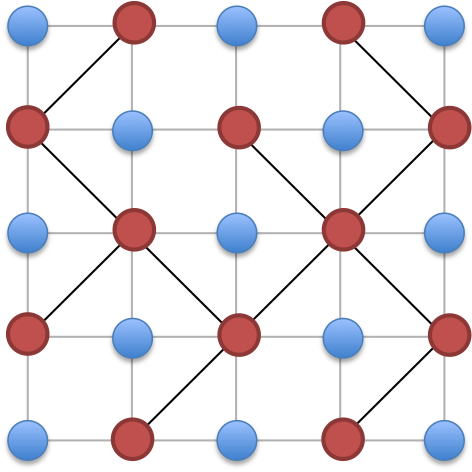

[TOC]

## [ZROI#2226. 马里乌波尔](http://zhengruioi.com/problem/2226)

首先我们边分治

然后边分治每层得到一条边和两个联通块

只有每层这样的联通块的最小生成树的边才有可能出现在最终的答案里。

然后这样的好处是距离很容易计算，就是 $dis_x+w+dis_y$

然后对于这样的很麻烦的生成树，一般就是用 $\rm Burovka$，我们先对两个联通块用距离从小到大排序，然后对于每一遍，我们从大到小扫，维护一个满足都是 $\le 0$ 的，我们只需要知道最大的 $\le 0$ 且不在同一个联通块内的和第一个 $>0$ 且不在同一个联通块内的。这个同样可以预处理出来。

边分治+最小生成树的复杂度是 $\mathcal O(n\log^2n)$，最后对所有有效边求最小生成树也是 $\mathcal O(n\log^2n)$

## [CF516E Drazil and His Happy Friends](https://www.luogu.com.cn/problem/CF516E)

*3100的数论只能看出第一步然后就不会了。

首先我们不难发现对于 $d=\gcd(n,m)>1$ 的情况，$\bmod d$ 不同的值是不可能碰到一起的。所以可以对 $d$ 个分别独立的求解。这样的一个好处就是 $\gcd(n,m)=1$ 只要一个是开心的迟早可以全部开心。然后无解也可以判断掉了。

于是现在的问题就是对于一个 $\gcd(n,m)=1$ 的局面判断最小时间，不妨假设 $n>m$。首先如果一开始就可以了直接返回 $-1$，然后如果在前 $m$ 天可以那么暴力判断。

然后就是不那么平凡的情况了，一个结论是最后一个男生变快乐的时间就是答案，证明可以考虑前 $m-1$ 次必定让除了这次的女生外所有女生变快乐。

然后还有一个结论是如果 $i$ 在第 $x$ 天变快乐，那么显然可以在 $x+m$ 天让 $(i+m)\bmod n$ 变快乐，于是我们建边 $i \stackrel{m}{\longrightarrow} (i+m)\bmod n$，如果 $i$ 一开始就是快乐的我们直接令 $dis_i=i$ 跑最短路即可。

但是现在点数还是 $10^9$ 级别的。这个是一个环。一个方案是观察到如果 $i,(i+m)\bmod n$ 初始都是不快乐的那么 $(i+m)\bmod n$ 快乐的时间肯定比 $i$ 晚所以 $i$ 是没用的。我们在环上只保留有用的点跑最短路即可。

复杂度 $\mathcal O((b+r)\log (b+r))$

## [CF526G Spiders Evil Plan](https://www.luogu.com.cn/problem/CF526G)

一个结论是用 $y$ 条路径覆盖有 $\le 2y$ 片叶子的树。

一个暴力是以 $x$ 为根，然后选叶子。然后选一片叶子的贡献就是这条长链的长度。但是这样每次根都是不一样的所以就寄了。

一个不换根的做法是观察到一个方案肯定会经过直径的一个端点，所以直接拿两个端点为根，选前 $2y-1$ 片叶子即可。

然后*3300就做完了？当然不会这么简单，因为 $x$ 不一定在这个联通块上，但是策略无非就两种：

- 删除贡献最小的叶子，加入 $x$ 这一条
- 把最靠近 $x$ 的一条扭过来

应该可以证明只有这两种。然后直接做就行了。

## [CF538G Berserk Robot](https://www.luogu.com.cn/problem/CF538G)

首先我们规定 $(t_0,x_0,y_0)=(0,0,0)$。

我们考虑如果 $t_i\le l$ 怎么做，首先上一条信息是 $(t_{i-1},x_{i-1},y_{i-1})$ 现在的信息是 $(t_i,x_i,y_i)$ 那么考虑要满足什么条件：

- $x_i+y_i+t_i\equiv0\bmod 2$
- $|x_i-x_{i-1}|+|y_i-y_{i-1}|\le t_i-t_{i-1}$

然后构造也不难，就直接把从 $(x_{i-1},y_{i-1})$ 移动到 $(x_i,y_i)$，然后剩下的操作次数是偶数直接反复横跳就可以了。

然后现在 $t_i$ 可以很大，但是如果我们知道时刻 $l$ 的位置 $(\Delta_x,\Delta_y)$，也就是操作一整个序列的偏移量。那么我们可以把很大的 $(t_i,x_i,y_i)$ 等价于 $((t_i-1)\bmod l+1,x_i-\lfloor\frac{t_i}l\rfloor\Delta_x,y_i-\lfloor\frac{t_i}l\rfloor\Delta_y)$。如果能求出 $\Delta_x,\Delta_y$ 就等价于存在 $i,j$ 满足 $t_i\equiv t_j\bmod l$ 就必定可以计算出 $\Delta_x,\Delta_y$。

然后我们现在的问题就是 $t_i\bmod l$ 两两不同了。我们仍然压到 $[0,l]$，不同的是我们现在用含有 $\Delta_x,\Delta_y$ 的代数式表示第 $i$ 天的位置，也就是 $(b_i-a_i\times \Delta_x,c_i-a_i\times\Delta_y)$。我们仍然考虑上面的等式，对于第一个约束，我们直接暴力算出 $\Delta_x,\Delta_y$ 的奇偶可以取那些值，对于第二个约束我们必定可以写成 $|a\times \Delta _x-b|+|a\times \Delta_y-c|\le d$，众所周知 $|a|+|b|=\max\{a+b,a-b,-a+b,-a-b\}$，然后就可以写成 $a\times \Delta_x+b\times\Delta_y\le c$ 的形式，其中满足 $|a|=|b|$。

对于这样的约束，我们可以算出 $\Delta_x+\Delta_y,\Delta_x-\Delta_y$ 的范围，所以我们可以枚举 $\Delta_x$ 看看有哪些可行的 $\Delta_y$ 。找到合法的 $\Delta_x,\Delta_y$ 之后我们就可以把所有的信息放到第一个周期跑刚刚的构造就可以了。

复杂度 $\mathcal O(n\log n+l)$

## [CF547D Mike and Fish](https://www.luogu.com.cn/problem/CF547D)

对于每一行两两连边，每一列两两连边

（可能）可以证明没有奇环，直接染色就好了，复杂度 $\mathcal O(n)$

## [CF547E Mike and Friends](https://www.luogu.com.cn/problem/CF547E)

比较无脑直接建了后缀自动机，把一个询问拆成两个，然后就扫描线，从 $k$ 这个节点往上跳跳到最高的 $u$ 满足 $len_u\ge|s_k|$ 查询 $u$ 内部点数即可。

好像AC自动机就行了我是憨憨。

## [CF549E Sasha Circle](https://www.luogu.com.cn/problem/CF549E)

不太相信这么神仙的题只有*2700

首先 $\min(n,m)=1$ 这样平凡的情况直接输出 $\texttt{YES}$ 即可。

然后我们有一个结论，只要 $a_i$ 全部在圆内**或圆上**，$b_i$ 全部在圆外或相反即可。只考虑第一种情况，那么在圆上我们只需要把圆稍稍扩大就全部在圆内了。然后如果只有 $\le 1$ 个点在圆上我们可以缩小圆直到有至少 $2$ 个点在圆上。然后我们枚举这两个点，得到一条中垂线，圆心在中垂线上，还有若干条限制形如 $|P-a|\le |P-b|$ 或 $|P-a|>|P-b|$，可以求出圆周角的范围判断有没有合法的圆心位置。这样我们可以做到 $\mathcal O(n+m)$ 判断一个点对，复杂度 $\mathcal O(n^2(n+m))$。

然后考虑不是每一个点对都有用的，如果有一个抛物线 $x^2+y^2=z$，把平面上的点投影到抛物线上，那么一个面 $ax+by+c=z$ 与抛物线的交是 $x^2-ax+y^2-by-c=0$，是一个圆的形式。抛物线是下凸的因此只需要一个平面把点分成上下两部分即可。

于是只有在这个上凸壳上的边才有可能是答案，并且这个上凸壳一定是原图一个三角剖分的投影，也就是边数是土包大小级别的。众所周知凸包大小是 $\mathcal O(C^{\frac23})$ 的因此暴力检验的复杂度是 $\mathcal O(C^{\frac23}(n+m))$ 的。其中 $C$ 是值域。

然后我们只需要求出上凸壳就好了，我们先跑出凸包，然后上凸壳一个面就相当于找一个三角形使得外接圆包括所有的点，于是我们只需要随便定两个点 $p_1,p_2$ 找到最大的 $p_k$，然后计算 $(p_i,p_k),(p_2,p_k)$ 的答案，然后地柜计算两边的凸包即可。

最终复杂度 $\mathcal O(C^{\frac43}+C^{\frac32}(n+m))$

## [CF553E Kyoya and Train](https://www.luogu.com.cn/problem/CF553E)

一个很 $\rm Naive$ 的 $\rm dp$ 就是设 $f_{i,j}$ 表示在时刻 $j$ 来到 $i$ 到 $n$ 在最有策略下的花费，那么显然有：
$$
f_{i,j}=\begin{cases}
[j>t]\times x&,i=n\\
x&,i\ne n,j\ge t\\
\displaystyle\min_{a_k=i}\left(\sum_{l=1}^tp_{k,l}\times f_{b_k,j+l}+c_k\right)&,i\ne n,j<t
\end{cases}
$$
转移次数是 $\mathcal O(mt)$ 的每次时间复杂度是 $\mathcal O(t)$ 所以总时间是 $\mathcal O(mt^2)$。因为 $j$ 只能从大往小转移所以一定是可以直接转移的。

然后我们考虑优化，记 $g_{i,j}=\sum_{l=1}^tp_{i,l}\times f_{b_i,j+l}$，那么我们直接 $\rm CDQ$，考虑 $f_{*,[mid+1,r]}$ 对 $g_{*,[l,mid]}$ 的贡献，贡献是一个差卷积的形式，分析一波复杂度是 $\mathcal O(mt\log^2t)$ 的，给了 $8s$ 加上 CF 神机常数稍微控制一下应该是可以通过了。

## [CF555E Case of Computer Network](https://www.luogu.com.cn/problem/CF555E)

首先边双缩点就是森林，一个边双内部肯定可以构造出一个环使得强连通，只需要给树边定向即可。

树边定向应该直接差分打标记就好了。记得判断不联通的情况。

## [CF559E Gerald and Path](https://www.luogu.com.cn/problem/CF559E)

我们记 $f_{i,j,p}$ 表示按端点从小到大排序，到了第 $i$ 条线段，最右的线段是 $j$ 方向是 $p$ 的最大长度和。

转移就枚举 $k=i+1\dots,n$ 钦定 $1+1,\dots,k-1$ 都是往右，计算一下从 $j$ 开始新增的贡献。这样可能会少算贡献但是因为取最大值所以答案一定会被取到。

## [CF568E Longest Increasing Subsequence](https://www.luogu.com.cn/problem/CF568E)

我们不妨钦定 $a_0=-\infty,a_{n+1}=+\infty$ 那么最长上升子序列一定经过 $0$ 和 $n+1$。

然后我们有一个很显然的想法就是我们可以在确定的位置上 dp 然后看不确定的位置最多能插入多少个。不妨记 $c_i$ 表示前 $i$ 个位置 $-1$ 的个数，$s_i$ 表示给出的 $m$ 个数中 $\le i$ 的有多少个数，那么我们就可以列出转移方程：

$$
f_j=\max_{i<j,a_i<a_j}f_i+\min(c_{j-1}-c_i,s_{a_j-1}-s_{a_i})+1
$$

具体的含义就是计算 $[i+1,j-1]$ 最多能插入多少个数。然后我们直接拆了 $\min$：

$$
f_j=\max\left(\max_{i<j,a_i<a_j,s_{a_j-1}-s_{a_i}\le c_{j-1}-c_i}f_i+s_{a_j-1}-s_{a_i}+1,\max_{i<j,a_i<a_j,s_{a_j-1}-s_{a_i}>c_{j-1}-c_i}f_i+c_{j-1}-c_i+1\right)
$$

对于 $s_{a_j-1}-s_{a_i}\le c_{j-1}-c_i$ 我们移项成 $s_{a_j-1}-c_{j-1}\le s_{a_i}-c_i$，然后就是一个三维偏序的形式，直接 CDQ 分治就可以通过了。

至于输出方案只要暴力模拟往里面插即可，具体实现可以看代码。

复杂度 $\mathcal O(n\log^2n)$

## [CF571D Campus](https://www.luogu.com.cn/problem/CF571D)

首先考虑如果没有赋值为 $0$ 的操作我们可以把操作离线下来建树，然后集合加就是区间加，轻松做到一只 $\log$

但是现在如果有赋值为 $0$ 的操作，实际上我们可以变成差分，也就是说查询上一次这个位置被赋值为 $0$ 是什么时候，两者的差就是答案了。

至于怎么求上一次赋值为 $0$ 是什么时候我们可以把另一些操作拉出来建树，那么一次操作就相当于更新子树内的时间戳，也可以做到一只 $\log$。

于是就在一只 $\log$ 的时间内做出了这道题。

## [CF571E Geometric Progressions](https://www.luogu.com.cn/problem/CF571E)

考虑把所有的 $a_i,b_i$ 质因数分解得到向量 $\mathbf a_i,\mathbf b_i$，那么我们就相当于要求一组 $\{k_i\}$ 满足 $k_i$ 都是自然数，并且 $\forall i\in[1,n],\mathbf a_i+k_i\mathbf b_i=\mathbf X$。我们希望这个 $\mathbf X$ 最小。

然后考虑如果 $b_i=1$ 那么最终可能的数只有 $a_i$ 直接判断即可。否则所有的 $\mathbf b_i$ 都不是 $\mathbf 0$，那么如果出现了两个 $\mathbf b_i,\mathbf b_j$ 线性无关，即存在 $p,q$ 满足 $\mathbf b_{i,p}\times \mathbf b_{j,q}-\mathbf b_{i,q}\times \mathbf b_{j,p}\ne0$，那么此时我们可以通过 $\mathbf a_{i,p},\mathbf a_{i,q},\mathbf a_{j,p},\mathbf a_{j,q},\mathbf b_{i,p},\mathbf b_{i,q},\mathbf b_{j,p},\mathbf b_{j,q}$ 计算出 $\mathbf X_p,\mathbf X_q$。因为 $\mathbf b_{i,p},\mathbf b_{i,q}$ 至少有一个不为 $0$ 因此我们可以计算出 $k_i$，计算出 $k_i$ 之后就可以计算出 $\mathbf X$，$\mathbf X$ 算出来之后暴力检验即可。因为对于非零向量线性相关满足传递性所以我们只需要对相邻的检验是否线性相关即可。

如果所有 $\mathbf b_i$ 都是线性相关的，那么还需要进一步计算。我们不妨设 $\mathbf b_i=\frac{w_i}{l_i}\times \mathbf b_1$，那么就有：
$$
\mathbf a_1+k_1\mathbf b_1=\mathbf a_i+k_i\times \frac{w_i}{l_i}\mathbf b_1\iff \mathbf a_i-\mathbf a_1=(k_1-k_i\times \frac{w_i}{l_i})\mathbf b_1
$$
于是就得到如果有解，所有 $\mathbf a_i-\mathbf a_1$ 都与 $\mathbf b_1$ 线性相关。

如果上一个条件满足，那么我们不妨把 $\mathbf a_i$ 写成 $\mathbf a_1+\frac{u_i}{v_i}\mathbf b_1$。如果 $\mathbf a_1$ 是最小的那么就会有 $\frac{u_i}{v_i}\ge 0$，如果不是那么可以把最小的移动到第一个。那么现在就是：

$$
\mathbf a_1+\frac{u_i}{v_i}\mathbf b_1+\frac{w_i}{l_i}\times k_i\mathbf b_1=\mathbf X\iff \frac{u_i}{v_i}\mathbf b_i+\frac{w_i}{l_i}\times k_i\mathbf b_i=\mathbf X-\mathbf a_1
$$
不妨设 $N=\mathrm{lca}(v_1,\dots,v_n,l_1,\dots,l_n),p_i=\frac{u_i}{v_i}\times N,q_i=\frac{w_i}{l_i}\times N$，那么我们就可以得到一个更简单的形式：
$$
p_1+q_1\times k_1=p_2+q_2\times k_2=\dots=p_n+q_n\times k_n=R
$$
这个就很容易做了，就是求 $R\equiv p_i\bmod q_i,R\ge p_i$ 的最小的 $R$，直接上 exCRT 就做完了。

还有一个问题是这个数会不会太大，让 exCRT 挂掉，但是分析一波是不会的，因为因子个数 $\le 30$，所有的 $q_i$  的最大公约数最大是 $2^4\times 3^3\times 5^2\times 7\times 11\times 13\times 17\times 19\times 23\times 29$ 不超过 `long long` 用 `__int128` 就完全存的下。

然后就不难算出 $\mathbf X$ 计算答案了。

## [CF573E Bear and Bowling](https://www.luogu.com.cn/problem/CF573E)

首先有一个很 $\rm Naive$ 的 $\rm dp$ 就是设 $f_{i,j}$ 表示位置 $i$ 长度为 $j$ 的最大值，那么：
$$
f_{i,j}=\max(f_{i-1,j},f_{i-1,j-1}+a_i\times j)
$$
经过一些精妙的证明我们可以知道 $f_i$ 一个前缀从 $f_{i-1,j}$ 转移剩下的从 $f_{i-1,j01}+a_i\times j$ 转移，实现时二分这个分界点，然后后面的整体后移、加一次函数，复杂度 $\mathcal O(n\log^2n)$。

## [CF575A Fibonotci](https://www.luogu.com.cn/problem/CF575A)

一个简单的矩阵快速幂。

记 $H_i=\begin{pmatrix}s_{i-1}&1\\s_{i-2}&0\end{pmatrix}$，我们要求的就是 $\prod_{i=2}^kH_i$。

然后对于 $H_i\ne \begin{pmatrix}a_{i-1\bmod n}&1\\s_{i-2\bmod n}&0\end{pmatrix}$ 的 $i$ 只有 $\mathcal O(m)$ 个，直接拎出来暴力计算。

对于两个关键点之间的积就线段树、矩阵快速幂搞一搞就好了。

## [CF578E Walking!](https://www.luogu.com.cn/problem/CF578E)

对每一个可用边相同的时间段跑矩阵快速幂即可。

因为这个快速幂只需要 $\lor$ 所以可以 `bitset` 优化。

复杂度 $\mathcal O(n^3m\log10^9/w)$。

## [CF575E Spectator Riots](https://www.luogu.com.cn/problem/CF575E)

首先因为要外接圆期望覆盖最多所以实际上就是要覆盖所有的点。

首先可以对所有有用的点求一个凸包，有用的个数是 $\mathcal O(n)$ 级别的所以这部分复杂度是 $\mathcal O(n\log n)$ 的。

然后一个结论是最大的圆肯定是凸包上相邻的 $3$ 个点得到的，直接枚举计算即可。

计算几何又写挂了/ll

## [CF578E Walking!](https://www.luogu.com.cn/problem/CF578E)

首先这个条件是不弱于分成最少的子序列每个子序列都是 `LR` 交替的。

然后考虑证明这两个条件是等价的，也就是对于一个子序列划分方案，一定可以转换成合法的答案。

考虑如果同时有 `LL,RR` 那么一定是合法的，比如如果 `LL` 的数量更多，我们可以把 `LL` 和 `RR` 合并成 `LR` 最后只剩下一个 `LL`，然后可以排成 `LR LL RL`。其他的情况也是类似的。

现在构造不出来的情况就是 `LR,RL` 同时存在但是没有 `LL,RR`，但是可以调整一对 `LR,RL` 把结束较迟的那个的末尾交给较早的。然后就得到了 `LL,RR`，就可以跑上面的做法了。

最后就是怎么让子序列最小，直接从前往后贪心即可。

## [CF578F Mirror Box](https://www.luogu.com.cn/problem/CF578F)

首先把网格看成 $(n+1)\times (m+1)$ 个点，然后镜子就是在两个点之间连边。

黑白染色，然后连边只能在颜色相同的点之间连边。然后只需要黑点或白点构成一棵树就是合法的。

证明从两个限制考虑：

- 每条边都要被走到，就意味着不能有环
- 从相邻的节点出来，也就是把边界上的边两两分成一组然后围住

大概就是这样，严谨的证明我不会

知道是树之后就可以跑矩阵树定理了，同一个联通块内缩一下点，复杂度 $\mathcal O(k^3)$

## [CF582D Number of Binominal Coefficients](https://www.luogu.com.cn/problem/CF582D)

首先根据库默尔定理我们知道进位次数就是 $p$ 的幂次。然后就可以 $\rm dp$ 了。

记 $f_{i,j,0/1,0/1}$ 表示前 $i$ 位发生了 $j$ 次进位（包括当前位），是否小于上界 ，是否从后一位进位

- $f_{i,j,0,0}\to f_{i+1,j,0,0}$，仍然等于上界，设这一位上界是 $x$ 则 $n-k$ 和 $k$ 的和是 $x$ 系数是 $x+1$
- $f_{i,j,0,0}\to f_{i+1,j,1,0}$，小于上界，则 $n-k$ 和 $k$ 这一位的和是 $[0,x-1]$，系数是 $\binom{x+1}2$
- $f_{i,j,0,0}\to f_{i+1,j+1,0,1}$ 仍然等于上界，实际值是 $x-1$ 系数是 $x$
- $f_{i,j,0,0}\to f_{i+1.j+1,1,1}$，小于上界，实际值是 $[0,x-2]$ 系数为 $\binom{x}2$
- $f_{i,j,0,1}\to f_{i+1,j,0,0}$ 仍然等于上界，和是 $x+p$ 系数为 $p-x-1$
- $f_{i,j,0,1}\to f_{i+1,j,1,0}$ 小于上界，和是 $[p,p+x-1]$ 系数为 $x(2p-x-1)/2$
- $f_{i,j,0,1}\to f_{i+1.j+1,0,1}$ 等于上界，和是 $x+p-1$ 系数为 $p-x+1$
- $f_{i,j,0,1}\to f_{i+1,j+1,1,1}$ 小于上界，和是 $[p-1,p+x-2]$ 系数为 $x(2p-x+1)/2$ 
- $f_{i,j,1,0}\to f_{i+1,j,1,0}$ 任取，和 $<p$ 系数 $\binom{p+1}2$
- $f_{i,j,1,0}\to f_{i+1,j+1,1,1}$ 任取，和 $<p-1$ 系数为 $\binom p2$
- $f_{i,j,1,1}\to f_{i+1,j,1,0}$ 任取，和 $\ge p$ 系数 $\binom p2$
- $f_{i,j,1,1}\to f_{i+1.j+1,1,1}$ 任取，和 $\ge p-1$ 系数为 $\binom{p+1}2$

然后直接 $\rm dp$ 就可以过了。

## [CF585E Present for Vitalik the Philatelist](https://www.luogu.com.cn/problem/CF585E)

一个想法是枚举 $\gcd_{i\in S}a_i=x$，设这个的方案数是 $g_x$，然后 $f_x$ 表示与 $x$ 互质的数的个数，那么就是要求 $\sum_{i>1}f_i\times g_i$。

然后考虑 $f_x$ 怎么求：
$$
f_x=\sum [\gcd(i,x)=1]c_i=\sum_{d|x}\mu(d)\left(\sum_{d|i}c_i\right)
$$
然后 后面一项就相当于对 $c_i$ 求狄利克雷后缀和，不妨记为 $s_i$，然后再求狄利克雷前缀和。

然后再考虑 $g_x$ 怎么求，设 $g'_x$ 表示 $\gcd$ 是 $x$ 的倍数的集合个数，那么显然 $g'_x=\sum_{d|x}g_d=2^{s_i}-1$，那么这个就反着来搞一下狄利克雷差分即可。

复杂度 $\mathcal O(n+W\log\log W)$

## [CF587F Duff is Mad](https://www.luogu.com.cn/problem/CF587F)

首先我们可以差分，然后就是变成 $s_{1,\dots,l}$ 在 $s_k$ 中出现了多少次。

然后把所有的串拼成一个串 $t$，中间加上分隔符。

应该可以变成加入一个串 $s_l$，给所有后缀是 $s_l$ 的位置 $+1$，然后询问就是问 $s_k$ 所在区间有一共被加了多少次。

然后后缀是 $s_l$ 的位置就是在后缀自动机 $s_l$ 结尾位置往上跳直到 $len_u\ge |s_l|$，这个子树内所有位置的贡献都要 $+1$

然后变成数据结构问题了。只需要分块，整块更新的时候处理贡献，零散快用 $\mathcal O(\sqrt n)$ 修改 $\mathcal O(1)$ 查询即可。

上面好像还是比较麻烦，直接对长度根号分治就不用分块了。

复杂度 $\mathcal O(n\sqrt n)$ 看上去能过。

可能会卡空间一种比较 $\rm Naive$ 的方法就是对每一个 $\ge B$ 分别跑那么空间复杂度就是 $\mathcal O(n\log n)$ 的倍增了。

## [P4298 [CTSC2008]祭祀](https://www.luogu.com.cn/problem/P4298)

首先根据 $\rm Dilworth$ 定理**最长反链**=**最小链覆盖**。本来这个最小链覆盖的链是可以相交的，但是我们先求一遍传递闭包然后这个链就不能相交了。

**最小不相交链覆盖**是经典题，建两排点，一条边 $u\to v$ 我们就在 $u\to v'$ 连一条边，然后求最大匹配，用 $n$ 减去就是答案。考虑正确性，本来链的条数是 $n$，选一条边 $u\to v$ 就让链数 $-1$，然后每个点的出度、入度都 $\le 1$ 所以就是一个最大匹配。

然后可行的点就是选择了这个点之后把不能选的点拿出来然后跑剩下的答案只减少 $1$。

然后构造方案只需要把所有可能的点暴力选中并标记不能选的点即可。

## [CF590E Birthday](https://www.luogu.com.cn/problem/CF590E)

首先发现如果把所有的子串关系建出来就是刚刚那个题。但不完全是，因为刚刚那题要输出可能的点但是这题不需要。因为构造方案只需要一遍网络流就可以了。

然后考虑子串关系怎么求。我们可以先建出 $\rm AC$ 自动机，然后一个点的子串就是往上跳 $\rm fail$ 所有遇到的结尾位置。然后我们又发现这个是有传递性对的也就是我们只需要找到最近的接吻位置即可。然后可能会爆栈我实现的时候用的是 $\rm bfs$。

## [CF605E Intergalaxy Trips](https://www.luogu.com.cn/problem/CF605E)

这个的策略感觉非常麻烦。设 $E_i$ 表示从 $i$ 到 $n$ 的期望时间，那么如果存在一条 $E_j<E_i$ 的边开了就会走，否则会走自环。于是就有：
$$
E_i=\sum_{E_j<E_i}E_j\times p_{i,j}\prod_{E_k<E_j}(1-p_{i,k})+E_i\prod_{E_j<E_i}(1-p_{i,j})+1\\
E_i=\frac{\displaystyle\sum_{E_j<E_i}E_j\times p_{i,j}\prod_{E_k<E_j}(1-p_{i,k})+1}{\displaystyle1-\prod_{E_j<E_i}(1-p_{i,j})}
$$
然后这个每次选一个最小的 $E_j$ 更新贡献即可。

复杂度 $\mathcal O(n^2)$。

## [CF607E Cross Sum](https://www.luogu.com.cn/problem/CF607E)

首先我们二分出一个最大的圆满足内部点数 $<m$。

给定半径求圆内点数就相当于给定若干段弧多少段有交。然后在转化成线段，就可以用树状数组做了。

现在内部点数 $<m$ 所以我们只需要暴力枚举所有有交的线段计算贡献即可。

对于圆上的点计算时要算还剩下多少个，就用半径乘个数。

复杂度 $\mathcal O(-n\log n\log\mathrm {eps}+m\log n)$

## 4.4模拟赛T2

> 题意：一张网格图，大小 $R\times C\le 10^5$，需要修稿边权，强制在线，最小生成树

首先边权只有减小那么可以直接 $\rm LCT$ 维护，如果本来就在最小生成树上那么现在肯定还在，否则看看能不能替换掉一条边使得答案更优。

然后边权会增大，考虑网格图是平面图，对偶图上边集的补集是最大生成树，那么直接跑上面的算法就好了。

细节有点多/ll，复杂度 $\mathcal O(q\log n)$

## 4.4模拟赛T3

> 题意：$n$ 个点连出内向树森林，如果第 $i$ 个点有父亲并且是 $p_i$ 那么权值就乘 $w_{(i-p_i+n)\bmod n}$ 求所有方案数的权值和。

首先有一个很 $\rm Naive$ 的矩阵树，边权是固定的，因为是森林可以建一个虚点 $n+1$，然后代数余子式：
$$
A=\begin{pmatrix}
S+1&-w_1&\cdots&-w_{n-2}& -w_{n-1}\\
-w_{n-1}&S+1&\cdots&-w_{n-3}&-w_{n-2}\\
\vdots&\vdots&\ddots&\vdots&\vdots\\
-w_2&-w_3&\cdots&S+1&-w_1\\
-w_1&-w_2&\cdots&-w_{n-1}&S+1
\end{pmatrix}
$$
其中 $S=\sum w_i$，直接做就是 $\mathcal O(n^3)$ 了。但是这个矩阵有性质。比如每一行都是上一行循环位移。我们构造一个范德蒙德矩阵：
$$
B=
\begin{pmatrix}
1&1&\cdots&1&1\\
\omega_n^0&\omega_n^1&\cdots&\omega_n^{n-2}&\omega_n^{n-1}\\
\vdots&\vdots&\ddots&\vdots&\vdots\\
\omega_n^0&\omega_n^{n-2}&\cdots&\omega_n^{(n-2)(n-2)}&\omega_n^{(n-1)(n-2)}\\
\omega_n^0&\omega_n^{n-1}&\cdots&\omega_n^{(n-2)(n-1)}&\omega_n^{(n-1)(n-1)}
\end{pmatrix}
$$
然后：
$$
A\times B=\begin{pmatrix}
f(\omega_n^0)&f(\omega_n^1)&\cdots&f(\omega_n^{n-2})&f(\omega_n^{n-1})\\
f(\omega_n^0)&\omega_n^1f(\omega_n^1)&\cdots&\omega_n^{n-2}f(\omega_n^{n-2})&\omega_n^{n-1}f(\omega_n^{n-1})\\
\vdots&\vdots&\ddots&\vdots&\vdots\\
f(\omega_n^0)&\omega_n^{n-2}f(\omega_n^1)&\cdots&\omega_n^{(n-2)(n-2)}f(\omega_n^{n-2})&\omega_n^{(n-1)(n-2)}f(\omega_n^{n-1})\\
f(\omega_n^0)&\omega_n^{n-1}f(\omega_n^1)&\cdots&\omega_n^{(n-2)(n-1)}f(\omega_n^{n-2})&\omega_n^{(n-1)(n-1)}f(\omega_n^{n-1})
\end{pmatrix}
$$
其中 $f(x)=S+1+\sum (-w_i)x^i$。求 $f(\omega_n^i)$ 直接 $\rm DFT$ 就可以了。

然后 $|A\times B|=|A||B|=|B|\times\prod_{i=0}^{n-1}f(\omega_n^i)$，然后就做完了。

## [noi.ac #2631. Alienation](http://noi.ac/problem/2631)

首先有一个很 $\rm Naive$ 的容斥，钦定有若干个矩形有交。

对于钦定一个有交，就是 $\sum \deg_i(n-2)/2$

对于两个有交，就是 $\sum\deg_i(\deg_i-1)/2$

对于三个有交，我们可以在左边界最右的矩形统计，统计的时候我们会乘上高度，只需要把所有的矩形高度减一，再做一遍差分一下就是答案了。

对于求 $\deg$ 也可以类似的方法。比较菜要用 `__int128`。

## [noi.ac #2632. Allocation](http://noi.ac/problem/2632)

首先根据毛估估就是regular language也就是可以建出自动机。

这个自动机直接构造不方便，题解的构造方法是先建出二叉树，然后如果一个状态后面接上所有长度 $\le 10$ 的串和另一个串相等那么就认为等价，可以不需要这个节点直接连接到等价节点。

然后这样做节点数不会太多。

然后自动机建出来就可以直接 $\rm dp$ 了。

复杂度 $\mathcal O(T\times n\times\text{玄})$。

## 4.5模拟赛T3

> 题意：一开始有 $T_0$ 只有一个节点 $1$，$T_i$ 是 $T_{a_i},T_{b_i}$ 的 $c_i,d_i$ 连在一起然后把 $T_{b_i}$ 中的所有点编号加 $|T_{a_i}|$，保证 $|T_i|\le10^{18}$，记 $F(T,u)$ 是 $T$ 以 $u$ 为根的深度，对所有 $T_i$ 求 $\sum F(T_i,u)$。

首先有一个题叫做 [送你一颗圣诞树](http://zhengruioi.com/problem/449) 教会我们求 深度和 和 两点距离 直接记忆化是多项式的。

然后深度就等价于到直径两个端点的距离和，直径我们可以从两棵树合并，然后对直径分类讨论：

- 如果直径 $d$ 是偶数，那么就相当于全部走到直径的中点，然后再走 $d/2$
- 如果直径 $d$ 是奇数，那么先走到直径中间的边的一个端点，然后补偿另一边少走的一步，然后再全部走 $(d-1)/2$

因此我们需要实现：

- `D(i,x,y)` 表示在 $T_i$ 上 $x$ 和 $y$ 的距离
- `S(i,x)` 表示在 $T_i$ 上以 $x$ 为根的深度和
- `W(i,x,y,k)` 表示在 $T_i$ 上从 $x$ 出发向 $y$ 走 $k$ 步
- `F(i,x,y,k)` 表示 $T_i$ 以 $x$ 为根向 $y$ 走 $k$ 步的子树大小

复杂度 $\mathcal O(\text{玄学})$，但是跑得飞快。

  ## [ZROI#2234. 游戏](http://zhengruioi.com/problem/2234)

结论题。

首先黑白染色，如果黑点的和和白点的和不一样毛估估是先手必胜。

否则记 $p_u$ 是 $u$ 子树内和 $u$ 深度奇偶性相同的减去不同的，如果存在 $p_u<0$ 那么先手必胜。

## [ZROI#2235. 数数](http://zhengruioi.com/problem/2235)

首先记 $a_i=b_i-c+1$，那么我们容斥，钦定 $S$ 内 $i$ 的都 $x_i\ge a_i$，那么方案数就是 $\binom{n-\sum_{r\in S}a_r+m-1}{m}$，于是我们就相当于求下面这个式子：
$$
\sum_{S\subseteq\{1,\dots,m\}}(-1)^{|S|}\binom{n-\sum_{r\in S}a_r+m-1}m
$$
然后这个就可以 $\rm dp$ 了，设 $dp_{i,j}$ 表示 $\sum_{S\subseteq\{i,\dots,m\}}(-1)^{|S|}\binom{n-\sum_{r\in S}a_r+m-1}j$ 的值，转移的时候枚举这个是否在 $S$ 内：

- 不在 $S$ 内：$dp_{i,j}\leftarrow dp_{i+1,j}$
- 在 $S$ 内，那么原来的二项式上面的数都要减去 $a_i$，那么：$dp_{i,j+1}\leftarrow dp_{i+1,j}\times\binom{-a_i}{k}$，其中的二项式是广义二项式系数，也就是 $\binom nm=n^{\underline m}/m!$。正确的原因是 $\binom{n+m}k=\sum_{r=0}^k\binom nr\binom m{k-r}$

但是这个做法有一点小bug，我们用的是广义二项式系数，也就是 $n<0$ 的时候 $\binom nm$ 还有值，但是事实上这个值是不能算的。一个解决方法是 $\sum_{r\in S}a_r\le n+m-1$，然后从高到低贪心放进 $S$ 里，因为 $a_i>\sum_{j<i}a_j$，所以这个是字典序最大的方案，比这个小一定合法，比这个大一定不合法。

然后多了一个字典序的限制，类似数位 $\rm dp$ 加一维表示现在是否贴上界即可。复杂度 $\mathcal O(m^3)$。

## [CF611G New Year and Cake](https://www.luogu.com.cn/problem/CF611G)

顺时针给出多边形 $p_1,\dots,p_n$，那么面积是：
$$
\sum_{i=1}^np_{i\bmod n+1}\times p_i/2
$$
然后枚举这条对角线的一个端点 $i$ 找到尽可能远的端点 $R$ 满足面积 $\le$ 一半。

然后对于 $i\to [i+2,R]$ 的多边形面积是减，$i\to [R+1,i+n-2]$ 的，面积是加。

但是这样有问题，如果两个相等就会被减两次。我的比较菜的解决方法是令面积 $<$ 一半再跑一遍，这样如果面积相等就会加两次就变成了 $0$。

最后可能数会比较大我的菜逼做法要 `__int128`。

## [CF611H New Year and Forgotten Tree](https://www.luogu.com.cn/problem/CF611H)

首先有 $m=\lceil\log_{10}n\rceil+1$ 种颜色。

然后我们可以调整一个方案使得每个颜色有一个关键点，关键点连成一棵树，剩下的边有一个端点是关键点。

然后对于那棵关键点连成的数直接枚举 Prufer 序列就是 $\mathcal O(m^{m-2})$ 了，然后剩下的一条边 $(x,y)$ 就意味着要么颜色 $x$ 剩余点数减一要么颜色 $y$ 剩余点数减 $1$，直接跑最大匹配即可。左边点数 $\binom{m+1}2$ 右边点数 $m$，因为 $m$ 只有 $6$ 所以是可以过的。

## [CF613E Puzzle Lover](https://www.luogu.com.cn/problem/CF613E)

首先我们断言图肯定是这样的：

然后我们就可以愉快的 $\rm dp$ 了，设 $dp_{i,j,k}$ 表示到 $i$ 行 $j$ 列，已经匹配了 $k$ 个的方案数，之后只能往右走。转移就直接暴力枚举。

然后判断第一段、第三段能不能构成就用Hash就可以了。

复杂度 $\mathcal O(nm)$。

## [CF626G Raffles](https://www.luogu.com.cn/problem/CF626G)

奶一口更改量不会太大

然后就是函数 $\frac{p x}{x+l}$ 是上凸的，所以每次的增加量是减小的，因此如果没有更改就直接选增加量最大的。

然后如果有修改就再维护一个减小的，调整即可。

## [CF627F Island Puzzle](https://www.luogu.com.cn/problem/CF627F)

首先把交换看成是 $0$ 的移动。然后树上的方案是唯一的就是从 $s$ 移到 $t$。

然后我们变成基环树怎么做，首先方案可逆也就是我们先把 $0$ 移到 $t$，得到新的 $a$，然后就是 $0$ 到环上转若干圈然后再回到 $t$ 使得 $a$ 和 $b$ 相同。

发现转圈的本质就是除了环上离 $t$ 最近的一点 $p$ 其他店全部转一位。所以当前所有 $a_i\ne b_i$ 的点一定是环上的点，并且环上还有一个 $p$，这些点连起来一定是一条链，如果不是链那么无解，否则加边方案就是唯一的。

有了环之后我们考虑最优方案，转的方向有两种我们可以只考虑一种另一种翻转即可。我们前面的方案能构造出合法接但是会出现无效的步数，我们可以先从 $s$ 走到一个端点，然后转需要的圈数，然后走到另一个端点然后再回到 $t$。

复杂度 $\mathcal O(n)$

## [CF568C New Language](https://www.luogu.com.cn/problem/CF568C)

首先直接从前往后贪心，如果前面是紧贴下界的话，当前位置有三个可能：取下界，取第一个大于下界并且和下界在同一个集合的，取第一个大于下界并且和下界不在同一个集合的。如果之前已经超过下界了，那么现在要么选 $\texttt{a}$ 要么选第一个和 $\texttt{a}$ 不在同一个集合的。

然后我们现在只需要判断后面是否合法即可。首先这个很明显是一个 2-SAT 问题，那么我们可以先建出图，跑传递闭包得到推出关系。然后我们需要判断后面能否合法。如果已经推导出矛盾了后面显然不合法，否则就直接在后面贪心地选字典序最大的，如果这样的字典序能够比给出的串大或相等就是合法否则就是不合法。

直接写就好了没什么细节。复杂度 $\mathcal O(n^3)$。

## [CF594E Cutting the Line](https://www.luogu.com.cn/problem/CF594E)

$k=1$ 非常 $\rm trival$ 就是 $s$ 和 $s^r$ 最小的那个、

如果 $k=n$ 怎么做，我们可以翻转 $s$ 得到 $s^r$，每次取最小的后缀。如果一段没有翻转就相当于取了一堆 $1$ 每个都翻转。取最小后缀依次拼起来就是答案了。求最小后缀只需要用 $\rm Lyndon$ 分解就可以了。

然后对于 $k\ge3$ 时，我们要选出一段最优的放上去，我们可以选两种：

- 一堆一样的
- 一堆 $1$

然后每次贪心直接选直到 $k=2$ 为止。对于 $k=2$ 我们需要一点特殊方法。我们还是考虑先选出当前 $s^r$ 的后缀 $t_1$ 和剩下部分 $t_2$ 并决定翻转还是不翻转：

- $t_1$ 翻转，$t_2$ 翻转

  得到的就是 $s$

- $t_1$ 不翻转，$t_2$ 不翻转

  得到就是 $s^r$ 所有循环同构中最小的，可以用 $\rm Lyndon$ 分解求

- $t_1$ 翻转，$t_2$ 不翻转

  比较 $i<j$ 就相当于比较 $(s^r[i,j-1])^r+s^r[1,i-1]$ 和 $s^r[1,j-1]$，然后这个比较显然可以用 $\rm exkmp$ 在 $\mathcal O(1)$ 的复杂度内求出 $\rm LCP$，然后就可以得到最优的位置了。

- $t_1$ 不翻转，$t_2$ 翻转

  最麻烦的一个，我们设 $s^r=a_1^{c_1}+a_2^{c_2}+\dots+a_m^{c_m}$，设 $b_i=a_i^{c_i},B_i=b_i+B_{i+1}$，可以证明最优方案一定选的是 $B_i$，然后如果 $B_i$ 不是 $B_{i+1}$ 的前缀肯定是 $B_{i+1}$ 更优，然后根据一些神秘的结论比如 $|B_{i+1}|<|B_i|/2$ 所以暴力比较复杂度 $\mathcal O(\sum |B_i|)$ 复杂度是正确的。

然后就在 $\mathcal O(n)$ 的复杂度内解决了这道神仙题。
