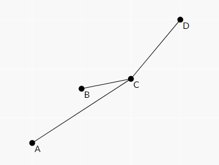

[TOC]

## [CF627E Orchestra](https://www.luogu.com.cn/problem/CF627E)

首先有一个很 $\rm Naive$ 的 $\mathcal O(r^2n)$ 的做法就是枚举上下边界，然后双指针跑一遍。

这个做法没有用到 $k$ 的性质，非常的菜。我们考虑枚举上边界，下边界逐渐上移，也就是会有一个删点的过程。我们考虑一个点的前驱和后继分别是 $L_x,R_x$，自己的坐标是 $val_x$，前 $k-1$ 个是 $pre_x$，那么对答案的贡献就是 $(val_{R_x}-val_x)\times pre_x$，然后删掉一个点只有 $\mathcal O(k)$ 个 $pre_x$ 会变，暴力更改这些即可。

复杂度 $\mathcal O(rnk)$

## [CF639E Bear and Paradox](https://www.luogu.com.cn/problem/CF639E)

首先最优解的 $p_i/t_i$ 一定是不降的，证明应该可以用 exchange arguement 那套理论。

然后现在只有 $p_i/t_i$ 相同的一段内部的顺序是不一定的，其他的顺序都已经定好了。

所以我们可以求出每一个任务完成的最早时间和最迟时间，然后二分检验按 $p_i$ 从小到大扫一遍判断有没有不合法的即可。

复杂度 $\mathcal O(n\log n+n\log \mathrm {eps})$。

## [CF639F Bear and Chemistry](https://www.luogu.com.cn/problem/CF639F)

这有 *3300？？？

首先对原图边双缩点。

就是问 $V$ 的点是不是在一个边双内。

一颗树怎么快速维护边双缩点呢？

把虚树拎出来，跑边双

复杂度 $\mathcal O\left(\sum(|E|+|V|)\log n\right)$

## [CF666D Chain Reaction](https://www.luogu.com.cn/problem/CF666D)

首先枚举每一个点是上下还是左右，$2^4$

然后对于不是全部横或全部竖情况数是 $\mathcal O(1)$ 的

然后全部横或全部竖要绝对值的最大值最小直接取中点即可。

## [CF643D Bearish Fanpages](https://www.luogu.com.cn/problem/CF643D)

记 $sum_i$ 为所有 $f_j=i$ 和 $i$ 自己对 $i$ 的贡献，$s_i$ 为所有 $f_j=i$ 的 $sum_j$ 构成的可重集合，$S$ 为所有 $s_i$ 最大值和最小值分别加上 $i$ 的贡献构成的集合。

然后更改的时候，只有 $\{x,f_x,f_{f_x},y,f_y\}$ 的 $sum$ 会变，这些点以及后继对 $S$ 的贡献会变，暴力删除这些点，暴力更改，最后加回去就可以了。

复杂度 $\mathcal O((n+q)\log n)$ 

## [CF679E Bear and Bad Powers of 42](https://www.luogu.com.cn/problem/CF679E)

猜一手加的次数不会太多就能全部好

对每一个点维护一个最少次数变成坏

然后线段树上暴力修改

根据 SegmentTree Beats 那套理论这个复杂度应该是对的。

## [CF696F ...Dary!](https://www.luogu.com.cn/problem/CF696F)

首先我们可以二分这个半径变成一个判定问题。

然后一个结论是一个圆覆盖到的直线在多边形上是一段连续区间，然后一个区间都有交那么这个区间的子区间也都有交。

于是我们就可以用双指针求出所有极大区间，判定一个区间是否合法用半平面交即可。

半平面交的复杂度是 $\mathcal O(n\log n)$ 那个 $\log$ 在排序上我们预处理好顺序就可以在 $\mathcal O(n)$ 的时间求一次半平面交了。

复杂度 $\mathcal O(n^2\log 1/\mathrm {eps})$

## [CF700E Cool Slogans](https://www.luogu.com.cn/problem/CF700E)

首先一个显然的观察是存在一组最优解使得 $s_{i-1}$ 是 $s_i$ 的后缀，因为如果不是的话那么变短答案显然不会更劣。

然后我们考虑在后缀自动机上 $\rm dp$，转移的时候一个等价类都是相同的，因为首先同一个等价类里无法相互转移，然后如果 $u$ 是 $v$ 的祖先 $v$ 这个等价类里面所有的字符串包含 $u$ 这个等价类里面的字符串的次数都是相等的，所以我们只需要在所有等价类最长串上 $\rm dp$。

然后状态数只有 $\mathcal O(n)$ 的了，直接在fail树上 $\rm dp$，其中 $f_i$ 表示从 $i$ 到根的路径上的最大值，转移的时候就拿出任意一个 $\rm endpos$，记为 $pos$，那么 $u$ 能转移到 $v$ 就等价于 $[pos-len_v+len_u,pos-1]\cap\mathrm{endpos}_u\ne\varnothing$，这个可以用可持久化线段树合并判断。

复杂度 $\mathcal O(n\log n)$。

## [CF704B Ant Man](https://www.luogu.com.cn/problem/CF704B)

牛逼贪心，根本想不到

一句话：从小到大加入，插入最优的位置。最优的就是贪心的选。

考虑为什么是对的，从小到大加入每个数，把 $x$ 插入 $y\to z$ 中间，不妨设 $x>y>z$，考虑贡献的变化：

- $y$ 到小
- 大到 $z$

然后变成了

- $y$ 到大
- 小到 $x$
- $x$ 到小
- 大到 $z$

然后这个东西加入两个小的贡献，把小的换成大的。然后对于 $x>z>y$ 同样是把小的换成大的然后在加入两个小的贡献。既然这样那么 每次贪心选最优的位置就是对的。

然后对于强制起点和终点的情况对 $[1,\min(s,e)-1],[\min(s,e)+1,\max(s,e)-1],[\max(s,e)+1,n]$ 类似上面讨论一遍就可以了。

## [CF704C Black Widow](https://www.luogu.com.cn/problem/CF704C)

思路不难，因为所有的 $x_i$ 或 $\lnot x_i$ 一共出现不超过两次，所以把出现了同一个 $x_{|i|}$ 的限制连起来，每一个联通快是独立的。然后对于联通块内部的情况，要么是单点，要么是链，要么是环。如果是链直接 $\rm dp$ 就可以了，如果是环断环为链然后直接 $\rm dp$ 就可以了，复杂度 $\mathcal O(n)$。

细节一大堆。

## [CF704E Iron Man](https://www.luogu.com.cn/problem/CF704E)

首先我们树链剖分，把鸡贼压到一条链上。

然后现在的问题就是平面上有若干条线段，问第一个交点的横坐标。

这个乍一看不是很好做，但是我们要求第一个交点的坐标所以我们先扫描线。

然后我们维护所有的线，因为在第一个交点之前所有线的相对位置是不会改变的，所以只需要用 `set` 就可以从下到上维护所有直线了。

然后我们还有一个结论是交点的两条线一定在某一时刻相邻，所以在加入/删除的时候计算一下新增的相邻线的贡献即可。

然后当前答案已经比扫描线小的话就要结束不然 `set` 会出现 `UB`。

注意当前答案指的是这条重链的答案而不是全局的答案。

## [CF708D Incorrect Flow](https://www.luogu.com.cn/problem/CF708D)

对 $f\le c$ 和 $f>c$ 的边分开来考虑：

- 如果 $f\le c$，最终的 $f$ 可以增大或减小，连三条边：
  1. 减小 $f$，$v\to u$ 退流，容量为 $f$ 费用为 $1$
  2. 增大 $f$（$f\le c$ 的部分），$u\to v$，容量为 $c-f$ 费用为 $1$
  3. 增大 $f$（$f>c$ 的部分），$u\to v$，容量为 $+\infty$ 费用为 $2$
- 如果 $f>c$ 则先花上 $f-c$ 的代价再链三条边
  1. 减小 $f$（$f\ge c$ 的部分），$v\to u$，容量为 $c-f$ 费用为 $0$
  2. 减小 $f$（$f<c$ 的部分），$v\to u$，容量为 $c$ 费用为 $1$
  3. 增大 $f$，$u\to v$ 容量为 $+\infty$ 费用为 $2$

对于初始的每条边，上界和下界都是 $f$，就可以直接跑有源汇上下界费用流了，过程如下：

- 先把所有的初始边连上
- 对于 入 - 出 $\ge 0$ 的从超级源点向这个点连边，否则向超级汇点连边
- 连 $n\to 1$ 使流量平衡。

## [AT3878 [ARC089D] ColoringBalls](https://www.luogu.com.cn/problem/AT3878)

首先这样的题目对操作序列计数很难不重，所以我们对得到的序列计数。

那么怎么判断序列是否合法呢，首先我们可以把连续的相同的缩成一个字符，然后 $\texttt{W}$ 把整个序列分成了若干个连续段，每个连续段都是独立的，并且每个连续段都是红蓝交错。

然后我们有如下结论：一个连续段如果有 $k$ 个蓝色（$k\ge 1$），那么需要 $a$ 个 $\texttt{r}$ 和 $k-a+1$ 个 $\texttt{b}$，并且前两个是 $\texttt{rb}$。如果全是红色就需要一个 $\texttt{r}$。然后我们的判断思路就很简单了，假如有 $a$ 个有蓝色的连续段和 $b$ 个全红色连续段，首先在最前面贪心地选出 $a$ 个 $\texttt{r}\dots \texttt{b}$，然后选出 $b$ 个 $\texttt{r}$，然后根据蓝色的数量从小往大贪心看 $\texttt{rb}$ 后面的数量还够不够，如果是够的就能被构造出来否则就是不行。

有了这个结论之后我们就能反过来 $\rm dp$ 了，首先枚举 $a$ 和 $b$，然后就能得到每个 $\texttt{rb}$ 之后有多少个可选的。我们记 $w_i$ 为从右往左数第 $i$ 个 $\texttt{rb}$ 右边的没有被选的个数加上 $i$ 的值，那么蓝色数量前 $i$ 小但是不为 $0$ 的段总的蓝色个数不能超过 $w_i$。于是 $\rm dp$ 方程就比较显然了，$f_{i,j,k}$ 表示蓝色的个数 $\le i$，已经有 $j$ 段蓝色个数和是 $k$ 的**贡献**和，之所以是贡献是因为长度相同的我们最终是无法区分的要除个数的阶乘，于是就是：
$$
f_{i,j,k}=f_{i-1,j,k}+\sum_{l=1}^{\min\left(j,\left\lfloor\frac ki\right\rfloor\right)}[\text{合法}]\times\frac{1}{l!}\times f_{i-1,j-l,k-il}
$$
这个看上去是 $\mathcal O(n^4)$ 的，但是事实上是一个调和级数所以是 $\mathcal O(n^3\log n)$ 的。

然后算上枚举 $a,b$ 的复杂度就是 $\mathcal O(n^5\log n)$，因为常数比较小所以是能过的。

## [AT3939 [ARC091D] Strange Nim](https://www.luogu.com.cn/problem/AT3939)

首先通过一些方法我们可以得到：
$$
SG(n,k)=\begin{cases}\frac nk&,&n\bmod k=0\\SG\left(n-\left\lfloor\frac nk\right\rfloor-1,k\right)&,&\text{otherwise}\end{cases}
$$
然后这个对于 $\left\lfloor\frac nk\right\rfloor$ 相同的一起转移就好了，可以证明复杂度是正确的。

## [AT3945 [ARC092D] Two Faced Edges](https://www.luogu.com.cn/problem/AT3945)

画画图就会做了。

首先缩点，变成 $\rm DAG$ 上的边和强连通分量内部的边

- $\rm DAG$ 上的边：原来有 $u\to v$，现在反转变成了 $v\to u$ 还有没有其他从 $u\to v$ 的路径，直接对每个 $u$ 统计 $u\to v$ 的路径数即可，复杂度 $\mathcal O(nm)$
- 强连通分量内部：考虑一个相连通分量 $\langle V,E\rangle$ 有一个导出子图 $\langle V',E'\rangle$，现在是强连通分量，并且满足 $\mathcal O(|V'|)=\mathcal O(|E'|)$，我们加入一个 $i\not \in V'$，那么首先要从 $V'$ 的任意一个点 到 $i$ ，然后再从 $i$ 到 $V'$ 的任意一个点，中间的点和边全部加入 $V'$ 和 $E'$ 得到 $\langle V'',E''\rangle$，显然还是强连通分量，然后显然有 $\mathcal O(|V''|)=\mathcal O(|E''|)$。对最后 $\mathcal O(n)$ 条边暴力检验即可，复杂度 $\mathcal O(nm)$

然后就在 $\mathcal O(nm)$ 的复杂度解决了这道题。给了 $5s$ 应该是可以过的。

## [AT3980 [ARC093C] Bichrome Spanning Tree](https://www.luogu.com.cn/problem/AT3980)

首先有一个结论是和原来的最小生成树相比只会有一条边不一样。

如果原来最小生成树的答案是 $ans$，那么：

- 如果 $ans>x$ 那么显然不可能 $=x$。
- 如果 $ans=x$，把所有可能出现在最小生成树上的边拎出来，只要这些边不要全部同色就一定有一种方案使得答案为 $x$，所以方案数为 $(2^{\text{可能的边}}-2)\times 2^{m-\text{可能的边}}$。
- 如果 $ans<x$，那么一定要换边，枚举有 $k$ 条满足换上去之后 $=x$，有 $h$ 条满足换上去之后 $>x$，那么答案就是 $2\times (2^k-1)\times 2^h$，也就是枚举原树的颜色，然后这 $k$ 条边的颜色不能全部和原树相同，然后 $>x$ 的边颜色可以随便选。

复杂度 $\mathcal O(n^2)$。当然可以用倍增写到 $\mathcal O(n\log n)$ 但是没什么必要。

## [AT3981 [ARC093D] Dark Horse](https://www.luogu.com.cn/problem/AT3981)

铜牌 $\rm dp$，确实挺简单的。

首先我们不妨钦定 $1$ 在位置 $1$，最后的方案数乘 $2^n$ 就可以了。

然后我们考虑如果 $m=0$，那么 $1$ 肯定是一路杀上去，对于 $m\ne 0$ 的情况，我们可以认为 $1$ 仍然是可以打得过所有人的，只不过遇到 $A$ 里面的方案不合法，然后我们钦定若干个 $A$ 内的数出现在了 $1$ 杀上去的路上，乘上容斥系数 $(-1)^{\text{个数}}$。

然后就考虑一个 $S\subseteq A$，我们还需要给 $x\in S$ 分配一个 $y\in [0,n-1]$ 的数表示 $1$ 碰到这个数的时候这棵树有多大了。然后对于这棵子树，$x$ 是这棵子树内最小的值。于是我们从大到小枚举 $x\in S$，然后就相当于要从 $x$ 后面选 $2^y$ 个数出来，以前选过的数不能选。

然后对这个过程 $\rm dp$ 就可以了，设 $f_{i,j}$ 表示考虑了 $S\subseteq \{A_i,\dots,A_m\}$，$\sum 2^y=j$ 的系数和，那么转移非常显然：
$$
f_{i,j}\leftarrow f_{i+1,j}\\
f_{i,S+2^j}\leftarrow [S\land 2^j=0][2^j\le 2^n-A_i+1-S]f_{i+1,S}\times \binom{2^j-A_i-S}{2^j-1}\times (2^j)!
$$
直接跑就好了，复杂度 $\mathcal O(nm2^n)$。

## [AT4114 [ARC095D] Permutation Tree](https://www.luogu.com.cn/problem/AT4114)

首先考虑 $p$ 的逆排列 $q$，即 $q_{p_i}=i$，那么 $i\ge2$ 实际上是向 $q_{1,\dots,i-1}$ 最大值所在的位置连边。

于是如果 $i-1$ 是前缀最大值，则 $fa_i=i-1$ 否则 $fa_i=fa_{i-1}$ ，于是树的形态应该是这样的：

```sto
  o
/|||\
     o
   /|||\
        o
      /|||\
```

如果能够画出这棵树就能得到那些位置是前缀最大值。前缀最大值这个关系我们可以用不等式来约束，也就是如果 $i,j$ 是相邻的前缀最大值，那么 $i+1,\dots,j-1$ 这些点向 $i$ 连边，$i$ 向 $j$ 连边。还有一个就是我们对 $q_n$ 是不是前缀最大值没有约束需要注意。

然后就可以用拓扑排序得到最优解了。

所以我们现在的目的就是把树变成上面的结构。

把所有的叶子删掉应该是一条链，链两端以及两端的叶子可能是上面这个结构的根，因为同一个点的叶子是等价的所以只要对 $4$ 个点分别当做根求解就能得到答案了。

复杂度 $\mathcal O(n\log n)$。

## [AT4119 [ARC096C] Everything on It](https://www.luogu.com.cn/problem/AT4119)

首先肯定是容斥，钦定 $i$ 个覆盖次数 $\le1$，那么对于不包括这 $i$ 个的 $2^{n-i}$ 个集合随便选方案数是 $2^{2^{n-i}}$。

然后对于这 $i$ 个，我们再加一个 $0$，钦定分成 $j+1$ 个集合，其中包含 $0$ 的集合是没有被覆盖的，剩下 $j$ 个是恰好被覆盖一次，所以方案数就是：
$$
\sum_{i=0}^n(-1)^i\binom ni2^{2^{n-i}}\sum_{j=0}^n\left\{\begin{matrix}i+1\\j+1\end{matrix}\right\}2^{(n-i)j}
$$
直接计算即可，复杂度 $\mathcal O(n^2)$。

## [AT4352 [ARC101C] Ribbons on Tree](https://www.luogu.com.cn/problem/AT4352)

容斥，钦定若干条边没有被染色，得到若干个联通块，每个联通块内随便联通。

用树上 $\rm dp$ 维护上面的容斥就好了，复杂度 $\mathcal O(n^2)$。

## [AT4133 [ARC097D] Monochrome Cat](https://www.luogu.com.cn/problem/AT4133)

首先黑色叶子统统删掉。

然后有一种很 $\rm Naive$ 的遍历方法是直接类似 $\rm dfs$ 序跑一遍，每个点颜色被翻转了 $\deg$ 次，如果是白色就必须手动修正。

这样起点和终点是同一个，但是实际上不需要，如果起点是 $S$ 终点是 $T$ 那么 $T\to S$ 的边全部少走一次，除了 $T$ 以外白点原来需要 $1$ 次现在不需要了，黑点原来不需要现在要一次，所以减少的就是 $S\to T\text{前一位} \text{的点数}+\text{白点个数}-\text{黑点个数}$，也就是白点贡献为 $2$ 黑点贡献为 $0$ 最长带权路径，并且路径的终点不能是叶子。直接树上 $\rm dp$ 即可。这里的颜色指的是跑过一遍 $\rm dfs$ 之后的颜色。

## [AT4163 [ARC099D] Eating Symbols Hard](https://www.luogu.com.cn/problem/AT4163)

难度不大，但是我照样写挂/ll

首先我们用 Hash 来表示数组，然后就可以做到快速左移、右移。

我们记 $(p_i,s_i)$ 为第 $i$ 次操作后的位置和数组状态，则 $[i,j]$ 的数组状态就是 $\mathrm{LeftShift}(s_j-s_{i-1},p_{i-1})$，也就是说 $s_j=\mathrm{RightShift}(s_n,p_{i-1})+s_{i-1}$，直接拿 `map<Hash,int>` 维护即可，复杂度 $\mathcal O(n\log n)$。

## [AT4169 [ARC100D] Colorful Sequences](https://www.luogu.com.cn/problem/AT4169)

牛逼计数。我们称 $k$ 个排列为好序列，考虑一个正难则反，不需要合法的序列的位置之和显然是 $(n-m+1)\times k^{n-m}$，枚举贡献在哪个位置，剩下的随便填。然后分类讨论：

- 如果 $\{A_i\}$ 已经包含好序列了，那么对答案有贡献的方案一定合法

- 如果 $\{A_i\}$ 包含两个相同的，那么一个好序列不可能跨过 $\{A_i\}$，我们还是统计贡献，设前面有 $x$ 个数那么后面有 $n-m-x$ 个数并且是独立的可以乘起来。那么我们只需要考虑一遍即可。设 $f_{i,j}$ 表示长度为 $i$ 的序列后缀最长不重的长度为 $j$ 的方案数，初始为 $f_{i,\mathrm{Prefix/Suffix}(A_i)}=1$，转移就是：
  $$
  f_{i,j}=f_{i-1,j-1}\times (k-j+1)+\sum_{k\ge j}f_{i-1,k}
  $$
  也就是这一位和不重后缀有没有重复，如果有重复，这个最长不重后缀就会缩短，否则就会增加 $1$。然后用后缀和维护一下就可以在 $\mathcal O(nk)$ 的复杂度解决这个了。

- 否则如果 $\{A_i\}$ 内的数两两不同且 $|A_i|<k$，那么所有满足这个条件的序列答案必定都是一样的，因此我们可以求出所有长度 $\ge m$ 的不重序列的个数和，再除 $k^{\underline m}$ 就是答案了，$\rm dp$ 的时候维护一个 $g_{i,j}$ 表示个数和即可，复杂度 $\mathcal O(nk)$。

然后就做完了。

## [AT4353 [ARC101D] Robots and Exits](https://www.luogu.com.cn/problem/AT4353)

首先用到左右的距离 $(L_i,R_i)$ 来表示一个机器人，我们设 $(x,y)$ 分别表示历史最左和历史最右，那么就相当于每次变成 $(x+1,y)$ 或 $(x,y+1)$，一个机器人当 $x=L$ 的时候会从左边出去，在 $y=R$ 的时候会从右边出去，把机器人 $(L,R)$ 画到平面直角坐标系中变成 $(L-0.5,R-0.5)$，则折线上方的机器人都会从左边溜走下方的都会从右边溜走。

然后就可以对这条折线 $\rm dp$ 了，为了不重不漏我们钦定这条折现是“最下”的。

记 $f_i$ 表示到第 $i$ 个机器人的方案数，那么转移就是：
$$
f_i=\sum_{L_j<L_i,R_j<R_i}f_j
$$
二维偏序，直接树状数组即可，复杂度 $\mathcal O(n\log n)$。

## [AT4363 [ARC102D] Revenge of BBuBBBlesort!](https://www.luogu.com.cn/problem/AT4363)

> **结论 $\rm I.$** 只有一开始 $p_i=i$ 的点可能作为中心点
>
> **证明 $\rm I.$** 如果 $p_i\ne i$ 拿 $i$ 做中心点，那么交换后 $p_{i-1}<p_i<p_{i+1}$，如果现在 $p_i$ 还想往左走，那么就要用 $i-2$ 作为中心点，但是这样之后又 $p_{i-2}<p_{i-1}$ 了，所以 $p_i$ 就动不了了，然后就寄了。

因此我们记 $a_i=[p_i=i]$，那么如果出现 $i,i+1,i+2$ 的 $a$ 都是 $0$，那么 $i+1$ 就动不了然后就寄了，否则我们可以按照 $a$ 把序列分成若干段，每一段 $01$ 交错，每一段内的只能在内部移动不能移出来，因此下标的范围应该要和值域一样。

> **引理 $\rm I.$** 如果一个序列交换次数恰好是 $1/2\sum |p_i-i|$ 也就是只能往一个方向走，那么这个序列的最长下降子序列长度 $\le 2$，证明参见冒泡排序

> **结论 $\rm II.$** 一个数只能往一个方向走
>
> **证明 $\rm II.$** 对于 $i$ 往左走之后满足 $p_{i-2}<p_{i-1}<p_{i}$，因为中心点是不会移动的所以不可能再往右了。

> **结论 $\rm III.$** 对于所有 $a_i=0$ 的最长下降子序列 $\le 2$ 则合法。
>
> **证明 $\rm III.$** 首先必要性是显然的，因为只能往一个方向移动所以根据 **引理 $\rm I.$** 和 **结论 $\rm II.$** 这个是必要的。然后充分性就必定有可以交换的点，交换不会使得最长下降子序列长度增加，暴力交换就完事了。

所以对每一段判断最长下降子序列长度是否 $\ge 3$ 即可，复杂度 $\mathcal O(n)$。

## [P8252 [NOI Online 2022 提高组] 讨论](https://www.luogu.com.cn/problem/P8252)

从大到小加入集合，维护一个 $v$ 数组。

对于当前集合 $S_i$，如果所有 $x\in S_i$ 的 $v_x$ 都一样就把所有 $x\in S_i$ 的 $v_x$ 都赋值成 $i$，否则找到 $|S_{v_x}|$ 最小的那个输出 $i$ 和那个就是答案。

复杂度 $\mathcal O(n)$。

## [CF235C Cyclical Quest](https://www.luogu.com.cn/problem/CF235C)

首先建 $\rm SAM$。

然后在 $\rm SAM$ 上跑，$\rm SAM$ 是支持加字符、删字符的。

打标记来判断不同的循环同构。

## [P6631 [ZJOI2020] 序列](https://www.luogu.com.cn/problem/P6631)

首先我们设 $\mathcal I$ 表示所有区间的集合，那么就是：
$$
\begin{array}{ccc}
\min & \sum\limits_{S \in \mathcal I} x_S, & \\
\text{s.t.} & \sum\limits_{S \ni i} x_S \le a_i & (s_i) \\
& -\sum\limits_{S \ni i} x_S \le -a_i & (t_i) \\
& x_S \ge 0 &
\end{array}
$$
然后对偶一下就是：
$$
\begin{array}{ccc}
\max & \sum\limits_{i=1}^n a_i (s_i - t_i), & \\
\text{s.t.} & \sum\limits_{i \in S} (s_i - t_i) \le 1 & (x_S) \\
& s_i,t_i \ge 0 &
\end{array}
$$
记 $w_i=s_i-t_i$，就是求所有区间的 $w_i$ 的和 $\le 1$ 的 $\sum a_iw_i$ 的最大值。然后经过一波分析可以得出 $w_i$ 的取值只有 $\{-1,0,1\}$，然后就可以 $\rm dp$ 了，设 $f_{i,x,y,z}$ 表示当前到了第 $i$ 个，三类区间的后缀最大值分别是 $x,y,z$ 转移的时候枚举新的值即可。复杂度 $\mathcal O(n)$。

## [P8182 「EZEC-11」雪的魔法](https://www.luogu.com.cn/problem/P8182)

由上一题我们知道就是要求 $\sum a_iw_i$ 的最大值，并且所有 $\le m$ 的子区间的和 $\le 1$。

然后进一步转化，就是选若干个数加起来，如果 $a_x,a_y$，且 $x<y,y-x<m$，那么必须减一个 $[x+1,y-1]$ 的值。然后这个就可以写 $\rm dp$ 了。复杂度 $\mathcal O(nq)$。 

首先第一步是根号分治：

- 如果 $m<\sqrt n$，那么枚举一个中间点，那么这个中间点 $mid$ 周围  $2m-1$ 个点，以这个点作为一个钦定被选择的位置跑。设 $f_{i,j}$ 表示从 $i$ 出发到 $j$ 上面的最大值，$g_{i,j}$ 表示从 $i$ 出发到 $j$ 并且要么前 $m-1$ 个不选要么先选一个减的最大值，那么钦定 $pos$ 为断点询问 $[l,r]$ 的答案就是 $g_{pos,l}+g_{pos,r}+a_{pos}$，然后两边分治下去解决。
- 如果 $m>\sqrt n$ 然后又要分两种情况的贡献取 $\max$：
  - 如果存在一整块没有被访问，或者存在相邻的两个距离 $>m$ 的点处在两个不同的块，我们可以枚举 $\sqrt n$ 个块的端点，假设现在的端点为 $pos$，那么贡献是 $\max(g_{pos,l}+f_{pos+1,r},f_{pos,l}+g_{pos+1,r})$。枚举端点的复杂度可以证明是正确的。
  - 否则就画成一张 $\lceil\frac nm\rceil$ 行 $m$ 列的表格，每一行必须要选，并且每一行第一个不能在上一行最后一个后面，然后我们递归地来解决：
    - 如果 $m\ge\sqrt n$，那么我们在 $m$ 列中间画一条竖线，竖线上有 $m$ 个点，钦定 $pos$ 在这条竖线上，那么 $[l,r]$ 的答案就是 $\max(g_{pos,l}+f_{pos+1,r},f_{pos,l}+g_{pos+1,r})$。然后对于不经过竖线的就递归到两边去求解。
    - 如果 $m<\sqrt n$，那么我们钦定中间那行的一个点 $pos$ 被经过，贡献是 $g_{pos,l}+g_{pos,r}+a_{pos}$。

然后就做完这个神仙题了，可以证明是 $\mathcal O((n+q)\sqrt n)$ 的。

## [ZROI#1221. 【20省选十联测day2】LCA on Tree](http://zhengruioi.com/problem/1221)

记 $sz_i$ 为子树大小，$sum_i$ 为子树的 $w_i$ 之和，$cnt_i$ 为 $i$ 子树内距离 $i\le 2$  的个数，我们可以得到 $f(x)$ 的表达式：
$$
2w_x+sum_x\times(sz_x-1)-\sum_{y\in e_x}sum_y\times (sz_y-1)
$$
分开来考虑，首先考虑 $w_x$ 的值，我们只需要在 $x$ 加的时候给 $add_x$ 加上 $v$，查询时就是 $w_{原x}+add_x+add_{fa_x}+add_{fa_{fa_x}}$。

然后考虑 $sum_x$ 的值，考虑增加 $v$ 时 $sum$ 的改变，对于 $y\in e_x$，$sum_y$ 增加了 $(|e_y|+1)\times v$，对于 $z\in e_y$，$sum_z$ 增加了 $v$，对于路径 $x\to 1$ 上的 $sum_i$ 都增加了 $cnt_x\times v$，于是直接用 $\rm dfs$ 序+树状数组维护即可。

最后就是那个 $\sum$，我们考虑 $val_x$ 等于那一串，$val'_x$ 等于那一串扣掉 $x$ 的重儿子，那么从 $val'_x$ 推到 $val_x$ 的复杂度显然是和求 $sum$ 的复杂度是一样的。然后对于 $y\in e_x$，改变量是 $coef1_y\times v$，$x$ 的改变量是 $coef0\times v$，这两个直接预处理，对于 $x$ 的祖先 $d$ 并且 $d\ne heavyson_{fa_d}$，$val'_{fa_d}$ 增加了 $(sz_d-1)\times cnt_x\times v$，这个暴力修改就是 $\mathcal O(\log n)$ 了。

然后我们就在 $\mathcal O(q\log n)$ 的复杂度解决了这个题。

## [ZROI#1220. 【20省选十联测day2】bitrev](http://zhengruioi.com/problem/1220)

这样的形式基本上就要数位 $\rm dp$ 了。

但是这个数位 $\rm dp$ 同时涉及到 $i$ 和 $g(i)$ 所以我们 $\rm dp$ 的时候要确定一个最高位一个最低位，然后让长度 $-2$。

直接写记忆化搜索就可以了，转移的时候记录后面有没有进位，前面的长度。

## [P2375 [NOI2014] 动物园](https://www.luogu.com.cn/problem/P2375)

简单字符串，发现就是跳 $\rm next$ 数组直到 $x\le i/2$，然后根据一些经典结论我们知道 $x>i/2$ 时是一个等差数列，所以可以直接跳过，复杂度 $\mathcal O(NL)$。

## [P2354 [NOI2014] 随机数生成器](https://www.luogu.com.cn/problem/P2354)

首先一个显然的贪心是从小到大加入数数字，如果能加入就加。

然后怎么维护这个能不能加入呢？其实加入 $(x,y)$ 是吧左下角和右上角给禁用了，对每一行维护一个 $l_i,r_i$ 表示当前还能加的范围，禁用的时候就缩小范围即可。

## [P2305 [NOI2014] 购票](https://www.luogu.com.cn/problem/P2305)

首先记 $dis_i$ 为 $i$ 到根的距离，那么有一个很 $\rm Naive$ 的 $\rm dp$：
$$
dp_u=(q_u+p_u\times dis_u)+\min_{v\in anc_u,dis_v\ge dis_u-l_u}-p_u\times dis_v+dp_v
$$
这个形式肯定是斜率优化，把点看做是 $(dis_v,dp_v)$，然后就是要查 $\ge dis_u-l_u$ 上凸包的一条切线。一个很 $\rm Naive$ 的想法是维护一个凸包然后回滚，复杂度一只 $\log$，但是如果遇到下面的情况，也就是 $A$ 的距离太远了，$B$ 是最优的点，但是我们维护的凸包直接把 $B$ 踢出去了，然后就寄了。





考虑fix一下上面的算法，一个方法是我们用线段树，只维护横坐标在区间内的点构成的凸包，查询的时候只需要把所有区间的答案取一个 $\min$ 就可以了，复杂度 $\mathcal O(n\log^2n)$。当然查询是一个单点加后缀查的形式可以树状数组。为了回滚需要一个回滚数据结构。

## [UOJ#14. 【UER #1】DZY Loves Graph](https://uoj.ac/problem/14)

首先把加边看成一颗树，显然这棵树上的边从下往上是递增的，所以只要暴力加入边即可，回退就用可撤销并查集。

现在就是怎样维护这棵数了，操作 $1$ 和 $3$ 都不难维护，操作 $2$ 我一开始用了倍增跳 $k$ 条边然后寄了，一个方法是直接用数组记录当前的边，然后跳的时候直接移动指针，把空间降到了线性。

然后不要用 `vector` 就可以过了。

## [UOJ#10. 【UTR #1】pyx的难题](https://uoj.ac/problem/10)

有一个很 $\rm Naive$ 的 $\mathcal O(n\log^2 n)$ 做法，就是二分 $p_x$ 的值，然后跑一遍算法看是大了还是小了。然后算法就是直接优先队列模拟。但是据说是过不去的所以我就不写了。

换一种思路，优先级从高到低加入题目，然后判断什么时候 $[t_x,T)$ 空闲的时间刚刚好是 $s_x$ 即可。覆盖只需要暴力覆盖就好了。类似珂朵莉树的写法复杂度应该是对的。

## [UOJ#11. 【UTR #1】ydc的大树](https://uoj.ac/problem/11)

首先如果能让 $\ge 1$ 个黑点不高兴那么所有白色叶子都是没有用的可以全部删除。

然后我们剩下的树所有叶子都是黑点，然后我们只需要找到直径的根，如果有一个黑点 $\rm DHZ$ 那么可以证明他的**好朋友** $\rm DY$ 一定经过直径的中点。

然后可以把这个直径的中点当做根，看看那些点可以阻断 $\rm D$ 和他的好朋友的联系，首先 $\rm D$ 到根的所有点显然都是可行的，对每一棵子树求出最大深度，然后分类讨论。

我的分类讨论又臭又长这里就不展开了。

复杂度 $\mathcal O(n)$。

## [UOJ#21. 【UR #1】缩进优化](https://uoj.ac/problem/21)

我会数论分块！$\mathcal O(n\sqrt W)$

反过来就好了，变成调和级数 $\mathcal O(W\log W)$

## [UOJ#702. 张飞卷精兵](https://uoj.ac/problem/702)

一个结论就是把打架画成树的形式，答案是奇数层减去偶数层，需要满足节点比子树所有值都要大。。

然后 $\mathcal O(2^n)$ 的暴力就是从大到小填数，如果是偶数层就直接填，否则找一个儿子个数尽可能多的子树填，儿子数量一样的子树显然是同构的。

考虑优化上述过程，将儿子个数为 $x$ 的节点称为 $x$ 类节点，那么删去一个奇数层的 $x$ 类节点将解锁偶数层 $0,1,\dots,x-1$ 类各一个，然后解锁奇数层 $x-1$ 个 $0$ 类节点，$x-2$ 个 $1$ 类节点，$\dots$，$1$ 个 $x-2$ 类节点。

然后维护当前解锁的每类节点有多少个，然后统计答案的时候用等比数列即可，做到 $\mathcal O(n^2)$ 。

然后贡献的形式应该是可以化到线性的，从而把复杂度优化到 $\mathcal O(n\log \bmod)$。

## [UOJ#703. 赵云八卦阵](https://uoj.ac/problem/703)

首先一个很 $\rm Naive$ 的想法是 $a_i$ 最终的值 $b_i$ 肯定是 $a_1,\dots,a_{i-1}$ 选若干个异或其起来然后再异或 $a_i$。有一个很 $\rm dp$ 就是设 $f_{i,j}$ 到位置 $i$ 长度为 $j$ 的最长上升子序列的结尾最小是多少，转移的时候就从线性基里面查最小的大于某个数的数即可，复杂度 $\mathcal O(n^2\log W)$。

然后对于 $a_i$ 插不进线性基的 $i$，可以认为 $a_i=0$，然后整个序列只有 $\log W$ 个非零项。我们考虑每一段连续的 $0$ 可不可以一起转移。有一个方法是算出当前的 $f_{i,j}$ 是线性基里的第 $x$ 个，然后对 $f_{i+k,j+w}$（$w\le k$） 的贡献就是线性基第 $x+w$ 个。可以直接用单调队列优化。

对于一个插进线性基里的 $a_i$，我们要处理这些东西：一个原来的排名到现在的排名的映射，一个是第一个不用 $a_i$ 就能异或出来的第一个值。考虑第一个怎么做，首先肯定是要最简线性基才能快速计算排名，然后我们考虑现在插入的位置是第 $pre$ 位，那么更高的位都要左移一位。那么 $pre$ 位的计算方法，考虑最简线性基的排名若线性基是 $h_1<h_{2}<\dots<h_k$，就是把一个数这些位拿出来组成的二进制数，$pre$ 为 $1$，当且仅当 $x$ 的 $h_{pre}$ 位为 $1$，进一步地，就是原来的 $rk$ 中 $h_{>pre}$ 并且包含 $pre$ 位的有奇数还是偶数个，可以用一个 $mask\& rk$ ，然后用 `__builtin_parityll` 检验奇偶。然后对于另一个就是原来也要有排名用刚刚类似的方法检验是否合法即可。

复杂度 $\mathcal O(n\log W)$。 

## [UOJ#704. 马超战潼关](https://uoj.ac/problem/704)

首先我们求出一组最大匹配，如果有一个匹配是 $(x,y)$，那么 $S\to x,x\to y,y\to T$ 砍且仅砍了一条边，我们把每一对 $(x,y)$ 一个编号表示是第几个匹配，$a_i$ 表示第 $i$ 个匹配割的是 $0/1/2$ 个位置，那么我们考虑没有被匹配的边 $(x,y)$ ，如果 $x$ 在的匹配是 $p$，$y$ 在的匹配是 $q$，显然 $x,y$ 至少有一个在匹配内：

- 如果同时在匹配内，那么只要不是 $a_p=1,2$ 且 $a_q=0,1$ 即 $a_p=0$ 或 $a_q=0$ 即可，我们连一条 $p\to q$ 的边。
- 如果 $x$ 不在匹配中，那么 $a_q=2$
- 如果 $y$ 不在匹配中，那么 $a_p=0$

[djq_cpp](https://uoj.ac/user/profile/djq_cpp) 说直接爆搜，每次固定搜度数最大的点复杂度上界是 $\mathcal O(\lambda^n)$ 其中 $\lambda\approx 1.5437$ 是 $\lambda^4=\lambda^3+2$ 的根而且跑不满。

## [UOJ#705. 黄忠庆功宴](https://uoj.ac/problem/705)

首先如果 $k$ 很小我们是可以对每个预处理前缀和的。

然后如果 $k^{-1}\bmod p$ 很小我们可以把等差数列分成 $k^{-1}$ 段。

因此我们把 $k=x\times y^{-1}$ 且 $1\le x,|y|\le \sqrt p$，对每个 $x$ 记 $b_i=a_{i\times x\bmod n}$，那么对 $b$ 跑第二个算法即可。

