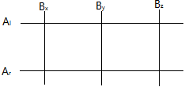
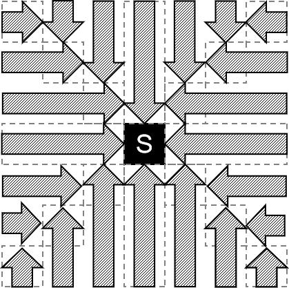

[TOC]

## [gym103470J - Xingqiu's Joke](https://codeforces.com/gym/103470/problem/J)

我们记 $a<b,\delta=b-a$，$f(a,\delta)$ 是把 $(a,a+\delta)$ 变成存在一个 $1$ 的最小步数，转移的时候就只需要枚举 $\delta$ 的质因子 $g$，然后从 $f\left(\left\lfloor\frac ag\right\rfloor,\frac \delta g\right)$ 和 $f\left(\left\lceil\frac ag\right\rceil,\frac \delta g\right)$ 转移即可。

加上记忆化复杂度是对的，因为第二维的状态数是因子个数个，然后对于一个 $g$，以任意顺序向上或向下取整除所有质因子，得到的最多只有两个不同的值，所以两维加起来的状态数和一维的状态数是同阶的，所以直接冲就完事了。

## [gym103470I - CloudRetainer's Game](https://codeforces.com/gym/103470/problem/I)

这个题蛮有趣的。

如果没有挡板，那么如果当前是右下，那么满足 $(x+y)\bmod 2H=k$ 如果是右上满足 $(2H-y+x)\bmod 2H=k$。

然后我们就可以 $\rm dp$ 了，设 $f(k)$ 表示特征值为 $k$ 的最大答案，如果是硬币就让 $f((x+y)\bmod 2H),f((2H-y+x)\bmod 2H)$ 加一，如果是挡板可以反转方向所以让两个变成两个的较大值。

复杂度 $\mathcal O(n\log n)$。

## [gym103470E - Paimon Segment Tree](https://codeforces.com/gym/103470/problem/E)

看上去是一个简单（？）数据结构

首先差分。

线段树维护一下应该就可以了吧/yiw

我的线段树有8个lazytag /tii

题解太高妙了！！！！用矩阵就不需要一大堆复杂的东西了！！！

考虑：
$$
(his',sum2',sum1',len')=(his,sum2,sum1,len)\times
\begin{pmatrix}
1&0&0&0\\
1&1&0&0\\
2k&2k&1&0\\
k^2&k^2&k&1
\end{pmatrix}
$$
现在就变成区间乘了。应该是有手就行了。

## [gym103470H - Crystalfly](https://codeforces.com/gym/103470/problem/H)

考虑 $f_i$ 表示不考虑 $i$ 上的蝴蝶，第一次进入 $i$ 最终能收货多少蝴蝶，答案是 $f_1+a_1$，那么策略无非两种：

- 进入 $u$ 的一个儿子 $v$，取完 $v$ 然后再去取其他的。
- 进入 $u$ 的一个儿子 $v$，去了 $v$ 然后找到一个 $t_w=3$ 取了 $w$ 和它的子树。

我们记 $sum_u$ 为 $u$ 所有儿子的 $f_v$ 之和，那么转移：
$$
f_u\leftarrow sum_u+a_v\\
f_u\leftarrow sum_u-f_v+a_v+sum_v+a_w (v\ne w,t_w=3)
$$
直接维护即可，复杂度 $\mathcal O(n)$。

## [UOJ706.【UER #10】随机薅羊毛](https://uoj.ac/problem/706)

有一个很简单的方程：
$$
f_i=1+(1-p_i)\frac{\sum_{j\ne i}f_j}{n-1}\iff f_i=\frac{n-1}{n-p_i}+\frac{1-p_i}{n-p_i}\times sum
$$
然后两边同时 $\sum$ 得到：
$$
\left(1-\sum_{i=1}^n\frac{1-p_i}{n-p_i}\right)sum=\sum_{i=1}^n\frac{n-1}{n-p_i}
$$
理论上就做完了，但是不知道为什么我被卡精度了。

## [UOJ707.【UER #10】重构元宇宙](https://uoj.ac/problem/707)

首先距离这个东西不太好搞，我们考虑变成向量内积，不妨钦定 $\mathbf p_0=\mathbf 0$，对于 $\mathbf p_i$ 和 $\mathbf p_j$，不难发现：
$$
\mathbf p_i\cdot\mathbf p_j=\sum_{x=0}^{k-1}\mathbf p_{i,x}\cdot\mathbf p_{j,x}=\sum_{x=0}^{k-1}\left(\mathbf p_{i,x}^2+\mathbf p_{j,x}^2-(\mathbf p_{i,x}-\mathbf p_{j,x})^2\right)/2=(\mathrm{dis}^2(i,0)+\mathrm{dis}^2(j,0)-\mathrm{dis}^2(i,j))/2
$$
我们先预处理出所有 $\mathrm {dis}(i,0)$，然后询问两个向量的内积就只需要一次询问。然后我们依次处理 $1\sim n-1$，维护嵌入空间的最小维数为 $sz$，并且维护一组向量使得第 $i$ 个向量最高位恰好是 $i$，然后我们构造的时候只需要每个向量一次计算，就能够计算出当前点的坐标了。如果距离还不够的话，就需要让嵌入空间维数 $+1$，把这一维设成还差的距离开根号即可。

复杂度 $\mathcal O(n^3)$。

## [UOJ708.【UER #10】磁球与磁棍](https://uoj.ac/problem/708)

首先有一个很 $\rm Naive$ 的 $\rm dp$ 就是 $f_{i,j,k,l}$ 表示 $i$ 的子树内，联通块个数为 $j$，$i$ 所在联通块叶子颜色为 $k$，$i$ 到父亲的边选或不选是否可行。

然后这个是一个树上背包的形式所以是 $\mathcal O(n^2)$ 的，一个优化是我们称一个点是自由的当且仅当它与这个联通块的叶子的颜色不同，称一个点是 $k$ - 自由点 当且仅当是自由点并且现在连接着 $k$ 条边，如果现在的联通块个数为 $k\ne n-1$，我们可以得到 $n-2$，具体操作是把一个 $2$ - 自由点周围的边全部断掉，一个 $\ge 4$ - 自由点周围段两条边，两个 $3$ - 自由点各删一条边。可以证明一定是可以操作的。然后删除一个自由点的边不会影响另一个是 几 - 自由点，所以直接模拟就可以了。

所以我们只需要 $\rm dp$ 个数是奇数/偶数时的个数最小值即可，复杂度 $\mathcal O(n)$ 可能有巨大常数但是可以过。

## [UOJ709.【北大集训2021】末日魔法少女计划](https://uoj.ac/problem/709)

$k=1$ 除了相邻的都要连边。

$k=2$ 可以找一个中间点，前后都往中间点连边，然后递归到两边。

$k>2$ 我们找 $i$ 个关键点，把序列分成了两个关键点的差都是 $o$，设然后关键点内部就可以变成更小的子问题，关键点，我们枚举两个关键点要走 $k-v$ 步才能互相到达，那么也就意味着两个关键点之间的 $o-1$ 个点第一个不用向前一个关键点连边，最后 $v-2$ 个不用向关键点连边，然后用 $i-1$ 条把 $i$ 个关键点连起来，关键点递归到一个 $i$ 个点 $k-v$ 的问题。然后因为最后 $v-2$ 个不用向关键点连边所以我们分配剩下的点的时候优先保证有 $v-1$ 个点。然后 $\rm dp$ 出这个构造方案的最优解之后输出方案就不难了。

## [UOJ710【北大集训2021】魔塔 OL](https://uoj.ac/problem/710)

首先如果只询问一次最优策略的话应该是普及难度的，首先看 $b-a$ 的符号，把回血的放在扣血的前面，对于 $b-a\ge 0$ 的按照 $a$ 从小到大大，$b-a<0$ 的按照 $b$ 从大到小打。最少的血量显然就是前缀和的最小值的相反数。

然后但是现在多了三维的限制，所以这个东西是一个很多维的偏序，

> $>3$ 维偏序，$\log$ 类分治数据结构不如根号，根号不如 bitset。

我们首先对排好序的怪物序列分块，每一块大小为 $B$，我们首先可以对每一块处理出 $2^B$ 种选择方案的和以及前缀最小值，然后处理出某一维 $\le x$ 的集合，然后暴力跑一遍所有询问，对于一次查询操作只需要找到最对应的集合就可以了，找集合可以把当前存在的怪兽与每一维 $\le$ 查询值的集合与起来。

当 $B=\log n$ 时复杂度最优为 $\mathcal O(\frac{n^2}{\log n})$。实现比较好就可以过了。

## [UOJ712【北大集训2021】简单数据结构](https://uoj.ac/problem/712)

打一个全局加的 $tag$，那么 $i$ 实际上的值是 $a_i+tag\times i$，$\rm chkMin$ 实际上是对 $v-tag\times i$ 这条直线 $\rm chkMin$。

对于 $a_i$ 第一次被 $\rm chkMin$ 之前答案是不难计算的。

$a_i$ 第一次被 $\rm chkMin$在之后的答案和 $a_i$ 一开始是 $+\infty$ 的答案是一样的。

如果 $a_i$ 是 $+\infty$ 那么序列是递增的，每次显然是对一段后缀 $\rm chkMin$ 有 $114514$ 种写法

所以只需要计算第一次被 $\rm chkMin$ 的时间即可。

第一次被 $\rm chkMin$ 的时间可以整体二分 ~~+李超树~~ 。

$\rm p\color{red}igstd$ 说的太对了可以直接建凸包。

可能应该大概好像是 $\mathcal O(n\log n)$ 的。

## [UOJ713【北大集训2021】Datalab](https://uoj.ac/problem/713)

$8200$ 次询问就是暴力判定每一位的值，因为对于两个第 $i$ 位为 $1$ 的串加起来第 $i+1$ 位到第一个和 $s_i$ 相同的位是 $1$。

然后分块，分成 $B=\sqrt{2^{13}}\approx90 $ 块，然后对于上面那个东西并行计算，如果出现了一个跨过块了，我们就能知道这个块剩下的是全部相等的，否则我们可以知道当前计算的值下一个相等的是那个。

第一个可以让剩下的块数 $-1$，第二个可以确定 $B$ 个，因此询问次数是 $2B$ 的。

## [UOJ714【北大集训2021】随机游走](https://uoj.ac/problem/714)

首先边肯定是 $x\to 1$ 的形式，这样才能让小 A 的期望步数更大

一个求期望步数的方法是记 $a_i$ 为 $i\to 1$ 的边数，那么 $f_i=1+\frac{a_i}{a_i+1}f_1+\frac{1}{a_i+1}f_{i+1}$，我们知道 $f_n=0$，可以把 $f_i$ 写成 $x_if_1+y_i$ 的形式，那么通过求解 $f_1=x_1f_1+y_1$ 就可以知道期望步数了。

通过打表找到如下结论：

- $n-1\sim 2$ 向 $1$ 连边
- 然后 $n-1\sim 1$ 向 $1$ 连边
- 如果 $m$ 没有用完就重复 $2$

我会矩阵快速幂！！！因为除了 $[2,n-1]$ 有两段不同的值，每一段直接矩阵快速幂就可以了。

然后直接写可能会有问题，因为 $a_i+1$ 可能没有逆元，我的实现方式是写成分式的形式，感觉不太靠谱但是确实过了。

## [ UOJ715【北大集训2021】小明的树](https://uoj.ac/problem/715)

因为这个删边和加边会更改父子关系所以我们维护的东西不能和父子有关，比如不能写从父亲点亮到儿子点亮的时间不合法。

考虑另一种限制方式就是没有点亮的联通块个数是 $1$，这个东西很容易和父子无关，只和总的点数和两边都是未点亮的边数有关，每次边的变化量又是 $\mathcal O(1)$ 的，所以这个不难维护。

然后求点亮的联通块个数，这个也不难求，因为就是一边点亮一边未点亮的个数。

所以要支持维护三个操作的线段树：

- 维护两个序列 $a_i,b_i$，把 $b_i$ 区间加
- 把 $a_i$ 区间加
- 全局查 $b_i$ 取最小值的时候 $a_i$ 的和

这个应该不难写。维护 $b_i$ 的最小值，最小值的个数，最小值对应的 $a_i$ 的和即可，打两个 $\rm lazytag$。

复杂度 $\mathcal O((n+m)\log n)$。

## [UOJ716【北大集训2021】出题高手](https://uoj.ac/problem/716)

题解说区间长度不会太大。

然后取一个长度上界 $L$ 扫描线即可。

有 $nL$ 个区间所以我们用 $\mathcal O(1)$ 改 $\mathcal O(\sqrt n)$ 查的数据结构即可。

## [UOJ718【北大集训2021】算术](https://uoj.ac/problem/718)

首先不妨假设长度为 $n$，那么第 $i$ 位的 $a_i$ 的系数变换如下：
$$
b^i\Longleftrightarrow (-1)^{\left\lfloor\frac ik\right\rfloor}b^{\left\lfloor\frac nk\right\rfloor-\left\lfloor\frac ik\right\rfloor+i\ \bmod\ k}
$$
然后我们有一个结论是每一个系数的变换都要是一个相同的比例，否则应该可以通过一些手段搞出原来是 $p$ 的倍数现在不是。

然后把 $i=0$ 带入得到后者是前者的 $b^{\left\lfloor\frac nk\right\rfloor}$ 倍，所以：
$$
b^i\equiv (-1)^{\left\lfloor\frac ik\right\rfloor}b^{-\left\lfloor\frac ik\right\rfloor+i\ \bmod\ k}\bmod p\iff b^{(k+1)\times\left\lfloor\frac ik\right\rfloor}\equiv (-1)^{\left\lfloor\frac ik\right\rfloor}\bmod p
$$
这个也就说明 $b^{k+1}\equiv -1\bmod p$，也就是要找 $b$ 在 $\bmod p$ 下的半阶 $-1$，首先我们要找到阶，如果 $\gcd(b,p)\ne 1$ 显然没有阶，然后对 $\phi (p)$ 质因数分解，然后看每个质因数最少要取多少个才是合法的，然后就在 $\mathcal O(\log^2p)$ 的复杂度找到了阶，有了阶除以 $2$ 就能得到半阶了，判断一下是合法即可。

然后就是一些边界情况要特判一下，比如说 $p=2$ 时答案是 $1$，半阶是 $1$ 的时候为了保证 $k$ 是正整数需要输出 $2$。

## [ UOJ719【北大集训2021】经典游戏](https://uoj.ac/problem/719) 

首先一个很 $\rm Naive$ 的观察就是一个子树深度为 $d$ （最大边数）的棋子的 $\rm SG$ 函数就是 $d$。先手必胜就以为着后手没有办法使得 $sg$ 变成 $0$，即 $sg>mxdep$。

然后就可以写出 $\mathcal O(n^2+nm)$ 的 $\rm 45pts$ 的暴力了。

然后不妨假设 $a_i\in\{0,1\}$，我们可以发现 $a_x$ 反转就是 $x$ 的长儿子所在子树异或上除了长儿子的最长深度，$x$ 所在子树除去长儿子异或 $x$ 的最大深度，整棵树除去 $x$ 所在的子树异或 $x$ 的长链长度，然后询问就是问与 $y$ 相连的和 $y$ 自己有多少个点满足 $sg_u>mxdep_u$。

我们发现可以给一个节点所有的儿子打标记，那么更改一棵子树实际上更改的值只有在它的父亲里这个节点的值，直接暴力修改。

然后 $a\oplus tag>b$ 对应的 $tag$ 画到 01-trie 上只有 $\mathcal O(n\log n)$ 棵子树，查询的时候直接在 trie 上找即可。

复杂度 $\mathcal O(n\log n)$，空间也是这个。

## [UOJ604【UER #9】赶路](https://uoj.ac/problem/604)

首先我们断言在题目所给的条件下一定有解，考虑归纳地构造，现在起点是 $1$ 终点是 $n$，首先我们随机在 $2\sim n-2$ 取一个点 $x$，然后把剩下的点分成在 $1-x$ 直线上面和在下面的，然后对于不和 $n$ 同侧的，起点是 $1$ 终点是 $x$ 构造，和 $n$ 同侧的起点是 $x$ 终点是 $n$。

根据快排这个复杂度应该是 $\mathcal O(n\log n)$ 的（

## [UOJ605【UER #9】知识网络](https://uoj.ac/problem/605)

首先有一个很 $\rm Naive$ 的想法是 $\mathcal O(n+k)$ 个点 $\mathcal O(m+n)$ 条边，对于同一个颜色转移建立一个虚点即可，边权为 $0/1$。求一个 $f(p,q)$ 就是 $p$ 到 $q$ 的最短路的 $+1$。

然后这个东西可以并行计算，枚举当前颜色是 $c$，所有 $c$ 色点都是 $dis_u=1$，然后先跑 $\rm bfs$，建出最短路图，因为没有 $0$ 环所以一定是 $\rm DAG$，对于 $u$ 为起点，那么 $u$ 以及所有 $u$ 的后继的距离都会 $-1$ 其他点不变，于是我们就能得到一个点是几个点的后继，然后就能得到一个点是几次 $dis$ 几次 $dis-1$ 了。

求是几个点的后继可以用 `bitset`，复杂度 $\mathcal O\left(k(n+m)+\frac{n(n+m)}w\right)$。

## [P8291 [省选联考 2022] 学术社区](https://www.luogu.com.cn/problem/P8291)

首先对于 $BC$ 的数据，我们断言是若干条链，每条链都是 楼上-楼上-学术-楼下-楼下 的形式，于是我们就可以建立分层图 $G_1,G_2$，对于一条 `a b loushang` 就在 $G_1$ 中连 $a\to b$，如果是学术就在 $G_1,G_2$ 的 $a$ 点连线，`a b louxia` 就在 $G_2$ 中连一条 $b\to a$ 的边，然后我们断言 $G_1$ 中的都出度 $\ge $ 入度，$G_2$ 中都 入度 $\ge$ 出度，然后我们就可以补足流量，用欧拉回路求一组合法解了。

然后对于 $C$ 的数据，我们不一定每条信息都可以满足，不满足的信息是和学术信息一样的。我们考虑先把所有的信息当做学术信息，然后选择若干条成为有效信息，上面能构造出合法解当且仅当 $G_1$ 出度 $\ge$ 入度，$G_2$ 入度 $\ge$ 出度，然后把一条边变成有效信息会让 $G_1$ 中一个点 出度 $-$ 入度 的值 $-1$，让 $G_2$ 中一个点 入度 $-$ 出度 的值 $-1$，因为两者都要满足条件所以是一个二分图匹配，匹配出最大的条数就是可以满足的信息数了。

然后所有数据，中间不一定是学术信息，我们可以把 `a b loushang` 和 `b a louxia`  合并到一起显然是不劣的，然后我们就得到了一条 $a-b$ 复合型学术信息，对剩下的信息跑上面的算法就可以通过了。

复杂度就是 $T$ 次网络流的复杂度，冲就完事了。

## [UOJ722【JOISC2022】监狱](https://uoj.ac/problem/722)

首先有一个结论是每次是直接让一个人移动到指定位置上。

然后有了这个结论就可以直接写了，一个人 $(s,t)$ 对于在起点在 $(s,t)$ 上的必须在之前润，终点在 $(s,t)$ 上的必须在之后润，然后这个用建拓扑图判断有没有环即可。然后用数据结构优化到 $\mathcal O(n\log n)$。

## [UOJ723【JOISC2022】京都观光](https://uoj.ac/problem/723)

首先我们考虑下面这样的东西：

然后我们求出 $B_y$ 是有用的当且仅当：
$$
\frac{B_y-B_x}{y-x}\le \frac{A_r-A_l}{r-l}\\
\frac{B_y-B_z}{y-z}\ge \frac{A_r-A_l}{r-l}
$$
然后我们可以对 $B$ 求出下凸壳，对 $A$ 也求出下凸壳，然后每次贪心地选即可。

复杂度 $\mathcal O(n+m)$。

## [UOJ724【JOISC2022】错误拼写](https://uoj.ac/problem/724)

首先说是 $T_x\le T_y$，实际上就是 $[\min(x,y),\max(x,y))$ 和 $(\min(x,y),\max(x,y)]$ 比大小。

进一步地，可以变成若干限制形如 $(l,r,o)$ 表示 $[l,r]$ 全部相等或者第一个和 $s_l$ 不同的比 $s_l$ 大/小。

然后我们可以 $\rm dp$，记 $f_{i,j}$ 表示到 $i$ 这个后缀选了 $j$ 的方案数，钦定前面的和当前不同，然后我们可以存下来当前的约束，然后如果下一段字符比 $j$ 小那么贡献 $f_{[x,i-1],[0,j-1]}$ 对于比 $j$ 大就 $f_{[x,i-1],[j+1,25]}$。求 $x$ 可以直接优先队列维护所有的限制，贡献转移的时候直接用前后缀和维护即可。

复杂度 $\mathcal O(n\log n+n|\Sigma|)$。

## [UOJ725【JOISC2022】复制粘贴 3](https://uoj.ac/problem/725)

大常数选手/kk

首先一个区间 $\rm dp$ 就是设 $f_{i,j}$ 表示打出来 $[i,j]$ 这段区间的最小时间，那么首先两种转移就是 $f_{i,j}\leftarrow \min(f_{i,j-1}+A,A+f_{i+1,j})$。

然后还有复制的操作，复制的影响应该是这样的： $\dots s\dots s\dots s\dots$，我们只在 $s\dots s\dots s$ 这种情况更新 $f$ 的值，因为两边加字符可以被第一种转移处理。然后我们钦定这个是**极长**的，也就是这一段只能选这么多个 $s$，因为如果不是极长的话，可以被个数更少的转移得到。

然后我们可以证明这样的转移个数是 $\mathcal O(n^2\log n)$ 的，证明就考虑每个左端点开始枚举长度得到的是 $\mathcal O(n\log n)$ 的调和级数。

然后注意常数随便写一写就可以了。

我的单模Hash被卡了换了双模才过。

## [UOJ727【JOISC2022】团队竞技](https://uoj.ac/problem/727)

一直在想怎么用数据结构维护然后就被打爆了。

考虑如果没有每个成员都有优势的限制，那么肯定是三个最大值加起来即可。

那么这个的问题是最大值可能由同一个人提供。

但是我们发现一个人如果有两维是最大值那么没有人能够和这个人组队，直接删去即可。

维护这个删去，然后如果没删完那么就直接输出最大值的和，否则就输出 $-1$。

复杂度 $\mathcal O(n\log n)$。

## [UOJ729【JOISC2022】洒水器](https://uoj.ac/problem/729)

没看到 $d\le 40$ 自闭了。当然看到了也不会。

一开始在想淀粉树那套理论，但是发现这个信息不能减然后就自闭了。

正解非常的优雅，考虑如果两个点 $x,y$ 的距离和 $d$ 奇偶性相同且 $\le d$，一定会有一个点使得 $x\to l\to y$ 距离恰好是 $d$，在这个点乘一遍即可。如果不同就会有 $d-1$ 同样的处理方式。

当然上边的讨论有一点小问题就是可能爬到 $1$ 还不满足，一个方案是直接在 $1$ 上面连一串点即可。

## [UOJ730【JOISC2022】蚂蚁与方糖](https://uoj.ac/problem/730)

首先是一个最大匹配。

然后众所周知：
$$
\min_{S\subseteq V_l}(|V_l|-|S|+|N(S)|)
$$
然后一个位置上的肯定是全部选或者全部不选，不妨记 $1\sim m$ 这些位置上分别有 $s_1,\dots,s_m$，那么就是找一个 $S\subseteq \{1,2,\dots,m\}$ 使得 $|N(S)|-\sum_{i\in S}s_i$ 最小。然后对于 $|N(S)|$，我们发现对于 $N(i)$，$i$ 变大的时候这个东西也是右移的，所以我们只需要 $\sum_{i\in S}|N(i)|-\sum_{i\in S}|N(i)\cap N(nex_S(i))|$ 即可，这样每个点只计算了一次显然是正确的。

然后一个结论是如果 $l\in S,r\in S$ 并且 $x_r-x_l\le 2L$，那么 $[l,r]$ 这段区间全部选，$|N(S)|$ 不变，减的值不变小，所以肯定全部选。

然后如果 $N(i)\cap N(nex_S(i))\ne \varnothing$，那么 $x_{nex_S(i)}-x_i\le 2L$，于是就得到 $nex_S(i)=i+1$，所以我们求的是这样一个东西的最小值：
$$
\sum_{i\in S}(|N(i)|-s_i)-\sum_{i,i+1\in S}|N(i)\cap N(i+1)|
$$
首先对于增加蚂蚁，就是单点减少。

然后对于增加方糖，就是对于 $[x_l,x_r]\subseteq [X-L,X+L]$ ，$i\in[l,r]$，$|N(i)|$ 增加，$i\in[l,r)$，$|N(i)\cap N(i+1)|$ 增加，进一步地，就是增加当前连续段个数乘这个值。然后因为区间长度 $\le 2L$ 所以区间连续段个数 $\le 1$ 所以直接打 $\rm lazytag$ 即可。更新的时候顺便记录一下 $|N(mid)\cap N(mid+1)|$。

复杂度 $\mathcal O(Q\log Q)$  

## [UOJ731【JOISC2022】制作团子 3](https://uoj.ac/problem/731)

直接设 $\mathrm{solve}(n,m,S)$ 表示题目那个意思，然后依次删除 $S$ 中的值判断是否仍然 $\ge m/2$，然后得到的两个集合就是 $S_1,S_2$，分别递归到 $\mathrm{solve}(n,m/2,S_1)$ 和 $\mathrm{solve(n,m-m/2,S_2)}$ 即可。

并且这个询问次数是固定的。

## [UOJ732【JOISC2022】鱼 2](https://uoj.ac/problem/732)

首先建线段树，然后一个节点上的鱼有四种：

1. 整个吃完的
2. 吃到左端点，往右吃不下去的
3. 吃到右端点，往左吃不下去的
4. 左右都吃不到的

第四种显然没有贡献，而第二、三种每种内部只有 $\mathcal O(\log W)$ 种鱼，因为吃不下去的时候前缀和至少乘 $2$。把这样的位置叫做障碍。

然后就只需要考虑如何合并即可。合并的时候对每一种鱼暴力扩展即可，类似双指针的写法即可做到 $\mathcal O(\log W)$。

所以就在 $\mathcal O(Q\log N\log W)$ 的复杂度解决了这题。当然好像多一只 $\log$ 也能过。

## [UOJ733【JOISC2022】复兴计划](https://uoj.ac/problem/733)

首先每条边存在的时间是一段区间。

然后我们可以计算出发生替换的时间，也就是对一条边找到链上最大的一条边计算时间。

然后就可以算出来所有的替换时间。

找到最大的一条可以用 $\rm LCT$ 但是也可以直接找复杂度是 $\mathcal O(nm\alpha(n))$。

## [P7740 [NOI2021] 机器人游戏](https://www.luogu.com.cn/problem/P7740)

把所有机器人就到过的格子数分为 $\le 16$ 的和 $>16$ 的，对于最后一个钦定的起点 $\le 17$ 的直接枚举即可，对于最后一个钦定的起点 $>17$ 的 $>16$ 的机器人都寄了只需要考虑 $\le 16$ 的机器人状压即可。复杂度底数是 $\sqrt 2$ 应该是能过的。

最后复杂度是非常垃圾的 $\mathcal O(\frac{mn2^{n/2}}w+n^22^{n/2}+m2^{n/2})$。

## [UOJ611【JOISC2021】IOI 热病](https://uoj.ac/problem/611)

首先经过一些人类智慧我们知道 $1$ 的方向确定之后剩下所有点的方向都能确定了。如果第一个点往上就是：

然后就是一些 dijkstra 的套路了。我的做法好麻烦我去贺题解了。

首先对于 $u$ 传染了同一方向上的两个人，我们可以认为是先传染了 $v$，然后 $v$ 再传染给 $w$。因此把一个点拆成三个方向上的点，然后向后继连边。

## [UOJ612【JOISC2021】饮食区](https://uoj.ac/problem/612)

如果没有删除就直接整体二分。

现在有删除，只要加上之前删去的个数就能直接整体二分了呀。

维护之前删去的个数和现在还剩下的个数是等价的。

剩下的数可以直接吉司机，但是有更高妙的做法就是维护 $x'=\max(x+a,b)$ 这个可以直接 $\rm pushdown$。

复杂度是整体二分的两只 $\log$。

## [UOJ614【JOISC2021】道路建设](https://uoj.ac/problem/614)

首先二分出距离 $d$ 使得是最后一个恰好 $< k$，然后，$\le d$ 的点暴力复杂度是正确的，剩下的都是 $d+1$。对于一个 $d$ 判断可以先把曼哈顿距离变成切比雪夫距离，然后只需要双指针扫一遍就可以，复杂度 $\mathcal O(n\log W\log n)$。

## [UOJ616【JOISC2021】古老的机器](https://uoj.ac/problem/616)

蛮有趣的通信题。

首先考虑 B 的策略是什么，首先找到最左边的 `X` 所在的位置 $i$ 和最左边的 `Z` 所在的位置 $j$，然后如果 $j<i$ 可以直接删去 $j$ 继续迭代，否则就从 $j-1$ 一路删到 $i+1$ 然后把 $j$ 删掉继续迭代。

所以我们只需要传第一个 `X` 所在的位置和后面所有的 `Z` 所在的位置，也就是一个 `01` 串，这样的长度太长了。一个减小长度的办法就是把一段连续的 `Z` 只在最后一个的位置上标记 `1`，这样新的 `01` 串后面都满足 `1` 不相邻，状态数就减小了。为了让 `X` 也满足这个性质需要补 `0`。

然后传没有相邻 `1` 的串可以直接用斐波那契数列编码，每 $63$ 个编一个码，需要 $44$ 个 bit，直接传过去就能过了。

## [UOJ618【JOISC2021】聚会 2](https://uoj.ac/problem/618)

比较结论。这个就相当于带权重心。根据经典结论权值和是奇数重心只有一个，是偶数有多个，是一条链，链上除了起点和终点都是 $0$，权值被均分到量两边。

然后这个东西可以淀粉质，对于 $u\to v$ 的路径，如果是上面的路径，会对 $\le 2\min(u的大小,v的大小)$ 的有贡献，淀粉质的时候只需要在较小的那一个统计贡献即可。复杂度 $\mathcal O(n\log^2n)$。

## [UOJ619【JOISC2021】活动参观 2](https://uoj.ac/problem/619)

首先判断是很 $\rm Naive$ 的。

然后套路做法是按位确定。

确定一个之后改变就是把一个区间中间劈开了。

所以我们只需要计算一个区间最多有即可。其实可以贪心地确定，对于每条线选了之后肯定是选第一条左端点超过它，右端点最小的，然后连边倍增就可以快速计算了。

复杂度 应该是 $\mathcal O(n\log n)$。

## [UOJ621【JOISC2021】最差记者 4](https://uoj.ac/problem/621)

首先是内向基环树，首先考虑子任务 $1,2$ 的情况
$$
f_{u,j}=\sum_{v\in son_u}\min f_{v,\ge j}-[j=h_u]\times c_u
$$
最后再加上 $\sum c_i$ 即可。然后就可以线段树合并了吧？

讲道理向上合并的时候每个 $f_{u,j}$ 都会有值，但是为了方便暂时只处理**子树内出现过的值**，然后更改的时候增加值就再把那个值加上去。

然后对于内向基环树森林就对每棵树求解，最后枚举环上的数选了什么。

## [UOJ617【JOISC2021】保镖](https://uoj.ac/problem/617)

首先画成坐标，然后旋转变成向右和向上，保镖每次可以往右或上走一步，如果与一条线的贡献是公共长度乘上这条线的权值（最后可能还要除 $2$  不过不是重点）。然后一个 $\mathcal O((n+Q)^2)$ 的做法是把所有点加进去跑 $\rm dp$，一个 $\mathcal O(n^2+nq)$ 的做法是每次询问先走到一行或一列然后走到关键点上然后直接用之前预处理的 $\rm dp$，然后用李超树做到 $\mathcal O(n^2\log+q\log n)$，然后发现点的纵坐标是递增的用凸包维护凸壳即可，复杂度 $\mathcal O(n^2+q\log n)$。

## [UOJ501【JOISC2020】建筑装饰 4](https://uoj.ac/problem/501)

$\rm A$ 的个数是一段连续的？

然后就直接 $\rm dp$ 然后倒着构造方案即可。

## [UOJ502【JOISC2020】汉堡肉](https://uoj.ac/problem/502)

非常麻烦的题目。

首先找到最大的 $l$，最小的 $r$，最大的 $d$ 和最小的 $u$，可以证明在 $K\le 3$ 时选 $(mxl/mnr,mxd/mnu)$ 中的一个是不劣的，所以就直接暴力枚举即可，复杂度 $\mathcal O(4^KN)$。

然后对于 $K=4$ 的情况，可以是这个矩形的边上各有一个点。我们考虑每个矩形在这个矩形上占了几条边，如果占用一条就减小这条边的范围，如果占用三条边就一定满足，所以只需要考虑 $2$ 条边的情况。两条边可以直接 $\rm 2-SAT$，前后缀优化建图，复杂度 $\mathcal O(N\log N)$。

## [UOJ503【JOISC2020】扫除](https://uoj.ac/problem/503)

第三个 sabtask 就是没有加点操作，并且形状是 $\ddots$。这个有什么用呢？手玩一下发现如果一开始满足这个性质，那么被推一次之后仍然满足这个性质。然后这个玩意儿很容易维护，直接写平衡树即可，复杂度 $\mathcal O(Q\log Q)$，可以参考这份 [11分代码](https://loj.ac/s/1461007)。

然后看第四个 subtask，没有了 $x$ 递增 $y$ 递减的性质，怎么办呢？继续手玩，发现所有推过一次之后的点都满足上面的性质，所以我们只需要计算出每个点第一次被推的时间然后在那个时间加入即可。求第一次被推的时间求相当于求第一个覆盖的矩形，可以正着求直接找但是我只会两只 $\log$ 的，考虑倒过来，一个包含 $(a,b)$ 的矩形的右端点的横坐标在 $[a,N-b]$，于是单点改区间查就是一只 $\log$ 了，总的复杂度还是 $\mathcal O(Q\log Q)$，可以参考这份 [64分代码](https://loj.ac/s/1461102)。

也就是说，我们现在不支持中间加点，我们不希望有这个操作。可不可以没有这个操作呢？其实可以用一只 $\log$ 的代价扔掉这个操作，具体的做法就是线段树分治，每次询问放到 $\log Q$ 个区间上，那么每个区间内都是一个 subtask4，因此总的复杂度就是 $\mathcal O(Q\log^2Q)$，得到了 [100分代码](https://loj.ac/s/1461094)。

## [UOJ504【JOISC2020】变色龙](https://uoj.ac/problem/504)

考虑一个 $n^2$ 的做法，询问两只变色龙是，如果同色或者喜欢就连边，那么每只变色龙连 $1\sim 3$ 条边。

考虑优化，如果已经知道两个集合分别是什么，那么如果 $u$ 和 $|S|$ 内无有关的边就是 $|S|+1$ 否则就不是，可以直接二分寻找边。但是我们不知道两个集合分别是什么，我们需要跑一遍二分图来保证那个 $|S|$ 内部没有边。求出连边就可以用 $2$ 次询问知道喜欢谁了。

次数是 $\mathcal O(n\log n)$，复杂度 $\mathcal O(n^2\log n)$。

## [UOJ505【JOISC2020】有趣的Joitter交友](https://uoj.ac/problem/505)

首先是若干个团，一条非团边的贡献是终点所在团的大小，一个团的贡献是 $s(s-1)$，然后两个团双向可达就要合并成一个团。

然后对每个团维护进边的编号，出边的终点所在的团以及起点的编号，然后启发式合并维护一下这两个东西就可以了，可能合并会引起新的合并，可以用队列维护，也可以直接 $\rm dfs$，复杂度 $\mathcal O(M\log^2 N)$。

## [UOJ506【JOISC2020】遗迹](https://uoj.ac/problem/506)

神仙计数。

考虑给定 $h$ 求最终的 $A$，最后一个 $h_{2N}$ 一定会留下，然后从后往前每个 $h_i$ 会一只减到 $0$ 或者后面没有出现这个数。

翻转序列，钦定一些位置会留下。为了方便计数，我们不妨认为两根高度相同的柱子是不同的，最后除 $2^n$ 即可。然后设 $f_{i,j}$ 表示翻转过的前 $i$ 根柱子，已经出现了 $[1,j]$ 的**贡献和**。贡献和的原因是如果我们直接算的话一定要记录集合是然后就寄了，所以我们不希望考虑集合是什么，只在每次 $j$ 增加的时候算上贡献。假设之前已经有 $cnt$ 个位置被钦定留下，考虑转移：

- 如果当前位置钦定不留下

  一共有 $2j$ 个数可以选，有 $j+i-1-cnt$ 个已经被选过了，因此 $f_{i,j}\leftarrow  f_{i-1,j}\times (j-i+1+cnt)$。

- 当前的位置钦定留下

  - 如果当前 $j$ 没有增大

    没有贡献，直接 $f_{i,j}\leftarrow f_{i-1,j}$。

  - 如果当前 $j$ 是从 $k$ 增大来的

    显然当前位置最后肯定要变成 $k+1$，否则贡献不会在这里乘。然后考虑还有 $cnt-k$ 个位置可以选，选 $j-k-1$ 个，然后这 $j-k-1$ 个位置上填数，不妨记方案数为 $g_{j-k-1}$，然后当前数的方案数是 $j-k+1$，所以 $f_{i,j}\leftarrow f_{i-1,k}\times\binom{cnt-k}{j-k-1}\times g_{j-k-1}\times (j-k+1)$。

然后就是求 $g$ 了，$g_n$ 就是 $1\sim n$ 个两个（可区分），填进去，要满足 $\le i$ 的个数 $\le i$，直接 $\rm dp$ 即可，设 $g_{i,j}$ 表示用 $\le i$ 的数变成长度为 $j$ ，那么 $g_{i,j}=g_{i-1,j}+2j\times g_{i-1,j-1}+j\times(j-1)\times g_{i-1,j-2}$。

然后就可以做到 $\mathcal O(n^3)$ 了。跑得蛮快的。

## [UOJ507【JOISC2020】星座3](https://uoj.ac/problem/507)

两颗星星能不能到达取决于中间最高的星星，所以我们建出笛卡尔树，现在的节点是 $x$，左边是 $[l,x-1]$ 右边是 $[x+1,r]$，设 $f_{i,j}$ 表示 $i$ 节点最高的星星高度 $j$ 的方案树，考虑转移无非就两种：

1. $x$ 上面的星星更新答案，加上两边不超过 $a_x$ 的最大值
2. 两边的星星更新答案，加上对面不超过 $a_x$ 的最大值

然后直接线段树合并即可，复杂度 $\mathcal O(n\log n)$。

## [UOJ508【JOISC2020】收获](https://uoj.ac/problem/508)

首先对每个点处理出这个点吃苹果之后下一个吃苹果的是谁，设为 $f_x$ 变成内向基环树森林。

我们先砍掉一条边变成树，然后考虑经过砍掉边和不经过砍掉边的贡献。

不经过砍掉边就是子树查询深度在一定范围内的个数，直接二维数点即可。

经过砍掉边相当于要求 $\sum \max\left(0,\left\lfloor\frac{X-x_i}{len}\right\rfloor\right)$，应该可以通过一些 **简单** 的分类讨论变成二维偏序然后硬算，大概就是变成 $\sum _{x_i\le X}\left\lfloor\frac{X-x_i}{len}\right\rfloor$，然后就可以直接计算了。

我的做法比较菜需要 `__int128` 才能过。

## [UOJ510【JOISC2020】首都](https://uoj.ac/problem/510)

把依赖关系建出来，用倍增优化连边，然后最小的没有出度的 $\rm SCC$ 就是答案。

复杂度 $\mathcal O(n\log n)$。

## [UOJ511【JOISC2020】制作团子](https://uoj.ac/problem/511)

找个优化器直接跑线性规划。

## [UOJ512【JOISC2020】应对方案](https://uoj.ac/problem/512)

考虑一个解肯定是若干方案连起来，第一个方案是 $L_i=1$ 最后一个方案是 $R_i=N$。

然后两个方案能 $i$ 前 $j$ 后并起来当且仅当 $R_i-L_j+1\ge |T_i-T_j|$。

然后就变成最短路，权值为点权和，然后因为是点权所以可以直接用最小的去扩展，找到合法的直接进队，显然是对的，复杂度 $\mathcal O(M\log M)$。
