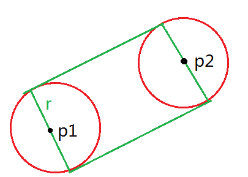

[TOC]

## [UOJ#341【清华集训2017】简单数据结构](https://uoj.ac/problem/341)

这个题目给了一大车限制条件所以你认为复杂度是对的大概率是能够跑过去的

首先没有修改十分 $\rm Naive$，就 $f_i$ 表示 $i$ 开始的最长上升子序列，转移直接枚举倍数，因为互不相同，所以复杂度是调和级数。

然后前面加也很 $\rm Naive$，和上面一样。

然后前面减也很 $\rm Naive$，就开一个桶记录一下各个取值的个数，删除的时候从桶里删除，因为长度是 $\log m$ 级别的所以每次直接在桶里找就能得到答案了。

然后后面加要思考一下，发现更改的只有因数上的值，暴力修改即可。

然后后面减发现会减少有点难搞，但是稍微思考一下记录一个 $c_{i,j}$ 表示 $i$ 之后的能接上的长度为 $j$ 的个数，修改的时候暴力修改因数的 $c$，然后减小就随便搞了。

## [P6097 【模板】子集卷积](https://www.luogu.com.cn/problem/P6097)

就把 $x^i\to x^iy^{\mathrm{popcount}(i)}$，乘法是 $x^ay^b\times x^cy^d\to x^{a\lor c}y^{b+d}$，然后对每一个 $[y^i]$ 的 $F_i(x)$ 做 $\rm FWT$，然后每一维暴力卷积，然后每一个 $[y^i]$ 在 $\rm IFWT$ 回去。复杂度 $\mathcal O(n^22^n)$。

## [UOJ#348 【WC2018】州区划分](https://uoj.ac/problem/348)

记 $W(S)$ 为 $\sum_{i\in S}w_i$，$p(S)$ 为 $S$ 没有欧拉回路，即不连通或有度数为奇数，$g(S)=[p(S)]w^p(S)$，那么显然有卷积：
$$
f_S=\frac1{W^p(S)}\sum_{T\subseteq S,T\ne\varnothing}f_{S\setminus T}\times g(T)
$$
这个式子看上去就可以子集卷积。一个细节是 $1/W^p(S)$ 的处理，常规的子集卷积是两个固定的数组卷积，但是这个式子是互相卷积，有点类似于半在线。可以在子集卷积的时候从 $\mathrm{popcount}$ 小的 $f_S$ 转移到大的，然后一个一个转移过去，做 $\rm IFWT$，乘上 $1/W^p(S)$，再 $\rm FWT$ 即可。复杂度 $\mathcal O(n^22^n)$。

## [P5333 [JSOI2019]神经网络](https://www.luogu.com.cn/problem/P5333)

挺简单的随便写了写就过了。

首先我们考虑如何统计贡献，一个显然的想法是每棵数变成若干条链，然后把所有的链拼起来。

可以通过树上背包算出 $f_{i,j}$ 表示 $T_i$ 选出 $j$ 条**无顺序，有方向**的链的方案数。树上背包用 `poly` 实现非常漂亮。

然后我们钦定从 $T_1$ 包含 $1$ 的路径出发，考虑限制是什么：

- 相邻的两条链不能来自同一棵树。
- 最后一条链不能来自 $T_1$。

扔掉第二条限制，如果我们做出来了，钦定最后一条链来自 $T_1$ 的答案相减即可。

然后就比较显然的容斥套路了，我们钦定第 $x$ 棵数的 $i$ 条链中缝合了 $j$ 条链，方案数是 $\binom{i-1}j$，容斥系数是 $(-1)^j$，然后对容斥后的值 $\rm EGF$ 乘起来即可。

分析一下复杂度就是 $\mathcal O(n^2)$。 

## [CF1119H Triple](https://www.luogu.com.cn/problem/CF1119H)

对 $a_i,b_i$ 分别异或 $c_i$：
$$
\prod_{i=1}^nw+ux^{a_i}+vx^{b_i}
$$
$\rm FWT$ 之后每一位取值只有 $w+u+v,w+u-v,w-u+v,w-u-v$。分别为 $a,b,c,d$。

对 $\sum x^{a_i},\sum x^{b_i},\sum x^{a_i\oplus b_i}$ 做 $\rm FWT$ 得到 $a+b-c-d,a+c-b-d,a+d-b-c$，然后还有 $a+b+c+d=n$ 就能计算分别的个数了。

## [UOJ#328 【UTR #3】量子破碎](https://uoj.ac/problem/328)

用 `manipulate` 做 $\rm FWT$，询问之后判断还有哪些剩下的合法即可。

因为是随机的所以期望 $n$ 次就可以只剩下一个数。

## [CF1336E2 Chiori and Doll Picking (hard version)](https://www.luogu.com.cn/problem/CF1336E2)

记线性基的秩为 $rk(A)$，线性基的向量空间为 $\mathrm{span}(A)$，$F(A)$ 表示 $\sum\limits_{i\in \mathrm{span}(A)}z^i$，$x\circ y=\mathrm {popcount}(x\land y)\bmod 2$。

首先我们求出线性基 $A$，然后只需要对线性基内计算然后乘上 $2^{n-rk(A)}$ 就是答案。

然后如果 $rk(A)\le \frac m2$ 直接暴力搜索所有数。

然后 $rk(A)>\frac m2$ 有一种 $m-rk(A)$ 的做法，是从 $\rm FWT$ 的角度出发的：

- 性质 $\mathbf I.$ $[z^i]\mathrm{FWT}(F(A))\in\{0,2^{rk(A)}\}$

  证明：对于 $x\in \mathrm{span}(A)$，有 $z^x\times F(A)=F(A)$，因此 $F(A)\times F(A)=2^{rk(A)}\times F(A)$，即 $([z^i]\mathrm{FWT}(F(A))^2=\mathrm{FWT}(F(A))\times 2^{rk(A)}$，结论显然成立。

- 性质 $\mathbf {II}.$ $[z^i]\mathrm{FWT}(F(A))=2^{rk(A)}$ 当且仅当 $\forall x\in A,i\circ x=0$。

  证明：如果与基底造成了 $-1$，就一定比 $2^{rk(A)}$ 小，而如果都是 $0$，那么 $(i\circ a)\oplus(i\circ b)=i\circ (a\oplus b)$，$\mathrm{span}(A)$ 内每个 $x\circ i=0$。

- 性质 $\mathbf {III}.$ $[z^i]\mathrm{FWT}(F(A))=2^{rk(A)}$ 的有且仅有 $2^{m-rk(A)}$ 位。

  构造正交线性基 $B$ 满足 $rk(A)+rk(B)=m$，$\forall x\in A,y\in B,x\circ y=0$，构造方式如下图

  

   

然后知道 $\mathrm{FWT}(F(A))$ 之后就好做了，我们记 $G_c=\sum[\mathrm{popcount}(i)=c]z^i$，那么就是求 $[z^0]F(A)\times G_c=[z^0]\mathrm{IFWT}(\mathrm{FWT}(F(A))\cdot\mathrm{FWT}(G_c))$，然后直接枚举 $\mathrm{FWT}(F(A))$ 那位的位数计算即可。

总的复杂度 $\mathcal O(2^{m/2})$。

## [UOJ#356【JOISC2017】Port Facility](https://uoj.ac/problem/356)

题目看错发现只会 $\mathcal O(n\log^2n)$ 自闭好久。**$l_i,r_i$ 互不相同** 

然后少了一堆 $\rm border\ case$，而且一个位置只有一个值。

一个显然的做法是二分图染色，有交但是不包含的位置连边，如果有染色方案是就是 $2^{联通块个数}$，否则就是 $0$。

联通块个数这个东西比较简单，我们不在意颜色，所以一个点被搜索到之后可以直接删去，这样直接在线段树上找连边复杂度是正确的。然后因为一个位置只有一个值所以甚至不需要用 `set` 维护最值。

然后怎么判断是否存在合法方案呢？上面的算法已经跑出一组必要的染色方案，判断是否充分即可。判断染色方案是否合法随便写一写就好了。

## [UOJ#360【JOISC2017】Railway Trip](https://uoj.ac/problem/360)

感觉这个玩意儿挺神秘的。

首先可以证明高度肯定是先不降，然后不升，因为如果出现了 $a>b<c$ 可以直接把 $b$ 扬了。所以我们可以直接想左右第一个 $\ge l_i$ 的连边。然后就可以做到 $\mathcal O(nq)$ 了。

然后怎么做到一只 $\log$ 呢？考虑从 $[A,A]$ 和 $[B,B]$ 往上跳，这个区间会越来越大，跳到两者的 $\rm LCA$ 就是答案了。。然后这个可以倍增。。。

## [UOJ#361【JOISC2017】Long Distance Coach](https://uoj.ac/problem/361)

以下讨论默认 $S_i,D_i$ 都升序，$S_{n+1}=X$，$n,m$ 同阶。

> 观察 $\mathbf I.$ 到第 $i$ 个车站或终点时水箱一定是空的

> 观察 $\mathbf {II}.$ 从第 $i$ 个个车站到第 $i+1$ 个车站，赶下车的人的编号一定是一个区间的一段后缀。
>
> 
>
> 首先编号肯定是连续的。对于第一种情况，没有司机，我们可以把 $[x,R]$ 的人赶下车，其中 $x\in [L,R]$。如果是第二种情况在司机最后一次喝水前我们要一直保证有谁，可以把 $[x,R]$ 赶下车，其中 $x\in [1,R]$。当然也可以不赶。

> 观察 $\mathbf {III}.$ 当被赶下车的人钦定时，肯定是越早赶下车越好。

> 观察 $\mathbf{IV}.$ 当赶下车的人被钦定时，如果有两个极长连续段被赶下车，两个极长连续段互不影响。
>
> 因为赶人的时候是连续的，所以两个拼不起来的段是没有影响的。

上面观察出了一大堆结论，可以得到一个很显然的 $\mathcal O(n^2)$ 做法，也就是直接 dp。设 $f_{i}$ 表示考虑了 $[1,i]$ 时的最优答案，我们可以处理出所有区间 $[l,r]$ 表示可以赶走一个后缀，赶走之前需要喝 $c$ 口水。枚举最后的点 $i$，那么只有 $r\le i$ 的区间是能用的，用一个数组 $val_i$ 表示当前能用的区间中包含 $i$ 的喝水的次数的最小值，转移有两种，枚举 $i$ 是否被赶走，不被赶走统计上喝水的次数，否则被赶走，枚举这个连续段的第一个点 $j$。
$$
f_i=\min\left(f_{i-1}+W\times\left(\frac{X-D_i}{T}+1\right),\min_{j=1}^if_{j-1}+\sum_{k=j}^iw\times val_k+C_k\right)
$$
这里有一个问题是 $j-1$ 可能也要赶下车，也就是 $[j,i]$ 可能不是极长的。但是分析一下发现把一个极长的区间拆成两个区间肯定是亏的，所以不需要考虑这种情况。

我们这里没有统计司机喝水的贡献最后加上即可。然后就得到了 [71分代码](https://loj.ac/s/1473409)

然后这个可以用分块优化到 $\mathcal O(n\sqrt n)$ 但是非常难写。我们发现难度主要在 $val_i$ 的处理。继续观察结论。

> 观察 $\mathbf V.$ 所有为次数 $c$ 的区间两两没有交，并且并起来是 $[1,R]$。
>
> 这个结论也很显然，因为如果这个区间没有司机，肯定是和上一个区间接起来的，然后有司机喝水的情况肯定是从 $1$ 开始的，所以并起来一定是一段前缀。

这个结论有什么用呢？最大的好处就是因为是一段前缀所以 $val$ 肯定是不降的。然后我们第二种转移枚举的时候不需要枚举区间左端点，而是去枚举 $val_i$ 的长度，记 $sum_i$ 为 $C_i$ 的前缀和，然后第二种转移就变成了这样：
$$
f_i\leftarrow\min_{j=0}^{i-1}f_{j}+sum_i-sum_j+w\times val_i\times (i-j)
$$
然后这个斜率优化随便做了吧。复杂度 $\mathcal O(n\log n)$。

## [UOJ#364【JOISC2017】Abduction 2](https://uoj.ac/problem/364)

要是考试考到这样的题直接寄好吧。

首先有一个非常 $\rm Naive$ 的 $\mathcal O(nm)$ 的 $\rm dp$。

然后一个优化是直接跳过一直往前走的。倍增到第一个拐弯的位置。

然后记忆化一下。经过一些分析知道是能过的但是我不会。

## [UOJ#366【JOISC2017】Dragon 2](https://uoj.ac/problem/366)

记 $P_A$ 表示 $C_i=A$ 的点的集合。

首先如果我们能够在 $\mathcal O(C)$ 的复杂度内计算以这个点为起点，终点在另一个集合中的射线与线段有交的个数 或 以这个点为终点，起点在另一个集合内的射线与线段有交的个数，就能在 $\mathcal O(\min(|P_A|,|P_B|)C)$ 的时间解决一次询问了。

然后这个东西的复杂度是正确的，因为考虑如果 $\min(|P_A|,|P_B|)\le \sqrt N$ 那么一次的复杂度就是 $\mathcal O(\sqrt N)$，否则两者都 $\ge \sqrt N$，则每个 $|P_A|$ 最多被计算 $\sqrt N$ 次，所以上面这个东西的复杂度是不超过 $\mathcal O((N+Q)\sqrt NC)$ 的。

于是我们现在只需要解决一个点对一个集合的问题了。画一画发现是起点和终点合法的另一个点的位置如下图：

分析一下第一种情况，把一个点写成 $(\theta_1,\theta_2)$，表示 $(\angle CAB,\angle CBA)$，那么 $(\theta_1,\theta_2)$ 为起点 $(\gamma_1,\gamma_2)$ 终点可行当且仅当两点在同一侧且 $\gamma_1<\theta_1\land\gamma_2<\theta_2$ 或两点异侧且 $\gamma_1<\pi-\theta_1\land \gamma_2<\pi-\theta_2$。这是一个二维数点，主席树即可做到 $\mathcal O(\log N)$。

对于第二种情况也是类似的。

复杂度 $\mathcal O((N+Q)\sqrt N\log N)$。

## [UOJ#668【UNR #5】答案查重](https://uoj.ac/problem/668)

首先如果两种染色方案同构，那么去掉颜色的树肯定也是同构的。

然后树的同构有一种非常经典的做法就是把重心拉出来当做根，变成有根数。如果有两个重心就在中间添加一个虚点并钦定那个点不能有颜色。然后我们就只需要考虑一个重心的情况了。

然后有根数的可以直接子树 $\rm dp$ 了，设 $F_i(x)$ 表示 $i$ 的子树的 $\rm EGF$，然后转移的时候就枚举所有不同的子树，个数和 $\rm EGF$，设 $(k,f)$ 表示有 $k$ 个等价子树，对应的 $\rm EGF$ 是 $f$，那么：
$$
F_u(x)=(1+x)\prod_{(k,f)}\left(\sum_{i=0}^k\frac{(f(x)-1)^i}{i!}\right)
$$
就是枚举每个等价类有几个是非空的，然后乘起来就得到本质不同的方案了。

然后优化这个东西。考虑轻重链剖分，重儿子定义为严格重儿子。然后严格重儿子肯定不会和其他的同构，所以肯定就直接乘。然后一条重链如果把轻儿子的全部计算出来之后是可以直接分治 $\rm NTT$ 乘起来了。

然后就是计算轻儿子的情况，首先不同的等价类可以分开来计算最后乘起来，同一个等价类要计算 $\sum_{i=1}^kf^i(x)/i!$，然后这样的东西可以直接分治 $\rm NTT$。

然后经过高超的复杂度分析知道是 $\mathcal O(n\log^3n)$，然后实现得好一点是可以过的。

## [UOJ#669【UNR #5】排名预测](https://uoj.ac/problem/669)

考虑一个 $\rm dfs$ 序 $\{b_i\}$ 能移动到 $\{a_i\}$ 的条件是什么。

记 $low_i$ 表示 $i$ 子树内最大的 $b_i$，那么一个序列合法当且仅当所有 $low_i$ 都满足 $low_i\ge a_i$。首先如果 $low_i<a_i$ 肯定构造不出来，因为肯定不能变大。然后一个构造方法是对 $low_i$ 从小到大排序，相同的按深度排序，换到合法位置。显然此时每次每次都是叶子，换的时候上面祖先的顺序还是满足的，然后就可以把这片叶子扬掉了。

然后有这个结论就好做了，设 $dp_i$ 表示要 $i$ 的子树都满足上面的约束时最小的 $b_i$ ，显然按 $dp$ 从小到大的顺序走。判断若 $dp_1=1$ 则有解并输出方案。

## [UOJ#671【UNR #5】诡异操作](https://uoj.ac/problem/671)

记 $w=128$。

然后如果只有除，一个位置只会被操作 $w$ 次，是大小至少减少一半。

然后如果只有与，一个位置只会被操作 $w$ 次，是 $\rm popcount$ 减少 $1$。

然后发现每除一次之后 $\rm popcount$ 可以变得很大，一个位置操作次数是 $w^2$ 的。

那么怎么办？一个很菜的方法是对与打标记，然后除法暴力求和。

然后区间与查询和一个很经典的方法就是记录每一位是 $1$ 的有多少个。但是复杂度太高而且没有办法并行计算。

但是发现这个是一张 $w\times \log len$ 的表，有很多空位，我们换成 $\log len\times w$ 的表，就没有浪费了。然后这个可以所有位并行计算加法非常的棒。

然后注意常数就能过了。

## [UOJ#672【UNR #5】航天飞机调度](https://uoj.ac/problem/672)

为了描述方便，区间扩充成 $[1,2n]$，其中 $i$ 和 $i+n$ 是同一个点。

> **引理**：对于 $u\le v\le x\le y< u+n$，有 $dis(u,x)+dis(v,y)\ge dis(u,y)+dis(v,x)$ 
>
> **证明**：考虑平面图上 $u-x$ 的路径与 $v-y$ 的路径必然有至少一个交点，记为 $r$，则 
> $$
> \begin{aligned}
> &dis(u,x)+dis(v,y)\\
> =&dis(u,r)+dis(x,r)+dis(v,r)+dis(y,r)\\
> =&(dis(u,r)+dis(y,r))+(dis(v,r)+dis(v,x))\\
> \ge&dis(u,y)+dis(v,x) 
> \end{aligned}
> $$

然后 $L=6\times 10^4$ 的数据，我们记 ${a_i}$ 表示这次事件是那架飞机，我们可以断言肯定是前面交替，后面全部是一架飞机。因为如果后面换飞机的话用上面的引理证明是不优的。然后对每个点只需要知道到前一个位置和前两个位置即可，询问次数 $2q$ 是能过的。

然后 $L=2\times 10^6$ 的数据，仍然需要用到上面那个类似四边形不等式的式子。一个朴素的转移是 $f_{i,j}$ 表示前 $i$ 次事件一架在 $j$ 一架在 $p_i$ 的最优答案。转移两种：
$$
f_{i+1,j}\leftarrow f_{i,j}+dis(p_{i},p_{i+1})\\
f_{i+1,p_i}\leftarrow f_{i,j}+dis(j,p_{i+1})
$$
第一种转移是全局加，可以直接打标记，第二种转移只会变一个值。所以我们只考虑第二种转移。

考虑一个 $n\times 2n$ 的矩阵 $A$ 满足 $A_{u,v}=dis(u,v)$ 当且仅当 $u\le v\le v+n$，否则是 $-\infty$，这个是满足四边形不等式的，所以给第 $i$ 行加上 $f_{i}$ 得到 $B_i$ 每列的最大值所在的行是递增的。然后第二种转移的时候二分扩大一下这一行是最优的区间是什么。

询问次数 $4q\log 2n+3q$ 也是能过的。

## [UOJ#550【UNR #4】网络恢复](https://uoj.ac/problem/550)

挺神奇的。不太会分析。以下会有很多“大概率”知道能过就行了。

首先树的情况我们给每一个点一个随机权值，然后一个点是叶子大概率当且仅当有一个 $a_v$ 和 $b_u$ 相同。这个可以直接 $\rm bfs$ 直到删空整棵树。

然后随机图的情况我们边随机分 $50$ 组，然后跑上面的算法，然后跑不下去的时候大概率有一个点度数为 $2$，然后枚举这个度数为 $2$ 的点的边，删去后继续跑上面删度数为 $1$ 的算法。

然后大概率是对的。。

## [UOJ#551【UNR #4】校园闲逛](https://uoj.ac/problem/551)

首先我们有一个矩阵 $M$ 满足 $M_{i,j}=\sum_{(i,j,w)\in E} x^{w}$，那么实际上就是求 $I+M+M^2+\dots=1/(I-M)$，然后直接高斯消元就是 $\mathcal O(n^3 v\log v)$ 了。

然后一个优化就是把 $M$ 看做一个关于 $x$ 的多项式，系数是矩阵，然后分治就能做了。然后系数为矩阵的多项式乘法是 $\mathcal O(n^3v+n^2v\log v)$ 的，然后分治根据主定理复杂度还是这个。

## [UOJ#552【UNR #4】同构判定鸭](https://uoj.ac/problem/552)

挺神奇的说。

对于 $\rm DAG$，字符串的长度不超过 $n$。

首先有一种强度比较高的 $\rm Hash$ 就是每个字母设一个 $W\times W$ 的随机矩阵，然后全部乘起来就是这个字符串的 $\rm Hash$ 值。毛估估正确性就蛮高的吧。。

然后我们就能得到所有某个长度的字符串的 $\rm Hash$ 值的和。就能得到最短的长度。然后就从前往后枚举这一位的取值使得两者不同。复杂度 $\mathcal O(nm|\Sigma|)$。

然后不是 $\rm DAG$ 上面的做法唯一的问题就是长度可能超过 $n$。但是经过一些高超的推导得到是不会超过 $n_1+n_2+1$ 的，所以直接做上面额东西仍然是对的。

实测 $W=2$ 就能轻松通过。

## [UOJ#554【UNR #4】挑战哈密顿](https://uoj.ac/problem/554)

提答。

一个神奇的做法：随机打乱边，维护一个边的集合使得每个点的出入度都 $\le 1$，按随机顺序加入边，如果加入这条边集合不可能变大就不加入，如果加入这条边出现了环就不加入，否则如果没有冲突就直接加入，否则就以 $\frac12$ 的概率加入并删去冲突的边。

$1\sim 9$ 跑得飞快。$10$ 跑了 17 分钟就得到答案。

判断环改成 $\rm LCT$ 可以快不少。不想写十级。。

## [UOJ#386【UNR #3】鸽子固定器](https://uoj.ac/problem/386)

虽然代码很短但是确实是 Day1 难度最大的题目。

首先一个恒显然的想法就是对 $s$ 排序，枚举 $i$，再枚举 $j$，记录 $[i,j]$ 前 $m$ 大的和（如果个数不到就是全部的和）$now$，答案就要对 $now^{dv}-(s_j-s_i)^{ds}$ 取较大值。复杂度 $\mathcal O(n^2\log n)$

然后这玩意儿有一个优化是如果 $i$ 对应的值被弹出了就不用继续了。可以通过随机数据。

然后一个结论是如果区间选的个数 $<m$ 那么区间肯定是连续的。然后如果选择的个数是 $m$ 有什么办法使得连续吗？其实是有的，我们不停的删 $v$ 的最小值，所有时刻的连续区间必定包含所有可能包含最优解的区间。然后用连边删除，删除的时候只需要考虑被删除元素所在的 $\mathcal O(m)$ 个连续区间即可，复杂度 $\mathcal O(nm)$。

## [UOJ#389【UNR #3】白鸽](https://uoj.ac/problem/389)

首先要有欧拉回路吧。

然后经过顺时针经过 $x$ 正半轴圈数 $+1$，逆时针进过圈数 $-1$。

然后我们先钦定所有都是顺时针穿过的。现在可能会流量不平衡，需要翻转一些边。

对于穿过轴的，假设是从 $u\to v$，那么从 $u\to v$ 连流量为 $1$ 费用为 $2$ 的边，否则连流量为 $1$ 费用为 $0$ 的边。

然后记一个点的当前 入度-出度 为 $\deg$，若 $\deg_i>0$ 则向汇点连 $\deg_i/2$ 的边否则从源点连 $-\deg_i/2$ 的边。

然后网络流够快可以直接冲过去。

## [UOJ#390【UNR #3】百鸽笼](https://uoj.ac/problem/390)

如果做过 [[PKUWC2018]猎人杀](https://www.luogu.com.cn/problem/P5644) 的话应该知道我们让住满了的鸽笼仍然可以被选择是不影响概率分布的。

然后就容易很多了，可以直接用序列刻画，我们钦定 $i$ 是有空位的，也就是钦定 $i$ 在序列中出现了 $a_i$ 次且最后一次出现就是末尾。然后对于其他 $j\ne i$ 的出现次数必须 $\ge a_j$。

然后序列计数问题我们可以用 $\bf EGF$ 来刻画，具体地就是 $\sigma(f)=\sum i![x^i]f$，$g(i)=x^i/(n^ii!)$ 也就是出现了 $i$ 次的 $\bf EGF$，那么 $i$ 的答案就是：
$$
\sigma\left(\frac{G(a_i-1)}n\prod_{j\ne i}\sum_{k\ge a_j}g(k)\right)
$$
然后这个东西次数是无限项怎么求啊？但是我们冷静分析一下，$\sum_{k\ge 0}g(k)=e^{x/n}$，因此上面这个多项式可以化成：
$$
\frac{G(a_i-1)}n\prod_{j\ne i}\left(e^{x/n}-\sum_{0\le k< a_j}g(k)\right)
$$
然后这个可以直接记录每一个 $x^ae^{bx/n}$ 的系数，卷积的时候暴力卷积。然后 $\sigma(x^te^{ax})=\left(\frac1{1-a}\right)^{t+1}$。记 $v=\max a_i$  然后就得到了一个 $\mathcal O(n^4v^2)$ 的做法。常数很小是可以过的。然后优化就是算出来所有的乘积然后求 $i$ 的时候倒退回去。复杂度 $\mathcal O(n^3v^2)$。

## [UOJ#653【APIO2021】封闭道路](https://uoj.ac/problem/653)

删去最小变成保留最大。

首先对于每个 $k$ 我们可以在 $\mathcal O(n\log n)$ 的时间求出答案，也就是 $f_{i,0/1}$ 表示这个点连的边数不超过 $k/k-1$ 的最大答案。转移的时候就直接先全部选 $f_{0}$，然后转移到 $f_{i,0}$ 最多选 $k$ 个从 $f_0$ 到 $f_1+w$，选取变化量最大的 $k$ 个即可。

那么如何对所有 $k$ 求解捏。这个套路真的非常神奇，对于当前的 $k$，我们只需要计算 $\deg_i>k$ 的点即可，$\deg_i\le k$ 的点不管周围的边怎么选都不会超过限制。于是对剩下的森林跑上面的算法，总的点数和是 $\sum \deg_i=\mathcal O(n)$，所以总的复杂度就是 $\mathcal O(n\log n)$。

## [UOJ#266【清华集训2016】Alice和Bob又在玩游戏](https://uoj.ac/problem/266)

显然每棵树是独立的所以要分别求 $\rm SG$ 函数然后乘起来。

然后发现进行操作后剩下的森林一定是原树的若干棵子树，所以树形 $\rm dp$，记 $f_{i}$ 为 $i$ 这棵子树的 $\rm SG$ 函数值。

然后用 tire 维护每一个删去每一个节点后剩下的子树的异或和，然后求 $\mathrm{mex}$。然后还要合并以及打异或标记。类似线段树写一下就可以了。复杂度 $\mathcal O(n\log n)$。

## [UOJ#267【清华集训2016】魔法小程序](https://uoj.ac/problem/267)

题面写得花里胡哨，但是冷静分析一下发现就是一个高维前缀和。

首先优化一下，比如把 $a$ 的有效长度变成 $\log m$，然后对每一维做一次前缀和。

然后反一反就是对每一维做一下差分。

## [UOJ#276【清华集训2016】汽水](https://uoj.ac/problem/276)

路径问题首先考虑淀粉质。我们把所有边权减去 $k$ 就是求平均权值和的最小绝对值。

然后在分治重心可以把点写成到根的距离 $dep$ 和权值和 $sum$，然后直接做非常不好做我们考虑二分一个 $m$，那么答案 $\le m-1$ 当且仅当存在不属于同一棵子树的两个点满足：
$$
-m<\frac{sum_1+sum_2}{dep_1+dep_2}<m
$$
化简一下是一个二维偏序的形式，淀粉质+二分+二维偏序一共三只 $\log$ 其实是已经可以过了。

我们考虑上面这个东西为什么会需要一只 $\log$ 才能判断，问题就在于两维都是会变的，需要排序。但是如果我们把上式改成 $\ge 0$ 那么有一维的顺序就不变了就不需要排序了。然后就是 $sum_1-m\times dep_1<-sum_2+m\times dep_2$，然后记录最大的 $-sum+m\times dep$ 和不和最大值在同一个联通块内的最大值，就可以判断了。

然后如果 $<0$ 全部的 $sum$ 取反再跑一遍即可。

复杂度 $\mathcal O(n\log n\log W)$。

## [UOJ#268【清华集训2016】数据交互](https://uoj.ac/problem/268)

下面只考虑加路径操作，删路径增加一条相反数即可。

下面记 $x\in (u,v)$ 表示 $x$ 在这条路径上。

首先对于一条路径 $(u,v)$，我们如果简洁地表示出所有与它有交的路径捏？发现有两种 $(a,b)$ 满足条件：

- $\mathrm{LCA}(a,b)\in (u,v)$ 且 $\mathrm{LCA}(a,b)\ne\mathrm{LCA}(u,v)$
- $\mathrm{LCA}(u,v)\in (a,b)$

发现所有有交的 $(a,b)$ 在上面这个东西中不重不漏得被数到了一次。换成权值这个显然也是不重不漏的。于是我们可以记 $val2_i$ 表示所有 $\mathrm{LCA}(u,v)=i$ 的权值和，$val1_i$  表示所有 $i\in(u,v)$ 的 $w$ 的权值和。然后我们可以把一条路径有交的权值和写成非常漂亮的形式：**路径上除了 $\rm LCA$ 的 $val_2$ 的和加上 $val1_{\mathrm{LCA}}$**。

然后这个就可以直接做了吧。设 $f_u$ 表示从 $u$ 开始往下走最大的 $val_2$ 和，然后转移 $u$ 的时候就算一个儿子的 $f$ 的最大值 $mx$ 和次大值 $cmx$，转移就是：

$$
\begin{aligned}
&f_u\leftarrow val2_u+mx\\
&ans\leftarrow val1_u+mx+cmx
\end{aligned}
$$

这个直接做就是 $\mathcal O(nm)$ 了，期望得分 [30pts](https://uoj.ac/submission/558082)。

然后这个东西可以 $\rm DDP$ 吧。我们把重链上的转移写成矩阵，每一个节点开一个 `multiset` 记录不是重儿子的 $f$ 值，记 $mx$ 为不是重儿子上的最大的 $f$，$cmx$ 为不是重儿子的次大值，那么：

$$
\begin{pmatrix}
f_u\\
g_u\\
0\end{pmatrix}
=\begin{pmatrix}
val2_u&-\infty& mx+val2_u\\
mx+val1_i&0&mx+cmx+val1_u\\
-\infty&\infty&0
\end{pmatrix}
\times
\begin{pmatrix}
f_{heavy}\\
g_{heavy}\\
0
\end{pmatrix}
$$

这里的矩阵乘法是对应加起来然后取 $\max$。

其中 $f$ 的意思和上面相同，$g$ 的意思是这条重链到当前为止的最大权值和。全局开一个 `multiset` 记录所有重链的最大值。

然后对这个矩阵我们考虑 $val1$ 和 $val2$ 的修改。

$val2$ 的修改其实是简单的因为只会更改一个值，修改这个值暴力更改上去即可，复杂度 $\mathcal O(\log^2n)$。

然后 $val1$ 的修改需要思考一下，矩阵会区间加一个值就会比较麻烦。但是思考一下也不是很麻烦，因为：

$$
\begin{pmatrix}
a&-\infty&b\\
c&0&d\\
-\infty&\infty&0
\end{pmatrix}\times
\begin{pmatrix}
e&-\infty&f\\
g&0&h\\
-\infty&-\infty&0
\end{pmatrix}
=\begin{pmatrix}
a+e&-\infty&\max(a+f,b)\\
\max(e+c,g)&0&\max(c+f,h,d)\\
-\infty&-\infty&0
\end{pmatrix}
$$

发现区间加就是让 $c,d,g,h$ 全部加一个值，发现乘法之后这两个位置仍然是加这个值。然后就可以打懒标记做了。复杂度 $\mathcal O(\log^2n)$。

## [UOJ#277【清华集训2016】定向越野](https://uoj.ac/problem/277)

首先一个直觉就是最短路只包含圆弧和切线（起点/终点到圆的切线，两圆的公切线）。

然后我们扬掉半径为 $0$ 的圆防止出现一些奇奇怪怪的问题。

然后切线只有 $\mathcal O(n^2)$ 条，有效的点数只有 $\mathcal O(n^2)$ 个，每个圆上的点连一圈边表示圆弧上的转移，边数仍然是 $\mathcal O(n^2)$ 的，然后跑最短路就做完了？？

好吧上面的部分并不是本题的难点，本题的难点在于求两个圆的公切线以及一条线段有没有经过一个圆内部。

因为我们后面还要对圆上的点连圆弧所以我们这里直接采用角度表示在圆上的位置是非常方便的。比如我们求 $C_1$ 和 $C_2$ 两个点的公切线，就是 $\theta\pm\Delta$ 的两个点：

其中 $\theta$ 可以用 $\vec{C_1C_2}$ 的 `atan2` 计算，$\Delta$ 可以用 $\arccos((r_1-r_2)/dis)$ 计算。

然后对于里面的公切线也是类似的：

然后现在我们已经能够计算出所有公切线了，然后就是要考虑一条线段会不会经过一个圆的内部。考虑现在有 $p_1,p_2$ 和圆 $C$，那么在线段经过圆内需要满足什么呢？

首先至少要圆心 $O$ 到直线的距离 $<r$，然后圆心的位置在下面的区域内就会有交：

两个红色的区域直接用距离判断即可。绿色的长方形区域就是要 $O$ 在 $p_1p_2$ 上的投影在 $p_1,p_2$ 之间也就是 $0<\vec{p_1O}\cdot\vec{p_1p_2}<\vec{p_1p_2}^2$。

对精度要求不高直接写就可以过了。

##  [UOJ#94【集训队互测2015】胡策的统计](https://uoj.ac/problem/94)

集合幂级数板子（

首先记 $h$ 为 $S$ 这个集合的任意连边方案数，即 $h_S=2^{\sum |u\in S\land v\in S|}$。

然后记 $g$ 为 $S$ 这个集合联通的方案树，那么 $g=\ln h$。

最后的答案因为要乘上阶乘所以 $k$ 个联通块是有顺序的就是 $1+g+g^2+\dots=1/(1-g)$。

## [UOJ#155【清华集训2015】遥远的星系](https://uoj.ac/problem/155)

首先任意一条走到 $v$ 记现在还剩下的为 $t$，如果 $t$ 是这个联通块所有边权的 $\gcd$ 的倍数的话就是可行的否则就是不可行的。

然后距离和所有边权的 $\gcd$ 用带权并查集维护一下即可。

## [UOJ#156【清华集训2015】恐怖的奴隶主](https://uoj.ac/problem/156)

被骗了。

这个东西很快就收敛了。

收敛就不用继续往下求了。

控制好精度就能通过了。

## [UOJ#161【清华集训2015】园子里](https://uoj.ac/problem/161)

按 $h$ 从小到大排序，如果相同按 $h-t$ 从小到大排序。

首先如果 $t_i\ne 0$ 的话能跳到的一定是之前的，可以直接用之前的信息求。

然后如果 $t_i=0$ 那么这一整段的期望都是相同的，分析一下每一次跳到原先的段的概率就能算出期望的时间了。

## [UOJ#164【清华集训2015】V](https://uoj.ac/problem/164)

先不考虑历史最值那么最麻烦的就是维护 $max(x-a,0)$。

然后发现 $\max(x+a,b)$ 和 $\max(x+c,d)$ 这两个变换是可以合并的，变成 $\max(x+a+c,\max(b+c,d))$。

然后历史最值可以用类似的方式合并。

## [UOJ#185【ZJOI2016】小星星](https://uoj.ac/problem/185)

一个简单的 $\rm dp$ 就是 $f_{i,j,S}$ 表示 $i$ 这棵子树，对应集合 $S$，$i$ 对应 $j$ 的方案数。转移的时候直接被暴力是 $\mathcal O(3^n\text{poly}(n))$ 的，如果子集卷积能做到 $\mathcal O(2^n\text{poly}(n))$ 但是非常不优美。

考虑一个优美的做法，上面的复杂度主要在于集合，那么如果我们不强调不能重复，钦定一个 $S$ 表示只能在这里面选，那么容斥系数就是 $(-1)^{n-|S|}$。然后对应的 $\rm dp$ 显然可以做到 $\mathcal O(n^3)$ 所以复杂度就是 $\mathcal O(2^nn^3)$，好写又漂亮。

## [UOJ#184【ZJOI2016】旅行者](https://uoj.ac/problem/184)

当时第一个想法就是分治，把图切成两半。然后发现对分割线上每一个点都要跑一遍最短路复杂度很高然后就不会了。

其实这个思路是正确的，不过每次从较长边切，那么每次的复杂度不超过 $\sqrt n$，总的复杂度就是 $T(n)=n\sqrt n\log n+2T\left(\frac n2\right)$，据说可以分析出来是 $T(n)=O(n\sqrt n\log n)$，写得好看是能过的。

什么叫写得好看呢？比如起点移动的时候可以直接给所有距离加上那条边啦减少常数。

## [UOJ#22【UR #1】外星人](https://uoj.ac/problem/22)

首先考虑判定，取模生效的一定是变小的，然后我们就能排序之后 $\rm dp$ 了。

然后计数就是让不生效的随便排就行了。

## [UOJ#31【UR #2】猪猪侠再战括号序列](https://uoj.ac/problem/31)

直接把每个左括号移到前面就行了。

## [UOJ#32【UR #2】跳蚤公路](https://uoj.ac/problem/32)

首先我们要求 $1$ 能到的，从 $i$ 出发所有简单环，也就是不经过重复点，如果权值为 $kx+b$ 的形式，我们只注意 $k\in[-n,n]$，同一个 $k$ 只保留 $b$ 最小的。

求负环可以用 Bellman-Ford。然后就能达到所有限制了。然后就能算出个数了。

## [UOJ#33【UR #2】树上GCD](https://uoj.ac/problem/33)

首先看到 $\gcd$ 一个想法就是变成是 $i$ 倍数有 $f_i$ 个然后容斥一下就能得到答案了。

然后我们搞一个阈值 $S$，对于 $i\le S$ 的 $f_i$ 我们能够暴力得到。

然后 $>S$ 的 $f_i$ 我们可以启发式合并，因为两个都 $>S$ 的合并只会发生 $\frac nS$ 次，所以复杂度是 $\frac {n^2}S\log n$ 的。

如果直接取 $S=\sqrt n$ 就能做到 $\mathcal O(n\sqrt n\log n)$ 跑得飞快。

## [UOJ#41【清华集训2014】矩阵变换](https://uoj.ac/problem/41)

首先不可能有两行选的数是同一个。

观察一下什么时候不合法，对于行 $i,j$，它们各自选了 $p_i,p_j$，那么 $p_i$ 导致不合法不合法当且仅当 $p_i$ 在 $i$ 中的位置比 $j$ 靠前。

然后把行看做男性，从前向后排列看做降序的喜爱程度，排列看做女性，每一行出现的下标从大到小看做是降序的喜爱序列，那么就等价于 $(i,p_i),(j,p_j)$ 不稳定。

变成稳定婚姻之后就能做到 $\mathcal O(n^2)$ 了。

