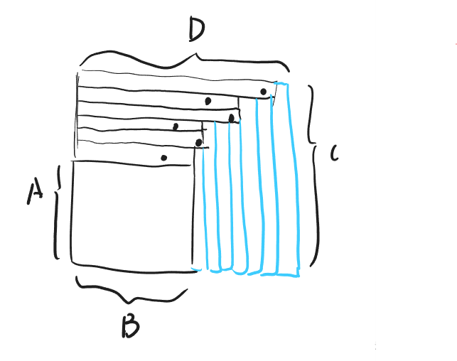
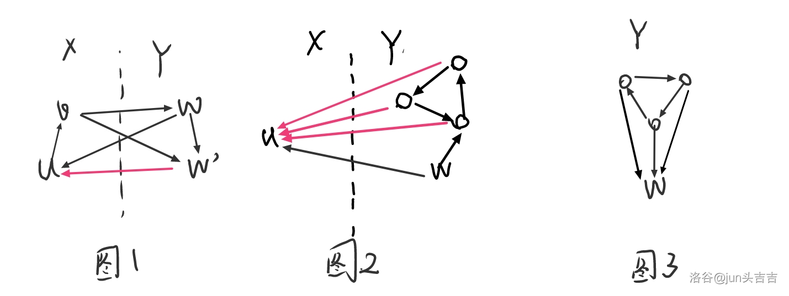
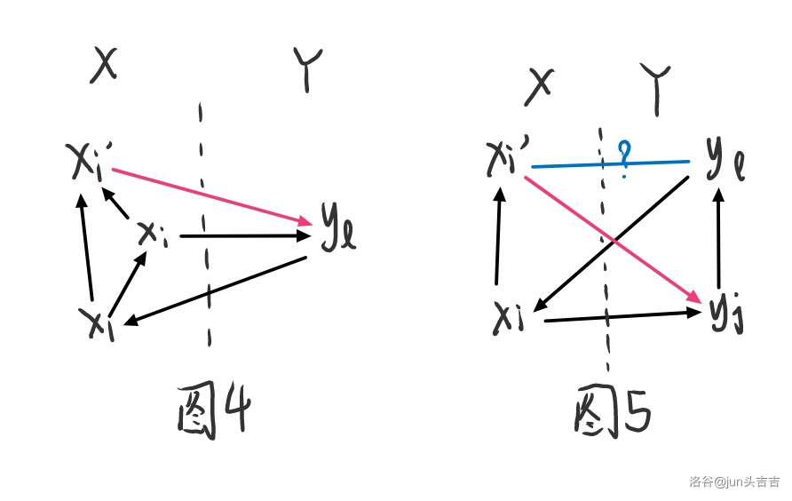
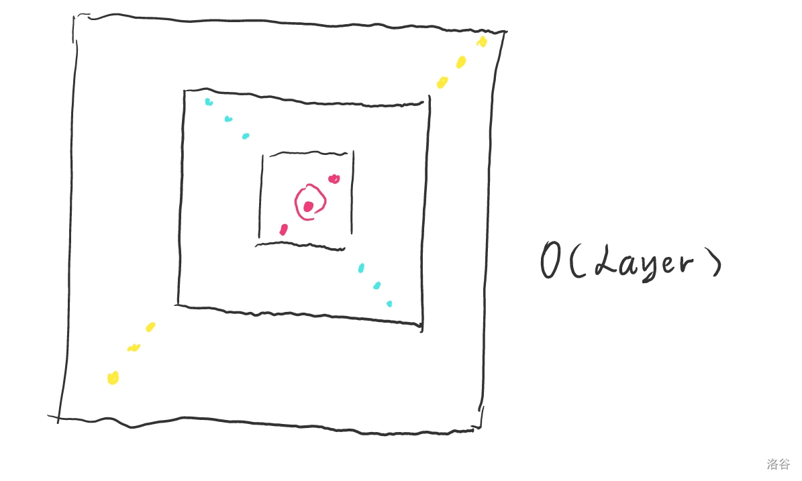
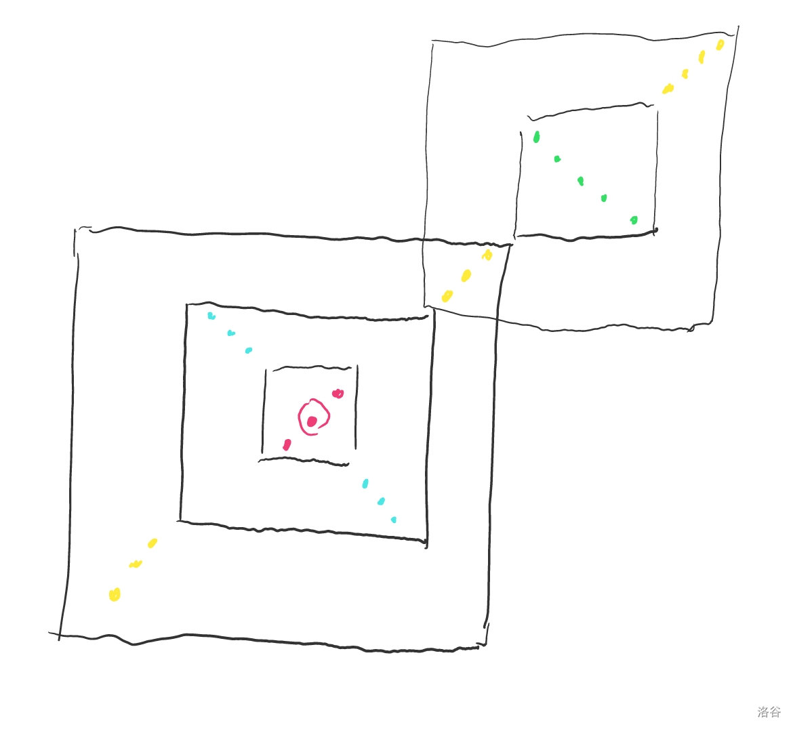

[TOC]

## [P2260 [清华集训2012]模积和](https://www.luogu.com.cn/problem/P2260)

简单推式子：
$$
\begin{aligned}
&\sum_{i=1}^n\sum_{j=1}^m(n\bmod i)\times (m\bmod j),i\ne j\\
=&\sum_{i=1}^n(n\bmod i)\sum_{j=1}^m(m\bmod i)-\sum_{i=1}^{\min(n,m)}(n\bmod i)(m\bmod i)\\
=&\left(n^2-\sum_{i=1}^ni\times\left\lfloor\frac ni\right\rfloor\right)\times \left(m^2-\sum_{i=1}^mi\times\left\lfloor\frac mi\right\rfloor\right)-\left(\sum_{i=1}^{\min(n,m)}nm-im\left\lfloor\frac ni\right\rfloor-in\left\lfloor\frac mi\right\rfloor+i^2\left\lfloor\frac ni\right\rfloor\left\lfloor\frac mi\right\rfloor\right)
\end{aligned}
$$
整除分块即可。复杂度 $\mathcal O(\sqrt n)$。

## [[AGC046A] Takahashikun, The Strider](https://www.luogu.com.cn/problem/AT_agc046_a)

看上去答案不会很大暴力走即可。

## [[AGC046B] Extension](https://www.luogu.com.cn/problem/AT_agc046_b)

考虑每次加一行或者加一列最后就是形如下面这个东西：

考虑一种合法方案的生成方式就是从第 $A+1$ 到第 $C$ 行（从下往上），每行撒一个点，然后形成一个形如阶梯的东西，权值是所有蓝色的柱子的高度积。要求所有撒点方案的权值之和。这个东西是可以dp的。设 $f_{i,j}$ 表示当前到第 $i$ 行阶梯到了第 $j$ 列的权值和（权值就是第 $B+1$ 列到第 $j$ 列的高度积），初始值为  $f_{A,B}=1$，转移是：
$$
\begin{aligned}
&f_{i,j}\leftarrow f_{i-1,k}\times (i-1)^{j-k}\quad (k<j)\\
&f_{i,j}\leftarrow f_{i-1,j}\times j
\end{aligned}
$$
第一种表示这一层阶梯是因为这个点才凸出来的。第二种表示这层阶梯是继承上一层的。

最后答案就是：
$$
\sum_{j=B}^D C^{D-j}f_{C,j}
$$
复杂度 $\mathcal O(BD)$。

## [[AGC046C] Shift](https://www.luogu.com.cn/problem/AT_agc046_c)

考虑在最后面加上一个 $0$ 显然不影响答案。记一共有 $m$ 个 $0$，第 $a_i$ 表示第 $i-1$ 个 $0$ 到第 $i$ 个 $0$ 中间 $1$ 的数量，一步操作就相当于选择 $i<j$，$a_i$ 加上 $1$，$a_j$ 减去 $1$，只能操作 $K$ 次求最终有多少种 $\{a_i\}_{i=1}^m$。

不考虑操作次数，一个 $\{b_i\}_{i=1}^m$ 能被构造出来的充要条件：

- $\sum_{i=1}^ma_i=\sum_{i=1}^mb_i$
- $\forall i\in[1,m],\sum_{j=1}^ib_j\ge\sum_{j=1}^ia_i$

两个条件都是必要的。然后毛估估也是充分的。最小操作次数是 $\sum_{i=1}^m\max(b_i-a_i,0)$。

这个可以直接 dp，就设 $f_{i,j,k}$ 表示 $\sum_{x=1}^i b_{x}=j,\sum_{x=1}^i\max(b_x-a_x,0)=k$ 的方案数。

转移的时候要枚举 $b_i$，复杂度是四次方，但是直接过了。

优化到三次方不难。但是我是懒狗。

## [[AGC046D] Secret Passage](https://www.luogu.com.cn/problem/AT_agc046_d)

首先考虑每一次删除前两个的时候，保留的那个不要立刻插回去，而是当做一个自由的数。用一个三元组 $(i,j,k)$ 表示字符串是 $S[i:|S|]$，$j$ 个自由的 $0$ 和 $k$ 个自由的 $1$。

所以现在我们最多有 $\mathcal O(|S|^3)$ 个三元组，我们想知道这些东西可以表示出多少不同的字符串。这个东西看上去不看好做。考虑下面的另一个算法：

对于一个字符串 $T$，从前往后枚举字符，维护 $i,j,k$，假设当前字符为 $c$，如果 $c$ 和 $S[i-1]$ 相等，那么让 $i-1$，否则如果 $c=0$ 则 $j+1$，否则 $k+1$。每一个字符串这样扫一遍都能够得到唯一的 $(i,j,k)$。对于这 $\mathcal O(|S|^3)$ 种的 $(i,j,k)$，我们可以算出每一种能够得到这个三元组的 $T$ 的数量。

然后想一想不难发现，对于最后得到的三元组相同的 $T$，要么全部能被构造出来，要么全部不能被构造出来。然后对于一个 $(i,j,k)$ 能够被构造出来，就相当于在第一步中存在三元组 $(w,j+S[i:w-1]\text{中0的个数},k+S[i:w-1]\text{中1的个数}》)$。要枚举 $w$ 的原因是我们刚刚匹配的其实是整个串，但是实际上只剩下一个后缀，要用自由的 $0/1$ 来补上。

朴素实现复杂度是四次方的，但是直接过了。

优化到三次方不难。但是我是懒狗。

## [[AGC046E] Permutation Cover](https://www.luogu.com.cn/problem/AT_agc046_e)

考虑 $a_x$ 是最小值 $a_y$ 是最大值，有解的充要条件是 $2a_x\ge a_y$。

首先是必要性，如果 $2a_x<a_y$，要不第一个/最后一个 $x$ 到边界有$\ge2$ 个 $y$，这样更靠近边界的就覆盖不到。要不两个相邻的 $x$ 中间有 $\ge 3$ 个 $y$，这样中间的 $y$ 就覆盖不到。两种情况至少存在一种然后就无解了。

否则任意一组解还是很容易构造的，如果 $a_x=a_y$ 只需要重复 $a_x$ 遍 $[1,k]$ 即可。

否则只需要中间是所有 $a_t=a_x$ 的  $t$，然后两边出现两次所有 $a_t\ne a_x$ 的 $t$，然后这一段显然能够被排列完全覆盖。那么所有 $a_t=a_x$ 的减小了 $1$，其他的减小了 $2$，然后就能归纳了。

然后我们能够判断有解了考虑怎么构造字典序最小。

考虑每次加上一个长度为 $l$ 的后缀使得后缀的 $k$ 个仍然是一个排列，要求 $l$ 字典序最小。首先 $l$ 内部的数已经确定了，因为前 $k-l$ 个是确定的，后缀的 $k$ 个要是排列，所以这些数也是确定的。然后在 $a_i$ 中把这些数减掉。设现在的最小值是 $a_x$ 最大值是 $a_y$。

如果 $2a_x\ge a_y$，那么显然接下来必然有解。

如果 $2a_x+1<a_y$，那么接下来必然无解，可以类似上面的分析。

所以接下来我们只需要考虑当 $2a_x+1=a_y$ 时构造一组字段组最小的解即可。类似上面的分析我们得出需要满足所有不存在 $i<j$ 满足 $a_{ans_i}=a_x,a_{ans_j}=a_y$。所以就可以直接贪心放了。设 $lst$ 是最后一次出现 $a_t=a_y$ 的位置，在 $lst$ 之前所有 $\ne a_x$ 先放进去，然后第 $lst$ 放进去之后把 $lst$ 之前的 $=a_x$ 按顺序放进去。之后就按顺序放。显然是字典序最小的。

每一次增加一段，需要枚举 $l$ 选择一个字典序最小的 $ans$。

复杂度是不超过 $\mathcal O(k^2\sum a_i)$ 的。感觉有高论但是我太不清楚。

## [[AGC046F] Forbidden Tournament](https://www.luogu.com.cn/problem/AT_agc046_f)

这 都 能 数 ？

以下内容 $a\to b$ 表示有从 $a$ 到 $b$ 的有向边。$a\to b$ 和 $b\not\to a$ 是等价的。

以下内容需要用到的结论有如果竞赛图有环，那么一定存在三元环。~~证明留作习题~~ 就考虑一个 $>3$ 的环中间割一条边变成一个较小的环，最终肯定可以到达三元环。

记题目中禁止出现的子图叫做 $H$，直观的理解就是**三元环上三个点都连向一个点**。

很厉害的题目。考虑如果有入度为 $0$ 的点，那么可以把这个点删掉变成一个 $N-1,K-1$ 的子问题。所以我们枚举删了 $i$ 个点，就是一个 $N-i,K-i$ 的子问题，系数是 $\binom Nii!$，删除这 $i$ 个点是有顺序的。

然后接下来我们考虑的问题**每个点至少有一个入度**。

考虑我们拉出来一个点 $v$，记 $Y=\{w|v\to w\}$，也就是 $v$ 的出边连向的点的集合，$X=V\setminus Y$，也就是 $v$ 的入边加上 $v$ 自己。

然后如果 $X$ 中有环，也就是有三元环，首先 $v$ 肯定不在环内，那么这个环都向 $v$ 连边，然后就构成了 $H$。所以我们得到了第一条结论：

**结论$\mathrm I.$** $X$ 是一个 DAG，存在一个 $x_1,\dots,x_k$ 且 $x_k=v$ ，满足若 $i<j$，则 $x_i\to x_j$。

如图1所示，对于 $u\in X,w\in Y$，如果 $w\to u$，且 $w\to w'$，我们可以推出 $w'\to u$，否则就会构成 $H$。

**性质$\mathrm I.$** 如果 $u\in X,w\in Y$，如果 $w\to u$，则所有 $w$ 能走到的 $w'$ 都有 $w'\to u$

然后一个显然的结论就是如果 $Y$ 中有环，那么没有 $w$ 能走到三元环，要么环缩点之后在 $w$ 之前，三个点都和 $w$ 右边。观察图2和图3不难发现两种情况必然会有 $H$ 出现。

**性质$\mathrm {II}.$** 如果存在 $u\in X,w\in Y$，且 $w\to u$，那么 $Y$ 也一定没有环。

然后我们保证了每个点至少有一个入度，所以取 $u=x_1$，至少存在一个 $w$ 满足 $w\to u$，那么 $Y$ 一定没有环。

**结论$\mathrm {II}.$** $Y$ 是一个 DAG，存在一个 $y_1,\dots,y_l$ ，满足若 $i<j$，则 $y_i\to y_j$。

**结论$\mathrm {III}.$** 当 $Y$ 是 DAG 时 **性质$\mathrm I$** 可以变成若 $y_j\to x_i$，那么对于 $j'\in[j,l]$，$y_{j'}\to x_i$。

然后发现如果 $y_l\not\to x_1$，那么不会有 $y_i\to x_1$，这与入度至少为 $1$ 矛盾，因此：

**结论$\mathrm {IV}.$** $y_l\to x_1$ 一定成立。

如图4，对于 $2\le i\le k$，如果  $y_l\not\to x_i$，那么对于 $i'\in[i+1,k]$，如果 $y_l\to x_{i'}$，那么显然就构成了 $H$，所以我们可以断定：

**结论$\mathrm V.$** 如果 $i'>i,y_l\not\to x_i$，则 $y_l\not\to x_{i'}$。

对于我们找到最大的 $t$ 满足 $y_l\to x_t$，那么对于 $i\in [1,t],j\in[1,l-1],i'\in[i+1,t]$，如果 $x_i\to y_j$，那么已经有三元环了，如果 $y_j\to x_{i'}$，我们又可以推出 $y_l\to x_{i'}$，然后就构成了 $H$。由此，我们推出最后一条结论：

**结论$\mathrm {VI}.$** 对于 $1\le i'<i\le t$，如果 $y_j\to x_i$，则 $y_j\to x_{i'}$。

不难验证如果满足所有六条结论，则一定不存在 $H$。

如果我们画一个 $k\times l$ 的网格图，$y_j\to x_i$ 则将 $(i,j)$ 涂黑，那么这个网格图满足：

- 如果 $(i,j)$ 为黑，则所有$1\le i'< i$， $(i',j)$ 也为黑
- 如果 $(i,j)$ 为黑，则所有 $j<j'\le l$，$(i,j')$ 也为黑
- $(1,l)$ 为黑

当然因为 $v=x_k$，所以 $(k,j)$ 必然不能为黑。

没有度数就直接网格图上dp这一段阶梯状物即可。

有度数限制就相当于一行的黑色数量不能超过某个值，一列的白色数量不能超过某个值。这个不难在 $\mathcal O(kl)$ 的复杂度求出。

然后求方案数就是钦定 $v=1$，枚举 $k,l$ 网格图上填色。然后 $x_1,\dots,x_{k-1},y_1,\dots,y_l$ 的方案数是 $(n-1)!$，其中 $n$ 指的是当前子问题的规模。

复杂度 $\mathcal O(N^4)$。

## [[AGC060A] No Majority](https://www.luogu.com.cn/problem/AT_agc060_a)

不能出现 $\texttt{AA}$ 或 $\texttt{ABA}$。

暴力 dp 即可，复杂度 $\mathcal O(n|\Sigma|^2)$。

## [[AGC060B] Unique XOR Path](https://www.luogu.com.cn/problem/AT_agc060_b)

首先发现拐角可以调整。然后两个连续的拐角不能同时调整。

那么计算出最多有多少个可以自由调整的，个数需要 $\le k$，不然线性基里肯定有 $>1$ 个 $0$ 就寄了。

然后构造也是可以做的，但是我不会。

复杂度 $\mathcal O(|S|)$。

## [[AGC060C] Large Heap](https://www.luogu.com.cn/problem/AT_agc060_c)

首先总的方案数是 $(2^N-1)!\prod\frac 1{sz_i}$。

然后考虑把 $1\to U,1\to V$ 所有点排序，然后排完序之后就可以形成一棵新的树，考虑现在的 $\prod 1/sz_i'$ 和原来的 $\prod 1/sz_i$ 有什么区别。观察一下只有 $1\to U,1\to V$ 这些点变了，所以只需要计算这部分的贡献即可。比如一个点原来的贡献是 $1/(2^i-1)$ 现在变成 $1/(2^i+2^j-2)$，所以贡献就是 $(2^i-1)/(2^i+2^j-2)$。

要对 $\mathcal O(N^2)$ 对 $2^i+2^j-2$ 求逆，复杂度瓶颈是这里。

朴素实现 $\mathcal O(N^2\log mod)$。可以做到 $\mathcal O(N^2)$。

## [[AGC060D] Same Descent Set](https://www.luogu.com.cn/problem/AT_agc060_d)

考虑 $S=\{i|P_i>P_{i+1}\}=\{i|Q_i>Q_{i+1}\}$。

然后计算恰好是 $S$ 的排列有多少个。然后这个可以容斥，也就是钦定一个 $T\subseteq S$，$T$ 里面钦定违反，填 $<$，然后 $[1,N-1]\setminus S$ 也是填 $<$。我们设 $f(T)$ 表示除了 $T$ 其他都钦定填 $<$ 的方案数，也就是 $N!\times \prod 1/len!$。$len$ 表示被 $T$ 分割的每一段的长度。方案数就是：
$$
\sum_{T\subseteq S}(-1)^{|T|}f(S\setminus T)
$$
然后对答案的贡献就是：
$$
\left(\sum_{T\subseteq S}(-1)^{|T|}f(S\setminus T)\right)^2=\left(\sum_{T\subseteq S}(-1)^{|T|}f(T)\right)^2
$$
然后考虑一对 $(-1)^{|A|+|B|}f(A)f(B)$ 对答案的贡献，也就是有多少 $S$ 满足 $A,B\subseteq S$。就是 $2^{N-1-|A\cup B|}=2^{N-1-|A|-|B|+|A\cap B|}$。我们可以把 $2^{N-1}$ 到最后乘。然后设 $g(A)=(-\frac12)^{|A|}f(|A|)$，我们要求的实际上就是：
$$
\sum 2^{|A\cap B|}g(A)g(B)=\sum _{S\subseteq A,S\subseteq B}g(A)g(B)
$$
实际上就是枚举 $A\cap B$ 的子集。

然后如果 $S$ 固定后 $S$ 把序列分成了若干段，每一段的贡献都是确定的，并且只和长度有关。

所以把每个长度的贡献计算出来，然后就可以计算最后的答案了。

复杂度 $\mathcal O(N\log N)$。瓶颈是多项式求逆。

## [[AGC060E] Number of Cycles](https://www.luogu.com.cn/problem/AT_agc060_e)

首先奇偶性是固定的，因为每次交换两个值，则 $f(x)$ 只会 $\pm 1$，那么 $f(x)+f(y)$ 只会 $0,\pm 2$，奇偶性不变。如果 $K$ 和任意一组解奇偶性不同肯定无解。

首先一个结论是最大的情况是 $x_i=i$，证明就考虑交换 $x$ 的两个值，如果多了一个 $x_i=i$，那么 $f(x)$ 肯定 $+1$，所以 $f(x)+f(y)$ 不会变小。如果 $K$ 比此时的还要大肯定无解。

然后就是我们可以构造出一个 $2$ 或 $3$ 的解，只需要前 $N-2$ 个选择让 $x$ 和 $y$ 都不会形成环的，第 $N-1$ 个选择让 $x$ 不会形成环的，那么 $f(x)=1,f(y)\le 2,f(x)+f(y)\le3$。

构造出这个之后我们可以二分一下进行了多少次交换让 $x_i=i$，因为是单调不降的所以肯定可以找到恰好 $=K$ 的时候。

复杂度 $\mathcal O(N\log N)$。

## [[AGC060F] Spanning Trees of Interval Graph](https://www.luogu.com.cn/problem/AT_agc060_f)

记 $M=2N-1,S=\sum C_{i,j}$。考虑矩阵树定理。把 $S$ 个区间标上号。设第 $i$ 个区间为 $L_i,R_i$。

设矩阵 $A$ 为 $S\times S$ 的矩阵，满足只有主对角线有值，$A_{i,i}$ 表示 $\sum \big[[L_i,R_i]\cap[L_j,R_j]\ne\varnothing\big]$，也就是有交的区间个数（包括自己）。

设矩阵 $B$ 为 $S\times S$ 的矩阵，$B_{i,j}=\big[[L_i,R_i]\cap [L_j,R_j]\ne\varnothing\big]$。

根据矩阵树定理，我们要求的就是 $A-B$ 划去一行一列之后的行列式。直接做是 $\mathcal O(S^3)$ 不可接受。

考虑两个函数 $F(l,r)$ 和 $G(l,r)$，返回值是长度为 $M$ 的列向量，满足：

- $F(l,r)=v$，则：
  - $v_{2i-1}=1(i\in[l,r])$
  - $v_{2i-1}=0(i\not\in[l,r])$
  - $v_{2i}=1([i,i+1]\subseteq[l,r])$
  - $v_{2i}=0([i,i+1]\not\subseteq[l,r])$
- $G(l,r)=v$，则：
  - $v_{2i-1}=1(i\in[l,r])$
  - $v_{2i-1}=0(i\not\in[l,r])$
  - $v_{2i}=-1([i,i+1]\subseteq[l,r])$
  - $v_{2i}=0([i,i+1]\not\subseteq[l,r])$

不难发现 $B_{i,j}=F(L_i,R_i)^T\times G(L_j,R_j)$。因为两个区间有交那么相交的点数减去相交的边数 $=1$。

考虑下面的矩阵：
$$
\left[\begin{array}{ccc|ccc}
 1 &  &  &  &  & \\
  & \ddots &  & G(L_1,R_1) & \cdots & G(L_{S-1},R_{S-1})\\
  &  & 1 &  &  & \\\hline
  & F(L_1,R_1)^T &  & A_{1,1} &  & \\
  & \vdots &  &  &  \ddots& \\
  & F(L_{S-1},R_{S-1})^T &  &   & & A_{S-1,S-1}
\end{array}\right]
$$
模拟一下消元的过程，为了消去 $F(L_i,R_i)^T$ 这部分，会让右下角矩阵第 $i$ 行 $j$ 列减去 $F(L_i,R_i)^T\times G(L_j,R_j)=B_{i,j}$，也就是当左下角矩阵消完时，右下角已经变成了 $A-B$ 划去一行一列，也就是：
$$
\left[\begin{array}{ccc|ccc}
 1 &  &  &  &  & \\
  & \ddots &  & G(L_1,R_1) & \cdots & G(L_{S-1},R_{S-1})\\
  &  & 1 &  &  & \\\hline
  &  &  & A_{1,1}-B_{1,1} & \cdots & -B_{1,S-1}\\
  &  &  & \vdots &  \ddots& \vdots\\
  & &  &  -B_{S-1,1} & \cdots & A_{S-1,S-1}
\end{array}\right]
$$
这个矩阵的行列式就是答案。可是这个还是 $\mathcal O(S^3)$ 的。尝试消去右上角。

为了消去 $G(L_i,R_i)$，我们需要用到 $F(L_i,R_i)| A_{i,i}$ 这一行，然后让左上角 $M\times M$ 的矩阵加上 $-1/A_{i,i}\times G(L_i,R_i)\times F(L_i,R_i)^T$。然后右上角就被消空了。矩阵大概是这样的：
$$
\left[\begin{array}{ccc|ccc}
  &  &  &  &  & \\
  & ? &  &  &  & \\
  &  &  &  &  & \\\hline
  & F(L_1,R_1)^T &  & A_{1,1} &  & \\
  & \vdots &  &  &  \ddots& \\
  & F(L_{S-1},R_{S-1})^T &  &   & & A_{S-1,S-1}
\end{array}\right]
$$

此时的行列式就是左上角 $M\times M$ 的部分的行列式乘上 $\prod A_{i,i}$。

所以我们现在只需要求出左上角的部分这道题就做完了。

首先有一个 $\mathcal O(N^4)$ 的求法就是考虑 $G(i,j)\times F(i,j)^T$ 一共贡献了多少次，更具体地就是 $- C_{i,j}/(S-\sum_{y<i}C_{x,y}-\sum _{j<x}C_{x,y})$。后面的两个求和可以直接求前缀和或者后缀和。顺便可以把 $\prod A_{i,i}$ 求出来。

优化到 $\mathcal O(N^3)$ 就是每一次 $G(i,j)\times F(i,j)^T$ 不要暴力加，差分加即可。

可以优化到 $\mathcal O(N^2)$ 但是求行列式还是 $\mathcal O(N^3)$ 的所以我就没写。

还要注意的一点就是上面的右下角矩阵是 $S-1$ 的所以要删去一个点喵。

## [[AGC047A] Integer Product](https://www.luogu.com.cn/problem/AT_agc047_a)

把数字写成 $x\times 2^a\times 5^b$ 的形式，其中 $\gcd(x,10)=1$，那么 $(a,b)$ 的组数不会很多，暴力即可。

## [[AGC047B] First Second](https://www.luogu.com.cn/problem/AT_agc047_b)

$S_i$ 能变成 $S_j$ 当且仅当 $S_i$ 之前的一个字母加上一段后缀能够变成 $S_j$。

字典树随便搞一搞即可。

## [[AGC047C] Product Modulo](https://www.luogu.com.cn/problem/AT_agc047_c)

套路题。就先用原根变成 $g^a$ 的形式，然后就是加法卷积。

复杂度 $\mathcal O(P\log P)$。

## [[AGC047D] Twin Binary Trees](https://www.luogu.com.cn/problem/AT_agc047_d)

首先枚举第一棵树上的 lca，然后得到黑点和白点，使得在这棵树上黑点和白点的 lca 就是当前的点，放到第二棵树上，然后要求的类似于 $A_x\times A_y\times B_{\mathrm{LCA}(x,y)}$，其中 $x$ 是黑点，$y$ 是白点。

因为 sz 和是 $H2^H$ 级别的所以是可以过的。

没有看懂以前在写什么。

## [[AGC047E] Product Simulation](https://www.luogu.com.cn/problem/AT_agc047_e)

简单构造。

首先如果 $A=B=0$ 时，序列不管怎么搞都是全 $0$，所以最后 $a[2]$ 肯定是对的。

加下来考虑 $A+B>0$ 的情况。考虑实现一个二进制拆分。

首先可以造出一个 $1$，就是 $a[3]=a[0]+a[1],a[3]=a[4]<a[3]$，那么现在 $a[3]$ 就一定是 $1$ 了。

二进制拆分就维护一个前缀 $s$，然后尝试当前位 $2^i$ 是否是 $1$，如果是 $1$ 那么 $s+2^i\le x$。因为只有 $<$ 所以要把 $a[0]=a[0]+a[3],a[1]=a[1]+a[3]$。然后就可以得到 $a[0]$ 和 $a[1]$ 所有二进制位了。

对于 $\{0,1\}\times \{0,1\}$ 的乘法是简单的，就考虑 $a\times b=[a+b>1]$。把所有二进制为乘起来加到 $a[2]$ 即可。

次数是 $\mathcal O(\log ^2)$ 的。

## [[AGC047F] Rooks](https://www.luogu.com.cn/problem/AT_agc047_f)

对于复杂度还是很迷。毛估估是对的。但是我不知道怎么严谨证明。

首先可以把 $X_i$ 排序，然后 $X,Y$ 离散化。以下内容假设 $X_i=i,Y_i\in[1,N]$，$dis(i,j)$ 表示 $i$ 和 $j$ 的曼哈顿距离（离散化之前）。下面从简单的子问题入手分析这个问题。

###  子问题 $1$：$N\le 300$

考虑枚举起点 $s$， $f_{i,j,isRight}$ 表示当前吃掉了 $[i,j]$ 所有子，$isRight$ 表示现在在 $j$ 还是 $i$，最少的步数。

然后转移就设 $mn=\min_{i\le k\le j}Y_k,mx=\max_{i\le k\le j}Y_k$，如果 $Y_{i-1}=mn-1$ 或 $Y_{i-1}=mx+1$，那么就可以转移：
$$
f_{i-1,j,0}\leftarrow f_{i,j,isRight}+dis(i-1,i+isRight\times(j-i))
$$
减一是因为最后一步是 $X$ 和 $Y$ 一起走的。

然后对于 $f_{i,j+1,1}$ 也是同样的。初始值是 $f_{s,s,0}=0$。

朴素实现是 $\mathcal O(N^3)$ 的。

注意如果最后最大的区间是 $[L,R]$，那么需要减去 $R-L$ 步，因为每一次吃子的时候是两步一起走的。

### 子问题 $2$：$N\le 3000$

这个要求 $\mathcal O(N^2)$ 捏，也就是不能枚举起点。

首先手玩一下发现每次扩展的方向顺序是无关的，也就是对于刚刚的 $dp$，肯定存在一个极大的可以到达的区间，不管按什么顺序操作最后都能到这个极大的区间。

所以我们可以倒过来 dp，转移的时候从大区间往小区间转移，方程是类似的，只是反过来：
$$
f_{i-1,j,0}+dis(i-1,i+isRight\times(j-i))\rightarrow f_{i,j,isRight}
$$
另一种转移同理。初始值是对于极大的区间$[i,j]$ $f_{i,j,0/1}=-(j-i)$。起点为 $s$ 的答案就是 $f_{s,s,0}$。

这个直接做就是 $\mathcal O(N^2)$ 了。

### 子问题 $3$：$Y_i=i$

这个就比较憨憨。对于起点 $s$，方案一定是 $s\to 1\to n$ 或 $s\to n\to 1$，最后的答案就是：
$$
\min(dis(s,1),dis(s,n))+dis(1,n)-(n-1)
$$

### 原问题

子问题 $3$ 看起来非常憨对不对。为什么要有这个子问题呢。这个其实是启示我们，如果 $[i,j]$ 满足 $\forall i\le k<j,|Y_k-Y_{k+1}|=1$，那么如果在子问题 $2$ 的dp的时候我们扩展了 $j$，可以直接把 $[i,j]$ 整一段扩展。

这个有什么用呢？一个令人惊讶的事实是，现在的状态数变成了 $\mathcal O(N)$！也就是直接记忆化dp就可以过了。

下面说明一下为什么是对的。感觉比较意识流，感性理解一下。。

考虑对于起点 $s$ 最后扩展到的极大区间一定是类似下图的：

对于这个东西，里面的每个点作为起点，按照上面的算法，最后得到的状态数是层数级别的。

然后对于所有的点，一定会形成若干个极大矩形。

可能会有上面的情况，也就是一些点同时在两个矩形里。但是最多也就只有两个矩形。所以层数和还是 $\mathcal O(N)$ 的。所以总的状态数也是 $\mathcal O(N)$ 的。

用 `map` 记忆化最后的复杂度是 $\mathcal O(N\log N)$。

## [[AGC048A] atcoder < S](https://www.luogu.com.cn/problem/AT_agc048_a)

简单讨论一下即可。

虽然我写了依托答辩。但是过了。

## [[AGC048B] Bracket Score](https://www.luogu.com.cn/problem/AT_agc048_b)

令 $C_i=[S_i=\texttt{'['}\lor S_i=\texttt{']'}]$，那么 $C$ 合法当且仅当奇数位置上的 $1$ 和偶数位置上的 $1$ 数量一样多。

然后就可以做了。复杂度 $\mathcal O(N\log N)$。

## [[AGC048C] Penguin Skating](https://www.luogu.com.cn/problem/AT_agc048_c)

考虑 $A_1,\dots,A_{N+1}$ 表示相邻企鹅之间的空格，$A_1/A_{N+1}$ 表示到边界的空格。$B_1,\dots,B_{N+1}$ 同理。

然后一次移动就相当于 $A_{i\pm 1}\leftarrow A_i,A_i=0$。

然后对于一个 $B_i$，就可以知道是哪一段 $A_i$ 移动得到的。

然后对于每一个 $B_i$ 计算把这一段 $A$ 移动到 $i$ 的最小代价即可。

复杂度 $\mathcal O(N)$。

## [[AGC048D] Pocky Game](https://www.luogu.com.cn/problem/AT_agc048_d)

首先可以证明每一次要么取一个要么取完。然后对于先手，肯定最左边的是越大越有优势。

然后设 dp：

- $f_{l,r}$ 表示 $b_{l+1,\dots,r}=a_{l+1,\dots,r}$，$b_l$ 至少要多少左边先手可以赢
- $g_{l,r}$ 表示 $b_{l,\dots,r-1}=a_{l,\dots,r-1}$，$b_r$ 至少要多少右边先手可以赢

然后考虑 $l$ 和 $r$ 一堆被取空之前的策略：

- 左边：如果此时 $b_r<g_{l+1,r}$，那么直接取空让右边必败，否则只取一个
- 右边：如果此时 $b_l<f_{l,r-1}$，那么直接取空让左边必败，否则只取一个

所以过程就是两个人轮流取一个，直到左边行动时 $b_r<g_{l+1,r}$ 或右边行动时 $b_l<f_{l,r-1}$。先手必胜就是第一种情况先发生。所以要求 $b_r<g_{l+1,r}$ 或 $b_l-f_{l,r-1}>b_r-g_{l+1,r}$，因此：
$$
f_{l,r}=\begin{cases}
1&a_r<g_{l+1,r}\\
f_{l,r-1}-g_{l+1,r}+a_r+1& a_r\ge g_{l+1,r}
\end{cases}
$$
对于 $g$ 也有对称的转移方程。边界条件是 $f_{i,i}=g_{i,i}=1$。

最后就是看 $a_1$ 和 $f_{1,n}$ 的大小关系即可。

复杂度 $\mathcal O(TN^2)$。

## [[AGC048E] Strange Relation](https://www.luogu.com.cn/problem/AT_agc048_e)

首先要知道 $f(A,T)$ 咋求。

一个很神秘的求法就是维护只有 $\{A_i,\dots,A_N\}$ 时的答案 $\{x_i,\dots,x_N\}$，然后考虑加入 $A_{i-1}$，首先 $x_{i-1}=0$。如果 $A_j+T\times (x_j+1)>A_{i-1}$，那么就让 $x_j$ 加一。然后可以证明这个是字典序最大的。

然后发现这个过程中 $x$ 是互不影响的，所以我们可以分别做，就先枚举 $A_i=B_{i,j}$，然后 $f_{a,b}$ 表示当前已经加入到 $A_{a}$，现在 $x_i=b$ 的方案数。转移就直接枚举 $A_{a-1}$ 即可。

复杂度 $\mathcal O(N^3K^2)$。

## [[AGC048F] 01 Record](https://www.luogu.com.cn/problem/AT_agc048_f)

这个结论很简单，但是证明很/yun。

首先翻转 $S$，称 $10101\dots$ 为好串。每一次贪心地选最长的好串，得到 $l_1,\dots,l_n$。如果选不完那么就是 $0$。

然后我们想知道长度为 $x_1,\dots,x_m$ 的好串能否被选出来（$x_1\ge x_2\ge \dots \ge x_m$）。显然有 $m\ge n$。给 $l$ 长度不够的部分补 $0$，那么就是：

- $\sum_{i=1}^m x_i=\sum_{i=1}^m l_i$
- $\forall 1\le i\le m,\sum _{j=1}^i\lfloor x_i/2\rfloor\le \sum_{j=1}^i\lfloor l_i/2\rfloor$
- $\forall 1\le i\le m,\sum _{j=1}^i\lceil x_i/2\rceil\le \sum_{j=1}^i\lceil l_i/2\rceil$

必要性证明就是说，第一个是显然的，第二个和第三个的意思是我们贪心地选择，得到的 $0$ 和 $1$ 的数量肯定是最多的，不能比这个更多。所以是必要的。

充分性的证明首先要证明一个引理：

> 对于长度为 $|a|$ 和 $|b|$ 的好串（$|a|\le|b|$），归并后得到 $S$，对于给定的 $|c|$ 和 $|d|$ 满足
> $$
> |a|\le|c|\le |d|\le |b|,|a|+|b|=|c|+|d|,\lfloor|a|/2\rfloor+\lfloor|b|/2\rfloor=\lfloor|c|/2\rfloor+\lfloor|d|/2\rfloor
> $$
> 一定可以把 $S$ 分成两个子序列 $c$ 和 $d$。证明就考虑贪心选出最长的 $p$，剩下的 $q$ 也是好串。有 $|p|\ge |b|,|q|\le|a|\le|c|$，可以再选一点形成 $c$，剩下的就是 $d$.

现在考虑操作 $l$ 使得变成 $x$：

- 首先找一个 $l_i<x_i$。如果不存在那么就变成 $x$ 了。
- - 找到 $i$ 后，如果存在 $j$ 满足 $j<i$ 且 $l_j\ge x_j+2$，那么有 $l_i<x_i\le x_j\le l_j-2$，然后就能把 $l_j$ 和 $l_i$ 重组成 $l_j-2$ 和 $l_i+2$
  - 否则一定存在 $j$ 满足 $j<i$ 且 $l_j=x_j+1$，因此 $l_i<x_i\le x_j\le l_j-1$，可以重组成 $l_j-1$ 与 $l_i+1$
- 反复上面的过程，一定能够在有限步内结束。

然后计算方案数是简单的，就考虑 $f_{m,i,j,k}$ 表示长度为 $m$，$x_m=i$，$\lfloor /2\rfloor$ 的和与 $\lceil /2\rceil$ 的和分别是 $j$ 与 $k$。

因为 $m\times i\le |S|$，所以状态数是 $\mathcal O(|S|^3\log|S|)$ 的。滚动数组可以做到 $\mathcal O(|S|^3)$ 空间。转移就形如：
$$
f_{m,i,j+\lfloor l/2\rfloor,k+\lceil l/2\rceil}\leftarrow f_{m-1,\ge i,j,k}
$$
用后缀和维护转移，复杂度 $\mathcal O(|S|^3\log |S|)$。

## [[AGC049A] Erasing Vertices](https://www.luogu.com.cn/problem/AT_agc049_a)

考虑操作的次数和的期望就是每个点是所有能到达它的点中第一个被删的概率和。答案就是：
$$
\sum_{i=1}^N1\bigg/\left(\sum_{j=1}^N[j\to i]\right)
$$
复杂度是传递闭包 $\mathcal O(N^3)$。

## [[AGC049B] Flip Digits](https://www.luogu.com.cn/problem/AT_agc049_b)

这个就是 $01\to 10,11\to 00$。

所以可以把所有 $T$ 中的 $1$ 贪心的匹配 $S$ 中的 $1$，计算距离和，然后 $S$ 中剩下的 $1$ 两两消掉。

可以做到 $\mathcal O(N)$。但是我写了 $\mathcal O(N\log N)$。

## [[AGC049C] Robots](https://www.luogu.com.cn/problem/AT_agc049_c)

bot.

如果一个机器人满足 $A_i>B_i$，那么就是好的，否则就是坏的。坏的机器人必须被好的机器人踩死。

所以考虑如果所有坏的都能被踩死，答案就是 $0$。否则策略有两种：

- 花费 $1$ 的代价踩死一个不能被好的踩死的坏的
- 花费 $B_i-A_i+1$ 的代价把一个坏的变成好的

第二种只会操作 $1$ 次，枚举是哪个，然后此时的答案就是 $\max(B_i-A_i+1,[之后不能被踩死的坏的机器人])$。

当然也有可能只有第一种。

复杂度 $\mathcal O(N)$。

## [[AGC049D] Convex Sequence](https://www.luogu.com.cn/problem/AT_agc049_d)

题意说的，等价于凸包。

考虑一种凸包生成方式：

- 钦定第一个出现最小值的位置 $i$
- 给 $i-1,i-2,\dots,1$ 分别加上 $1,2,\dots,i-1$
- 给所有数加上 $1$，重复若干次
- 给 $j,j-1,\dots,1$ 加上 $1,2,\dots,j$（$j<i$），重复若干次
- 给 $j,j+1,\dots,N$ 加上 $1,2,\dots,N-j+1$（$j>i$），重复若干次

然后这个就相当于每个物品都是无限的背包。

然后 $i=1$ 时只有 $\mathcal O(\sqrt M)$ 种物品因为物品 $\le M$ 才是有意义的。

$i$ 和 $i+1$ 只会相差 $\le 2$ 件物品。众所周知背包是可以回退的。

因为第二步的存在所以合法的 $i$ 只有前 $\mathcal O(\sqrt M)$ 个。当然物品的变化也是 $\mathcal O(\sqrt M)$ 次。

复杂度 $\mathcal O(M\sqrt M)$。

## [[AGC049E] Increment Decrement](https://www.luogu.com.cn/problem/AT_agc049_e)

考虑给定 $A_i$ 怎么做。首先考虑只有操作二，那么肯定只用加，答案是：
$$
\sum_{i=1}^NC\times\max(A_i-A_{i-1},0)
$$
然后现在有操作 $1$，所以考虑操作二变成了 $D$，代价是：
$$
\sum_{i=1}^NC\times \max(A_i-A_{i-1},0)+|A_i-D_i|
$$
这个最直接的想法是dp：
$$
f_{i,j}=\max_{k\ge 0}f_{i-1,k}+C\times\max(j-k,0)+|j-A_i|
$$
初始条件是 $f_{i,j}=(C+1)\times j$。但是第二位的值域是 $10^9$ 显然过不去。

考虑归纳证明 $f_{i,j}$ 是一个关于 $j$ 的下凸函数，斜率在 $[-1,C+1]$。首先 $i=0$ 显然成立。设 $g_{i,j}=\max_{k\ge 0}f_{i-1,k}+C\times \max(j-k,0)$，设 $f_{i-1,x_0}$ 是第一个最小值，$x_1$ 是第一个满足 $f_{i-1,x_1+1}-f_{i-1,x_1}=C+1$，那么我们就可以得到 $g_{i,j}$ 的结构：

- $0\le j\le x_0$，$g_{i,j}=f_{i-1,x_0}$
- $x_0<j\le x_1$，$g_{i,j}=f_{i-1,j}$
- $j>x_1$，$g_{i,j}=f_{i-1,x_1}+C\times (j-x1)$

所以 $g_i$ 的斜率在 $[0,C]$ 并且不降。加上一个绝对值函数之后 $f_i$ 的斜率在 $[-1,C+1]$ 并且不降。

然后考虑怎么计算答案，维护一个长度为 $C+2$ 的不下降序列 $S$ 满足，$S_i$ 表示斜率为 $i-2$ 和斜率为 $i-1$ 的分界点（$1\le i\le C+2$）。初始是 $C+2$ 个 $0$。然后考虑加入了 $A_i$ 时做了什么：

- 把第一个最小值之前的全部变成最小值，也就是把 $-1$ 和 $0$ 的分界点移动到 $0$。
- 斜率为 $C+1$ 的全部变成斜率为 $C$，也就是删除最后一个分界点。 
- 然后加上 $|j-A_i|$，也就是删除 $0$ 上的分界点，在 $A_i$ 加入两个分界点。
- 需要保证 $S$ 仍然是不下降的。

然后考虑 $f_i$ 的最小值和 $f_{i-1}$ 的最小值变化了多少。不难发现 $f_{i,0}=f_{i-1,x_0}+A_i$，最小值出现的位置恰好是此时 $S$ 的最小值，也就是 $-1$ 和 $0$ 的分界点。增加了 $A_i-S_1$。

重新回顾整个算法：

- 初始 $S$ 为 $C+2$ 个 $0$;
- 从 $1$ 到 $N$ 枚举 $i$；
- 删除 $S$ 中的最大值和最小值；
- 加入两个 $A_i$ 并且排序；
- 答案累加上 $A_i-S_1$。

如果 $A_i$ 给定就可以做了。不固定的情况也是类似的。就考虑 $B_{i,j}$ 的贡献。首先是作为 $A_i$ 被加的贡献和是 $K^{N-1}$。然后计算所有情况作为最小值被减了多少次。

这个也是好做的，就直接硬上 dp，设 $f_{a,b,c,d}$ 表示此时算法已经枚举到 $i=a$，$B_{i,j}$ 作为最小值已经被减了 $b$ 次，$S$ 中有 $c$ 个比 $B_{i,j}$ 小的，$d$ 个 $B_{i,j}$ 的方案数。小的定义是数值更小或数值一样位置更前。

现在是 $\mathcal O(N^2K^2C)$ 可以过了。好像就高论可以到四次方。

就考虑有多少次最小值 $< x$ 把 $<x$ 的看做 $0$ ，$\ge x$ 的看做 $1$，统计有多少次集合中的数都为 $1$，最后拿总删除次数减去全为 $1$ 的次数即可。

## [[AGC049F] Happy Sequence](https://www.luogu.com.cn/problem/AT_agc049_f)

设 $L=2\times 10^5$，$g(x)=\sum_{i=1}^n|b_i-x|-|a_i-x|$，合法当且仅当 $\forall x\in[0,L],g(x)\ge 0$。因此 $0\le a'_i\le L$。

首先令 $a'_i=0$，代价为 $\sum_{i=1}^nc_ia_i^2$，并计算当前的 $g(x)$。让 $a_i'=x$ 增加到 $x+1$ 的代价 $C_{i,x}$ 为 $c_i(2(k-a_i)+1)$，带来效果是 $0\le i\le x$，$g(i)$ 减小 $1$，$x<i\le L$，$g(i)$ 增大 $1$。

然后讲道理，我们要限制先选 $C_{i,x}$ 才能选 $C_{i,x+1}$，但是 $C_{i,x}$ 值更小，加的范围更大，肯定会比 $C_{i,x+1}$ 先选。

然后设 $f(x)$ 表示 $C_{?,x}$ 总共选择了多少个，那么满足：
$$
g'(x)=g(x)+\sum_{i=0}^{x-1}f(i)-\sum_{i=x}^Lf(i)\ge 0
$$
令 $S=\sum_{i=0}^L$，发现 $\sum _{i=x}^Lf(i)\le\lfloor\frac{S+g(x)}2\rfloor$，设为 $lim(i)$。

带入 $g(0)$ 和 $g(L)$ 发现 $\sum a_i'=\sum b_i$，所以 $S=\sum b_i$。

然后我们就有一个多项式做法了。有 $NL$ 个物品，每一个后缀选的物品数小于限制，最终选择 $S$ 个物品，最小化费用和。

有一个 $\mathcal O(NL\log NL)$ 的做法就是维护一个可重集 $S$，从后往前枚举 $x$，将 $C_{?,x}$ 全部加入集合，删除最大的数知道个数恰好为 $lim(x)$。最后的答案就是剩下的 $S$ 个数。

但是这个复杂度太高了。考虑一个优化。记 $K=\max c_i\le5$。

设 $calc(x,v)=\sum_{i=1}^n[C_{i,x}=v]$，我们可以 $\mathcal O(K)$ 求出 $calc(x,v)$，以及一行、一列的前后缀和。

然后记 $mx$ 为当前 $S$ 中的最大值，$sz$ 表示当前集合大小，$del(x)$ 表示 $x$ 被删除的次数（只保证 $\le mx$ 的部分是正确的），从 $L$ 到 $0$ 枚举 $x$：

首先让 $sz$ 加上 $\sum_{i=-10L}^{mx}calc(x,i)$，然后分类讨论：

- $sz>lim(x)$，计算 $\sum_{i=x}^Lcalc(i,mx)-del(mx)$，若大于 $sz-lim(x)$，则删除这么多个，否则全部删除，令 $mx$ 减去 $1$ 并重复。
- $sz<lim(x)$，让 $mx$ 加 $1$，先令 $del(mx)=\sum_{i=x+1}^Lcalc(i,mx)$，然后若 $calc(x,mx)\ge lim(x)-sz$，则加入 $lim(x)-sz$ 个，否则全部加入并重复。

可以证明复杂度为 $\mathcal O(N+LK^2)$，过程如下：

记 $mx(i)$ 为第 $x=i$ 时的 $mx$，每一次 $mx$ 的加减都是 $\mathcal O(K)$ 的所以复杂度是 $\mathcal O(K\sum_{i=1}^L|mx(i)-mx(i-1)|)$。

记 $nd(x)=lim(x)-lim(x+1)$，根据 $g(x)$ 的计算过程不难发现 $0\le nd(x)\le nd(x-1)\le n$。

令 $f(x)$ 为 $C_{i,x}$ 中的第 $nd(x)$ 小，$f'(x)$ 为第 $nd(x+1)$ 小。考虑 $\sum_{i=1}^L|f(i)-f(i-1)|$：

考虑 $C_{i,x-1}$ 和 $C_{i,x}$ 即为前一个数加上 $2c_i$，假设 $f'{(x-1)}<f(x)-2K$，那么严格比 $f'(x)$ 小的数至少有 $nd(x)$ 个，矛盾了，所以 $f'(x-1)\ge f(x)-2K$。

然后根据 $nd(x)\le nd(x-1)$，得到 $f'(x-1)\le f(x-1)$，所以 $f(x)-f(x-1)\le 2K$。

然后因为 $|f(i)|\le \mathcal O(LK)$，所以上升和下降的部分最多相差 $\mathcal O(LK)$。所以 $\sum _{i=1}^L|f(i)-f(i-1)|\le\mathcal O(LK)$。

最后因为 $mx(i)$ 在 $mx(i+1)$ 和 $f(i)$ 之间，$mx(i+1)$ 在 $mx(i)$ 和 $f(i+1)$ 之间，所以 $|mx(i)-mx(i+1)|\le |f(i)-f(i+1)|$。

最终复杂度 $\mathcal O(N+LK^2)$。
