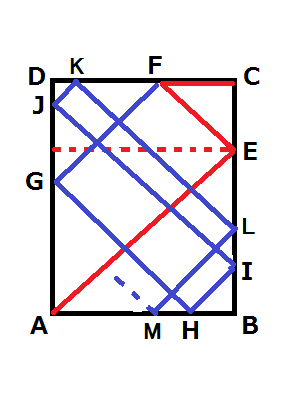
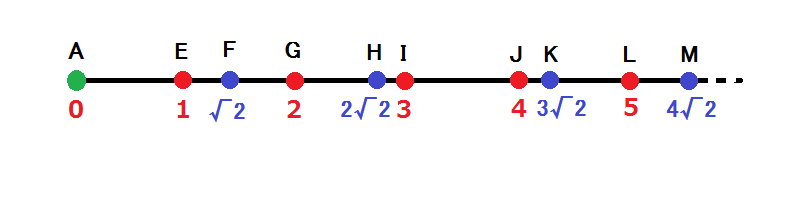
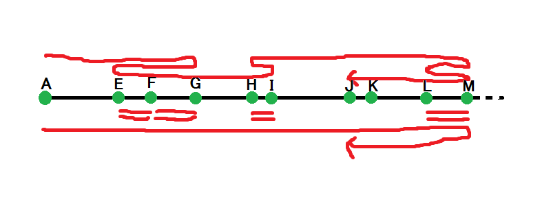
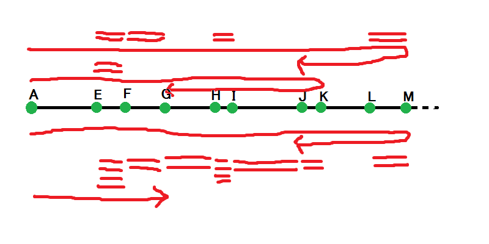
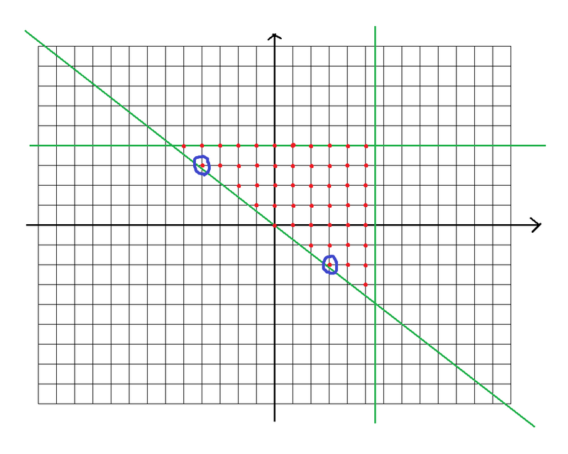
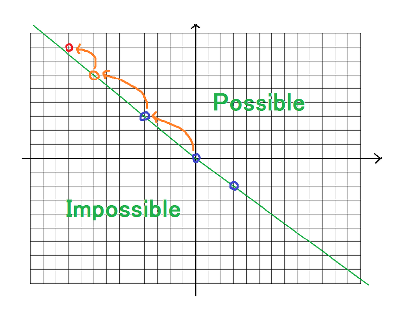

[TOC]

## [[AGC050A] AtCoder Jumper](https://www.luogu.com.cn/problem/AT_agc050_a)

考虑跳到 $2i \bmod n$ 和 $2i+1\bmod n$。注意这里 $n\bmod n=n$。

考虑为什么是对的，$x$ 走十步之后可以到 $1024x+i\bmod n,i\in[0,1024)$，显然可以走到所有位置。

## [[AGC050B] Three Coins](https://www.luogu.com.cn/problem/AT_agc050_b)

考虑如果只有三个硬币，那么从左到右位置 $\bmod 3$ 应该是 $012$、$120$ 或 $201$。这时充要的。

然后如果场上有超过 $3$ 枚硬币，那么充要条件就是，每一组都要满足上面的条件，然后任意两组要么不交，要么一组在另一组的两个硬币中间。

然后区间dp即可，复杂度 $\mathcal O(N^3)$。

## [[AGC050C] Block Game](https://www.luogu.com.cn/problem/AT_agc050_c)

这题就比较巧妙。

记 $(L,R)$ 为一个局面，$L$ 是左边可以走的房间数，$R$ 同理。$(L,R)$ 和 $(R,L)$ 显然等价。

初始状态是 $(+\infty,+\infty)$。若当前状态是 $(L,R)$，如果是 $\texttt S$ 那么可以变成 $(L\pm 1,R\mp 1)$ 或不变，如果是 $\texttt B$ 饥可以变成 $(\min(L,R),0)$。]

所以 $\texttt{B}$ 最多只有 $\log |s|$ 个。

所以可以计算 Snuke 胜利的串，倒序枚举，对于倒数第 $k$ 个 $\texttt B$ 到下一个 $\texttt B$ 至少要有 $2^{k-1}$ 个 $\texttt S$，然后就可以dp了，记录一下当前有几个 $\texttt{B}$ 即可。

复杂度 $\mathcal O(|s|\log|s|)$。

## [[AGC050D] Shopping](https://www.luogu.com.cn/problem/AT_agc050_d)

只要，设完状态，暴力就好了。

设 $f_{x,y,z,m}$ 表示当前是第 $m$ 轮，还剩下 $x+1+y$ 的人，我们要计算第 $x+1$ 人最后拿到东西的概率，现在轮到第 $z$ 人。

第 $z$ 人会在 $K-m+1$ 个商品中选，其中有 $K-N+x+y+1$ 个还没有选过。也就是能拿到东西润的概率是 $(K-N+x+y+1)/(K-m+1)$。

记忆化搜索，边界条件是 $m>K$ 或 $N-(X+Y+1)= K$ 返回 $0$。

复杂度 $\mathcal O(N^4)$。

## [[AGC050E] Three Traffic Lights](https://www.luogu.com.cn/problem/AT_agc050_e)

令 $t_i=g_i,l_i=g_i+r_i$。

然后 $T=l_1l_2l_3,L=\mathrm{lcm}(l_1,l_2,l_3)$。我们只计算 $[0,L)$ 内的答案，最后乘上 $T/L$。

我们记 $(m_1,x_1,m_2,x_2,m_3,x_3)$ 合法当且仅当 $\exist t\in[0,\mathrm{lcm}(m_1,m_2,m_3)),\forall i\in\{1,2,3\},t\equiv x_i\bmod m_i$。

$[0,L)$ 内的答案实际上就是：
$$
\sum_{\forall i\in\{1,2,3\},x_i<t_i}[(l_1,x_1,l_2,x_2,l_3,x_3)\ \text{合法}]
$$
这个还是不好做。记 $\mathrm{ord}_pn$ 表示最大的 $a$ 满足 $p^a|n$，有结论：

> 若 $\mathrm{ord}_pm_1>\max(\mathrm{ord}_pm_2,\mathrm{ord}_pm_3)$，则 $(m_1,x_1,m_2,x_2,m_3,x_3)$ 合法当且仅当 $(m_1/p,x_1,m_2,x_2,m_3,x_3)$ 合法。

考虑证明。首先一个显然的结论是，如果对于任意素数 $p$，$(p^{\mathrm{ord}_pm_1},x_1,p^{\mathrm{ord}_pm_2},x_2,p^{\mathrm{ord}_pm_3},x_3)$ 合法，则 $(m_1,x_1,m_2,x_2,m_3,x_3)$ 合法。最后只需要用中国剩余定理合并一下即可。

然后 $(p^{a_1},x_1,p^{a_2},x_2,p^{a_3},x_3)$ 合法的充要条件是 $\forall i,j\in\{1,2,3\},x_i\equiv x_j\bmod p^{\min(a_i,a_j)}$。

那么如果 $\mathrm{ord}_pm_1>\max(\mathrm{ord}_pm_2,\mathrm{ord}_pm_3)$，那么让 $m_1$ 除 $p$ 合法性显然不变。

然后我们就能通过这个得到一组 $l_1',l_2',l_3'$ 使得对于任意 $x_1,x_2,x_3$，$(l_1,x_1,l_2,x_2,l_3,x_3)$ 合法性和 $(l_1',x_1,l_2',x_2,l_3',x_3)$ 相同。并且 $\mathrm{ord}_pm_i\le\max_{j\ne i}\mathrm{ord}_pm_j$。

这个有什么用呢。手玩一下发现，我们可以找到一组 $g,a,b,c$ 满足 $l_1'=gab,l_2'=gac,l_3'=gbc,n=\mathrm{lcm}(l_1',l_2',l_3')=gabc$。不妨设 $l_1'\le l_2'\le l_3'$，即 $a\le b\le c$，最后的答案就是：
$$
\sum_{i\in[0,n)}\prod_{j=1}^3\sum_{k\in[0,t_j)}[k\equiv i\bmod l_j']
$$
化简一下就是：
$$
\sum_{i\in[0,n)}\prod_{j=1}^3\left\lfloor\frac{t_j}{l_j'}\right\rfloor+[i\bmod l_j'<t_j\bmod l_j']
$$
拆项。考虑：
$$
\sum_{i\in[0,n)}\prod_{j=1}^3[i\bmod l_j'<t_j\bmod l_j']
$$
的项。其他项难度显然严格低于此部分。

满足 $i\bmod l_2'<t_2\bmod l_2'$ 的 $i$ 是 $a$ 个区间，$i\bmod l_3'<t_3\bmod l_3'$ 的是 $b$ 个区间，所以满足这两个条件的是 $\mathcal O(a+b)$ 个区间，对于每个区间可以 $\mathcal O(1)$ 计算有多少个满足 $i\bmod l_1'<t_1\bmod l_1'$。

$a\le b\le \sqrt{bc}\le \sqrt{2\times 10^{12}}$，可以通过。

## [[AGC050F] NAND Tree](https://www.luogu.com.cn/problem/AT_agc050_f)

这个膜 $2$ 就很厉害。

当 $n$ 为偶数时，暴力枚举第一次操作。接下来只考虑 $n$ 为奇数，也即是合并次数为偶数的情况。

我们考虑找到最小的 $i$ 使得 $2i-1$ 次和 $2i$ 次相互不影响，交换之后不影响树的样子，那么交换之后和交换之前抵消了，不影响答案。

考虑什么叫做相互影响。首先一定要边有公共点。不妨设为 $(x,y)$ 和 $(y,z)$，那么两种顺序分别是 $\mathrm{NAND}(\mathrm{NAND}(c_x,c_y),c_z)$ 和 $\mathrm{NAND}(\mathrm{NAND}(c_z,c_y),c_x)$。

如果 $c_x=c_z$ 那么得到的树是一样的直接抵消了。否则一定是不一样的。

然后我们就可以换一种合并边的方式：每次选择一条链 $x\leftrightarrow y \leftrightarrow z$，满足 $c_x\ne c_z$，缩成一个点，点权任意。我们把可以自选的点叫做自由点。

考虑如果有自由点参与合并

- 如果 $y$ 是自由点，那么 $y$ 两种选择最后得到了相同的树，然后抵消掉了。

- 如果 $x,z$ 都是自由点，那么选择 $01$ 和 $10$ 也能抵消掉。
- 否则只有 $x$ 是自由点，必须选择和 $z$ 不同的。

也就是说我们禁止自由点作为 $y$，禁止两边都是自由点。

所以发现操作使得自由点的数量是不降的，最后要只剩下一个点，所以除了第一次之后每一次都要把自由点当做链的一端。

因此我们钦定第一次合并时的 $x$，满足 $c_x=1$，那么就是有根树，我们要计算拓扑序 $a_1,\dots,a_n$ 的组数满足：

- $c_{a_3}=0$
- $a_{2i}$ 是 $a_{2i+1}$ 的父亲

但是很妙的一点是这两个条件都可以删去。

先考虑第二点，找到第一个 $a_{2i}$ 不是 $a_{2i+1}$ 的父亲，交换这两个，抵消。

然后考虑第一点，如果 $c_{a_3}=1$，那么所有情况和以 $a_3$ 为根，第三个为 $x$ 的情况抵消。

所以就是拓扑序数量，$n!/\prod sz_i$。

只要求膜 $2$ 的值所以计算每个含有多少个 $2$ 即可。

朴素实现 $\mathcal O(N^3)$，简单换根 $\mathcal O(N^2)$。

## [[AGC051A] Dodecagon](https://www.luogu.com.cn/problem/AT_agc051_a)

考虑边长为 $\{e_1,e_2,e_3,\dots,e_{11},e_{12}\}$ 的十二边形，围一圈变成 $\{e_1,e_2-1,e_3,\dots,e_{11},e_{12}-1\}$ 或 ${\{e_1-1,e_2,e_3-1,\dots,e_{11}-1,e_{12}\}}$，最后变成 $\{0,0,0,\dots,0,0\}$。

所以方案数是 $\binom{2n}n$。考虑第一次两种操作是等价的，所以要乘 $\frac12$。

## [[AGC051B] Bowling](https://www.luogu.com.cn/problem/AT_agc051_b)

考虑一个构造：
$$
\{(Ai+Bj,Bj+Ck)|i,j,k\in[0,10)\}
$$
要这个构造满足，只需要 $Ai+2Bj+Ck$ 互不相同。

取 $A=1,B=100,C=10$ 即可。

## [[AGC051C] Flipper](https://www.luogu.com.cn/problem/AT_agc051_c)

考虑过程中的不变量。

设 $p_{a,y}=\bigoplus_x a_{x,y}$，$q_{a,y,i}=\bigoplus_{x\equiv i\pmod 3}a_{x,y}$。

先不加证明地给出结论，$a$ 能变成 $b$ 的充要条件是：

- $\forall y,p_{a,y}=p_{b,y}$
- $\forall x,(q_{a,x,0}\oplus q_{b,x,0})=(q_{a,x,1}\oplus q_{b,x,1})=(q_{a,x,2}\oplus q_{b,x,2})$

显然是必要的。考虑为什么充分。一个简单的证明就是过程可逆，尝试把 $a$ 和 $b$ 变成同一种状态。过程就是每一次选择一个字典序最大的 $(x,y)$ 满足 $x\ge 2,y\ge 3,a_{x,y}=1$，操作 $(x-1,y-2)$。分析最后的状态：

- $x\ge 2,y\ge 3$，此时显然有 $a_{x,y}=0=b_{x,y}$
- $x=1,y\ge 3$，此时这一列只有第一个有值，所以 $a_{1,y}=p_{a,y}=p_{b,y}=b_{1,y}$。
- $x\ge 2,y\le 2$，此时从第三列开始全是 $0$，所以 $q_{a,x,0}=q_{b,x,0}=0$，所以 $a_{x,1}=q_{a,x,1}=q_{b,x,1}=b_{x,1}$，同理 $a_{x,2}=b_{x,2}$。
- $x=1,y\le2$，第一列 $p_{a,1}=p_{b,1}$，下面部分又全部相等了，所以 $a_{1,1}=b_{1,1}$，同理 $a_{1,2}=b_{1,2}$。

以上我们证明了是充分的。考虑最后的网格是 $b$，如果我们暴力枚举了每一行的 $q_{a,x}$ 是否要翻转得到得到了 $q_{b,x}$，那么此时的答案是：
$$
\sum_{i=0}^2\max(\sum_{y\equiv i\pmod 3}p_{b,y},\sum_{x}q_{b,x,i})
$$
注意我们需要满足 $\bigoplus_{y\equiv i\pmod3}p_{b,y}=\bigoplus_xq_{b,x,i}$。

构造到下限是容易的。对于 $p_{b,y}=1$ 且 $q_{b,x,i}=1$ 且 $(y\equiv i\pmod 3)$，直接在 $(x,y)$ 放即可满足两个。剩下的放到 $(x,\infty)$ 或 $(\infty,y)$ 即可。由于异或相等所以必然剩余偶数个是合法方案。

然后就是暴力翻转显然是不可行的。一个简单的方案就是对于 $1$ 的个数 $\ge 2$ 的 $q_{a,x}$，我们先强制翻转，记这之后前面三个值分别为 $X,Y,Z$，后面三个值分别为 $x,y,z$，我们每次可以翻转一个只有一个 $1$ 的变成有两个 $1$，也就是在 $x,y,z$ 中选择一个减一，其他加一。可能这样的操作不一定是合法的但是最优解一定是合法的。要最小化 $\max(X,x)+\max(Y,y)+\max(Z,z)$。

然后就相当于最小化 $\sum_{i=0}^2\max(a_i,0)$，每次把最大的减 $1$，其他加 $1$，不停操作直到不变小。

最后如果 $a_0\not\equiv 0\bmod 2$，还需要再操作一次。

复杂度 $\mathcal O(n\log)$

## [[AGC051D] C4](https://www.luogu.com.cn/problem/AT_agc051_d)

欧拉回路计数嘛，度数不是偶数就可以输出 $0$ 了。

然后无向图我们不会但是有向图我们会啊。有BEST定理：

>对于有向图 $G=(V,E)$，图的欧拉回路数量 $ec(G)$ 为：
>$$
>ec(G)=t_s(G)\prod_{v\in V}(\deg_v-1)!
>$$
>其中 $t_s(G)$ 表示以任意一点为根的外向树数量。

因此如果我们变成有向边就能做了。

不妨设 $1\to 2,2\to 3,3\to 4,4\to 1$ 的次数分别为 $a,b,c,d$，那么 $2\to 1,3\to2,4\to3,1\to4$ 就分别为 $A-a,B-b,C-c,D-d$。因为出度和入度相等所以 $a$ 固定后 $b,c,d$ 也固定了，只需要枚举 $a$ 即可。

然后有向边，我们可以 $\mathcal o(1)$ 得到 $ec(G)$，但是还不能统计进答案。考虑两点

- BEST定理给出的是无起点欧拉回路条数，我们要求得是有起点，所以要乘上 $deg_1$ 表示从 $1$ 出来第一步走了哪条边
- 每种边实际上是不作区分的，所以要乘上 $1/(a!b!c!d!(A-a)!(B-b)!(C-c)!(D-d)!)$

然后累加进答案即可。复杂度 $\mathcal O(A)$。

## [[AGC051E] Middle Point](https://www.luogu.com.cn/problem/AT_agc051_e)

首先 $Q$ 能被搞出来的条件是存在一组 $w_i$ 形如 $*/2^*$，且 $w_i\ge 0$，$\sum w_i=1$，$\sum w_iP_i=Q$。

然后我们给出如下结论：

- 凸包外面的点不可能构成
- 凸包边界的点只能用两边的点构成
- 凸包内部的点可以忽略 $w_i\ge0$ 的限制。

前两点是显然的。考虑第三点。不妨假设我们要构成的点是 $Q$，且 $Q$ 是原点。（否则平移到原点）

那么我们的目的是证明：

- 存在一组非负整数 $c_i$ 满足 $\sum c_iP_i=0$ 且 $\sum c_i$ 为 $2$ 的幂

和

- 存在一组整数 $d_i$ 满足 $\sum d_iP_i=0$ 且 $\sum d_i$ 为 $2$ 的幂

等价。也就是说我们需要找到一个用 $d_i$ 构造 $c_i$ 的方法。官方题解的方法是找到一组正整数 $e_i$ 满足 $\sum e_iP_i=0$，因为在凸包内部所以必然能找到一组正有理数解，乘上分母的 $\rm lcm$ 就是正整数解。找一个足够大的 $t$ 使得 $s\sum d_i+t\sum e_i$ 是 $2$ 的幂，且 $sd_i+te_i\ge0$。

总之通过上面的构造我们知道内部的点不需要限制 $w_i\ge 0$ 。我们还知道如果把一个点移到原点我们还不需要限制 $\sum w_i=1$。

如果 $w_i$ 都是整数可以构造出哪些点？这个问题可以用辗转相除得到两个向量 $A=(a,b),B=(c,0)$ 使得 $\{\sum w_iP_i|w_i\in\mathbb Z\}$ 和 $\{Am+Bn|m,n\in\mathbb Z\}$ 是相同的。具体的实现流程可以看代码。

但是 $w_i$ 可以是 $*/2^*$ 的形式，不难发现把 $\mathbb Z$ 换成 $W=\{a/2^b|a\in\mathbb Z,b\in\mathbb N\}$ 上面两个集合还是相同的。

以 $B,A$ 为基底建立新坐标系，新坐标系的点 $(x,y)$ 在原来的坐标系中是 $xB+yA$，也就是 $(ay+cx,by)$。

记 $\alpha=\mathrm{ord}_2a,\beta=\mathrm{ord}_2b,\theta=\mathrm{ord}_2c$，我们希望在原坐标系中也是整数，所以首先 $by$ 要是整数，也就是说 $y$ 是 $2^{-\beta}$ 的倍数。但是 $ay+cx$ 不好处理。考虑如果 $\alpha\ge\beta$，那么 $by$ 为整数时 $ay$ 也一定为整数，所以只要考虑 $cx$ 也就是 $x$ 是 $2^{-\theta}$ 的倍数。

但是如果 $\alpha<\beta$，但是 $\theta\le\alpha$，我们可以不断给 $A$ 加上 $B$ 使得最终的 $\alpha\ge\beta$。

但是如果 $\alpha<\min(\beta,\theta)$ 咋办呢？一个很高妙的方法就是交换 $x$ 轴和 $y$ 轴对 $A,B$ 重新辗转相除，可以断定之后一定会有 $\alpha\ge \min(\beta,\theta)$。

然后我们只需要考虑新的坐标系下，凸包内部有多少 $x$ 是 $2^{-\theta}$ 的倍数，$y$ 是 $2^{-\beta}$ 的倍数的点即可。

横坐标乘 $2^{\theta}$，纵坐标乘 $2^{\beta}$，就是要求凸包内部有多少整点。

这个问题是简单的。用皮克定理即可计算内部的整点数量。

时间复杂度 $\mathcal O(n\log n)$。

## [[AGC051F] rng_58's Last Problem](https://www.luogu.com.cn/problem/AT_agc051_f)

翻译一下官方题解。

首先我们可以换一种描述问题的方式：有一个 $1\times \sqrt2$ 的矩形，你从 $(0,0)$ 出发，可以以 $(0,\pm1),(\pm1,0),(\pm1,\pm1)$ 的速度走，碰到墙壁可以改变速度，问碰到墙壁时可以得到多少种时间。

然后这个问题还是不好描述。我们把 $A-E-F-G-H-I-J-K-\cdots$ 这些点拿到数轴上，变成下面这样：

然后我们可以重新描述这这个问题：可以走若干次，从 $A$ 出发，到一个点就变换方向，求最后的总时间。

这个怎么理解呢？首先考虑走一次的意义就是每次碰到墙壁要么转弯，要么往回走（一直斜着走）。有一个小问题就是这样没有考虑横走/竖走的情况，如果你横走/竖走没有到顶点的话，那么就相当于直接翻了一个沙漏。然后如果走到顶点就相当于重新从 $A$ 出发。然后至于为什么可以走若干次就是每一次最后一步改成横走或竖走走到顶点重新开始。

然后呢就是我们可以把一次行程看做是走到最远的地方，走回来，加上若干段出现两次的，类似下图

然后走多次我们可以只保留最远的那一次，剩下若干两次的，以及单走 $a$ 和单走 $a\sqrt 2$，类似下图：

这个问题已经形式化很多了。我们甚至可以给出一个初步的判断式。设 $z_0,z_{1},z_2,\dots,$ 是所有自然数和所有 $\sqrt2$ 的倍数排完序的结果，那么一个合法的时间满足：
$$
T=2z_q-z_p+2\left(\sum_{i=0}^{q-1}(z_{i+1}-z_i)c_i\right)+r+s\sqrt 2
$$
其中所有 $p,q,c_i,r,s$ 均为自然数，$p\le q$。

于是我们有了初步的判断方法：枚举 $p,q$，然后用 $r,s\in\{0,1\}$ 调整使得 $T-2z_q+z_p-r-s\sqrt2$ 系数为偶数，判断能否被 $\sum_{i=0}^{q-1}(z_{i+1}-z_i)c_i$ 构造出来。

然后又是很巧妙的一步。考虑一个坐标系，点 $(x,y)$ 表示 $x+\sqrt 2y$。画出 $x\le z_q$、$\sqrt2y\le z_q$ 和 $x+\sqrt2y\ge0$。 就类似于下图：

所有的红点就是所有 $0\le i\le j\le q$，$z_j-z_i$ 的值。现在就是问这些向量可以组成哪些向量。

一个结论是分别找到两个蓝点，也就是斜率的极值点，结论就是要在原点和蓝点的连线上方就一定能构成，否则一定不能构成。

至此，我们得到了一个确定性的判断方法。

考虑优化以上方法。不妨假设询问的 $T=x+\sqrt 2y$ 满足 $x>0,y<0$，那么我们可以枚举可行的区域。对于一个区域，我们找到最小的 $z_q$，然后此时 $z_p$ 取 $z_q$ 或者离 $z_q$ 最近的和 $z_q$ 不同类的。对于右下方的蓝点是 $(tx,-ty)$ 的情况，就是 $z_q=z_p=tx$ 或 $z_q=tx,z_p=\sqrt2ty$。然后调整一下使得系数变成偶数再判断是否在区域内即可。

$x<0,y>0$ 的情况也是类似的。

最后就是一个问题，如何求出所有不同的区域。考虑类似 Stern-Brocot Tree，初始是 $0/1$ 和 $1/0$，每次在 $a/b$ 和 $c/d$ 中间插入 $(a+c)/(b+d)$，不断逼近 $\sqrt 2$，这中间出现的分数就对应一个蓝点的坐标。这也说明了不同的区域个数是 $\log MAX$ 级别的。

最后的复杂度为 $\mathcal O(T\log MAX)$。

## [[AGC052A] Long Common Subsequence](https://www.luogu.com.cn/problem/AT_agc052_a)

$$
\overbrace{\texttt0\dots\texttt0}^N\overbrace{\texttt1\dots\texttt1}^N\texttt0
$$

即可。

## [[AGC052B] Tree Edges XOR](https://www.luogu.com.cn/problem/AT_agc052_b)

把边权变成点权，每一条边的值是两边的点权的异或。一次操作就相当于交换两个相邻的点权。

然后如果确定 $a_1$，所有的点权都是确定的。我们计算了初始的一种点权 $a_1,\dots,a_n$ 和最后的点权 $b_1,\dots,b_n$，我们就是要找到一个 $x$ 使得 $a_1,\dots,a_n$ 和 $b_1\oplus x,\dots,b_n\oplus x$ 通过重排后相同。

一个必要条件是 $a_1\oplus \dots\oplus a_n\oplus (b_1\oplus x)\oplus\dots\oplus (b_n\oplus x)=0$，此时可以唯一确定 $x$。

复杂度 $\mathcal O(n\log n)$。

## [[AGC052C] Nondivisible Prefix Sums](https://www.luogu.com.cn/problem/solution/AT_agc052_c)

首先一个好的数组，所有元素的和不能是 $P$ 的倍数。接下来只考虑和不为 $P$ 的倍数的数组。

假设 $1$ 是出现次数最多的元素，出现了 $N-M$ 次（如果不是 $1$ 乘上最多的数的逆元即可），剩下的数为 $B_1,B_2,\dots,B_{M}$，那么有解的充要条件是：
$$
N-M\le(P-B_1)+(P-B_2)+\dots+(P-B_M)+P-1
$$
 必要性是显然的，考虑如果不满足，则 $\sum A_i=N-M+\sum B_i\ge (M+1)P$，又因为不为 $P$ 的倍数所以至少是 $(M+1)P+1$，跨过 $P,2P,\dots,(M+1)P$ 的时一定不能用 $1$，但是不为 $1$ 的只有 $M$ 个所以就寄了。

然后充分性，考虑一种构造方法，设 $x$ 是当前众数，$sum$ 为已经确定的和

- 如果 $sum+x\not\equiv0\pmod P$，那么在末尾附加 $x$
- 否则取任意不为 $x$ 的元素 $y$，在末尾加上 $y,x$

可以证明这个算法不会寄。假设寄了，那么一定是 $sum+x\equiv 0\pmod P$ 且剩下的数只有 $x$。然后因为和不是 $P$ 的倍数所以至少有两个。不难发现这个过程中，如果一个数是众数，那么之后它的个数不会比众数的个数少超过 $1$，因此可以断定 $x=1$，且 $1$ 一直是众数。

所以情况现在是这样的：
$$
\overbrace{1,\dots,1}^{P-1},B_1,\overbrace{1,\dots,1}^{P-B_1},B_2,\overbrace{1,\dots,1}^{P-B_2},\dots,B_M,\overbrace{1,\dots,1}^{P-B_M},\overbrace{1,1}^{\ge2}
$$
 但是这个不满足上面的条件。所以我们断定不会出现这种情况。

这样我们就证明了条件的充分性。

然后计数就简单了。首先考虑和不为 $P$ 的数组怎么计算。不妨设 $a_n$ 为和为 $P$ 的倍数的长度为 $n$ 的数组数量，$b_n$ 为不为 $P$ 的倍数的长度为 $n$ 的数组数量 $/(P-1)$，也就是对任意 $1\le y<P$，$\sum A_i\equiv y\pmod P$ 的方案数，有转移：
$$
\begin{aligned}
&a_{n+1}=(P-1)b_n\\
&b_{n+1}=a_n+(P-2)b_n
\end{aligned}
$$
意义是显然的。

最后我们得到 $(P-1)b_N$ 表示长度为 $N$ 的非 $P$ 倍数的个数。然后考虑减去不符合条件的。

设 $f_{i,j}$ 表示 $\sum_{j=1}^i P-B_i=j$ 的 $\{B_1,\dots,B_i\}$ 数量。这个就是一个背包，然后答案就是：
$$
\sum_{i=0}^N\sum_{j=0}[N-i-j\not\equiv 0\pmod P][N-i>j+P-1]f_{i,j}\binom Ni(P-1)
$$
前两个条件就是和不为 $p$ 的倍数且不符合条件，然后乘 $\binom Ni$ 表示选出不为 $1$ 的位置，然后因为众数不一定为 $1$ 所以还要乘上 $p-1$。这个不会算重是因为此时的众数一定是绝对众数了。

因为有用的 $j$ 的值域是 $\mathcal O(N)$ 的所以复杂度 $\mathcal O(N^2)$。

## [[AGC052D] Equal LIS](https://www.luogu.com.cn/problem/AT_agc052_d)

考虑求出原序列的 $\rm LIS$ 长度为 $L$。求出以 $i$ 结尾的最长上升子序列为 $f_i$。

- 如果长度为偶数 $L=2k$，那么把 $f_i\le k$ 的分给第一个，否则分给第二个。

  考虑为什么是正确的。首先都 $\ge k$，因为最长上升子序列的前半在第一个，后半在第二个

  然后也都 $\le k$，第一个是显然的，第二个如果 $>k$ 的话那么 $L>2k$。

  所以是正确的。

- 否则长度为 $L=2k+1$，试图构造两个都为 $k+1$

  充要条件是存在一个 $x$，使得一个 $\rm LIS$ 不包含它，并且存在一个上升子序列长度为 $k+1$ 且包含 $x$。

  必要性是显然的。充分性的证明考虑包含 $x$ 的子序列为 $A_1,\dots,A_{k+1}$，先放进第一个，然后如果 $f_i\ne f_{A_j}$ 那么就放进第二个，否则如果 $f_i=f_x$ 那么也放进第二个，否则放进第一个。

  类似的方法不得到两个都为 $k+1$。

复杂度 $\mathcal O(N\log N)$。

## [[AGC052E] 3 Letters](https://www.luogu.com.cn/problem/AT_agc052_e)

首先一个简单的结论是如果我们操作 $i$ 位置，那么 $S_{i-1}=S_{i+1}$，并且操作之后的结果是唯一的。

这样之后还是不好做，考虑找到一个数组 $A$ 满足：

- $|A_{i+1}-A{i}|=1$
- $A_i\equiv S_i\pmod 3$

$A_1$ 确定后实际上数组是唯一的，然后操作一次就相当于选择 $A_{i-1}=A_{i+1}$，然后 $A_i\pm 2$。

然后我们对于 $S,T$ 确定两个数组 $A,B$，满足 $A_i\equiv B_i\pmod 2$，那么最小操作次数为：
$$
\frac12\sum_{i=1}^N|A_i-B_i|
$$
 这个证明就考虑找一个 $A_i>B_i$ 的最大 $A_i$（否则就找 $A_i<B_i$ 的最小值，显然是等价的），那么显然 $A_{i-1}=A_{i+1}=A_i-1$，操作 $A_i$ 减二即可。取到下界。

然后就简单了，随便找一组 $A_i,B_i$ 满足条件且 $A_1\equiv B_1\pmod 2$，我们可以将所有 $B$ 都加上一个相同的 $6$ 的倍数，记 $C_i=A_i-B_i$，最小化：
$$
\sum_{i=1}^N |C_i-6k|
$$
经典结论。中位数上下取整试一试即可。

复杂度 $\mathcal O(N)$。

## [[AGC052F] Tree Vertices XOR](https://www.luogu.com.cn/problem/AT_agc052_f)

首先过程可逆没有任何问题。所以所有合法状态互相可达。

然后我们强制只能选择周围有奇数个 $1$ 的点翻转。

发现如果周围有 $s$ 个 $1$，那么翻转后连通块数量的变化是 $\pm(s-1)$，所以奇偶性不变。

所以我们得出两个必要条件：

- 连通块数量为奇数
- 存在一个点周围有奇数个点

接下来我们证明，在**存在一个点 $\deg\ge 3$ 且删去后存在 $\ge 2$ 个 $\ge 2$ 的连通块**的情况下，也是充分的。如果不想看dirty work可以直接跳到QED。

> **引理 $1.$** 若 $a_i=1$ 的导出子图非空且只有一个连通块，那么 $\{a_i\}$ 合法

这个每次扩展一个点就行了吧。

> **引理 $2.$** 将 $a_i=1$ 的所有连通块每个只保留一个点不影响合法性

这个也比较显然，就一个点可以用引理1的方法扩展到一个连通块。

因此我们现在只考虑 **不存在 $(x,y)\in E$，使得 $a_x=a_y=1$** 的图。我们有两种操作：

- **移动操作**：$a_x=1$ 且 $(x,y)\in E$，$y$ 周围没有其他 $1$，那么可以交换 $a_x,a_y$
- **合并操作**：$a_x=0$ 且周围有 $\ge 3$ 且为奇数个 $1$，那么可以周围全赋值为 $0$，$x$ 赋值为 $1$。

两者可以合并为 $x$ 周围有奇数个 $1$，可以把周围赋值为 $0$ 且 $x$ 赋值为 $1$。统称为**操作**。

我们希望当有 $>1$ 个 $1$ 时一定可以执行合并操作。继续证明。

> **引理 $3.$** 若一个点可以操作，若干次后可以改变 $a_{rt}$ 的状态

证明引理

1. $a_{rt}=0$
   1. 周围有奇数个 $1$，直接操作
   2. 否则递归进入可以操作的子树
2. $a_{rt}=1$，周围都是 $0$
   1. 其中一个儿子的儿子有偶数个 $1$，执行操作
   2. 否则可以操作的点在某个子树内部，归纳修改，再执行操作

> **引理 $4.$** 若一棵树不能操作，且 $a_{rt}=0$，存在至少一个 $1$，那么给 $rt$ 连一个 $1$ 的点就可以执行合并操作

证明引理

1. $rt$ 所有儿子均为 $0$，移动 $1$ 到 $rt$，归纳
2. 否则 $rt$ 有偶数个儿子为 $1$，$rt$ 现在可以合并了

接下来就可以证明最初的结论了。选择一个满足 $\deg\ge 3$ 且删去后有至少两个 $\ge 2$ 的连通块的 $rt$。如果 $a_{rt}=1$ 就用引理 $3$ 翻转 $rt$。现在 $a_{rt}=0$，有 $>1$ 个奇数个 $1$，至少有一个点可以操作，我们希望进行合并操作。先对 $rt$ 为 $1$ 的儿子分类讨论：

1. 为偶数。任选一个可以操作的子树，翻转一个儿子的值，变为奇数

2. 为奇数且 $\ge 3$，对 $rt$ 执行合并操作

3. 只有一个儿子为 $1$，继续对不为 $1$ 的儿子分类讨论：

   1. 存在两个可以操作，翻转之后合并

   2. 有一棵子树不全为 $0$ 且无法操作，把 $1$ 移动到 $rt$ 然后用引理 $4$ 合并

   3. 否则至多一个儿子可操作，其余全是 $0$。因为有 $\ge 2$ 个 $\ge 2$ 的子树，我们可以把 $1$ 移到一个 $\ge 2$ 的全 $0$ 子树。

      若满足前两点，就可以合并了。否则其它子树最多有一个可以操作并且其他全为 $0$。

      假如没有可以操作的子树，那么就只有一个 $1$ ，已经结束了。

      否则有可操作子树，通过引理 $3$ 使得子树的根为 $1$，原来的 $1$ 下移一步，新的 $1$ 移到一棵全为 $0$ 的子树，原来的 $1$ 所在的子树肯定是可以操作的，再分类讨论：

      1. 原来的 $1$ 和新的 $1$ 出来的子树都能操作，那么就是上面的情况 $1$。
      2. 新的 $1$ 出来的子树现在不全为 $0$ 且无法操作，那么就是上面的情况 $2$。
      3. 否则新的 $1$ 出来的子树也全部为 $0$，现在只有两个 $1$，和有奇数个 $1$ 矛盾。

以上，我们证明了一定可以不断合并使得变成一个 $1$，从而证明了结论的正确性。

QED.

那么对于符合这种条件的树就可以计算了。设 $f_{u,0/1,0/1,0/1,0/1}$ 表示 $u$ 的子树，$a_u$，$\oplus_{v\in son_u}a_v$，当前连通块个数的奇偶性，除了 $u$ 是否存在可以操作的点。合并手玩一下即可。复杂度 $\mathcal O(N)$。

如果不满足上面的情况，树的结构是简单的，是一条链，两个端点连出若干片叶子。不妨设链的点数为 $l$，分别连出 $x,y$ 片叶子（$x,y\ge1$）。

对于这种情况，如果 $\{a_i\}$ 可以变成全 $1$，我们可以断言存在一种方案使得不会把端点的值从 $1$ 变成 $0$。我们强制不能够两次翻转同一个点的值，这样是没有意义的。然后假如出现了端点从 $1$ 变成 $0$，找到最后一次，假设是左端点，那么最后要是 $1$，所以肯定要 $1\to0\to1$，然后直接翻转回来已经被我们 ban 掉了，所以右边的点肯定要先翻转，然后翻转回来，然后右边第二个点也是同理，最后我们得出右端点需要翻转再翻转回来，这和这是最后一次 $1\to 0$ 矛盾，所以不会存在这样的情况。

然后统计可行的情况就简单了：

1. 两个端点为 $1$，那么外面的叶子可以随意选，然后链上需要全部是 $1$，不然链上有若干个连续段，操作无法减少连续段的个数就寄了。方案数 $2^{x+y}$。
2. 两个端点只有 $1$ 个 $1$，假设是左端点，那么左端点连出的叶子是随意选，然后链上的 $1$ 不断操作要能够使得右端点翻转，所以右端点连出的叶子有偶数个 $1$，然后左端点到右端点的 $1$ 是一段连续的。所以这部分的方案数为 $2\times(l-1)\times 2^{x+y-1}$。
3. 否则两个端点都是 $0$，那么一定是中间有一段连续的 $1$，两个端点接偶数个 $1$。所以方案数为 $\binom {l-1}2\times2^{x+y-2}$。

复杂度 $\mathcal O(N)$。

## [[AGC053A] >< again](https://www.luogu.com.cn/problem/AT_agc053_a)

首先 $k=\min |A_i-A_{i+1}|$

然后构造就是对于 $j=0\sim k-1,B_{j,i}=\lfloor(A_i+j)/k\rfloor$。

## [[AGC053B] Taking the middle](https://www.luogu.com.cn/problem/AT_agc053_b)

Aoki第 $i$ 次拿的是 $[N-i+1,N+i]$ 中的牌。

每次选可选范围内最小的没有选过的牌。

剩下的就是Takahashi拿到的牌。

## [[AGC053C] Random Card Game](https://www.luogu.com.cn/problem/AT_agc053_c)

设 $2N$ 在第二堆，那么取完的肯定是第一堆。设 $p_i=\min_{B_j>A_i}j$，那么次数就是 $n+d$，其中 $d=\min p_i-i$。

这个证明就考虑每一次要么删除一个 $A$ 的数，要么使得 $d$ 减去 $1$。

然后就是设 $P(d)$ 表示 $\le d$ 的概率，最后求 $\sum _{d=0}^{n-1}(P(d)-P(d-1))(n+d)$。

然后求 $P(d)$，就是相当于 $i=1,\dots,n-d$ 不是 $A_1,\dots,A_i,B_1,\dots,B_{i+d}$ 里最大的，$i=n+d-1,\dots,n$ 不是 $A_1,\dots,A_i,B_1,\dots,B_n$ 里最大的。概率为：
$$
P(d)=2\times\prod_{i=1}^{n-d}\frac{2i+d-1}{2i+d}\prod_{i=n-d+1}^{n}\frac{n+i-1}{n+i}
$$
可以 $\mathcal O(n)$ 预处理后 $\mathcal O(1)$ 得到 $P(d)$。

## [[AGC053D] Everyone is a winner](https://www.luogu.com.cn/problem/AT_agc053_d)

题目减一变成 $0,1,2$。

首先第 $i$ 个人 $1\sim i$ 题降序做 $i+1\sim n$ 题降序做。

然后我们先得到所有人全部降序做时前 $i$ 题最快时间 $T_i$。

然后从 $n$ 到 $1$ 枚举 $i$。找到一组 $0\le x\le A_i,0\le y\le B_i,0\le z\le C_i$ 使得 $x+y+z=i,y+2z\le T_i,(y+2z,z)$ 最大。如果找不到就无解。

否则做题顺序就是 $z,y,x,C_i-z,B_i-y,A_i-x$。然后计算 $f_{i,j}$ 表示调整后前 $j$ 题的时间，$1\le j<i$，更新 $T_j=\min(T_j,f_{i,j})$。

上面对于 $i<j$，一定有 $f_{j,i}\ge f_{i,i}$。但是为什么 $f_{j,j}\le f_{i,j}$ 不会证。摆摆摆。

## [[AGC053E] More Peaks More Fun](https://www.luogu.com.cn/problem/AT_agc053_e)

不妨假设 $A_i<B_i$，$B_{i}<B_{i+1}$。

考虑一个合法的排列等价于存在 $k\in[1,n]$ 满足：$i\in[1,k-1],B_i>A_{i+1},i\in[k+2,n],A_{i-1}<B_i$。

称顺序加入为 $A_i,B_i$，逆序加入为 $B_i,A_i$

充分性：$[1,k]$ 顺序加入，$[k+1,n]$ 逆序加入。

必要性：$i$ 和 $i+1$ 一个顺序一个逆序那么两个 $B$ 中有且仅有一个为峰，那么为了 $N-1$ 个峰必须是一段顺序，一段逆序。

那么我们可以取 $k=\min_{1\le i\le n,A_{i+1}>B_i}i$，约定 $A_{n+1}=+\infty$，判断后者是否成立。

对于 $k=n$ 的情况，设 $U_i=\sum_{j=i+1}^n[A_j<B_i]$，从后往前插入，可以插入的位置有 $U_i+1$ 个，$1$ 是插入末尾，否则插入一个 $A_j<B_i$ 的 $j$ 前面。也就是 $\prod_{i=1}^nU_i+1$。

否则假设 $k$ 和 $k+1$ 分别是 $x$ 和 $y$，因为 $A_y>B_x$，所以 $x<y$。然后翻转 $[k+1,n]$ 就相等于找两个序列，结尾分别是 $x$ 和 $y$，要求和上面一样。方案数就是 $\prod_{i=1}^{x-1}U_i\prod_{i=x+1}^{y-1}U_i+1\prod_{i=y+1}^nU_i+2$。

然后就可以做了。复杂度 $\mathcal O(n\log n)$。

## [[AGC053F] ESPers](https://www.luogu.com.cn/problem/AT_agc053_f)

首先一个简单的算法就是找到最后一次两个票数相同，那么之前的ESPers赢得概率为 $\frac12$，后面的必赢。设 $Y$ 为之前的人数除 $K$，我们要求 $Y$ 的期望 $E(Y)$，答案就是 $1-E(Y)/2$。

然后我们设 $S$ 表示一次投票过程，$P(S)$ 为概率，$Y(S)$ 为对应的值，那么要求：
$$
E(Y)=\sum_SP(S)Y(S)
$$
然后对一个 $S$，构造一个序列 $\{a_i\}$：

1. 第 $i$ 次投票给严格更多的或投票者为ESPer，则 $a_i=1$
2. 第 $i$ 次投给严格更少的人，则 $a_i=-1$
3. 否则相等且不是ESPer，那么 $a_i$ 等概率在 $\pm1$ 中选择。

$Q(S,a)$ 为 $S$ 得到 $a$ 的概率，那么就是：
$$
\sum_SY(S)P(S)\sum_aQ(S,a)=\sum_a\sum_SY(S)P(S)Q(S,a)
$$
将 $\{a_i\}$ 表示成 $A_0,-1,A_1,-1,\dots,A_x,1,A_{x+1},1\dots,A_{x+y}$ 的形式（每个 $A_i$ 和为 $0$ 且前缀和非负，允许为空）。显然是唯一的，每次选最长的串串。

考虑每部分的贡献：

1. ESPer可以出现在为 $1$ 的位置，贡献为 $\binom{(2N+1-x+y)/2}K/\binom{2N+1}K$
2. 其余每个人，投票时票数不同，对 $P(S)$ 有 $\frac12$ 贡献，否则对 $Q(S,a)$ 有 $\frac12$ 贡献，贡献为 $1/2^{2N+1-K}$
3. $x$ 是偶数则最后一次相等是 $A_x$ 末尾否则是 $A_{x-1}$ 末尾。最后一次相等之前 $1$ 的期望个数为 $(x+[x\equiv0\bmod 2])(2N+1-x-y)/(x+y+1)/2$，因为所有 $A_i$ 是等价的，总的 $1$ 的个数为 $(2N+1-x+y)/2$，所以贡献为 $(x+[x\equiv0\bmod 2])(2N+1-x+y)/(x+y+1)/(2N+1-x+y)$。
4. 然后 $A$ 的方案数就相当于长为 $x+y+2N+1$ 初始有 $x+y$ 个左括号的括号序列方案数，相当于从 $(x+y,0)$ 走到 $((2N+x+y+1)/2,(2N+x+y+1)/2)$ 并且不能走到 $x=y$ 上方。经典套路，对 $x+1=y$ 翻转终点得到的所有方案数就是不合法的，所以就是 $\binom{2N+1}{(2N+1-x-y)/2}-\binom{2N+1}{(2N-1-x-y)/2}$。

所以要计算的就是：
$$
\sum_{x,y}
\frac{(2N+1-x-y)\binom{(2N+1-x-y)/2}K\left(\binom{2N+1}{(2N+1-x-y)/2}-\binom{2N+1}{(2N-1-x-y)/2}\right)(x+[x\equiv0\bmod2])}
{(2N+1-x+y)(x+y+1)2^{2N+1-K}\binom{2N+1}K}
$$
设 $k=\frac{x+y-1}2$，显然为正整数。我们只考虑 $x$ 为偶数的情况：
$$
\frac1{2^{2N+1-K}\binom{2N+1}K}\sum_{k=0}^N\frac{(N-k)\left(\binom{2N+1}{N-k}-\binom{2N+1}{N-k-1}\right)}{k+1}\sum_{x\equiv0\bmod2,x\le2k+1}\frac{(x+1)\binom{N+k-x+1}K}{2(N+K-x+1)}
$$
把 $\binom{N+K-x+1}K$ 变成 $\frac{N+K-x+1}K\binom{N+k-x}{K-1}$，然后就是：
$$
\frac1{2^{2N+1-K}\binom{2N+1}K\times 2K}\sum_{k=0}^N\frac{(N-k)\left(\binom{2N+1}{N-k}-\binom{2N+1}{N-k-1}\right)}{k+1}\sum_{x\equiv0\bmod2,x\le2k+1}(x+1)\binom{N+k-x-1}{K-1}
$$
后面就是：
$$
\sum_{w\equiv N\bmod2,N-k\le w\le N+k}(N+k+1-w)\binom w{K-1}
$$
预处理所有偶数/奇数的 $\binom i{K-1}$ 和 $i\binom i{K-1}$ 的前缀和即可。

复杂度 $\mathcal O(N)$。

