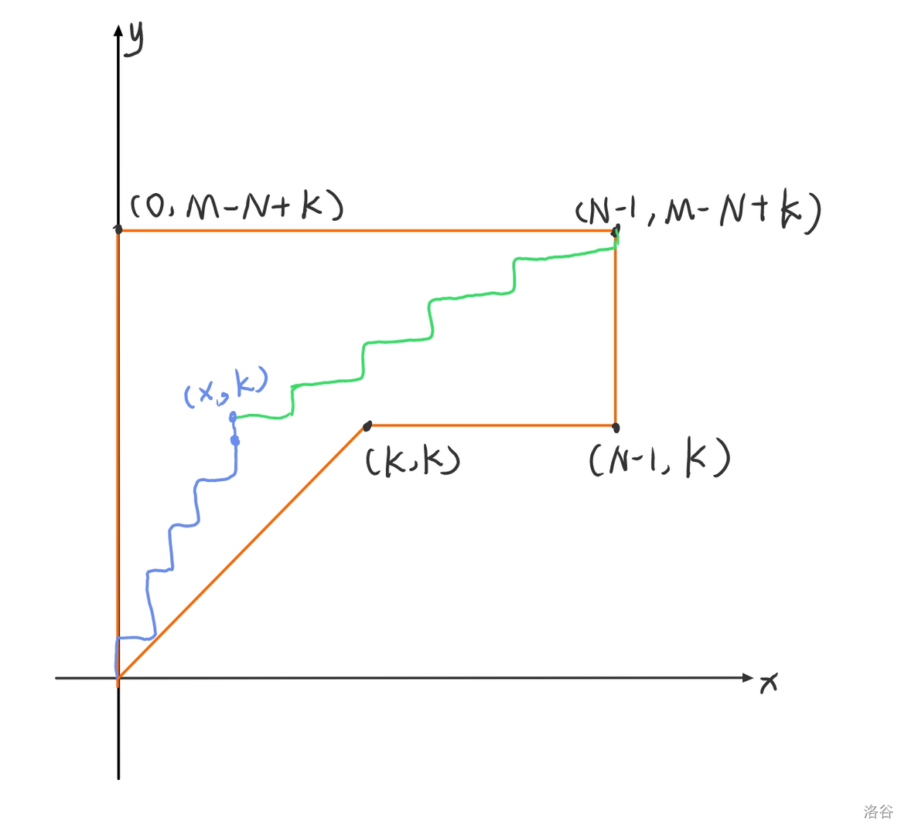
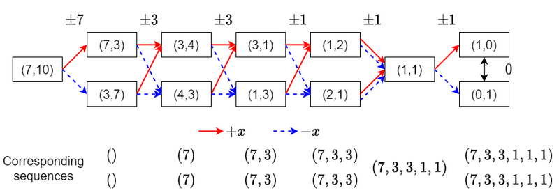

[TOC]

## [[AGC054A] Remove Substrings](https://www.luogu.com.cn/problem/AT_agc054_a)

不难验证是一次或两次。

简单判断即可。

## [[AGC054B] Greedy Division](https://www.luogu.com.cn/problem/AT_agc054_b)

注意到两个人分别拿到的固定，顺序固定，那么对应的 $\{p_i\}$ 有且仅有一组。

直接dp即可，设 $f_{i,j,k}$ 表示前 $i$ 件东西，第一个人拿了 $j$ 件和为 $k$ 的方案数。

答案就是 $\sum j!(n-j)!f_{n,j,sum/2}$。

复杂度 $\mathcal O(n^2\sum W_i)$。

## [[AGC054C] Roughly Sorted](https://www.luogu.com.cn/problem/AT_agc054_c)

设 $cnt_x$ 表示 $P_i=x$ 之前有多少个比它大。

然后一次交换如果前后 $P_i>P_{i+1}$，那么交换后 $cnt_{P_{i+1}}$ 减少 $1$。

因此假如原来是 $\{cnt_i\}$，那么最后就是 $cnt'_i=\{\min(cnt_i,K)\}$。那么初始的方案数就是 $(n-K+1)^{\#[cnt_i=K]}$

然后一组 $\{cnt_i\}$ 满足 $0\le cnt_i\le N-i$ 和一组 $\{P_i\}$ 是一一对应的，从小到大插入即可。

复杂度就是逆序对。

## [[AGC054D] (ox)](https://www.luogu.com.cn/problem/AT_agc054_d)

首先可以证明不会交换 $s_i,s_{i+1}\in{\texttt{o},\texttt{x}}$，这样显然是亏的。

然后如果只考虑括号得到的答案和答案只保留括号是一样的。这个可以直接贪心求出。

然后就可以把 $\tt ox$ 串插入了。设 $f_{i,j}$ 表示括号串插入前 $i$ 个，$\tt ox$ 串插入前 $j$ 个最小的新增逆序对数。

复杂度 $\mathcal O(n^2)$。

## [[AGC054E] ZigZag Break](https://www.luogu.com.cn/problem/AT_agc054_e)

结论：不妨设 $P_1<P_N$，能消完当且仅当存在 $i\in[1,N-1]$ 使得 $P_1\ge P_i,P_{i+1}\ge P_N$。

充分性：首先对 $1\sim i$ 和 $i+1\sim N$ 分别消成降序。然后就可以直接消完了。

必要性：归纳证明，如果 $[l,r]$ 能够被消去到只剩下头尾，且 $P_l<P_r$ 那么要满足 $\exist i\in[l,r-1],P_l\ge P_i,P_{i+1}\ge P_r$。$r-l+1=2$ 时显然成立，否则考虑最后一次消去的是 $k$，不妨设 $P_l<P_k>P_r$，那么 $[l,k]$ 要只剩头尾就需要一组 $P_l\ge P_i,P_{i+1}\ge P_k>P_r$。所以归纳证明了是必要条件。

然后就可以计数了。用总数减去不合法。还是先考虑 $P_1<P_N$ 的情况。不然令 $P_1=N-A+1$ 即可。

首先枚举 $P_N$，那么设 $[1,P_1]$，$(P_1,P_N)$，$[P_N,N]$ 分别有 $a+1,b,c+1$ 个，分别叫做 $1,2,3$。我们的要求是 $3$ 不接在 $1$ 后面。初始是 $13$。依次插入 $2,1,3$。

插入 $2$ 的方案数是 $b!$，插入 $1$ 的方案数是 $(a+b-1)!/(b-1)!$，插入 $3$ 的方案数是 $(b+c-1)!/(b-1)!$。然后就是推式子时间：
$$
\begin{aligned}
&\sum_{P_N=P_1+2}^Nb!\times\frac{(a+b-1)!}{(b-1)!}\times\frac{(b+c-1)!}{(b-1)!}\\
=&\sum_{P_N=P_1+2}^Nb\times\frac{(a+b-1)!(b+c-1)!}{(b-1)!}\\
=&\sum_{P_N=P_1+2}^N(P_N-P_1-1)\times\frac{(P_N-3)!(N-P_1-2)!}{(P_N-P_1-2)!}\\
\end{aligned}
$$
设 $k=P_N-P_1-2$。1
$$
\begin{aligned}
&=(N-P_1-2)!\sum_{k=0}^{N-P_1-2}\frac{(k+1)(k+P_1-1)!}{k!}\\
&=(N-P_1-2)!\left((P_1-1)!\sum_{k=0}^{N-P_1-2}\frac{(k+P_1-1)!}{k!(P_1-1)!}+P_1!\sum_{k=0}^{N-P_1-2}\frac{(k+P_1-1)!}{(k-1)!P_1!}\right)\\
&=(N-P_1-2)!\left((P_1-1)!\sum_{k=0}^{N-P_1-2}\binom{k+P_1-1}{P_1-1}+P_1!\sum_{k=0}^{N-P_1-2}\binom{k+P_1-1}{P_1}\right)\\
&=(N-P_1-2)!\left((P_1-1)!\binom{N-2}{P_1}+P_1!\binom{N-2}{P_1+1}\right)\\
\end{aligned}
$$
$\mathcal O(N)$ 预处理 $\mathcal O(1)$ 求。

## [[AGC054F] Decrement](https://www.luogu.com.cn/problem/AT_agc054_f)

记 $a_i$ 为 $A_i$ 删除了多少，$b_i$ 为 $B_i$ 最终删除了多少。对于没有定义的位置都是 $0$。如果不考虑次数限制那么合法当且仅当 $\forall i,2|a_i+b_i+b_{i-1},\max(a_i,b_i,b_{i+1})\le(a_i+b_i+b_{i-1})/2$。

必要性是因为操作 $[l,r]$，会把 $i\in[l,r]$，$a_i,b_{i+1},b_{i}$ 中的两个加一。所以显然是必要的。

充分性就考虑每次选出一对相邻的满足 $a_i=b_i+b_{i+1}$ 的位置操作。可以证明之后仍然满足条件。

然后有次数上限。

如果 $B_i>A_i+B_{i-1}$，那么令 $b_i\le B_i$ 这条限制是没用的，不妨令 $B_i=A_i+B_{i-1}$。对 $B_{i-1}$ 同理。

然后如果 $A_i\ge B_i+B_{i-1}$，那么 $a_i\le A_i$ 这条限制是没用的，可以把原问题拆成两个子问题，分别是 $[1,i]$ 和 $[i,n]$ 前一个问题令 $A_i=B_{i-1}$，后一个问题令 $A_i=B_i$。

现在只需要考虑 $|B_i-B_{i-1}|\le A_i<B_i+B_{i-1}$ 的情况。我们希望最大化 $\sum a_i$。

记 $f_{i}$ 为 $a_1,\dots,a_i$ 全部取 $A_1,\dots,A_i$ 时 $b_i$ 的取值范围，那么 $f_{i}=\bigcup_{b_{i-1}\in f_{i-1}}\{x|x\in[A_i-b_{i-1},\min(A_i+B_{i-1},B_i)],x\equiv A_i+b_i\pmod 2\}$。

发现 $f_i$ 一定可以写成 $\{x|x\in[l,r],x\equiv p\pmod 2\}$ 的形式。右端点有 $B_n=0,A_n=B_{n-1}$，所以 $f_n$ 的限制为 $[0,0]$。因此如果 $2|\sum A_i$，则直接取 $A_1,\dots,A_n$ 就是合法的。否则取 $A_1,\dots,A_{n-1},A_n-1$ 也是合法的。

我们希望考虑后一种情况有多少种合法的。设 $g_i$ 表示 $a_{i},\dots,a_n$ 全部取 $A_1,\dots,A_n$ 时 $b_{i-1}$ 可以选的范围，考虑 $A_i$ 减一后 $f_{i-1}$ 转移到的 $f'_i$ 和 $g_{i+1}$ 有没有交即可。

时间复杂度是第一步的调整 $B$。链上最短路可以做到 $\mathcal O(n)$，但是我是懒狗就直接写 $\mathcal O(n\log n)$ 了。

## [[AGC055A] ABC Identity](https://www.luogu.com.cn/problem/AT_agc055_a)

遍历 $\tt ABC,ACB,BAC,BCA,CAB,CBA$。

把 $S$ 分成相等的三段 $S_1,S_2,S_3$，然后如果当前遍历到的串是 $T$，在 $S_1,S_2,S_3$ 分别有 $A_1,A_2,A_3$ 个 $T_1,T_2,T_3$，那么选择前 $\min(A_1,A_2,A_3)$ 个拼成一个串。

## [[AGC055B] ABC Supremacy](https://www.luogu.com.cn/problem/AT_agc055_b)

对于串 $s$，令 $s_i$ 按 $\tt A\to C\to B\to A$ 的环走 $i$ 步。

然后就相当于连续三个相同可以变成任意其他的连续三个。

然后就相当于连续三个相同可以删除，问 $S$ 和 $T$ 能不能变成相同。

可以证明删除是顺序无关的，用栈模拟即可。

## [[AGC055C] Weird LIS](https://www.luogu.com.cn/problem/AT_agc055_c)

首先序列的极差不超过 $1$。设原序列的 $\rm LIS$ 为 $k$，那么：

- 必经点为必须在 $\rm LIS$ 上的点，删除后答案变成 $k-1$
- 非必经点为可以在 $\rm LIS$ 上的点，删除后答案还是 $k$
- 无关点为不能在 $\rm LIS$ 上的点，删除后答案还是 $k$

因此首先考虑所有值都相等的情况：

- 全部是 $k-1$，全部是必经点，那就只能升序。
- 全部是 $k$，那么都是非必经点或无关点。非必经点是成对出现的，因此 $2k\le n$。这个条件也是充分的，就考虑 $n-k+1,\dots,n,n-2k+1,\dots,n-k,\dots$ 这样的序列即可。

然后考虑有两种值的情况，不妨设有 $x$ 个必经点，那么把序列分成了 $x+1$ 段，长度分别为 $len_0,len_1,\dots,len_x$。然后非必经点是成对出现的，所以 $k$ 的上限为 $x+\sum\lfloor len_i/2\rfloor$。然后这个也是可以构造的。枚举 $y=\sum \lfloor len_i/2\rfloor$，那么答案就是：
$$
\sum_{x=1}^{\min(m,n-1)}\sum_{y=0}^{\lfloor(n-x)/2\rfloor}\binom{x+y}{y}\binom{x+1}{n-x-2y}(\min(m,x+y)-\max(x,3)+1)
$$
意义很简单，首先是两个两个分配，然后分配哪些是奇数，然后乘上可行的 $k$。

复杂度 $\mathcal O(n^2)$。

## [[AGC055D] ABC Ultimatum](https://www.luogu.com.cn/problem/AT_agc055_d)

记 $A,B,C$ 分别为前缀 $\tt B$ 的个数减去 $\tt A$ 的个数的最大值，$\tt C$ 的个数减去 $\tt B$ 的个数的最大值，$\tt A$ 的个数减去 $\tt C$ 的个数的最大值。那么合法当且仅当 $A+B+C\le n$。

必要性：合法子序列，包含两个 $ (\texttt A,\texttt B),(\texttt B,\texttt C),(\texttt C,\texttt A)$，考虑 $A$，那么 $(\texttt A,\texttt B)$ 最多使用 $n-A$ 次，总次数 $\ge 2n$，化简就是 $A+B+C\le n$。

充分性：第 $i$ 个 $\tt A$，第 $i+A$ 个 $\tt B$ 和第 $i+A+B$ 个 $c$ 组成子序列（后两者 $> n$ 就减去 $n$）。

根据定义我们知道第 $i+A$ 个 $\tt B$ 一定在第 $i$ 个 $\tt A$ 后面，第 $i+A+B$ 个 $\tt C$ 一定在 $i+A$ 个 $\tt B$ 后面，第 $i+A+B+C$ 个 $\texttt A$ 一定在 $i+A+B$ 个 $\tt C$ 后面。然后 $A+B+C$ 不到一圈所以肯定是按顺序的。

然后就可以dp了，就设 $f_{i,a,b,c,A,B,C}$，分别为前 $i$ 个 $\texttt A,\texttt B,\texttt C$ 的个数以及当前的 $A,B,C$。因为 $a+b+c=i$ 所以状态数也就是复杂度是 $\mathcal O(n^6)$ 的。

## [[AGC055E] Set Merging](https://www.luogu.com.cn/problem/AT_agc055_e)

首先 $S_i=S_{i+1}$ 操作肯定是亏得。强制没有这种操作。

然后一个很神仙的构造就是一个排列 $\{p_i\}$，每次可以交换 $p_i<p_{i+1}$，最后的集合为 $S_i=[\min\limits_{j=i}^np_j,\max\limits_{j=1}^ip_j]$。

这个证明直接归纳就行了。发现交换 $p_i>p_{i+1}$ 时两个集合相同没有意义。然后归纳一下交换 $p_i<p_{i+1}$ 之后的集合仍然满足条件。

所以我们就要在复合 $L_i,R_i$ 的限制下最小化逆序对数。首先 $L$ 和 $R$ 需要不降，然后 $L_i\ne L_{i+1}$，$R_i\ne R_{i-1}$ 的位置已经固定了。剩下的位置按顺序填即可。

如果合法输出逆序对，否则输出 $-1$。

## [[AGC055F] Creative Splitting](https://www.luogu.com.cn/problem/AT_agc055_f)

首先考虑怎么判定一个数组是不是合法的。一个显然的贪心策略是维护长度为 $N$ 的序列 $\{c_j\}$，初始值全部为 $K$，也就是每个序列没有填的长度。从后往前遍历 $b_i$，找到最小的 $c_j\ge b_i$，把 $c_j$ 减去 $1$。如果没有 $c_j$ 那么就是不合法。

这个找到最小的 $c_j\ge b_i$ 不方便计数，我们换一种方式，也就是设 $c_i'=\sum_j [c_j<i]$，初始全部是 $0$，每次就是让 $c'_{b_i}$ 加 $1$，如果已经是 $N$ 那么就不合法，然后从小到大排序。

这个为什么是对的呢。考虑找到最小的 $c_j\ge b_i$ 就相当于找最小 $x\ge b_i,c'_{x+1}\ne c'_x$，然后把 $c_x'$ 加上一。发现既然 $c'_{b_i}$ 到 $c_x'$ 都是相等的，那么加哪个都是一样的。

这个的好处就在于，如果 $b_i$ 的取值为 $[1,K]$，那么甚至不需要排序。唯一需要排序的一次是在 $pos$ 的时候，因为要保证 $c_{b_{pos}}'<N$。

那么就可以计数了。设到 $pos$ 时的数组为 $\{c_i'\}$，那么对应的贡献是：
$$
\sum_{\begin{aligned}&0\le c_1'\le c_2'\le\dots\le c_K'\le N\\ &\sum c_i'=NK-pos\end{aligned}}\frac{K!}{\prod_{i=0}^n(\sum_j [c_j'=i])!}\times\frac{(NK-pos)!}{\prod_{i=1}^K c_i'!}\times\frac{(pos-1)!}{\prod_{i=1}^K(N-c_i'-[i=val])!}
$$
第一项的含义是把序列重排的方案数，第二项的含义是 $b_{NK}$ 到 $b_{pos+1}$ 这 $NK-pos$ 次的分配方案，第三项的含义是 $b_{pos-1}$ 到 $b_1$ 这 $pos-1$ 次的分配方案。

枚举 $val$ 然后dp即可，设 $f_{x,y,z}$ 表示选 $\le x$ 的数，共 $y$ 个，和为 $z$，的贡献和。转移就是枚举 $x$ 选了几个即可。复杂度 $\mathcal O(N^2K^4)$。

## [[AGC056A] Three Cells per Row and Column](https://www.luogu.com.cn/problem/AT_agc056_a)

$N\equiv 0\bmod3$ 一个简单的构造方法是：

```
###......
...###...
......###
###......
...###...
......###
```

然后 $N\equiv1\bmod 3$ 可以把右下角重新构造：

```
#...        ....#
.###   ->   ..###
            ##..#
```

然后 $N\equiv2\bmod3$ 对左上角同样操作即可。

## [[AGC056B] Range Argmax](https://www.luogu.com.cn/problem/AT_agc056_b)

判定一个 $(x_1,\dots,x_m)$ 是否合法：从大到小填数，每次找到最小的 $k$ 使得这个位置没有被填过，所有包含 $k$ 的区间都是 $k$，在这个位置填上当前数，把所有包含 $k$ 的区间删除。

然后这个得到的排列 $p$ 和 $x$ 是一一对应的。我们要是能计算这个能得到多少排列就能知道有多少 $x$ 了。

发现我们找到一个 $k$ 后序列就被划分成了两个子问题，肯定是先填完左边再去填右边。但是两边的限制又有所不同，右边的限制实际上是和原问题相同的，左边填最大值的时候，要保证 $k$ 是最小合法的位置，设 $mn_{x,y,k}=\min_{[l_i,r_i]\subseteq[x,y],k\in[l_i,r_i]}l_i$，那么左边的最大值填的位置一定要满足 $mn_{l,r,k}\le k'<k$。

然后就可以dp了，设 $f_{i,j,k}$ 表示区间 $[i,j]$ 的子问题，填的最大值位置 $\ge k$ 的方案数。转移就是：
$$
f_{i,j,k}=f_{i,k-1,mn_{i,j,k}}\times f_{k+1,j,k+1}+f_{i,j,k+1}
$$
复杂度 $\mathcal O(n^3)$。

## [[AGC056C] 01 Balanced](https://www.luogu.com.cn/problem/AT_agc056_c)

设 $01$ 分别是 $1,-1$，我们希望前缀和 $d_i$ 尽可能大。

然后限制就是 $d_i\le d_{i-1}+1,d_{i-1}\le d_i+1,d_{l_i-1}\le d_{r_i},d_{r_i}\le d_{l_i}$。

然后跑最短路。为什么不会出现 $d_i=d_{i+1}$ 小编也不知道呢。

## [[AGC056D] Subset Sum Game](https://www.luogu.com.cn/problem/AT_agc056_d)

首先是一个玄学做法。

如果 $N$ 是奇数，那么Alice能赢就等价于存在一个 $a_i$，删除并排序后奇数位置和是 $X$，偶数位置和是 $Y$，满足 $a_i+X\ge L,a_i+Y\le R$。

充分性显然。必要性就考虑如果 $a_i+Y>R$，那么Bob每次取最小的那么Alice就超了。

然后 $N$ 是偶数就相当于选 $a_i,a_j$，删除这个两个并排序之后奇数位置和是 $X$，偶数位置和是 $Y$ 满足上面的条件。

充分性显然。必要性不显然。但是过了。

然后是题解的正经做法。

操作一番之后变成 $|x+\text{Alice选的}-\text{Bob选的}|\le R-L$，其中 $x=\sum a_i-(R+L)$。

就相当于轮流操作，Alice可以加，Bob可以减，Alice想最小化绝对值，Bob想最大化绝对值。

设 $f(a)$ 为把 $a$ 排序之后得到 $b$，计算 $\sum(-1)^ib_i$。

现在的数是 $x$，有结论：

- 轮到 Alice操作，有 $n$ 个数，最后得到绝对值等价于 $\min_p f(\{a_1,\dots,a_n,p,p+x\})$。显然存在一个 $p=a_i$ 能够取到最小值。
- 轮到Bob操作，有 $n-1$ 个数，最后得到的绝对值等于 $f(\{a_1,\dots,a_{n-1},x\})$。

归纳证明。

Alice显然是成立的，因为你让 $p=a_i$ 就等价于删去 $a_i$，加入 $a_i+x$，然后交给Bob。

Bob也是成立的。不妨设数组排序后是 $b_1,\dots,b_n$，其中 $b_s=x$，那么Bob选 $b_t(t\ne s)$，那么Alice选 $p=b_t$ 就取到了 $f(b)$。所以这个是Bob分数的上界。设 $s$ 为奇数，若 $s=1$ 取 $t=n$ 否则取 $t=s-1$ 就可以取到这个上界。然后 $s$ 是偶数可以所有数取相反数。

这个做法看上去严谨多了。复杂度 $\mathcal O(N^2)$。应该可以做到 $\mathcal O(N\log N)$ 的说。

## [[AGC056E] Cheese](https://www.luogu.com.cn/problem/AT_agc056_e)

考虑 $(a,b)$ 表示 $a$ 奶酪到了 $b$ 老鼠前面。那么判定就类似于这样：
$$
\begin{aligned}
&(1,a_{1,1}),(1,a_{1,2}),\dots,(1,a_{1,p_1})\\
&(2,a_{2,1}),(2,a_{2,2}),\dots,(2,a_{2,p_2})\\
&\dots\\
&(n-1,a_{n-1,1}),(n-1,a_{n-1,2}),\dots,(n-1,a_{n-1,p_{n-1}})
\end{aligned}
$$
每次判定提供 $\frac12$ 的贡献。最后一次判定是被吃掉了。

然后这个是原题的判定顺序，一个结论是在保持 $(i,a_{i,1}),\dots,(i,a_{i,p_i})$ 顺序不变的前提下，我们可以任意的顺序判定。

考虑交换两次相邻的判定。如果两次判定的奶酪不同，那么交换显然没有影响。如果相同，设为 $(x,a)$ 和 $(y,a)$，但是都没有吃，也没有影响。唯一有影响的就是前一个没吃后一个吃了。发现交换后我们可以还是判定前一个没吃后一个吃了，然后把后面所有的 $(x,*)$ 改成$(y,*)$。

那么实际上就相当于我们可以同时把所有奶酪都放好，然后每次选一个奶酪走，这样答案是不变的。

然后我们不妨设要计算 $0.5$ 位置的老鼠没有吃到奶酪的概率。那么我们可以先让所有奶酪顺时针走到 $0$ 的位置并判定。这个过程可以用dp描述，设 $f_{i,j,k}$ 表示处理到过程 $i$，现在已经放了 $j$ 块奶酪，被吃了 $k$ 块的贡献和。（过程就形如 在 $1$ 加入奶酪，判定 $1.5$ 的老鼠，在 $2$ 加入奶酪，判定 $2.5$ 的老鼠，……，在 $n$ 加入奶酪）

如果当前是加入奶酪，如果概率是 $A_p$，那么转移就是：
$$
f_{i+1,j+w,k}\leftarrow f_{i,j,k}\times A_p^w/w!
$$
要除 $w!$ 是因为这 $n-1$ 块奶酪最后要按顺序放下去，要乘上重排数。

然后当前是判定老鼠，那么转移是：
$$
\begin{aligned}
&f_{i+1,j,k}\leftarrow f_{i,j,k}\times 1/2^{j-k}\\
&f_{i+1,j,k+1}\leftarrow f_{i,j,k}\times\left(1-1/2^{j-k}\right)
\end{aligned}
$$
然后现在全部在 $0$ 位置了，设现在有 $k$ 块奶酪和 $k+1$ 只老鼠，我们可以依次判定每块奶酪。我们考虑第一块不被 $0.5$ 吃掉的概率，发现就是：
$$
\left(\frac1{2^2}+\frac1{2^3}+\dots+\frac1{2^{k+1}}\right)\times \left(1+\frac1{2^k}+\frac1{2^{2k}}+\dots\right)
$$
第一部分就是一圈内被不是 $0.5$ 的老鼠吃掉的概率。然后每次有 $1/2^k$ 的概率没有吃就要进入下一圈。

第二块奶酪实际上是 $k$ 只老鼠的情况，然后一直到两只老鼠的情况。

上面的先化简是：
$$
\frac{2^k-1}{2^{k+1}-1}
$$
所以最后的概率就是：
$$
\prod_{i=1}^{k}\frac{2^i-1}{2^{i+1}-1}=\frac{1}{2^{k+1}-1}
$$
所以最后的答案就是：
$$
\sum f_{lst,n-1,i}\times (n-1)!/(2^{n-i}-1)
$$
单次复杂度 $\mathcal O(n^4)$，总复杂度为 $\mathcal O(n^5)$。

## [[AGC056F] Degree Sequence in DFS Order](https://www.luogu.com.cn/problem/AT_agc056_f)

不妨强制dfs序就是 $1,2,\dots,N$，然后问能生成多少度数序列。

如果一张无向图的 dfs 序为 $1,2,\dots,N$，一个必要条件是对于 $u>1$，存在边 $(u,v)$ 使得 $v<u$。

但是这个有问题啊。你跑 dfs 的时候必须要跑到底，有可能你还要往下走但是 $u+1$ 就寄了。

但是一个很高妙的结论是如果 $a<b<c<d$，有边 $(a,c),(b,d)$，我们可以变成边 $(a,d),(b,c)$ 并且没有改变度数，也没有改变图是否满足必要条件。这个肯定可以在有限步内结束因为 $\sum_{(u,v)\in E}(u-v)^2$ 是递增的。

我们把满足必要条件的图按照结论不停操作。然后如果已经走过 $1\sim u$。根据dfs的原理，假设 $u+1$ 连接的是 $v$，那么从 $u$ 一直往上跳到 $v$，如果只有 $v$ 有未遍历过的出点那么就是合法的。否则有一个点 $a$ 连出了 $b$，因为 $a$ 在 $u\sim v$ 之间所以 $v<a<u+1<b$，然后 $(v,u+1),(a,b)$ 有边与不能操作矛盾。也就是一定能够是 $1,2,\dots,N$。

然后就相当于满足必要条件的图能够生成多少种度数序列 $\{a_i\}$。有三个必要条件：

- $\sum_{i=1}^Na_i=2M$。因为一共有 $M$ 条边每条边提供 $2$ 的度数。
- $\sum_{i=1}^ua_i\ge2(u-1)+1$。内部至少有 $u-1$ 条边，然后 $u+1$ 还要连一条边。
- $a_{u+1}\le M-(u-1)$。前 $u$ 个点内部至少有 $u-1$ 条边，因此最多只有 $M-(u-1)$。

这个应该也是充分的。考虑一个算法：

枚举 $i=2\sim N$，从前面选一个度数最大的点连边。由于第二个条件满足所以一定是可以做的。

然后如果之后不存在 $a_x'>M-(N-1)$，那么肯定可以构造一种合法连边方案。接下来证明不会有这种情况。

显然最多只有一个 $a'_x>M-(N-1)$，不存在其他 $a'_y\ge M-(N-1)$。然后因为 $a_x\le M-(x-2)$，在前面的算法中，如果有一次 $i>x$ 且 $i$ 向 $y$ 连边，那么最后 $a_y'\ge a_x'-1$。前面已经说明了这种情况不存在，所以后 $N-x+1$ 条边都是连向 $x$ 的。

那么 $a_x'=a_x-(N-x+1)\le M-(N-1)$。那就矛盾了啊。所以是一定合法的。

现在的形式已经很简单了，可以有 $\mathcal O(\mathrm{poly}(N,M))$ 的算法。

为了方便不妨设假设我们有数组 $\{b_i\}$， $b_0=a_1,b_i=a_{i+1}-1$，那么三条限制就是：

- $\sum _{i=0}^{N-1}b_i=2M-(N-1)$
- $\sum_{i=0}^{u-1}b_i\ge u$
- $b_u\le M-u$

把这个看做 $(0,0)$ 出发，向上走 $b_0$，向右走 $1$，向上走 $b_1$，向右走 $1$，……，向上走 $b_{N-1}$，到达 $(N-1,2M-(N-1))$。

然后第二条限制就是不能碰到 $y=x-1$。如果不考虑第三条限制那么就是经典的卡特兰数求法，到终点的方案数减去到终点关于线对称点的方案数。也就是 $\binom{2M}{N-1}-\binom{2M}{N-2}$。

接下来说明至多只有一个 $b_K$ 使得 $b_K>M-K$。

设 $p<q$，$b_p\ge M-p+1,b_q\ge M-q+1$，限制二说明 $\sum _{i=0}^{p-1}b_i\ge p$。

所以 $\sum_{i=0}^{N-1}b_i\ge \sum_{i=0}^{p-1}b_i+b_p+b_q\ge 2M-q+2>2M-(N-1)$。

所以我们可以枚举 $K$，就可以计算出所有不合法的方案数。然后就相当于有一组 $\{c_i\}$，满足 $b_K=c_K+(M-K+1),b_i=c_i$。

现在没有第三条限制了。重写前两条：

- $\sum _{i=0}^{N-1}=M-N+K$
- - $u\le K$，仍然是 $\sum_{i=0}^{u-1}b_i\ge u$
  - $u>K$，那么 $\sum_{i=0}^{u-1}b_i=\sum _{i=0}^{u-1}c_i+M-K+1\ge \sum_{i=0}^{K-1}c_i+M-K+1\ge M+1$，显然一定满足。

那么我们现在的区域就类似下图：



不妨枚举第一次碰到 $y=K$ 的点 $(x,K)$，那么方案数就是 $(0,0)$ 不碰到 $y=x-1$ 走到 $(x,K-1)$ 的方案数乘上 $(x,K)$ 走到 $(N-1,M-N+K)$ 的方案数。注意这里要特判 $K=0$ 时是 $\binom{M-1}{N-1}$。

然后就简单化简一下式子：
$$
\begin{aligned}
&\sum_{K=1}^{N-1}\sum_{x=0}^{K-1}\left(\binom{x+K-1}x-\binom{x+K-1}{x-1}\right)\binom{M-x-1}{M-N}\\
=&\sum_{x=0}^{N-2}\binom{M-x-1}{M-N}\sum_{k=x+1}^{N-1}\binom{x+K-1}x-\binom{x+K-1}{x-1}\\
=&\sum_{x=0}^{N-2}\binom{M-x-1}{M-N}\left(
\left(\binom{x+N-1}{x+1}-\binom{2x}{x+1}\right)-
\left(\binom{x+N-1}{x}-\binom{2x}{x}\right)\right)
\end{aligned}
$$
然后用 $\binom{2M}{N-1}-\binom{2M}{N-2}-\binom{M-1}{N-1}$ 减去这一坨就可以了。

复杂度 $\mathcal O(N+M)$。

## [[AGC057A] Antichain of Integer Strings](https://www.luogu.com.cn/problem/AT_agc057_a)

一个贪心是从大往小选。设 $f(X)=\min(\overline{1X},\overline{X0})$，显然这个是递增的，所以选的就是所有 $L\le X,f(X)\le R$ 的。

这个二分就可以了。

## [[AGC057B] 2A + x](https://www.luogu.com.cn/problem/AT_agc057_b)

然后一个数操作 $i$ 次的范围是 $[2^iA_j,2^iA_j+(2^i-1)X]$。设这个区间为 $[L_j,R_j]$。

那么最小的极差就是 $\max(0,\max L_i-\min R_i)$。

不会超过 `long long` 范围。~~不妨假设是对的~~。证明一下

> 如果答案不为 $0$，那么右端点最小如果是 $[A,B]$，左端点最大为 $[C,D]$，极差为 $C-B$。所有数操作一遍之后变成 $[2A,2B+X]$ 与 $[2C,2D+X]$，极差为 $2C-2B-X$，极差变小当且仅当 $C-B<X$，但是如果此式成立，那么极差严格递减，最终答案为 $0$ 矛盾。所以不会所有数都操作。然后有没有操作的所以最多的次数是 $\log \max a_i$ 级别的。
>
> 然后如果但为 $0$，我们不妨找到操作次数最小的，所有都减去这个次数，现在的极差 $a$ 需要 $<X$，那么 $\max L_i<\min R_i+X$，所以现在操作次数最多是 $\log \max a_i+X$ 次，之后第 $i$ 次的结果是 $2^ia-(2^i-1)X=a+(2^i-1)(a-X)$，所以最多是 $\log \max a_i$ 次。

所以我们贪心，每次选最小的 $R_j$ 操作一次，答案取最小值。操作次数是 $\log$ 级别的。

所以复杂度是 $\mathcal O(N\log N\log V)$。

## [[AGC057C] Increment or Xor](https://www.luogu.com.cn/problem/AT_agc057_c)

首先要异或和加以，考虑建 tire，然后异或就相当于某一层节点全部翻转，加一就是到 $2^N-1$ 一路上的路径全部翻转。

现在我们知道每个数希望变成的值，也得到了某个节点要不要翻转。

我们可以通过 $x,-1,x$ 来翻转到 $x$ 的路径。

然后把倒数第二层全部翻转好，接下来只能用一次异或。

时间复杂度 $\mathcal O(N2^N)$，操作次数 $\mathcal O(2^N)$。

## [[AGC057D] Sum Avoidance](https://www.luogu.com.cn/problem/AT_agc057_d)

首先 $i$ 和 $S-i$ 最多只能选一个，$S$ 是偶数 $S/2$ 也不能选。所以最多选 $\lfloor (S-1)/2\rfloor$ 个。

构造合法解是简单的，从 $\lfloor S/2\rfloor+1$ 选到 $S-1$ 即可。 

但是要求字典序最小。我们称 $1\sim\lfloor S/2\rfloor$ 为低位，$\lfloor S/2\rfloor\sim S-1$ 为高位。我们希望把一些高位换成低位。

发现有两个要求：

- 低位的数不能线性组合出 $S$。
- 低位的数能线性组合出的低位数要被选中（等价于低位和高位不能组成 $S$）

所以如果最小的是 $d$，存在 $x$，那么 $x+kd$ 也被选中。

然后最小值不会很大，要字典序最小，找到第一个 $d\not|S$，这个数选中显然是合法的，同时也保证了字典序最小。

然后就可以建同余最短路，每次尝试加入一个最小的数使得两条条件仍然满足。

$d$ 是 $\mathcal O(\log S)$ 的，所以复杂度 $\mathcal O(T\log^3S)$。

## [[AGC057E] RowCol/ColRow Sort](https://www.luogu.com.cn/problem/AT_agc057_e)

只有 $01$ 怎么做？

设 $R_M$ 为 $M$ 每行 $0$ 个数的可重集，$C_M$ 为 $M$ 每列 $0$ 个数的可重集。那么 $A$ 两种操作之后都是 $B$ 就等价于 $R_A=R_B,C_A=C_B$。

然后确定每行每列的个数的顺序之后，实际上 $A$ 是唯一的，因为行列顺序实际上不影响放 $1$ 的方案数。当每行个数递减，每列个数递减时，唯一的方案就是 $B$，所以此时的方案数就是 $R_B$ 重排的方案数乘上 $C_B$ 重排的方案数。

然后如果不是只有 $01$，那么我们可以把 $\le k$ 的看做 $0$，$> k$ 的看做 $1$，得到 $A_k$ 和 $B_k$，对所有 $k$ 都要满足 $R_{A_k}=R_{B_k},C_{A_k}=C_{B_k}$。

然后每次在 $A_{k+1}$ 里填入 $A_k$ 的方案数是和 $A_{k+1}$ 具体形态无关的，因为 $A_{k+1}$ 重排之后就是 $B_{k+1}$，然后我们要做的就是所有的方案数乘起来就是答案。我们不妨假设 $A_{k+1}=B_{k+1}$，然后每列的个数分别为 $b_1,\dots,b_m$，然后 $B_k$ 每行的个数是 $a_1,\dots,a_n$。这两个都是递减的。我们希望重排行列，使得：
$$
B_{k,i,j}=1\Rightarrow B_{k+1,p_i,q_j}=1
$$
其中 $p,q$ 是长度为 $n$ 和 $m$ 的排列。那么这个的条件就是：
$$
j\le a_i\Rightarrow p_i\le b_{q_j}\iff p_i\le b_{\max(q_1,q_2,\dots,q_{a_i})}
$$
这个就可以 dp 了。设 $f_{i,j}$ 表示已经确定了 $\max(q_1,q_2,\dots,q_i)=j$，并且 $a_t\le i$ 的 $p_t$ 已经确定的方案数。转移就是：
$$
f_{i,j}= (j-i+1)f_{i-1,j}+\sum _{k<j}f_{i-1,k}
$$
然后如果 $a_t=i$，那么就可以确定 $p_t$ 的个数：
$$
f_{i,j}=f_{i,j}\times (b_j-t+1)
$$
然后这样我们多区分一些情况，比如 $B_{k}$ 个数相同的行列是不区分的，要除掉。然后 $a_i=0$ 或 $b_i=0$ 会算重，要扬掉。

最后复杂度 $\mathcal O(kn^2)$，其中 $k$ 是值域，$n$ 是矩阵大小。

## [[AGC057F] Reflection](https://www.luogu.com.cn/problem/AT_agc057_f)

考虑把 $(A,B,C)$ 记作 $(B-A,C-A)$，然后 $(X,Y)$ 变成 $(\min(X,Y),|X-Y|)$ 和 $(|X-Y|,\min(X,Y))$。然后两种分别可以让 $B\pm\min(X,Y)$。所以我们就相当于对每种可以达到的 $B$ 的个数求和。




就形如上图。对于某一个终点，我们把可以自由选择正负的数写下来，就问能够得到多少不同的值。然后这个就相当于问能够得到多少种不同的和。这个过程是一个辗转相减的过程，假设初状态两个数互质，我们不妨设序列为 $a_1,\dots,a_1,a_2,\dots,a_2,\dots,a_k,\dots,a_k,1$。其中 $a_k$ 也是 $1$ 但是要单独拿出一个来。个数分别是 $n_1,\dots,n_k$。有 $a_i=n_{i+1}a_{i+1}+a_{i+2}$。

我们发现如果 $i$ 没选满，$i+1$ 选满，$i+2$ 选了，那么可以把 $n_{i+1}$ 个 $a_{i+1}$ 和一个 $a_{i+2}$ 换成 $a_i$。然后一直换。我们可以证明没有这种情况的时候和一定不同。

然后就可以做了，dp的时候记录一下前两个的情况，然后对一整段统计答案即可。

然后最后的一个 $1$，我们可以证明多了一个 $1$ 的方案数就是没有这个 $1$ 的方案数加上 $1$。

现在我们就统计完所有的和了。复杂度 $\mathcal O(T\log V)$。

注意特判一些情况。

## [[AGC058C] Planar Tree](https://www.luogu.com.cn/problem/AT_agc058_c)

把相邻的 $12$ 删去 $1$，相邻的 $34$ 删去 $4$，相邻的相同的数删去一个。

然后剩下的数的个数分别是 $C_1,C_2,C_3,C_4$，那么必要条件是 $C_3>C_1,C_2>C_4$。

然后这个也是充分的。

## [[AGC058D] Yet Another ABC String](https://www.luogu.com.cn/problem/AT_agc058_d)

考虑一个简单的想法就是容斥。

但是容斥位置有重叠怎么办？所以实际上容斥的是线段。

然后线段的容斥系数是：
$$
f(len)=\begin{cases}-1&,len\equiv 0\bmod 3\land len\ge 3\\1&,len\equiv1\bmod 3\land len\ge 3\\0&,\rm{otherwise}\end{cases}
$$
然后就可以dp了，因为肯定是若干段 $3$ 的倍数，剩下的可以自由选择的形式。更具体地，设 $g_{i,j}$ 表示现在长度为 $i$，有 $j$ 个可以自由选择，转移是：
$$
\begin{aligned}
&g_{i,j}\leftarrow g_{i-1,j-1}\\
&g_{i,j}\leftarrow g_{i-3k,j-1}\\
&g_{i,j}\leftarrow -3\times g_{i-1-3k,j}
\end{aligned}
$$
第一种是当前不在线段内，后两种是线段，如果是 $3k$ 型线段那么方案数是 $3$，容斥系数是 $-1$。$3k+1$ 型线段取决于第一个放什么，容斥系数是 $1$。最后答案是：
$$
\sum_{i=0}^{\min(a,b,c)}\binom{a+b+c-3i}{a-i,b-i,c-i}g_{a+b+c,a+b+c-3i}
$$
 然后就是要快速求 $g$。考虑设 $G=\sum g_{i,j}x^iy^j$，$F=xy+\sum_{i\ge1}x^{3i+1}y-3\sum_{i\ge1}x^{3i}$。

然后 $G=GF+1$，也就是：
$$
G=\frac{1-x^3}{1-xy+2x^3}
$$
那么 $[x^ny^m]G$ 怎么求呢。考虑 $G'=1/(1-xy+2x^3)$，那么就是 $[x^ny^m]G'-[x^{n-3}y^m]G'$。然后：
$$
[x^ny^m]G'=[x^ny^m]\sum_{i=0} (xy-2x^3)^i=[x^n]\sum_{i=0}x^{m+3(i-m)}\binom im(-2)^{i-m}
$$
然后就可以做了吧。时间复杂度 $\mathcal O(a+b+c)$。

## [[AGC058E] Nearer Permutation](https://www.luogu.com.cn/problem/AT_agc058_e)

下标和值域均为 $[0,n)$。$inv(x)$ 表示 $x$ 的逆序对数。

考虑对于一个 $x$ 如何求 $f(x)$。字典序最小可以贪心，每次把最小的合法的移到前面。具体地：

- 初始 $z=x$，此时 $d(y,z)-d(x,z)=inv(x)$
- 然后枚举 $i=0\dots n-1$，把最小合法的移到当前位置。

这个贪心显然是对的。但是可以描述更加清爽一点：

- $s=inv(x)/2$
- 每次在 $x_0\dots x_{\lfloor s\rfloor}$ 中找到最小值 $x_m$，放到 $z$ 的末尾，删除 $x_m$，$s\leftarrow s-m$

最后得到 $z=f(x)$

找到第一个 $k$ 使得 $A_K>A_{k+1}$。如果不存在那么 $A$ 显然合法。

那么经过 $k$ 次操作后的 $x$ 序列和 $s$ 一定满足以下条件：

1. $x_0=A_k,x_{\lfloor s\rfloor+1}=A_{k+1}$
2. $x_0=\min(x_0,\dots,x_{\lfloor s\rfloor})$
3. 将 $A_k$ 和 $A_{k+1}$ 删去后剩下的 $x$ 序列就是 $A_{k+2},\dots,A_{n-1}$

经过 $f$ 变化后成为 $A$ 的序列 $B$ 一定可以这样得到。

1. 初始令 $B=A$
2. 从大到小遍历 $k+1,k-1,\dots,0$，每次可以把 $B_i$ 向后移 $c_i$，其中 $c_i$ 要满足 $\forall x\in[1,c_i]$ 有 $B_i<B_{i+x}$，若此时 $i=k+1$ 还要满足 $\forall x\in[1,c_i],A_k<B_{i+x}$

不妨考虑 $\Delta=s-p$，其中 $s,p$ 为 $k+1$ 次操作后 $s$ 和 $A_{k+1}$ 的位置。考虑 $c_i$ 增加 $1$ 对 $\Delta$ 的影响

1. 若 $i\ne k+1$，那么 $c_i$ 增加 $1$ 让逆序对个数增加 $1$，但是操作 $1$ 中 $s$ 多减少 $1$，$\Delta$ 减少 $\frac12$
2. 否则，$c_i$ 增加 $1$，逆序对个数增加 $1$，$p$ 增加 $1$，所以 $\Delta$ 减少 $\frac12$

我们知道 $\sum c_i=0$ 时 $\Delta=inv(A)/2$，所以我们只需要检验是否存在 $\sum c_i=inv(A)$ 或 $inv(A)-1$ 的合法解即可。

然后对 $A_1,\dots,A_{k-1},A_{k+1}$ 中的数从小到大贪心地确定 $c_i$ 的大小即可。

复杂度 $\mathcal O(N\log N)$。

## [[AGC058F] Authentic Tree DP](https://www.luogu.com.cn/problem/AT_agc058_f)

这个东西很神秘。有一个神秘的双射：

- 每条边中间插入一个特殊点，特殊点再连出 $P-1$ 片叶子
- 设当前总点数为 $s$，那么就是每个点 $1\sim s$ 的互不相同的数，要求特殊点比周围的数都大的概率

很神秘。为什么对的呢？考虑一个点的时候肯定是对。然后 $\ge 2$ 个点的时候，就相当于枚举最大值是哪个特殊点，概率为 $1/(n+n-1+(n-1)(P-1))=1/n$。

然后这个东西就好做了。对于特殊点 $u$，我们需要 $v_{fa_u}<v_u$，否则要满足 $v_{fa_u}>v_u$。钦定若干个特殊点不满足，那么剩下的限制就是 $v_{fa_u}>v_u$，这个的概率就是 $\prod 1/sz_i$。

然后就可以树形dp了，设 $f_{i,j}$ 表示节点 $i$，当前连通块膜 $P$ 后大小为 $j$。

做的时候乘上系数即可。复杂度 $\mathcal O(N^2)$。

