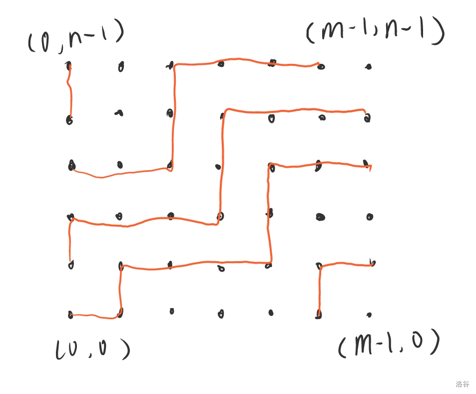
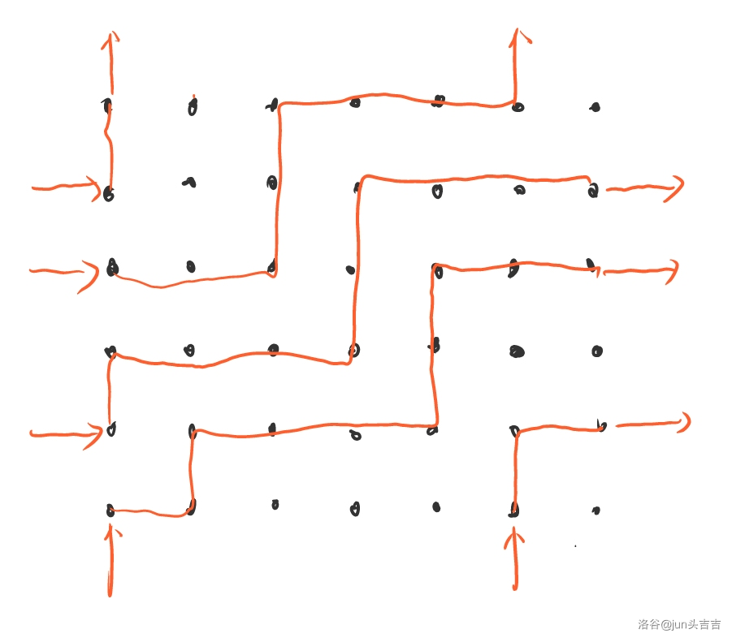
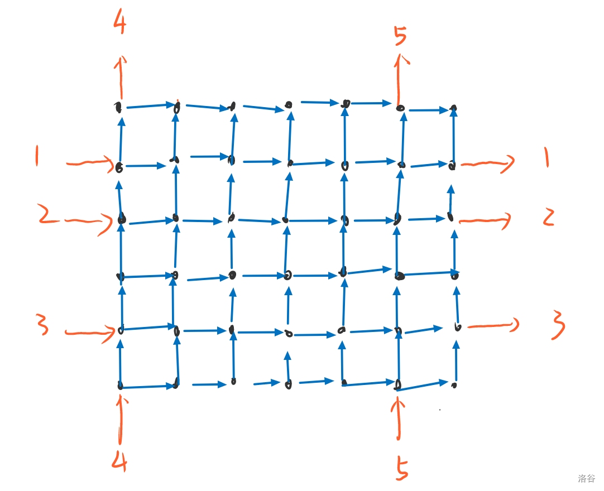
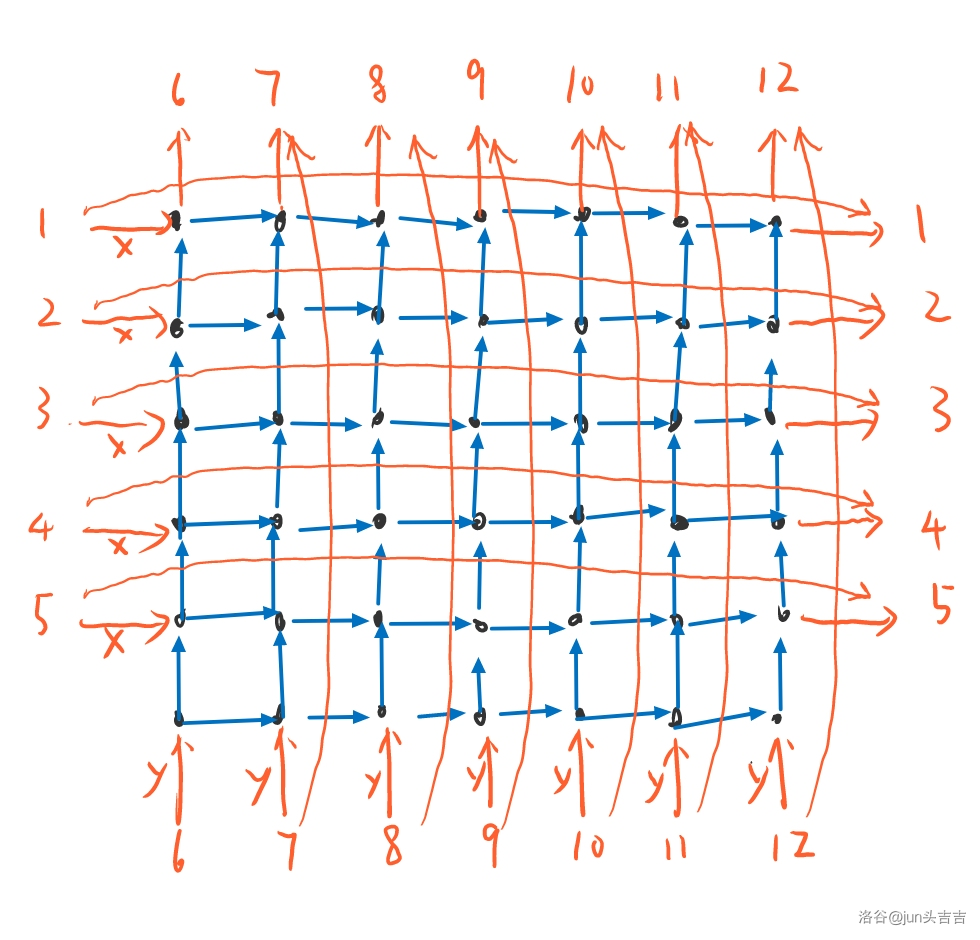

[TOC]

## [[AGC059A] My Last ABC Problem](https://www.luogu.com.cn/problem/AT_agc059_a)

首先如果是环那么答案显然是不变的。

若有 $k$ 个相邻的位置不同，如果 $k\ge 4$，每次最多让 $k$ 减少 $2$。同时也一定可以减少 $2$。

$k\le 3$ 时手玩发现是 $\lceil k/2\rceil$。

所以答案就是 $\lceil k/2\rceil$。前缀和维护 $sum_i=\sum_{j=2}^i [a_{j-1}\ne a_j]$ 即可。

复杂度 $\mathcal O(N+Q)$。

## [[AGC059B] Arrange Your Balls](https://www.luogu.com.cn/problem/AT_agc059_b)

有 $m$ 种颜色，分别是 $1\sim m$，出现了 $c_1,\dots,c_m$ 次。

首先答案 $\le m$，只要相同颜色排在一起即可。

然后答案 $\ge m-1$，因为所有颜色是联通的，因此至少有 $m-1$ 条边。

然后如果 $n<2(m-1)$ 时，答案 $=m$，因为如果是 $m-1$，然后每个点度数又是偶数，那么每条边都至少出现了两遍，那么就 $n\ge 2*(m-1)$ 了。

否则如果 $n\ge 2(m-1)$ 时，答案 $=m-1$，初始有两个空隙，每次选择当前出现次数最多的颜色，放入一个空隙，然后这个颜色中间会形成 $c-1$ 个空隙，也就是新增 $c-2$ 个空隙（如果 $c=1$ 则是消耗一个空隙）。这样 $2+\sum c_i-2=n-2m+2\ge0$，所以一定是可以做的。然后这个也不难发现是合法的。

时间复杂度 $\mathcal O(n)$。

## [[AGC059C] Guessing Permutation for as Long as Possible](https://www.luogu.com.cn/problem/AT_agc059_c)

合法的充要条件是对于每一次 $(x,y)$，不存在之前的询问 $(a_1,b_1),(a_2,b_2),\dots,(a_{m-1},b_{m-1}),(a_m,b_m)$ 使得 $b_i=a_{i+1},a_1=x,b_m=y,P_{a_i}<P_{b_i}$ 或全是大于。这个是必要条件。然后也是充分的应为不直接连起来就无法判断大小。

然后我们断言上面的条件只要 $m=2$ 即可。因为对于 $m\ge 3$，对于 $(a_1,b_1),(a_2,b_2)$，如果之前问过 $(a_1,b_2)$，那么可以直接缩起来，使得 $m$ 减少 $1$。否则之后询问 $(a_1,b_2)$ 的时候 $m=2$ 就一定违法了。

所以现在我们只需要对 $m=2$ 都满足即可。然后这个就是若干组限制， 每组限制形如 $(P_x<P_y\land P_x<P_z)\lor (P_x>P_y\land P_x>P_z)$。然后这个我们在 2-sat 上连边，因为连的是双向边所以可以直接用并查集。

如果有矛盾那么答案就是 $0$。否则我们不难发现 2-sat 两部分是对称的，每个连通块都有唯一对应的连通块，这两个只能选一个。

所以连通块的个数如果是 $m$，那么确定了所有的大小关系后，方案是唯一的，所以答案就是 $2^{m/2}$。

复杂度 $\mathcal O(n^3)$。我是懒狗多了 $\alpha(n^2)$。

## [[AGC059D] Distinct Elements on Subsegments](https://www.luogu.com.cn/problem/AT_agc059_d)

首先有个必要条件是 $|B_i-B_{i+1}|\le 1$。

记 $L_i$ 表示 $A_i$ 在 $A_{i+1},\dots,A_{\min(N+K-1,i+K-1)}$ 出现过，$R_i$ 表示 $A_i$ 在 $A_{i-1},\dots,A_{\max(1,i-K+1)}$ 出现过。

于是有 $B_{i+1}-B_i=L_i-R_{i+K}$。边界为 $B_1=K-R_1-R_2-\dots-R_K$，$B_N=K-L_N-L_{N+1}-\dots-L_{N+K-1}$。

结论：设 $\{L_i\}$ 中为 $1$ 的位置为 $X_1,X_2,\dots,X_p$，$\{R_i\}$ 中位置为 $1$ 的位置为 $Y_1,Y_2,\dots,Y_q$，那么有解当且仅当 $p=q$ 且 $\forall i\in[1,p],1\le Y_i-X_i\le K-1$。

对于每种颜色 $x$，设位置为 $Z_1,Z_2,\dots,Z_r$，对于所有满足 $Z_{i+1}-Z_i\le K-1$ ，$L_{Z_i}=R_{Z_{i+1}}=1$。所以 $p=q$ 且存在一组匹配使得对于每一对 $(X_i,Y_j)$ 满足 $1\le Y_j-X_i\le K-1$。交叉匹配合法那么调换后也合法，所以可顺序匹配。

然后构造也简单，如果 $R_i=1$，那么找到 $Y_t=R_i,A_i=A_{X_t}$。否则直接令 $A_i=i$ 即可。

最后就是怎么得到一组合法的 $\{L_i\}$ 和 $\{R_i\}$ 呢。如果 $|B_{i+1}-B_i|=1$，那么两个值已经确定。

结论是如果有解，那么对于所有 $B_i=B_{i+1}$，若 $B_i<K$，则两个都取 $1$ 即可，否则取 $0$。

不妨假设有解的情况存在 $B_i=B_{i+1}<K$，且 $L_i=R_{i+K}=0$，那么中间肯定存在 $A_x=A_y$。那么我们让 $L_i=R_{i+K}=1$ 之后把匹配 $(x,y)$ 改为 $(i,y)$ 和 $(x,i+K)$ 即可。显然仍然合法。

然后对于 $B_1$ 和 $B_N$ 的限制，把所有的 $1$ 尽可能往中间放显然是不劣的。

填完后就可以构造了。

时间复杂度 $\mathcal O(N+K)$，

## [[AGC059E] Grid 3-coloring](https://www.luogu.com.cn/problem/AT_agc059_e)

考虑对于一个合法的矩阵 $A_{i,j}$ 满足相邻两个不同，一定存在一个合法的矩阵使得相邻两个相差 $1$，且 $B_{i,j}\equiv A_{i,j}\pmod 3$。不难验证是正确的。

然后我们可以先把边框这一圈转化成矩阵 $B$。这个确定 $B_{1,1}$ 之后是唯一的。如果边框都无法转化那么肯定无解。

然后边框能转化也不一定有解，还有一个必要条件是 $|B_{1,j}-B_{N,j}|\le n-1,|B_{i,1}-B_{N,1}|\le n-1$。

然后这个也是充分的，直接考虑 $B_{i,j}=\max(B_{1,i}-(j-1),B_{i,N}-(N-j),B_{1,j}-(i-1),B_{N,j}-(N-i))$。

显然是合法的。时间复杂度 $\mathcal O(N)$。

## [[AGC059F] LIDS](https://www.luogu.com.cn/problem/AT_agc059_f)

首先不考虑限制的计数是简单的，这个限制就相当于杨表是 L 形。然后方案数就是：
$$
\sum \binom{n-1}i^2=\binom{2n-2}{n-1}
$$
然后考虑一个神秘双射：$(n-1)\times (n-1)$ 条线把平面划分成了 $n\times n$ 个格子。从左往右，从上往下递增，$[i,j]$ 表示第 $i$ 条横线与第 $j$ 条竖线的交点，$(i,j)$ 表示第 $i$ 行第 $j$ 列的格子。选出 $k$ 条横着的黑线，$k$ 条竖着的黑线，其他为白线，从左往右的黑竖线，从上往下的黑横线依次匹配，画出交点，称为黑点。从右往左的白竖线，从上往下的白横线依次匹配，画出交点，称为白点。有以下算法：

- 如果一个黑点左上没有白点，那么把左上格涂黑。如果右下没有白点，右下格涂黑
- 如果一个白点左下没有黑点，那么把左下格涂白。如果右上没有黑点，左上格涂黑
- 最后最多剩下一行没有格子被涂，一列没有格子被图，那么把交点位置的格子涂灰

如果 $i,j$ 位置被涂色了，那么 $P_i=j$。接下来证明生成的排列满足条件并且是双射。

**性质 $1.$** 所有黑格/黑点单调递增，所有白格/白点单调递减

**性质 $2.$** 若黑点 $[i,j]$ 左上格被染黑，则 $[i,j]$ 左上方的黑格左上都被染黑。

**性质 $3.$** 对于黑点 $[i,j]$，左上格与右下格至少有一个被染黑。（否则左上和右下都有白点与 $1$ 矛盾）

**性质 $4.$** 不存在一个点既被染黑又被染白。（否则一条线上有两个点）

**性质 $5.$** 不存在一行/一列上两个格子被染成不同颜色。

假设 $(i,j_1)$ 为黑色，$(i,j_2)$ 为白色，不妨设 $j_1<j_2$，那么一定有 $[i-1,j_1-1]$ 为黑点，$[i,j_2-1]$ 为白点或 $[i,j_1]$ 位黑点，$[i-1,j_2]$ 为白点。但是不管哪种都慢炖。

**性质 $6.$** 不存在一行/一列上两个格子被染成了相同颜色。

假设 $(i,j_1),(i,j_2),j_1<j_2$ 同时被染黑，那么 $[i-1,j_1-1]$ 和 $[i,j_2]$ 都是黑点。然后 $j_1-1$ 和 $j_2$ 是两条相邻的黑竖线，中间一定有白竖线，因为一定有白点。然后就矛盾为了。

因此当前至少有 $n-1$ 个格子被染色了。

如果是 $N$ 个格子被染色，那么至少有一个黑格的左上和右下均被染黑（白格同理）。考虑这个点是 $[i,j]$，那么白点都在右上或左下，所以 $LDS=n-k$，然后 $LIS=k+1$，显然符合条件。

否则把灰格涂上。假设是 $(i,j)$。

**性质 $7.$** 被 $(i,j)$ 左上方黑点染黑的只有左格，其他方向同理。

考虑反证，假设 $(i,j)$ 左上方 $[p,q]$ 右下格被染黑，那么第 $i-1$ 条横线不能是黑线（否则第 $i$ 行有格子被染黑）。然后是白线，白点一定在 $[p,q]$ 左下方，但是它右上有黑点，所以左下格一定被染白，与第 $i$ 行为空矛盾。

**性质 $8.$** $(i,j)$ 左上方只有黑点，其他方向同理。

反证。假设 $(i,j)$ 左上有白点 $[p,q]$，左下格被染白，那么讨论 $i-1$ 条横线：如果是白，那么白点在 $[p,q]$ 左下，左下格被染白，矛盾。如果为黑，$[p,q]$ 左下被染白，黑点在 $[p,q]$ 右下，左上不能染，右下被染黑，矛盾。

因此不能发现这样之后的排列 $LDS=n-k,LIS=k+1$，也是符合条件的。

所以这个是单射。怎么变成双射呢？对于一个合法排列 $p$，如果 $LIS$ 和 $LDS$ 都确定，那么令他们的交为黑色格点，否则他们的交为一段值连续的连续子序列。记长度为 $l$，我们将这个前 $l-1$ 个格子右下角定位为黑色交点，因为值连续所以存在一个 $l\times l$ 且以这段序列为对角线的正方形，把整个正方形看做灰点，和前面一样构造即可。

然后证明了是双射。

考虑 $(x,y)$ 被黑点 $[x-1,y-1]$ 染黑的方案数，那么枚举上面的黑线数量 $i$，右下方不能有白点，所以白横线线数量 $n-k-1\le (x-i-1)+(y-i-1)$，即 $k\ge n+2i-x-y+1$，也就是除了 $i$ 条外至少还有 $n+i-x-y+1$ 条黑线。

然后其他情况是对称的。但是有一个问题就是 $(x,y)$ 同时被两个点染黑的被数了两次，$(x,y)$ 为灰没有数。

我们强制不能恰好有 $n+i-x-y+1$ 条黑点。然后单独计算这样的情况即可。

时间复杂度 $\mathcal O(n)$。

## [[AGC061A] Long Shuffle](https://www.luogu.com.cn/problem/AT_agc061_a)

首先打表发现偶数时，要不 $a_{2i-1}=2i-1,a_{2i}=2i$ 要不 $a_{2i-1}=2i,a_{2i}=2i-1$。

那么是哪一种只需要判断 $2i-1$ 和 $2i$ 之间交换了多少次即可。发现就是 $\binom{n-1}{2i-2}$。用 Lucas 即可判断奇偶。

然后是奇数就手玩一下第一层变成偶数即可。

时间复杂度 $\mathcal O(T)$。

## [[AGC061B] Summation By Construction](https://www.luogu.com.cn/problem/AT_agc061_b)

B 比 F 难.jpg

首先如果 $N$ 是奇数我们可以这么填。假如 $N=7$：

```
7 7 5 5 3 3 1 1
6 7 7 5 5 3 3 6
6 6 7 7 5 5 3 3
4 6 6 7 7 5 5 4
4 4 6 6 7 7 5 5
2 4 4 6 6 7 7 2
2 2 4 4 6 6 7 7
```

更形式化地，就是对于前 $N\times N$ 的矩阵。$C_{i,j}$ 根据 $\lfloor(j-i)/2\rfloor$ 填数，然后最后一列随便构造一下。

然后 $N$ 是偶数，对于前 $(N-1)\times (N-1)$ 的矩阵仍然按照原来的方法填数。

```
6 6 4 4 2 . .
5 6 6 4 4 . .
5 5 6 6 4 . .
3 5 5 6 6 . .
3 3 5 5 6 . .
. . . . . . .
```

然后填剩下的部分：

```
6 6 4 4 2 5 2
5 6 6 4 4 5 2
5 5 6 6 4 4 3
3 5 5 6 6 4 3
3 3 5 5 6 6 1
6 3 4 5 2 6 1
```

但是出现了重复点。调整一下：

```
6 6 4 4 2 5 2
5 6 6 4 4 5 1
5 5 6 6 4 4 3
3 5 5 6 6 4 3
3 3 5 5 6 6 1
2 3 4 5 2 6 6
```

## [[AGC061C] First Come First Serve](https://www.luogu.com.cn/problem/AT_agc061_c)

记 $c_i=\max_{a_j<b_i}j$，$f_i$ 表示 $[i,n]$ 这些人能够得到的不同的顺序，$g_i$ 表示 $[i,n]$，$i$ 强制选右边能够得到不同的顺序。

如果 $c_i=i$，那么显然 $f_i=g_i=f_{i+1}$。

否则先考虑 $g_i$，枚举 $[i+1,c_i]$ 中第一个选右边的 $j$，那么一个 $[j,n]$ 且 $j$ 选右能够得到的顺序，唯一对应一个 $i$ 选右的顺序，贡献为 $g_j$。如果没有这样的 $j$ 那么显然就是 $f_{c_i+1}$。

然后考虑 $f_i$，首先如果选左边那么右边随意，贡献为 $f_{i+1}$。但是选左边和选右边有重复的串，也就是 $[i+1,c_i]$ 全部选右边。这个的个数就是 $g_{c_i}$。

有一个区间求 $g$ 和的操作后缀和维护一下即可。

时间复杂度 $\mathcal O(N)$。

## [[AGC061D] Almost Multiplication Table](https://www.luogu.com.cn/problem/AT_agc061_d)

首先二分一个 $k$，然后记 $x_iy_j$ 的范围是 $[L_{i,j},R_{i,j}]$，不妨假设 $x_n\le y_m$ 否则翻转再做一次即可。考虑以下算法：

- 初始 $x_i=1,y_i=+\infty$
- 重复如下算法直到合法或者不可能合法（$y_1\le0$ 或 $x_n>y_m$）。
- $i=1,\dots,n$，令 $x_i\leftarrow \max(x_i,x_{i-1}+1,\max_{j=1}^m\lceil L_{i,j}/y_j\rceil)$
- $i=m,\dots,1$，令 $y_i\leftarrow \min(y_i,y_{i+1}-1,\min_{j=1}^n\lfloor R_{i,j}/x_j\rfloor)$

考虑正确性。每一次 $\rm chkmax/chkmin$ 都是必要条件的，也就是一组合法解 $x$ 一定不会比当前 $x$ 小，$y$ 不会比当前 $y$ 大。所以如果有解一定能找到。

考虑复杂度。设 $V$ 是值域，每次 $x$ 至少增加一，然后不会超过 $\sqrt  V$，所以轮数是 $n\sqrt V$，每一次 $nm$，单次复杂度 $n^3\sqrt V$。

套上二分复杂度 $\mathcal O(n^3\sqrt V\log V)$。

## [[AGC061E] Increment or XOR](https://www.luogu.com.cn/problem/AT_agc061_e)

我们考虑一个子问题，叫做 $(k,s,t,m)$，大意是这样的：

低 $k$ 位 $X$ 和 $Y$ 相同。如果 $s=0$ 则 $X=S$ 否则 $X=0$。如果 $t=0$ 则 $Y=T$ 且 $k-1$ 位没有向 $k$ 进位，否则 $Y=0$ 且向 $k$ 进位（这个进位一定是最后一步加一，否则之前就有进位就已经得到全部为 $0$ 了）。然后 $m$ 中的数异或了奇数次否则是偶数次。

记 $cost(k,s,t,m)$ 表示这个子问题的最小代价。初始值是这样的：

- $cost(0,s,0,m)=\sum _{i\in m}C_i$
- $cost(0,s,1,m)=\sum_{i\in m}C_i+A$。（加一可以看做是 $-1$ 向 $0$ 进位）

最后要求的是 $\min cost(B,0,0,?)$。其中 $B=40$。

考虑怎么从 $cost(k,?,?,?)$ 转移到 $cost(k+1,?,?,?)$。

首先如果 $k-1\to k$ 没有进位，并且这一位 $X$ 经过 $m$ 中的数异或后得到的就是 $Y$，转移就是 $cost(k+1,s,0,m)\leftarrow cost(k,s,0,m)$。

然后如果 $k-1\to k$ 进位了，并且这一位 $X$ 经过 $m$ 中的数异或后得到 $1$，那么加上上一个进位就又进位了，所以就是 $cost(k+1,s,1,m)\leftarrow cost(k,s,1,m)$。

否则过程就类似于  经过 $k-1$ 的子问题，当前位为 $0$ $\to $ 进位使得当前位为 $1$ $\to $ 经过 $k-1$ 的子问题，当前位为 $0$ $\to$ 进位使得当前位为 $1$ $\to \dots$。写成形式化的形式就是 $cost(k+1,s,t,\bigoplus_{i=0}^{l}m_i)\leftarrow cost(k,s,1,m_0)+cost(k,1,1,m_1)+\dots+cost(k,1,1,m_{l-1})+cost(k,1,t,m_l)$。限制条件是每一次进位的时候当前位都是 $0$（最后一次除外）。这个转移是一个最短路的形式，用朴素的 Dijkstra 复杂度为 $2^{2N}$。

所以整个题目的复杂度为 $\mathcal O(B2^{2N})$。

## [[AGC061F] Perfect Strings](https://www.luogu.com.cn/problem/AT_agc061_f)

首先变成 $n\times m$ 的网格图，初始在 $(0,0)$，当前在 $(x,y)$，那么下一步可以走到 $((x+1)\bmod m,y)$ 或 $(x,(y+1)\bmod n)$。除了最后一步不能走重复点，最后走回 $(0,0)$ 的方案数。显然唯一对应一个好的 $01$ 串并且不存在更小的好的子串。

然后这个还是不好计数。不妨假设最后一步是从 $(0,n-1)$ 走到 $(0,0)$，否则交换 $n,m$ 再做一遍即可。

下图展示了一种合法的路径：



把每次跨过 $n$ 或 $m$ 进入/走出网格的线画出来：



也就是说如果我们知道了 $i+j$ 个起点和 $i+j$ 个终点（$i$ 个横 $j$ 个竖，需要有 $\gcd(i,j)=1$，才能保证只有一个环），然后就只需要求不相交路劲数即可。不相交路径数有 lgv 引理。因此我们只需要确定起点，就可以直接计数：



设 $M_{i,j}$ 表示从起点 $i$ 到终点 $j$ 的方案数，个数就是 $(-1)^{ij}\mathrm{det}(M)$。$(-1)^{ij}$ 是因为起点为 $12345$，终点为 $45123$，逆序对数量 $ij$，所以要乘上。

但是暴力枚举取了哪些起点还是不可行。考虑变成下图：



有 $n+m-1$ 个起点和终点，除了标出的剩下的边权都是 $1$。现在求行列式，得到的 $x^iy^j$ 项系数，就是所有选了 $i$ 个横起点 $j$ 个竖起点的行列式之和。考虑如果一个横着的起点被选了，那么在新的图中就体现为经过了边权为 $x$ 的边，乘上一个 $x$，没有选那么就相当于直接走边权为 $1$ 的边跳到终点。对于竖着的起点也是同理。一点小细节是横着的起点只有 $n-1$ 个因为我们已经强制第一步和最后一步了。第 $n$ 个起点不能直接跳到第 $n$ 个终点。

对于这个图求行列式就可以了。经典套路，就直接带入 $x=1\dots n,y=1\dots m+1$ 插值即可。

时间复杂度 $\mathcal O(nm(n+m)^3)$。

## [[AGC026F] Manju Game](https://atcoder.jp/contests/agc026/tasks/agc026_f)

分类讨论。

首先如果 $n$ 是偶数，那么A选不是开头/结尾的位置，两边一奇一偶，B往偶数个那边走，就抢到了先手权，所以A不会比直接选开头/结尾更优。

然后如果 $n$ 是奇数，如果A选奇数位，类似上面也是选开头或结尾。

否则就是每次选一个偶数位，先手权始终在A的手上，但是后手可以决定往那边走，直到出现了一个奇数区间先手直接取开头或结尾更优。然后这个就等价于找到若干个偶数位置，相邻两个之间的贡献 (A-B) 的最小值最大。二分即可。

时间复杂度 $\mathcal O(N\log W)$。

## [[ARC154E] Reverse and Inversion](https://www.luogu.com.cn/problem/AT_arc154_e)

首先考虑 $f(p)$ 怎么求：
$$
\begin{aligned}
f(p)=&\sum_{i<j,p_i>p_j}i-j\\
=&\sum_{i=1}^ni\sum_{j=1}^{i-1}[p_i<p_j]-\sum_{i=1}^ni\sum_{j=i+1}^{n}[p_i>p_j]\\
=&\sum_{i=1}^ni\left(\sum_{j=1}^{i}[p_i<p_j]-\sum_{j={i+1}}^n[p_i\ge p_j]\right)\\
=&\sum_{i=1}^ni\left(i-\sum_{j=1}^i[p_i\ge p_j]-\sum_{j={i+1}}^n[p_i\ge p_j]\right)\\
=&\sum_{i=1}^ni(i-p_i)
\end{aligned}
$$
我们只要求出 $i$ 位置上的数最后的期望位置 $s_i$，就能够得到答案 $\binom{n+1}2^m\sum_{i=1}^n i^2-s_ip_i$。

然后考虑从 $i$ 到 $j$ 的方案数为 $\min(i,n-i+1,j,n-j+1)$，所以操作一次之后期望位置就是 $\frac{n+1}2$。

然后一次也不操作的概率是 $q=\left(1-i(n-i+1)/\binom{n+1}2\right)^m$，所以 $s_i=iq+(n+1)/2\times (1-q)$。

时间复杂度 $\mathcal O(n\log m)$。

## [CF765F Souvenirs](https://www.luogu.com.cn/problem/CF765F)

首先找到中位数 $mid$，然后设 $b_x=|a_x-mid|$，对于在中位数同侧的答案递归到 $[L,mid)$ 和 $(mid,R]$ 计算，异侧的贡献就是 $b_x+b_y$。我们不用管是同侧还是异侧，因为选两个同侧的 $b$ 肯定是不优的。

然后 $b_i+b_k$ 有效当且仅当不存在 $i<j<k$ 使得 $b_j+b_i\le b_i+b_k$ 或 $b_j+b_k\le b_i+b_k$，也就是 $b_j\le \min(b_i,b_k)$。

那么用单调栈就可以得到所有的有效点对了。有效点对是 $\mathcal O(n\log n)$ 的，因此复杂度是 $\mathcal O(n\log^2n+m\log n)$。

## [CF1718F Burenka, an Array and Queries](https://www.luogu.com.cn/problem/CF1718F)

首先按照 $\le\sqrt C$ 的质数和 $>\sqrt C$ 的质数分类。第一类最只有 $65$ 个。

然后可以前缀和算出 $[l,r]$ 每个 $\le \sqrt C$ 的质数是否出现，就可以算出 $[1,C]$ 和这些数互质的有多少。dfs 的时候记得剪枝。

然后减去 $>\sqrt C$ 的贡献，如果 $p$ 出现了，那么就就要减去 $[1,\lfloor C/p\rfloor]$ 中和所有小质数互质的数。用莫队算出 $cnt_i$ 表示有多少 $\lfloor C/p\rfloor =i$，然后就不难统计了。

时间复杂度 能过。

## [P6864 [RC-03] 记忆](https://www.luogu.com.cn/problem/P6864)

设 $ans$ 为答案，$cnt$ 为后缀合法括号序列数。

显然操作一是 $ans$ 加上 $cnt+1$，$cnt$ 加上 $1$。

操作二是 $ans$ 加上 $1$，$cnt$ 变成 $1$。

用矩阵维护即可。

时间复杂度 $\mathcal O(n\log n)$。

## [P7275 计树](https://www.luogu.com.cn/problem/P7275)

首先一定是若干段，每段相邻两个连边，每段 $\ge 2$，剩下的边不能连相邻的。

然后容斥一下，原来的生成函数是 $f=x^2+x^3+\dots=x^2/(1-x)$，那么现在变成 $g=f-f^2+f^3-f^4+\dots=f/(1+f)=x^2/(1-x+x^2)$。

然后现在就没有不能连相邻的边的限制了。用 prufer 序列计算方案数，设每一段的度数分别是 $\deg_1,\dots,\deg_m$，长度分别是 $len_1,\dots,len_m$，显然 $\sum len_i=n$。
$$
\begin{aligned}
&\sum_{\sum_{i=1}^m (\deg_i-1)=m-2}\frac{(m-2)!}{\prod_{i=1}^m(\deg_i-1)!}\prod_{i=1}^m len_i^{\deg_i}\\
=&(m-2)!\prod_{i=1}^mlen_i\sum_{\sum_{i=1}^m(\deg_i-1)=m-2}\prod_{i=1}^m\frac{len_i^{\deg_i-1}}{(\deg_i-1)!}\\
=&(m-2)!\prod_{i=1}^mlen_i[x^{m-2}]\prod_{i=1}^m\exp(len_ix)\\
=&(m-2)!\prod_{i=1}^mlen_i[x^{m-2}]\exp(nx)\\
=&n^{m-2}\prod_{i=1}^mlen_i
\end{aligned}
$$
然后设 $[x^i]h=in[x^i]g$，即 $h=g'\times xn=-\frac{n (x-2) x^2}{\left(x^2-x+1\right)^2}$。

然后就是 $n^{-2}[x^n]\frac1{1-h}$。也就是求：
$$
[x^n]\frac{x^4-2 x^3+3 x^2-2 x+1}{x^4+(n-2)x^3-2x^2+(3-2n)x+1}
$$
低项式除低项式可以常系数齐次线性递推吧。

时间复杂度 $\mathcal O(\log n)$。

## [P8553 醒来](https://www.luogu.com.cn/problem/P8553)

首先可以减去所有数的交使得 $l\sim r$ 所有数的交为 $0$。然后此时 $l$ 和 $r$ 的最高位不同。不妨设 $r$ 的最高位 $p=2^q$。

根据二进制下 $1$ 个数奇偶性把所有数分为黑色和白色。有两个必要条件：

- 黑点和白点相差不超过 $1$，因为答案一定是黑白相邻的。
- $l+p\le r$，否则 $<p$ 的和 $\ge p$ 的根本连不上。

然后一定有解。我们断言可以分为两部分，左边一部分 $<p$，右边一部分 $\ge p$。然后如果 $p-l$ 是奇数，那么接口是 $l$ 和 $l+p$，否则接口是 $r-p$ 和 $r$。

然后我们需要构造 $0\sim n-1$ 的，以 $k$ 为端点的排列。我们断言如果是 $n$ 偶数那么一定可行，否则 $k$ 是黑点或白点中较多的那个也一定可行。

首先考虑一个子问题就是 $\mathrm{build2k}(M,k)$ 表示构造一个 $0$ 开头 $k$ 结尾的 $0\sim M-1$ 的排列，保证 $M$ 是 $2$ 的幂次。然后考虑：

1. 若 $k\ge M/2$，那么直接拼接 $\mathrm{build2k}(M/2,1)$ 和 $\mathrm{build2k}(M/2,k\oplus(M/2+1))\oplus (M/2+1)$ 即可。
2. 否则设 $\{a_0,a_1,\dots,a_{M-1}\}=\mathrm{build2k}(M/2,k)$，返回 $a_1,a_1+M/2,a_2+M/2,a_2,\dots$ 即可。

然后设 $\mathrm {build}(m,k)$ 表示构造一个 $0\sim m-1$ 的排列，第一个元素是 $k$。设 $m-1$ 的最高位 $p=2^q$：

1. 若 $k\ge p$，求出 $A=\mathrm{build}(m-p,k-p)$，$B=\mathrm{build2k}(p,1)$，然后 $B$ 全部异或上 $A$ 的第一个数，然后给 $A$ 异或上 $p$，拼接。
2. 否则设 $o=(|k|+1)\bmod 2$，其中 $||$ 表示二进制下 $1$ 的个数。然后求 $A=\mathrm{build2k}(p,k\oplus o)$ 和 $B=\mathrm{build(m-p,o)}$，前者异或上 $o$，后者异或上 $p$，拼接。

可以证明一定是正确的。

## [CF1620F Bipartite Array](https://www.luogu.com.cn/problem/CF1620F)

有一个必要条件是不能出现三元环吧。

然后出现三元环等价于出现了长度为 $3$ 的下降子序列。

然后这个也是充分的，因为如果没有那么可以划分成两个上升子序列，每个内部没有连边，所以肯定是二分图。

然后简单 dp 就可以了，设 $f_{i,j}$ 表示前 $i$ 个数第一个序列结尾的是 $\pm p_i$ 时第二个序列结尾最小是多少。$j$ 表示 $p_i$ 取正值还是负值。

然后这个 dp 是 $\mathcal O(n)$ 的。

## [CF321D Ciel and Flipboard](https://www.luogu.com.cn/problem/CF321D)

记 $r_{i,j}$ 表示 $a_{i,j}$ 是否变成了相反数。

一个必要条件是：

- $r_{i,j}\oplus r_{i,m}\oplus r_{i,j+m}=0$
- $r_{i,j}\oplus r_{m,j}\oplus r_{i+m,j}=0$

因为每一次如果翻转了 $r_{i,m}$，那么 $r_{i,j}$ 和 $r_{i,j+m}$ 有且仅有一个翻转。否则一个都不翻转。

然后是充分的，因为这个确定前 $m\times m$ 个格子后方案唯一，数量为 $2^{m\times m}$，然后每次翻转线性无关所以的确是 $2^{m\times m}$。

然后我们只要枚举 $r_{m,1\dots m}$，然后就知道了 $r_{m,1\dots n}$。然后所有 $y<m$，第 $y$ 列是独立的，然后确定 $r_{m,y}$ 后所有 $x<m$ 的 $r_{x,y}$ 也是独立的。取最大值即可。

时间复杂度 $\mathcal O(2^mn^2)$。

## [CF755G PolandBall and Many Other Balls](https://www.luogu.com.cn/problem/CF755G)

记 $f_{i,j}$ 表示 $i$ 个球分成 $j$ 组的方案数，$F_i=\sum f_{i,j}x^j$，那么显然有：
$$
F_i=(x+1)F_{i-1}+x F_{i-2}
$$
然后不难发现：
$$
F_n=\left(\left(\frac{1+x+\sqrt{1+6x+x^2}}{2}\right)^{n+1}-\left(\frac{1+x-\sqrt{1+6x+x^2}}2\right)^{n+1}\right)\bigg/\sqrt{1+6x+x^2}
$$
然后事实上我们对 $x^{\min(n+1,k+1)}$ 取模，第二项显然 $\equiv 0\bmod x^{n+1}$，所以我们要求的实际上就是：
$$
F_n\equiv\left(\frac{1+x+\sqrt{1+6x+x^2}}{2}\right)^{n+1}\bigg/\sqrt{1+6x+x^2}\bmod x^{\min(n+1,k+1)}
$$
然后直接多项式快速幂就是 $\mathcal O(k\log k)$ 了。如果不想写开根可以求一下导推出 $\sqrt{1+6x+x^2}$ 的系数递推式。

## [CF1770H Koxia, Mahiru and Winter Festival](https://www.luogu.com.cn/problem/CF1770H)

膜拜强大zak。

首先如果 $p_i=i,q_i=i$，那么答案显然是 $1$。否则答案是 $2$。

考虑 $p_i=n-i+1,q_i=n-i+1$ 的构造，路径分别是：
$$
(1,i)\to (\min(i,n-i+1),i)\to (\min(i,n-i+1),n-i+1)\to (n,n-i+1)\\
(i,1)\to (i,i)\to (n-i+1,i)\to (n-i+1,n)
$$
然后这个构造出来之后，如果 $p_i>p_{i+1}$，我们可以交换这两条路径的终点，因为一定相交。因为最初的 $p_i=n-i+1$，所以通过这样，我们可以把 $p_i$ 调整到希望的 $p_i$。$q_i$ 同理。

时间复杂度 $\mathcal O(n^3)$。

## [P5179 Fraction](https://www.luogu.com.cn/problem/P5179)

$$
\frac ab<\frac pq<\frac cd\iff \frac{d\bmod c}c<\frac{q-p\times\lfloor d/c
\rfloor}p<\frac{b-a\times\lfloor d/c\rfloor}a
$$

变成子问题了。递归不下去就是 $\frac ab<1,\frac cd>1$，此时答案是 $p=q=1$。

## [CF1764G3 Doremy's Perfect DS Class (Hard Version)](https://www.luogu.com.cn/problem/CF1764G3)

我们把 $2x$ 和 $2x+1$ 分成一组。对于 $[l,r]$，我们把一组中只有一个在里面的叫做 disconnected element。可以通过一次询问 $(l,r,2)$ 问出一段区间的 disconnected element 数量。

然后如果 $n$ 是奇数，不考虑 $1$，那么 $[1,x]$ 和 $[x+1,n]$ 的 disconnected element 显然是一样的。有 $1$ 之后就是 $1$ 在多的那边，可以二分找到 $1$，次数为 $20$。

然后如果 $n$ 是偶数，那么可以用二分找到 $n$，我们可以用 $(1,x,n)/(x+1,n,n)$ 判断前缀有没有 $n$。次数为 $10+20=30$。

然后一个优化就是不用找到 $n$ 的具体位置，在跑奇数算法的时候如果两边 disconnected element 不一样，那么肯定是 $1$ 和 $n$ 在同侧，直到一样才在异侧，这时候问一次知道 $n$ 在哪边即可，
