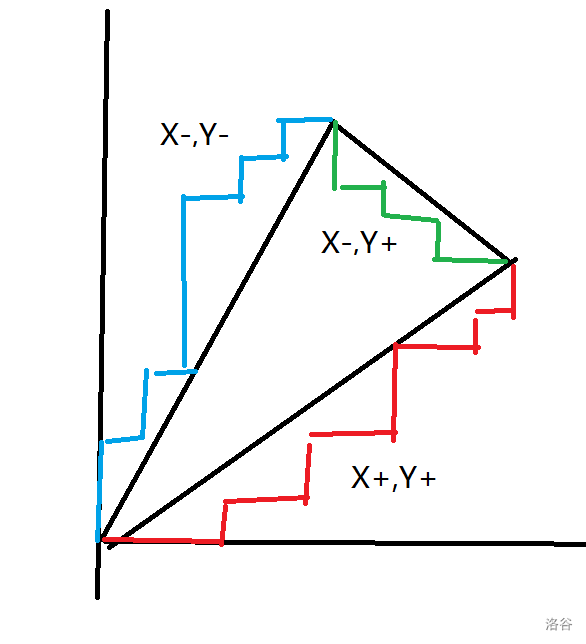
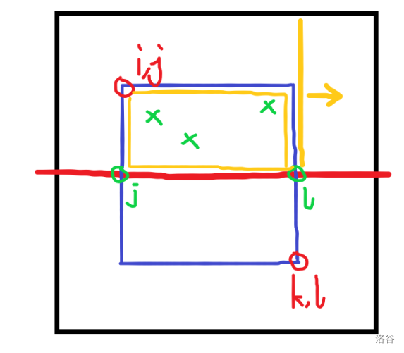
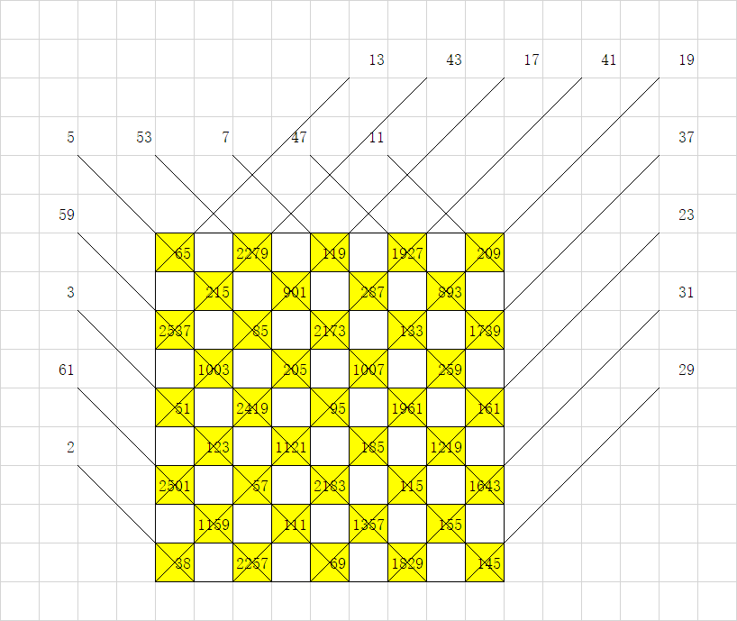

[TOC]

## [CF1598G The Sum of Good Numbers](https://www.luogu.com.cn/problem/CF1598G)

考虑若 $a\ge b$，那么 $|a|=|x|$ 或 $|a|=|x|-1$

- 若 $a=|x|-1$，那么 $|b|=|x|-1$
- 若 $a=|x|$，那么设 $lcp$ 为 $a$ 和 $x$ 的最长公共前缀，$|b|=|x|-lcp$ 或 $|x|-lcp-1$

找最长公共前缀可以用扩展 $\rm kmp$ ，

判断两个数的和是否等于第三个可以用 $\rm Hash$，但是最好是随机模数

## [CF1582F2 Korney Korneevich and XOR (hard version)](https://www.luogu.com.cn/problem/CF1582F2)

首先从小到大枚举结尾的数这样就不用管升序了。

记当前结尾为 $i$ ，$dp[i]$ 表示异或和为 $i$ 的最前位置，有转移
$$
dp^\prime_{i\oplus j}\leftarrow \mathrm{lower\_bound}(dp_j)
$$
然后就是 $5000^2\log n$。

## [CF1582G Kuzya and Homework](https://www.luogu.com.cn/problem/CF1582G)

考虑对于 $i$ 求出了所有合法的开头，那么我们希望推到 $i+1$

如果 $i+1$ 的操作是 $*$，那么直接把每个因数放进一个对应的数组里

否则如果有因数 $j$，那么就意味着上一次出现因数 $j$ 到 $i+1$ 都不能成为起点，然后把上一个 $j$ 消掉。可以理解是括号匹配。

 $\mathcal O(n\log n)$。

## [AT4839 [ABC149F] Surrounded Nodes](https://www.luogu.com.cn/problem/AT4839)

考虑每一个点对答案的贡献，当且仅当自身是白色，有 $\ge 2$ 个子树有黑点。那么相当于是 $2^{n-1}$ 减去只有 $<2$ 个子树有黑点的方案数，如果是 $0$ 就是 $1$，否则就是有一棵子树有点方案为 $2^{sz}-1$。

最后对方案数 $/2^n$ 就是期望了。

## [AT4831 [ABC155F] Perils in Parallel](https://www.luogu.com.cn/problem/AT4831)

首先差分是肯定要想到的，记 $v_i=b_i\oplus b_{i-1}$，然后我们的目的是让所有 $v_i(1\le i\le n)$ 变成 $0$。然后对于操作，就相当于在左端点和右端点同时取反，在这两个点连边。考虑一个合法的选边方案一定可以不包括环，因此我们求出一个生成树森林，然后在森林上 $\rm dp$。特判一下 $v_{n+1}$ 可以随便选即可。

## [AT4819 [ABC135F] Strings of Eternity](https://www.luogu.com.cn/problem/AT4819)

首先把 $S$ 重复若干次到 $2$ 倍 $T$ 的长度多一些，用 $\rm Hash$ 暴力匹配，如果次数大于等于 $|S|/|T|-1$ 肯定是无限次否则就是答案。

## [AT3954 [AGC023C] Painting Machines](https://www.luogu.com.cn/problem/AT3954)

不会做被 $\rm W\color{red}WYHN$ $\mathcal D$ 爆了。

首先转化成 $(n-1)!+\sum_{i}$ 第 $i$ 步还没有结束的方案数。

然后是 $(n-1)!+\sum_i (n-1)!-$ 第 $i$ 步已经结束的方案数。

再是 $n!-\sum_{i}$ 选 $i$ 个数使得覆盖所有 $\times i!\times (n-1-i)!$。

下一步就是选 $i$ 个数覆盖所有，显然第一个是 $1$ 第 $i$ 个是 $n-1$，那么每一次位置要么加一要么加二，一共加了 $n-2$，次数为 $i-1$，多出来的是 $n-i-1$，那么在 $i-1$ 里选 $n-i-1$ 次加 $2$ 其它加一就行了，方案数显然为 $\binom{i-1}{n-i-1}$ 。

## [AT4823 [ABC134F] Permutation Oddness](https://www.luogu.com.cn/problem/AT4823)

看上去不怎么能 $\rm dp$，考虑转化成左边 $n$ 个点右边 $n$ 个点中间 $n-1$ 条线，匹配完之后与线的交点总数就是「奇妙さ」。设 $dp_{i,j,k}$ 表示到第 $i$ 个，上面没有匹配的数量为 $j$，现在与线的交点总数为 $k$，那么从三种转移：

- 两个都不匹配，直接 $dp_{i-1,j-1,k-2\times j}$
- 有一个匹配，那么可以左或右或左右连边，方案数为 $(2\times j+1)\times dp_{i-1,j,k-2\times j}$
- 两个都匹配，那么随便选，方案数为 $(j+1)^2\times dp_{i-1,j+1,k-2\times j}$

直接 $\mathcal O(n^4)$ $\rm dp$ 然后输出 $dp_{n,0,k}$ 就做完了。

## [CF1458C Latin Square](https://www.luogu.com.cn/problem/CF1458C)

考虑一个三元组 $(i,j,a_{i,j})$，`L`/`R` 实际上是对 $j$ 操作做 $\pm 1$，`U`/`D` 是对 $i$ 操作 $\pm1$，`I`/`C`是交换 $i,a_{i,j}$ 或 $j,a_{i,j}$。维护一下每个数变到哪了，加了多少即可。

为了实现方便可以转换成 $[0,n)$。

## [P5307 [COCI2019] Mobitel](https://www.luogu.com.cn/problem/P5307)

有一个非常 $\rm Naive$ 的 $\mathcal O(rsn)$ 的 $\rm dp$ 但是显然是过不去的。

我们记 $dp_{i,j,k}$ 表示到 $(i,j)$ 再乘上 $k$ 就可以超过 $n$ 的方案数，状态数显然是 $rs\sqrt n$ 的，转移也十分显然：
$$
dp_{i,j,\lceil\frac k{a_{i,j}}\rceil}\leftarrow dp_{i,j-1,k}+dp_{i-1,j,k}
$$

## [P7207 [COCI2019-2020#3] Sob](https://www.luogu.com.cn/problem/P7207)

考虑对于 $n-1$ 找到一个最小的 $x$ 使得 $x\& (n-1)=(n-1)$，然后 $x$ 匹配 $n-1$，$x-1$ 匹配 $n-2$。然后问题转变到了另一个更小的问题。原题告诉我们一定有解所以一定可以找到 $x$。

如果 $m\&(n-1)=n-1$ 直接 $m+1,n-1$，否则 $x$ 肯定是一直加到最后的位和 $n-1$ 相同，所以两个一起减仍然是对的。

## [CF1361E James and the Chase](https://www.luogu.com.cn/problem/CF1361E)

我们随机找一个点然后判断，存在但没找到的概率是 $(\frac45)^k$ 随便取个 $k=100$ 就可以认为一定能找到了。

判断一个点显然有 $\mathcal O(n)$ 做法，首先必须有一棵外向生成树覆盖所有点，然后还必须没有横叉边，可以有返祖边。

然后试着去找到所有点，如果一个点的子树内的有且恰好有一条返祖边跳出子树，并且跳到的那个点是好的，那么这个点也是好的，否则这个点就是坏的。统计有几条可以用差分，如果恰好有一条可以用一个数组记录最浅的那一个节点。

复杂度 $\mathcal O(kn)$，$k=100$ 基本上稳过。

## [CF1444D Rectangular Polyline](https://www.luogu.com.cn/problem/CF1444D)

首先有一个必要条件是 $n=m$，$X$ 可以分成两个和相等的集合 $X_+,X_-$，$Y$ 可以分成两个和相等的集合 $Y_+,Y_-$。寻找这样的集合可以 `bitset` 优化背包。

我们让 $X_+\le X_-$，$Y_+\ge Y_-$，不满足交换即可。显然 $X_+\le Y_{+}$，然后可以这样构造：

我们希望红色的这段不要越过黑线，实际上把 $X_+$ 从大到小，$Y_-$ 从小到大排序之后加是不会超过线的，对于任意一个前缀稍作分析就不难得到一定在黑线一下，蓝线也是同理。然后就构造除了一组合法方案。

## [AT4850 [ABC164F] I hate Matrix Construction](https://www.luogu.com.cn/problem/AT4850)

我的确讨厌矩阵构造/fn/fn/fn

首先拆位是显然的，现在的限制是：

- 某一行/列全 $0/1$
- 某一行/列有 $0/1$

第一个直接暴力填就好了。第二种考虑每一行/列未填的个数，选一个限制未满足并且未填的个数最小的，随便选一个使得满足限制。

考虑为什么正确。如果一开始未填个数为 $1$ 那么就直接填是没得选的。如果未填个数大于 $1$ 那么这个填好之后最多有一行/列变成 $1$，这样下去显然是可以构造出一组解得。

## [AT5330 [ABC153F] Silver Fox vs Monster](https://www.luogu.com.cn/problem/AT5330)

从左到右炸，如果还没死炸到死并更改能炸到的。贪心显然是正确的。可能需要数据结构。

## [AT4754 [ABC126F] XOR Matching](https://www.luogu.com.cn/problem/AT4754)

注意到 $0\oplus1\oplus\ldots\oplus2^m-1=0$

因此有以下构造：
$$
0,1,2,\dots,k-1,k+1,\dots,2^m-1,k,2^m-1,\dots,k+1,k-1,\dots,2,1,0,k
$$
对于 $a_i=a_j\ne k$ 显然正确，而 $k$ 可以满足前面有 $0\sim 2^m-1$ 异或和是 $0$ 所以仍然是 $k$。

## [【2021提高组十连测day2】幸运数字](http://zhengruioi.com/contest/975/problem/2006)

考虑现在的数在 $\bmod a$ 是 $x$ 在加上一个数 $i$ 之后就变成了 $y=(x\times10+i)\bmod a$，跑最短路就可以得到最短解了。最短解得到之后按位贪心就做完了。

## [【2021提高组十连测day9】区域赛的冠军](http://zhengruioi.com/problem/2119)

首先考虑如若 $x>a_i$，那么就是 $x/(x+a_i)=1/(1+a_i/x)$ 在 $a_i/x=1/2$ 处泰勒展开暴力 $30$ 项。

若 $x<c_i$ 那么就是 $x/(x+a_i)=(x/a_i)/(x/a_i+1)$ 同样在 $x/a_i=1/2$ 处泰勒展开 $30$ 项。

然后因为展开的数 $<1$ 在 $\frac12$ 处所以很快就收敛了。

## [AT5281 [ABC162F] Select Half](https://www.luogu.com.cn/problem/AT5281)

首先如果 $n$ 是偶数那么就是每两个选一个，随便 $\rm dp$ 一下就好了

如果是奇数考虑一共 $2k+1$ 个数选 $k$ 个至少有 $k-1$ 个空格还剩下 $2$ 个，$dp_{i,j}$ 表示强制选 $i$ 多选了 $j$ 个空格就做完了。

## [[zr联赛集训day15] 大清扫](http://zhengruioi.com/contest/1036/problem/2143)

$\rm W\color{red}YH\_AK$ 一眼就看出可以 $\cal CDQ$！！

首先考虑一个显然的 $\rm dp$，记 $dp_{i,j}$ 表示这个位置的答案，那么有转移：
$$
dp_{i,j}=\max dp_{a-1,b-1}+S(a,b,i,j)
$$
这个 $\mathcal O(n^4)$ 的转移看上去就非常菜， 没有用到每行每列只有一个值的性质。

考虑一个分治，把一个矩形分成上下两个区间，一共是 $\log n$ 层，就像下面这张图：

考虑对于一个 $(j,l)$，最优的 $i$ 是唯一确定的，我们希望找到 $i$ 使得权值和加上 $\rm dp$ 值最大，记为 $val_{j,l}$。考虑如果 $l$ 向右移动了一位，那么如果有值，那么这个值以及之前的权值和就会加上这个值，这个可以用线段树区间加，然后查询最大值。

然后确定 $l$，我们希望得到最优的 $j$，这个权值就是这一段的权值和加上 $val_{j,l}$，如果 $k+1$ 了，如果这一行有值，那么这个值之前的位置为起点的权值和都会加上这个数，仍然可以线段树。

现在的复杂度是 $\mathcal O(n^2\log^2n)$，然后每次横分再竖分再横分再竖分复杂度就可以丢到一只 $\log $ 了，经过一些高妙的分析可以知道每个点只会被修改常数次。

## [[zr联赛集训day15] 水管工](http://zhengruioi.com/contest/1036/problem/2142)

考虑另一个东西，把每一条边拆分成两条不同的边 $a,b$，那么可以在节点的地方合并，合并的时候可以把不是来自同一条边的两条合并。

考虑原题的方案转移到这个解法，首先每条边分到的是 $a$ 还是 $b$ 方案数就是 $2^{n-1}$，但是如果两条边完全相同那么对应的方案数就要除 $2$。所以上面的方案数除以 $2^{n-1}$ 就是答案。

最后就是上一个明显 $\rm Naive$ 多的问题了。每一个节点的地方是独立的可以全部算出来再乘起来。

连边的方案数合法当且仅当不存在同一条边的 $a,b$ 自己匹配，然后可以容斥钦定若干个自己匹配剩下的乱搞。$\mathcal O(n^2)$ 可以得到 $80pts$ 的好成绩。

$\mathcal O(n)$ 的 $\rm dp$ 暂时不会 

## [AT2536 切符の手配 (Arranging Tickets)](https://www.luogu.com.cn/problem/AT2536)

神仙贪心。考虑断环为链，然后一个 $A_i,B_i$ 要么覆盖 $[A_i,B_i)$ 要么覆盖翻转的，使覆盖次数的最大值最小。

考虑如果不翻转覆盖得到的次数序列 $\{a_i\}$，经过翻转一些之后得到的序列为 $\{b_i\}$，有以下结论：

1. **翻转的区间肯定有公共交**。设为 $[l,r]$。考虑翻转两个没有公共交的区间，答案必定变得更劣。
2. 存在一种最优方案使得**$[l,r]$ 中最大的 $b_t$ 满足 $b_t\ge\max b_i-1$。**证明可以考虑反证，如果 $b_t\le \max b_i-2$，那么可以取消反转一个区间，答案没有更劣。
3. **存在最优方案使得 $a_t=\max a_i$**。同样反证，如果存在 $a_k>a_t$ 那么 $k\not \in[l,r]$，那至少有一个区间没有覆盖 $k$，$a_k-b_k\le a_t-b_t-2$ 化简一波就与性质 $2$ 矛盾了。
4. **对于所有 $a_k=\max a_i$ 都满足 $k\in[l,r]$**。如果存在 $a_k=a_t$ 但是 $k\not\in [l,r]$ 和上面一样可以推出矛盾。

$t$ 已经可以直接找到了。然后可以二分找到这个最大值。如果当前二分的值为 $up$，那么 $\max b_i-1=up-1\le b_t$ 因此 $b_t$ 只能取 $up$ 或 $up-1$，翻转的区间个数 $cnt=a_i-up$ 或者 $a_i-up+1$。

然后对于任意一个 $i<t$ 需要满足左端点 $\le i$ 的翻转区间个数 $x$ ，$a_i-x+(cnt-x)\le up$，这个才能保证 $a_i$ 这个位置的值要小于等于 $up$。

然后就可以贪心了，当 $i$ 确定时，尽可能翻转 右端点最大的。最后再判断一遍是否合法即可。

## [P3514 [POI2011]LIZ-Lollipop](https://www.luogu.com.cn/problem/P3514)

首先如果一个和是可以被构造出来的，那么 $x-2$ 一定可以构造。考虑：

- 如果 $a_l=2\lor a_r=2$，删去 $l$ 或 $r$ 即可
- 否则 $a_l=a_r=1$ 同时删去即可

然后只需要找到最大的奇数和、偶数和，暴力减构造方案

## [【2021提高组十连测day10】灯](http://zhengruioi.com/problem/2152)

想到了差分，想到了建图，但是没有想到树。

先差分，然后变成更改两个值。

观察一下得到，一棵树如果有合法方案一定唯一。那么把没有合法方案判掉，然后非树边随便选，方案数就是 $2^{\text{非树边条数}}$

## [【2021提高组十连测day10】矩阵](http://zhengruioi.com/problem/2153)

$n=1$ 或 $m=1$ 的情况非常丝薄特判即可。

否则毛估估有解且有唯一解。可以转化成一次在第 $i$ 行和第 $j$ 列减去 $c$ 问能否把 $A$ 搞到 $0$.

首先我们通过操作 $(1,1)$ 可以把和变成 $0$。然后对 $(i,1)$ 选 $c=\frac1{m-1}\sum_{j=1}^m A_{i,j}$ 。因为矩阵和为 $0$ 所以列的和不变。又因为整一行减去了一个平均数所以和也变成了 $0$。同样的操作可以让列的和也变成 $0$。

然后处理其他位置。对于 $(i,j)$，让 $(i,j),(1,1)$ 减去 $-A_{i,j}$，$(1,j),(i,1)$ 减去 $A_{i,j}$，然后就把 $(i,j)$ 变成了 $0$，每一行、每一列的和并没有变。然后就构造出了一组合法解、

可以证明也是唯一解。

## [AT2363 [AGC012C] Tautonym Puzzle](https://www.luogu.com.cn/problem/AT2363)

牛逼构造题，考虑分成两部分，第二部分是 $1,2,\dots,100$，那么第一部分的上升子序列个数就是好的串的个数。

我们希望构造上升子序列的个数恰好为 $n$，考虑从小到大加数，放在前面个数加一，放在后面个数乘二。然后二进制拆分就好了。

## [【2021提高组十连测day10】折纸](http://zhengruioi.com/contest/1047/problem/2154)

首先大胆猜测行和列是独立的，把行列 $\rm Hash$ 分别跑然后乘起来即可。

然后就是一个 $n=1$ 的问题，考虑一个中心点 $x$ 『左可达』当且仅当回文半径为 $l$，$[x-l,x)$ 中有『左可达』的，特别的，$0$ 是『左可达』的。同样可以定义『右可达』。这个东西可以 $\rm Manacher$ 线性求出。

然后一个『左可达』和『右可达』中间的字符串是可以被折叠得到的，前缀和统计一下就好了。

## [AT4378 [AGC027D] Modulo Matrix](https://www.luogu.com.cn/problem/AT4378)

对，就这样。

## [CF512E Fox And Polygon](https://www.luogu.com.cn/problem/CF512E)

因为这个上界非常宽松，所以考虑直接构造。

因为题目已经告诉我们任意两种情况都可以互相转换，所以我们考虑把 $a,b$ 都变成 $1\sim3,1\sim4,\dots,1\sim n-2$

这个可以找到第一个 $i$ 没有与 $1$ 连接的，找到 $>i$ 的第一个与 $1$ 连接的 $j$，翻转 $i-1\sim j$，直到 $i$ 与 $1$ 有连边。

模拟翻转可以用 `bitset`。

## [P5362 [SDOI2019]连续子序列](https://www.luogu.com.cn/problem/P5362)

考虑一种生成数列的方式，现在是 $\{0\}$，然后把 $0\to 0,1$，然后 $1\to 1,0$，不停重复就可以得到这个序列了。

然后把这个操作变成逆向操作，一个序列可以把连续两个合并成一个。对于一个长度 $\ge 4$ 的序列方案唯一，如果有两个相邻且相等的，分割方案唯一。如果没有的情况只有 $0,1,0,1$ 显然也是唯一的。

分割就两种，要么 $2|2|2|\dots$，要么 $1|2|2|\dots$

然后每次长度会除以 $2$ 状态数大概是 $\log k$ 级别的，然后记忆化搜索就可以了。

## [P5291 [十二省联考 2019] 希望](https://www.luogu.com.cn/problem/P5291)

首先由一个经典结论满足条件的联通块肯定是一棵树，而树 $\text{点数}-\text{边数}=1$。因此钦定一个满足条件的点的方案数-钦定一条满足条件的边的方案数就是答案。

设 $f_{u,i}$ 表示 $u$ 的子树内距离 $\le i$ 的联通块方案（如果非空必须选 $i$），$g_{u,i}$ 表示去除 $u$ 的子树再加上 $u$ 距离 $\le i$ 的方案数。有 $\rm dp$：
$$
f_{u,i}=\prod_{v\in son}f_{v,i-1}+1\\
g_{u,i}=g_{fa,i-1}\prod_{v\in brother}f_{v,i-2}+1
$$
一个点对答案的贡献是：
$$
((f_{u,l}-1)g_{u,l})^k-((f_{u,l-1}-1)(g_{u,l}-1))^k
$$
特别的，如果 $u$ 是根则没有第二项。

然后 $f$ 显然是可以长链剖分做的，从长儿子继承数组，然后用其他儿子更新。但是更新的时候需要注意 $f_{u,>d_u}$ 是有值的，都是 $f_{u,d_u}$，为了处理这样的情况我们可以在前缀暴力乘逆元，然后整体打上乘标签。

如果出现了 $0$ 需要特别注意下，因为没有逆元所以需要把整个序列变短。

处理完 $f$ 之后考虑 $g$，一个 $u$ 仅有 $g_{u,l-d_u,\dots,l}$ 这些值是有用的，就是长链长度。可以让长儿子继承当前的长度，其他的儿子暴力计算。长儿子继承的过程同样会后缀乘、单点乘、整体加，具体实现类似于 $f$。

对于短的儿子，我们希望得到 $f_{v,i-1}$ 的前后缀积。在计算 $f$ 的从长往短计算，计算 $g$ 从短往长计算，然后前缀的积就不难处理了。后缀积可以在计算 $f$ 的时候支持一下回退，那么把 $v$ 的操作回退之后后面的就是后缀积了。

但是为了扔掉 $\log$ 我们在后缀乘法的时候需要逆元，我们可以先把 $f_{v,d_v}$ 也就是没有任何限制的时候算出来，用线性求逆元求出所有。

最后的复杂度是 $\mathcal O(n+n\log k)$，但事实上常数还是主要在长链剖分 $\rm dp$。

