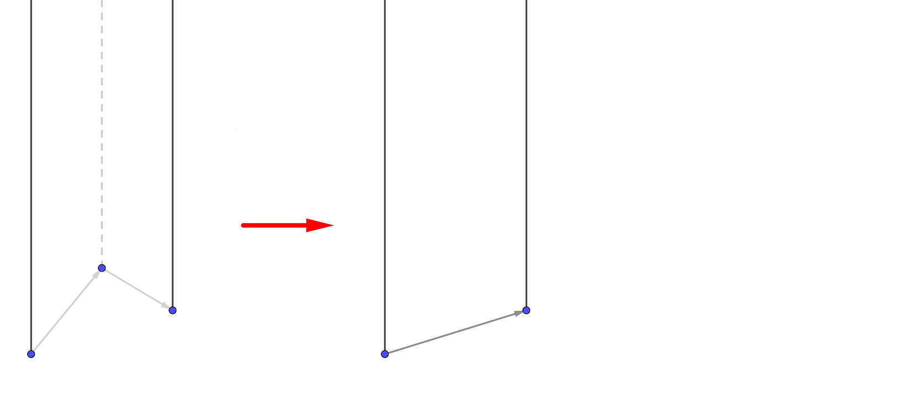
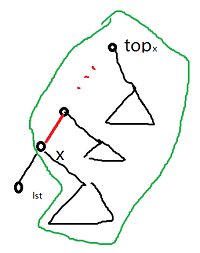
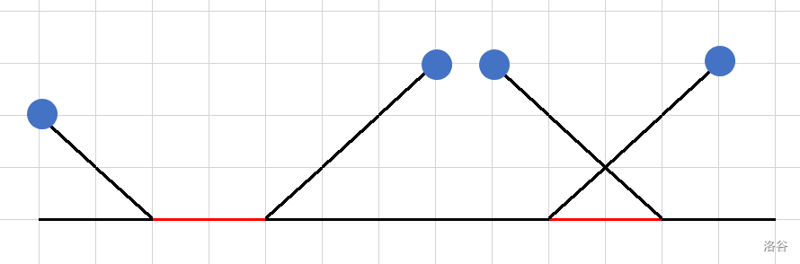
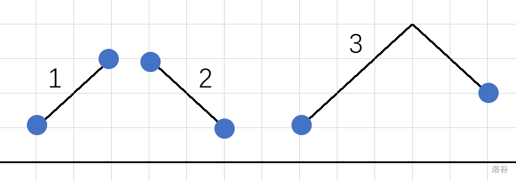
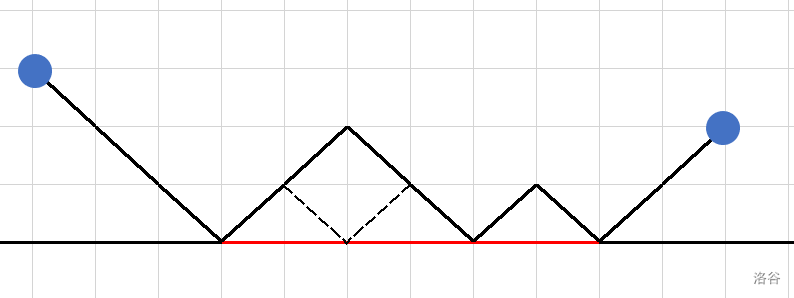
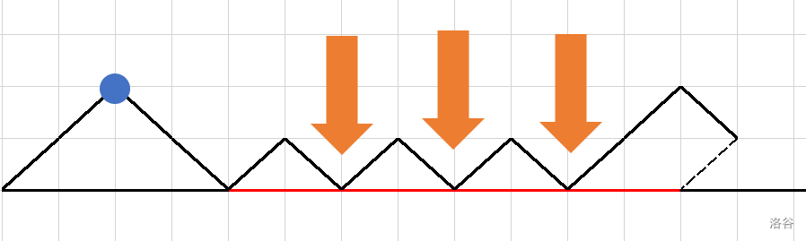

[TOC]

## [AT4512 [AGC030C] Coloring Torus](https://www.luogu.com.cn/problem/AT4512)

牛逼构造题。考虑如果 $k\le 500$ 有一种很显然的构造：
$$
\begin{matrix}
1&1&\dots&1&1\\
2&2&\dots&2&2\\
\vdots&\vdots&\ddots&\vdots&\vdots\\
k&k&\dots&k&k
\end{matrix}
$$
进一步地，如果 $k$ 是 $4$ 的倍数可以有如下的构造方式：
$$
\begin{matrix}
1&2&\dots&1&2\\
3&4&\dots&3&4\\
\vdots&\vdots&\ddots&\vdots&\vdots\\
k-1&k&\dots&k-1&k
&\end{matrix}
$$
看上去非常合理但是无法扩展到 $k$ 为 $2$ 的倍数或者任意 $\le 1000$ 的情况。考虑如下构造：
$$
\begin{matrix}
1&2&3&4&5&6\\
2&3&4&5&6&1\\
3&4&5&6&1&2\\
4&5&6&1&2&3\\
5&6&1&2&3&4\\
6&1&2&3&4&5
\end{matrix}
$$
正确性也是显然的，而且这个可以扩展：
$$
\begin{matrix}
1&2&3&4&5&6\\
2&3&4&5&6&\color{red}{7}\\
3&4&5&6&1&2\\
4&5&6&\color{red}{7}&2&3\\
5&6&1&2&3&4\\
6&\color{red}{7}&2&3&4&5
\end{matrix}
$$
仍然是正确的，一共有 $500$ 选择若干个插 $2$ 个就可以构造出所有 $\le 1000$ 的 $k$ 了。

## [AT5140 [AGC035C] Skolem XOR Tree](https://www.luogu.com.cn/problem/AT5140)

看到构造树可以考虑菊花或类似菊花。

如果 $n=2^k$ 的形式即 $n=\mathrm{lowbit(n)}$ 无解，因为不存在一些数异或起来为 $n$。

考虑 $2i\oplus 2i+1=1$，因此我们可以构造 $2i+1 \sim 2i\sim 1\sim (2i+1)'\sim (2i)'$，正确性不难验证。

现在还有一些细节，比如 $1'$ 放哪里。 $1'$ 直接连一个 $2i+1$ 那么 $1\to 1'$ 就满足条件了。

如果 $n$ 是偶数还会多出来一个 $n$，考虑怎么匹配。可以 $n\sim n-\mathrm{lowbit(n)}\sim 1\sim (\mathrm{lowbit}(n)+1)'\sim n'$，也可以验证是正确的。

## [P5495 Dirichlet 前缀和](https://www.luogu.com.cn/problem/P5495)

不难发现若 $a_x$ 对 $b_y$ 有贡献当且仅当 $x=\prod p_i^{\alpha_i}$，$y=\prod p_i^{\beta_i}$，$\forall k,\alpha _i\le \beta_i$。

发现这是可以高维后缀和直接做，根据某个经典结论 $\sum_{p\le n}\frac 1p\sim \log \log n$ 所以复杂度是 $\mathcal O(n\log\log n)$。代码十分好写：

```cpp
for(int i=1;i<=tot;i++)
	for(int j=1;j*pr[i]<=n;j++)
		a[j*pr[i]]+=a[j];
```

## [AT5696 [AGC041E] Balancing Network](https://www.luogu.com.cn/problem/AT5696)

有两个问题就两个问题分别考虑。

- 第一个子问题要求全部汇集到一个点，那么我们设 $f_{i,j}$ 表示从 $j$ 出发经过当前的限制器可不可以到达 $i$。新增一个限制器对应 $f_{x,j}=f_{y,j}=f_{x,j}\lor f_{y,j}$。可以用 `bitset` 优化到 $\mathcal O(\frac {nm}w)$ 。那么在 $\rm dp$ 完所有限制器之后 $f_i$ 全部为 $1$ 那么 $i$ 是可以作为终点的。一个终点来构造方案可以倒着 $\rm dp$，设 $dp_{i}$ 表示在当前限制器后能不能到达 $i$，转移类似上面的，在转移的时候决定方向即可。
- $m>0$，那么 $n=2$ 显然无解。对于 $n>2$ 我们考虑倒着构造，设 $end_i$ 表示经过后面的限制器第 $i$ 条线去了那里，而 $cnt_i$ 表示最后到 $i$ 的条数。我们知道之前的状态一定有合法解并构造出了一组  $cnt_i<n$ 的合法解。那么现在新增 $(x,y)$ 我们希望仍然有 $cnt_i<n$ 的性质。具体地，如果 $end_x=end_y$ 添加并没有影响，否则 $cnt_{end_x}$ 与 $cnt_{end_y}$ 必定有一个 $<n-2$ 把这个新增的 $1$ 移到那个 $<n-2$ 的即可。复杂度 $\mathcal O(n+m)$。

## [AT5759 ThREE](https://www.luogu.com.cn/problem/AT5759)

对 $\bmod 3$ 分类是 $0,1,2$，那么两个点要么是 $0,x$ 要么是 $1,2$

众所周知树是二分图，然后可以二分图染色。如果两个点距离为 $3$ 那么就是异色的点。

转换成一个更强的问题，任意两个异色的点要么有一个为 $0$ 要么是 $1$ 和 $2$。

考虑黑色点的数量 $x$ 与白色点的数量 $y$，如果黑点的个数比 $1$ 的个数多并且白点的数量比 $2$ 的数量多直接涂色剩下的用 $0$ 来补。

否则一定有一个不到 $\frac n3$，全部用 $0$ 去填剩下的放另一边。

因此这道题可以改成“路径长度为奇数”这一更强的限制，但是提示就更明显了。

## [CF1283F DIY Garland](https://www.luogu.com.cn/problem/CF1283F)

感觉把这个序列倒过来看就是选一个最小的叶子，然后删除叶子，加入父亲。就类似于一个 $\rm pr\ddot{u}fer$ 序列的有根树形式。所以我们就翻转 $a_i$ 。

那么就算出所有点在序列出现了多少次，出现 $0$ 次的就是叶子。然后枚举 $a_i$，那么现在编号最小的叶子就是 $a_i$ 的儿子，输出这条边，并且让 $a_i$ 的儿子数量减少 $1$。如果 $a_i$ 的变成了叶子就加进队列。

## [P2161 [SHOI2009]会场预约](https://www.luogu.com.cn/problem/P2161)

反正有一个不用动脑子的无脑线段树做法，因为线段数是 $\mathcal O(n)$ 的所以暴力删除复杂度是对的，然后就找重合的线段数即可。其实就是左端点 $[1,r]$ 并且右端点 $[l,n]$ 的，也就是找 $[1,r]$ 右端点的最大值并删除。

但是这样不优美，考虑一个 $<$ 定义为 $l_a<r_a$，那么根据 $\rm STL$ 里对等于的定义，$A\not<B\land B\not<A\iff A=B$ 因此就等价于有交。然后只需要用 $\texttt{set}$ 里的 $\texttt{find}$ 就能找到有交的了。然后删除就好了。

## [P4000 斐波那契数列](https://www.luogu.com.cn/problem/P4000)

众所周知斐波那契数列有循环节并且循环节长度 $\pi(p)\le 6p$。那么这个题很明显是让我们求出循环节然后对取模之后计算。

但是我们不需要找到精确的循环节，只需要找到一个循环节的倍数使得可以计算即可。

求循环节的倍数就相当于要找到 $i\ne j$ 满足 $F_i=F_j\land F_{i+1}=F_{j+1}$，那么 $\pi(p)\big{|}|i-j|$。

我们每次随机一个 $i$，然后查询 $(F_i,F_{i+1})$ 有没有出现过，如果出现过就相当于找到了循环节的倍数。

找到了循环节的倍数就做完了。根据生日悖论次数应该不会太高，期望次数应该是 $\mathcal O(\sqrt p)$。为了不要带 $\log$ 可以用光速幂预处理 $\begin{pmatrix}0&1\\1&1\end{pmatrix}$  的幂。

## [P6688 可重集](https://www.luogu.com.cn/problem/P6688)

思路很简单，就是维护 $\rm Hash$ 值。当 $l1,r1,l2,r2$ 确定时，这个 $k$ 是唯一确定的，就是 $\max_{i\in[l1,r1]}a_i-\max_{i\in[l2,r2]}a_i$ 然后傻乎乎写线段树维护。

其实可以用树状树组，因为就是两个的差除以长度，所以维护和就好了，常数显著减小。

## [CF1264F Beautiful Fibonacci Problem](https://www.luogu.com.cn/problem/CF1264F)

我们知道 $\pi(10^9)=1.5\times 10^9$。我们记 $N$ 为这个值。然后有一些结论：

- $f_{xN}\equiv 0\pmod{10^9}$ 。证明略。
- $f_{N+1}\equiv 1\pmod {10^9}$。可以打表验证 $f_{N+1}=t\times 10^9+1$，其中 $t\perp10$。可以得到 $t\equiv 584177449\pmod{10^9}$ 即 $f_{N+1}\equiv t
  \times 10^9+1\pmod{10^{18}}$
- $f_{2N+1}\equiv f_N^2+f_{N+1}^2\equiv f_{N+1}^2\equiv 10^9\times 2t+1 \pmod {10^{18}}$。归纳一下不难得到 $f_{xN+1}=10^9\times xt+1\pmod {10^{18}}$。

这个东西就很有意思了，实际上就提供了一种线性变换，带入一个 $x$ 得到的是关于 $x$ 线性的。那么如果 $xt\equiv a+id \pmod {10^9}$ 就做完了。也就是 $x\equiv t^{-1}a+i\times t^{-1}d \pmod{10^9}$。那么 $xN+1=(N(t^{-1}a)+1)+i\times (N(t^{-1}d))$。到这一步构造就比较显然了，直接令 $b=N(t^{-1}a\bmod 10^9)+1$，$e=N(t^{-1}d\bmod 10^9)$ 即可。$t\perp10$ 所以求逆直接 $\rm exgcd$ 就好了。

## [P3725 [AH2017/HNOI2017]队长快跑](https://www.luogu.com.cn/problem/P3725)

首先这个 $\theta$ 仔细分析一下就可以知道可以把线掰成向上和向下的，具体操作是如果在上面的线如果与路径有交点就是向下否则向上，下面的就是反一反。然后一个合法的方案必然是在上下端点前进。

然后对上下维护两个凸壳。现在新加入了一条线，那么可以证明只有以下两种情况：

- 如果加入后不形成合法凸壳，就弹出队尾直到合法为之。这个点的 $pre$ 就是上一个点。



- 但是也有可能被另一侧截断了。可以证明如果出现截断的情况肯定是从对面来更优，这一侧只剩下过来的那个点以及现在新的点。

## [P3703 [SDOI2017]树点涂色](https://www.luogu.com.cn/problem/P3703)

记 $v_i$ 为 $i$ 到根的颜色数，那么如果 $x$ 是 $y$ 的祖先那么 $x\sim y$ 这条路径上的颜色数量就是 $v_y-v_x+1$。进一步地，$u\sim v$ 这一条路径上的颜色数量为 $v_u+v_v-2v_{lca}+1$。

然后我们的问题是去维护 $v_i$ 了。经过高妙的复杂度分析我们知道每次暴力覆盖一段颜色相同的复杂度是正确的。然后我们考虑覆盖 $x\to top_x$ 这一段的颜色原来是相同的，现在要全部改成新颜色。其中 $top_x$ 指的是 $x$ 这种颜色的顶端而不是数剖上的顶端。

首先考虑 $x$ 这种颜色恰好是从 $x$ 开始的，那么考虑下面一张图：



然后就发现绿圈内的值统一减去 $v_x-1$。然后就是把 $top_x$ 的子树减去 $v_x-1$ 再在 $x$ 里面加上。 

然后如果 $x$ 上的颜色会延伸下去，那么延伸下去的子树要额外加一，因为当前颜色没有被完全覆盖。

两只 $\log$ 还不如 $\rm LCT$ (bushi

## [CF963D Frequency of String](https://www.luogu.com.cn/problem/CF963D)

非常刺激的题目。我们知道对于所有长度为 $l$ 的的字符串，$\rm endpos$ 的和的大小应该是 $|S|-l+1$ 。然后因为这些串的长度和也是 $\mathcal O(n)$ 的，大于 $\sqrt n$ 的最多有 $\sqrt n$ 个，小于 $\sqrt n$ 的最多有 $\sqrt n$ 种，因此不同的长度最多有 $\mathcal O(n\sqrt n)$ 的。所以暴力枚举 $\rm endpos$ 中相邻 $k$ 的位置的最小值复杂度是正确的。

所以我们的目标是求出 $\rm endpos$ 集合。你大可以 $\rm SAM$ 上线段树合并但是代码极其难写。不过其实可以用 `bitset` 在 $\mathcal O(\frac{ST}w)$ 的时间内求出，大概就是储存每个字母出现在那些位置，枚举 $i$ 的值 $T_i$ 然后把 $pos_{T_i}<<i$ 全部与起来仍然为 $1$ 的就是 $\rm startpos$ 了。

然后不能暴力枚举位置不然复杂度就错了。应该用 `._Find_first()` 找到第一个为 $1$ 的然后 `._Find_next(i)` 找到下一个为 $1$ 的。

 ## [P3248 [HNOI2016]树](https://www.luogu.com.cn/problem/P3248)

思路不难但是树套树实现起来比较恶心。

首先我们可以把一次拷贝得到的点缩成一块，然后把它穿过父亲块的边权压到边上。

然后查询的时候先把 $a,b$ 移动到各自的根，然后往上跳直到 $\rm lca$ 下面一个点，根据刚才的定义我们已经到 $\rm lca$ 下面的路径长度加起来了。那么从这两块的根再往上跳一步就都在 $\rm lca$ 块上了，然后再在原树上得到这两点距离。

在同一块内与两块是祖孙关系的情况是平凡的这里就不讨论了。

## [CF27E Number With The Given Amount Of Divisors](https://www.luogu.com.cn/problem/CF27E)

因为 $\rm W\color{red}{YH\_AK}$ 写了才来写这道题。

首先我们知道一个质因子出现了 $c$ 次答案就要乘上 $(c+1)$ 因此最多有 $10$ 个质因子。

因为怕和【】一样写挂然后就写了 $\rm dp$，记 $dp[i][j]$ 表示用了前 $i$ 个质数现在的个数是 $j$ 的最小的值。然后 $\rm dp$ 方程特别显然就不写了。

## [AT2374 [AGC014B] Unplanned Queries](https://www.luogu.com.cn/problem/AT2374)

首先发现一个环肯定没有贡献，那么把这些环删去得到的加边就是森林。

然后再毛估估一下如果加边构成了一棵树肯定无解，进一步地，如果是森林也无解，所以唯一有解就是只剩下一堆点。

于是我们得到了有解任何树都是有解的，无解对任何树都是无解的。然后拿条链模拟就好了。

## [P3526 [POI2011]OKR-Periodicity](https://www.luogu.com.cn/problem/P3526)

牛🐮逼题

首先众所周知 $s$ 有长度为 $l$ 的周期等价于有 $|s|-l$ 的 $\rm border$。

考虑 $solve(s)$ 为字典序最小的、$\rm border$ 集合与 $s$ 相同的 $01$ 串，有以下的情况：

1. 如果 $s$ 所有字符相同，扔回去 $|s|$ 个 $0$
2. 如果 $s$ 周期集合为空，那么返回 $|s|-1$ 个 $0$ 加上 $1$ 个 $1$
3. 如果 $s$ 的最小周期 $len$ 满足 $2len\le |s|$，设 $t=s[0,len-1]$，那么 $s$ 可以写成 $ttt\dots t'$ 的形式，其中 $t'$ 是 $t$ 的一个前缀，可为空。
4. 否则 $s$ 的最小周期 $len$ 满足 $2len>|s|$，设 $\rm border$ 为 $t$ 那么 $s$ 可以表示为 $tat$ 的形式，显然 $a$ 不为空。

对于第 $3$ 种情况可以构造 $tt'$ 得到 $qq'$，然后 $qqq\dots q'$ 就是正确的构造了。根据 $\rm Weak\ Periodicity\ Lemma$ 所有大于 $|qq'|$ 的 $\rm border$ 都可以被不重不漏地构造出来，而 $<|qq'|$ 的 $\rm border$ 在子问题中已经被正确构造了。因此是正确的。

对于第 $4$ 种情况，可以先求解 $p=solve(t)$，然后 $\le |t|$ 的 $\rm border$ 已经构造完毕了，我们希望 $pap$ 最长的 $\rm border$ 是 $|t|$ 而不是其他什么奇奇怪怪的值。我们希望 $a$ 全为 $0$。然是可能让 $\rm border$ 变大。考虑如果把 $a$ 最后一位变成 $1$ 之后肯定合法，因为 $0\dots1t=t0\dots0$ 感觉就不大可能匹配上。

然后模拟这个构造过程就好了。

## [P4462 [CQOI2018]异或序列](https://www.luogu.com.cn/problem/P4462)

首先可以变成前缀和 $sum_i$，然后就相当于问  $[l-1,r]$ 有多少对 $(i,j)$ 使得 $sum_i\oplus sum_j=k$。随便写个莫队就可以维护了。

## [CF671E Organizing a Race](https://www.luogu.com.cn/problem/CF671E)

首先转化一下题意，记 $G_i$ 为 $g_i$ 的前缀和，$W_i$ 为 $w_i$ 的前缀和，那么两个条件：
$$
\forall i\in[l,r),
\begin{cases}
G_i-G_{l-1}\ge W_i-W_{l-1}\\
G_r-G_i\ge W_{r-1}-W_{i-1}
\end{cases}
$$
然后移项：
$$
\forall i\in[l,r),
\begin{cases}
G_i-W_i\ge G_{l-1}-W_{l-1}\\
G_r-W_{r-1}\ge G_i-W_{i-1}
\end{cases}
$$
不妨记 $a_i=G_i-W_i,b_i=G_i-W_{i-1}$，得到：
$$
\forall i\in[l,r),\begin{cases}a_i\ge a_{l-1}\\b_i\le b_r\end{cases}
$$
但是现在还有加操作。显然一次 $g_{i}++$ 会让 $j\ge i$ 的 $a_{j},b_{j}$ 都增加一。然后如果没有 $b$ 的限制，那么肯定是全部加在 $l$ 位置上。但是现在有 $b$ 的限制，也就是说对于 $r$ 找到第一个大于 $b_r$ 的位置 $p_1$，在 $p_1+1$ 的位置加上 $b_{p_1}-b_r$（为了满足 $a$ 的限制肯定加在最前面）。然后找到第一个大于 $b_{p_1}$ 的位置 $p_2$ 在 $p_2+1$ 的位置加上 $b_{p_2}-b_{p_1}$……然后一直操作到 $l$，现在就是判断 $\max \{0,a_{l-1}-\min_{i\in[l,r)}{a'_i}\}$ 是否还足够即可。

然后还可以发现，如果把这些值加在 $a'_l$ 和把这些值加在任何 $t\le l$ 的 $a'_t$ 是等价的，因此我们可以找到最大的 $p$ 使得满足这一段要加的值是 $\le k$ 的，把所有 $p$ 之前的增加操作撤销，然后就相当于找再这段区间内最小的满足 $a_{l-1}-\min_{i\in[l,r)}{a'_i}\le k-\text{已经的代价}$，的 $l$。如果我们可以求出一段区间这玩意儿的最小值就可以线段树上二分了。

首先我们肯定要区间加，因此可以先把 $[r,n]$ 加上 $+\infty$ 使得强制是 $i\in[l,r)$。然后需要一棵有技巧的线段树。

在一个节点 $[l,r]$ 维护 $4$ 个值：

- $mn1_u$ 指 $\min_{i\in[l,r]}a'_i$
- $mn2_u$ 指 $\min_{i\in[l,r]}a_{i-1}$
- $tag_u$ 指区间更改的值
- $lans_u$ 指只考虑左儿子中的点在 $[l,r]$ 中的答案，即 $\min_{i\in[l,mid]}\{a_{i-1}-\min_{j\in[i,r]}a'_j\}$

前面的维护都是显然的，考虑第三个如何维护。

我们考虑函数 $\mathrm{calc}(u,sufmn)$ 返回节点 $u$ 后缀最小值为 $sufmn$ 时的答案，其中 $lans_u$ 就是 $\mathrm{calc}(\mathrm{LeftSon}_u,mn1_{\mathrm{RightSon_u}})$。

这个 $\rm calc$ 其实想一想就知道 $lans$ 是用来干什么的了，如果 $mn1_{\mathrm{RightSon}_u}\ge sufmn$，那么右儿子的贡献就是 $mn2_{\mathrm{RighSon_u}}-sufmn$，左儿子递归处理；否则右儿子比 $sufmn$ 小则左儿子的贡献就是 $lans_u$，右儿子递归处理。

有了这个 $\rm calc$ 线段树的其他操作都比较好写了。

## [CF1151E Number of Components](https://www.luogu.com.cn/problem/CF1151E)

大受震撼

根据某个典中典，连通块个数等于 点数 $-$ 边数。然后计算每个点被统计了多少遍，每条边被统计了多少遍，然后就做完了。

## [CF568B Symmetric and Transitive](https://www.luogu.com.cn/problem/CF568B)

满足对称性，传递性，但不满足自反性，也就是说有一些 $(x,x)$ 不在 $\rho$ 中，那么设有 $0<i\le n$ 族不在 $\rho$ 中，那么还有 $n-i$ 组在 $\rho$ 中，这些在 $\rho$ 中的必然构成连通块，这些的方案数就是 $\sum \left\{\begin{matrix}n-i\\j\end{matrix}\right\}$。最后答案就是：
$$
\sum_{i=1}^n\binom ni\sum_{j=0}^{n-i} \left\{\begin{matrix}n-i\\j\end{matrix}\right\}
$$

## [CF710E Generate a String](https://www.luogu.com.cn/problem/CF710E)

首先有个十分 $\rm Naive$ 的 $\rm dp$ 方程：
$$
f_i=\begin{cases}
\min(f_{i/2}+y,f_{i-1}+x),&i \text{\ is even}\\
\min(f_{i+1}+x,f_{i-1}+x),&i \text{\ is odd}\\
\end{cases}
$$
这个奇数的情况使得 $\rm dp$ 出现了环，而 $10^7$ 也不像是最短路跑得过去的。但是细心分析一波，奇数只有可能减一次，如果减了两次还不如在翻倍前减一次。

于是得到比较优秀的 $\rm dp$ 方程：
$$
f_i=\begin{cases}
\min(f_{i/2}+y,f_{i-1}+x),&i \text{\ is even}\\
\min(f_{(i+1)/2}+x+y,f_{i-1}+x),&i \text{\ is odd}\\
\end{cases}
$$

## [CF840B Leha and another game about graph](https://www.luogu.com.cn/problem/CF840B)

首先如果没有 $-1$ 并且 $d_i$ 的异或和不为 $0$ 直接输出 $-1$ 跑路。

否则以 $-1$ （如果没有 $-1$ 随便找一个点）为根，从下往上构造，肯定可以构造出一组合法解。

## [CF525D Arthur and Walls](https://www.luogu.com.cn/problem/CF525D)

首先发现如果一个 `*` 使得无法构成矩形一定是下面的情况：

```
.* 
..
```

然后把这个 `*` 改掉，$\rm dfs$ 看看周围会不会继续改即可。

不太清楚为什么 c++14 可以过 c++17 过不了

## [CF915D Almost Acyclic Graph](https://www.luogu.com.cn/problem/CF915D)

这个 $n$ 很小但是 $m$ 很大就很有意思。

比较 $\rm Naive$ 的想法是找到一个环，环上最多有 $n$ 条边，暴力删去之后检验即可。

但是这样的做法不优美，考虑进入一个点的边删去那一条都是等价的，所以枚举 $i$，先给 $i$ 的入度减一，然后再拓扑排序即可。

## [CF915F Imbalance Value of a Tree](https://www.luogu.com.cn/problem/CF915F)

首先肯定可以把最大值和最小值拆开来考虑。两者显然等价只考虑最大值即可。

最大值就按边权排序，然后从小到大连边，然后一条边的贡献就是边权乘上两边连通块的大小。

然后发现题目是点权，但是可以让边权变成两个点的较大值。

最小值同理。

## [P6792 [SNOI2020] 区间和](https://www.luogu.com.cn/problem/P6792)

先来复习一下吉司机线段树的复杂度为什么不会太高，再一个节点上记录最小值和次小值，记一个节点的权值 $\varphi$ 为本质不同的数的数量，往下递归说明这次的 $val$ 至少大于等于次大值，因此肯定能使 $\varphi$ 至少减 $1$。所以复杂度差肯定是低于 $n\log^2n$ 的。

然后考虑让最小值变大，但是在最小值变大的过程中可能最大前缀和/最大后缀和/最大和会发生改变，但是毛估估一下改变的次数只有 $n\log n$ 次因此每一次要更改的时候暴力递归到子树复杂度是正确的，仍然是两只 $\log$。因此在 $\rm pushup$ 的时候需要再维护一个 $M$ 表示超过这个数之后最大前缀和/最大后缀和/最大和中的一个会发生改变。

这个 $M$ 是最后剩下的问题，首先肯定要对左右儿子的 $M$ 取 $\min$，然后如果最大前缀是在 $[l,mid]$ 里的，那么有可能会被 $[l,mid]+[mid+1,r]$ 取代，其中 $[mid+1,r]$ 是右儿子的最大前缀。最大后缀和以及最大和同理。

 ## [CF662B Graph Coloring](https://www.luogu.com.cn/problem/CF662B)

首先一棵树的根是否选中被确定后，这棵树就确定了。进一步地，一个连通块最多只有两种方案。于是枚举最后全部红色还是全部蓝色，然后枚举每个连通块的两种方案哪个更优即可。

## [CF1100E Andrew and Taxi](https://www.luogu.com.cn/problem/CF1100E)

然后只需要而二分枚举这个最大值，然后大于这个最大值的边不形成环就一定有解。

构造直接比较两个位置的拓扑序然后连边就好了。

## [P4943 密室](https://www.luogu.com.cn/problem/P4943)

显然只有四种方案，分别去 $x,y$，一个人走完全部。

随便写个最短路就好了。

## [CF109C Lucky Tree](https://www.luogu.com.cn/problem/CF109C)

首先枚举 $i$，然后发现这个 $j$ 和 $k$ 的选法就是有多少方案。然后有多少方案就是 $n-\text{没有幸运边}$。没有幸运边就是 由非幸运边组成的连通块的大小，然后就做完了。

## [CF457C Elections](https://www.luogu.com.cn/problem/CF457C)

首先我们钦定一个 $x$ 作为自己的票数，然后其他人都需要贿赂最便宜的使得 $<x$，如果不够就继续贿赂知道达到 $x$ 张票，毛估估这个函数是先降后升的。当让可以直接在 $f(x+1)-f(x)$ 上二分找到最后一个小于 $0$ 的点。

## [CF73D FreeDiv](https://www.luogu.com.cn/problem/CF73D)

首先 $k=1$ 的情况十分显然就是连通块个数减 $2$ 。

然后记 $cnt$ 为连通块个数，$s=\sum \min(sz,k)$，那么答案有一个很显然的下界是 $cnt-1-\lfloor\frac s2\rfloor$。可以通过一些巧妙的方式构造出来。

## [P2501 [HAOI2006]数字序列](https://www.luogu.com.cn/problem/P2501)

这个严格单调上升看起来就很烦，所以我们把 $a_i$ 减去 $i$ 使得变成单调不降。

单调不降就简单很多了啊，毛估估肯定是取出现过的值，$\mathcal O(n^2)$ 随便写个 $\rm dp$ 就 $90$ 分了。

然后那个最后 $10\%$ 数据随机，不变的值肯定是最长上升子序列大概长度是 $\mathcal O(\log n)$ 的，所以直接 $\rm dp$，具体就是枚举上一个点 $i<j$ 使得 $j$ 是从 $i$ 转移过来。然后因为是转移过来的肯定不存在一个 $k\in(i,j)$ 使得 $a_k\in[a_i,a_j]$，于是最后肯定是 $a_i,\dots,a_i,a_j,\dots,a_j$ 的形式，因为数据随机随便写一写都能过。

## [P3336 [ZJOI2013]话旧](https://www.luogu.com.cn/problem/P3336)

首先有一定的阅读理解技巧发现是 **极小值** 为 $0$ 换句话说如果开始下降就必须下降到底。然后就是可以 $\rm dp$ 了，记 $f_{i,0/1}$ 表示到了第 $i$ 个点上一条边是从下面来还是从上面来。然后就可以 $\rm dp$ 了：

记上一个点为 $(x_1,y_1)$ 这个是 $(x_2,y_2)$，那么有两种连接方式：天上连接和地上连接。记 $len=x_2-y_2-x_1-y_1$。发现 $len>0$ 只能天上连接，否则只能地上连接。





### 天上连接



可以证明就这三种情况。转移直接模拟就好了。

### 地上连接

$len=0$ 的情况是平凡的就不讨论了。



如果最后一个点是上升的，那么方案数就是 $2^{len/2-1}$，相当于 $\frac {len}2-1$ 个位置中（必须是偶数）选若干个接地面。



然后如果是下降上面的式子仍然成立。

方案数会统计了但是最高仍然是问题。如果两个是天上连接并且可以取道（指正的 $\rm dp$ 一遍反的一遍两边否可以上升），就形成一个高度为 $\frac{x_2-x_1+y_1+y_2}2$ 的峰，对所有峰取最大值。

## [P3558 [POI2013]BAJ-Bytecomputer](https://www.luogu.com.cn/problem/P3558)

首先不知道从那里知道 $a_i$ 最后的取值也是只有 $\{-1,0,1\}$，记 $f_{i,j}$ 为 $i$ 的位置值是 $j-1$，然后对 $a_i$ 分类讨论。初始是 $f_{1,a[1]+1}=0$。

1. $a_i=1$，那么 $f_{i,0}=f_{i-1,0}+2$，$f_{i,1}=f_{i-1,0}+1$，$f_{i,2}=\min(f_{i-1,0/1/2})$
2. $a_i=0$，那么 $f_{i,0}=f_{i-1,0}+1$，$f_{i,1}=\min(f_{i-1,0/1})$，$f_{i,2}=f_{i-1,2}+1$
3. $a_i=-1$，那么 $f_{i,0}=f_{i-1,0}$，$f_{i,2}=f_{i-1,2}+2$

然后 $\rm dp$ 就好了。

## [P5301 [GXOI/GZOI2019]宝牌一大堆](https://www.luogu.com.cn/problem/P5301)

~~果然麻将什么的最有趣了~~

首先国士无双和七对子直接暴力判断就好了，复杂度不会太高。

然后考虑如果开杠，就算是宝牌 $2\times \binom44<\binom43$ 所以肯定不会杠，因此只需要考虑 『$3\times4+2$』 就可以了。因为有顺子所以要记录最后三张牌的张数。考虑这样一个 $\rm dp$：$dp_{i,j,k,a,b,c}$ 表示到第 $i$ 张牌，有 $j$ 个面子，$k$ 个雀头，$i/i+1/i+2$ 分别选了 $a/b/c$ 张，记 $\mathrm{calc}(x,y)$ 表示第 $x$ 张牌选 $y$ 张的贡献，那么可以转移：

1. 选 $i$ 形成雀头 $f_{i,j,1,a+2,b,c}\leftarrow f_{i,j,0,a,b,c}\div\mathrm{calc}(i,a)\times \mathrm{calc}(i,a+2)$
2. 选 $i$ 形成刻子 $f_{i,j+1,k,a+3,b,c}\leftarrow f_{i,j,k,a,b,c}\div \mathrm{calc}(i,a)\times \mathrm{calc}(i,a+3)$
3. 选 $i,i+1,i+2$ 形成顺子 $f_{i,j+1,k,a+1,b+1,c+1}\leftarrow f_{i,j,k,a,b,c}\div(\mathrm{calc}(i,a)\mathrm{calc}(i+1,b)\mathrm{calc}(i+2,c))\times (\mathrm{calc}(i,a+1)\mathrm{calc}(i+1,b+1)\mathrm{calc}(i+2,c+1))$

然后转移到 $i+1$ 就好了 $f_{i+1,j,k,b,c,0}\leftarrow f_{i,j,k,a,b,c}$。

最后的答案就是 $\max f_{34,4,1,*,0,0}$。

## [P3649 [APIO2014]回文串](https://www.luogu.com.cn/problem/P3649)

narrowly pass/kk

首先考虑 $\rm Manacher$ 的过程中，一共扩展的次数是 $\mathcal O(n)$ 的，并且转移得到的串一定是之前扩展过的。因此 $\rm Manacher$ 不漏地遍历了所有回文子串。

然后考虑如何统计一个子串 $[l,r]$ 出现了多少次，就是在 $r$ 的结束位置往上跳尽可能高使得 $len_i\ge r-l+1$。写个倍增就可以了。

## [P5289 [十二省联考 2019] 皮配](https://www.luogu.com.cn/problem/P5289)

好像确实只考了背包/jy

首先考虑有一个很 $\rm Naive$ 的 $\mathcal O(nM^2)$ 的 $\rm dp$ 就是枚举蓝阵营选了多少个，鸭派选了多少个。然后就有了 $\rm 50pts$。

然后考虑 $k=0$ 的情况怎么做，发现一个城市加入那个阵营与一所学校加入那个派系是无关的，然后就有了一个 $\mathcal O(nM)$ 的算法，也就是 $f_{i}$ 表示 $i$ 个人去蓝阵营，$g_i$ 表示 $i$ 个人去鸭。那么恰好 $i$ 个人在蓝队，$j$ 个人在鸭派的方案数就是 $f_{i}g_{j}$。

现在有 $k$ 个人有限制，那么考虑有之多 $k$ 个1城市有限制，对没有限制的城市和没有限制的人跑上面的 $\rm dp$。然后考虑有限制的人和城市。

记 $F_{j,k}$ 是之前被限制的城市有 $j$ 个选手去蓝，被限制的学校  $k$ 个去鸭的方案数，那么记 $G_{k,0/1}$ 表示当前城市去蓝/红 鸭派人数为 $k$ 的方案数。转移是一个卷积的形式所以复杂度是 $\mathcal O(kM^3)$ 的，还不如一开始的暴力。

考虑之所以会有卷积的形式是因为要枚举之前选了多少个鸭，现在有多少个鸭。那么我们干脆把 $\rm dp$ 变成如下形式：$F_{j,k}$ 表示当前城市去红，之前一共 $j$ 个人去蓝，到现在一共 $k$ 个人去鸭的方案数，$G_{j,k}$ 表示当前城市去蓝，最后 $F_{j,k}\leftarrow G_{j-\text{这个城市的人数},k}$ 即可。发现这样就能做到 $\mathcal O(kM^2)$，当然 $\rm dp$ 的上界不用到 $M$ 所以是跑不满的。

最后枚举受限制的城市共 $i$ 个去了蓝，受限制的学校 $j$ 个去了鸭，不难得出剩下的城市和学校人数的限制，然后用前缀和暴力计算即可。

## [UVA1437 String painter](https://www.luogu.com.cn/problem/UVA1437)

考虑如果 $A$ 是空串，那么 $B$ 的最小操作次数有一个绿色的 $\rm dp$：$f_{i,j}$ 表示 $[i,j]$ 变得和 $B$ 相同最少需要的次数，显然有 $\rm dp$：
$$
f_{i,j}=\begin{cases}
1&,i=j\\
\min(f_{i,j-1},f_{i+1,j})&,B_i=B_j\\
\min(f_{i,k}+f_{k+1,j})&,\text{otherwise}
\end{cases}
$$
然后这个显然是答案的上界，但是可能会有一些位置 $A_{i}=B_i$ 使得不需要刷，这是用 $g_i$ 表示刷到与 $[1,i]$ 一样的最小操作数，如果 $A_i=B_i$ 那么 $g_i=g_{i-1}$，否则 $g_i=\min(g_k+f_{k+1,i})$。然后输出 $g_n$ 就可以了。

## [P2466 [SDOI2008] Sue 的小球](https://www.luogu.com.cn/problem/P2466)

发现这个玩意儿还需要记录一个时间然后复杂度直接爆炸。

首先 $y$ 是没用的可以扔掉，然后再发现收集肯定是一个区间扩大的过程因为再返回肯定不优。然后就是再前往的过程中会过一段时间，这段时间所有未被收集的星星都会有损失，那么直接 $\rm dp$ 最小的损失就没有后效性了。用一个 $f_{i,j,0/1}$ 表示再 $[i,j]$ 的左边/右边且全部收集完的最小损失，然后应该就

## [P2585 [ZJOI2006]三色二叉树](https://www.luogu.com.cn/problem/P2585)

首先根据题意我们是可以把字符串变成唯一对应的树的。

然后在这一棵树上 $\rm dp$ 就好了，$f_{i,0/1/2}$ 表示 $i$ 涂某一种颜色的最大值（最小值），暴力转移就好了。

## [P3698 [CQOI2017]小Q的棋盘](https://www.luogu.com.cn/problem/P3698)

只会非常菜的 $\rm dp$ 最后发现是贪心。

首先走最长链，如果走不完就直接输出 $m+1$ 跑路。

否则发现多走两步就能使走到的点增加 $1$ 所以再加上这一部分即可。

最后可以证明这样是对的。

## [P5658 [CSP-S2019] 括号树](https://www.luogu.com.cn/problem/P5658)

首先有一个非常 $\rm Naive$ 的想法是记录 $s_i$ 为根到 $i$ 的前缀和，$($ 为 $+1$，$)$ 为 $-1$。那么对于一个位置 $u$ 新增了多少能算就做完了。如果 $v\to u$ 合法当且仅当 $s_v=s_u$ 并且路径上的每一个点的 $s\ge s_u$。那么就相当于找到第一个 $< s_u$ 的位置 $x$ 然后查询在 $x\to u$ 有多少个是 $s_u$。求这个可以开一个桶记录。现在问题是找到第一个 $x$，但是我们发现这个前缀和一定是连续变化的，然后只要找到上一个是 $s_u-1$ 的就可以了，同样可以用桶维护。

## [P3177 [HAOI2015]树上染色](https://www.luogu.com.cn/problem/P3177)

首先肯定是想 $f_{i,j}$ 表示 $i$ 的子树选了 $j$ 个黑点的最小贡献，现在要合并的时候就是现在 $u\to v$ 这条边被计算了多少次，然后复杂度看上去向 $3$ 次方但是是能过的。

当然暴力 $\rm dp$ 常数有点大，要直接在原数组上操作，如果是 $-\infty$ 可以 `continue`。

## [P4395 [BOI2003]Gem 气垫车](https://www.luogu.com.cn/problem/P4395)

猜了一个 $1/2$ 的结论感觉不大对经果然是错的。

颜色数量大概是 $\log n$ 级别的，所以带一个 $20$ 左右基本上就稳过了。

## [P1896 [SCOI2005]互不侵犯](https://www.luogu.com.cn/problem/P1896)

首先正经算法肯定是枚举轮廓线做到 $\mathcal O(\mathrm{poly}(n)2^n)$ 但是这个不怎么好写。

其实可以直接枚举上一行的状态和现在这一行的状态，然后因为状态数毛估估是不多的并且 $n\le 9$ 所以跑得飞快。

## [P3694 邦邦的大合唱站队](https://www.luogu.com.cn/problem/P3694)

首先考虑如果最后的排列固定那么答案也是固定的。

那么考虑现在是 $f_{S}$ 表示 $S$ 的固定最少出列的个数，那么现在的长度已经确定了，然后又来了一个 $i$，那么就是扩展到的这段区间内是 $i$ 的不用出列其他都要出列。

然后就非常好写了。

## [P4925 [1007]Scarlet的字符串不可能这么可爱](https://www.luogu.com.cn/problem/P4925)

首先这个 $s$ 的限制显然是没有用的，所有字符的都是等价的直接除 $k$ 就好了。

有长度大于 $1$ 的回文串就必然出现回文中心形如 $AA$ 或 $ABA$。

那么第一个有 $k$ 种选择，第二个有 $k-1$ 种选择，从第三个开始都只有 $k-2$ 种选择了。

如果 $s\ne 0$ 那么是 $(k-1)(k-2)^{l-2}$ 否则就是 $k(k-1)(k-2)^{l-1}$

就是 $l=1$ 需要特判。

## [P2157 [SDOI2009]学校食堂](https://www.luogu.com.cn/problem/P2157)

首先看到 $b$ 很小所以可以 $\rm dp$，记 $dp_{i,S,j}$ 表示 $i$ 之前的都吃过了，从 $i$ 开始后 $8$ 个的状态是 $S$，然后上一个吃饭的人是 $i+j$，那么有转移：
$$
dp_{i+1,S\setminus \{i\},-1}\leftarrow dp_{i,S,*}\quad i\in S\\
dp_{i,S\cup\{i+k\},k}\leftarrow dp_{i,S,j}+T_{i+j}\oplus T_{i+k}\quad i+k\notin S
$$

## [P2167 [SDOI2009]Bill的挑战](https://www.luogu.com.cn/problem/P2167)

看到恰好，又看到 $n$ 很小，直接钦定若干个使得满足，然后二项式反演就做完了。

