[TOC]

## [P2396 yyy loves Maths VII](https://www.luogu.com.cn/problem/P2396)

思路不难，就是 $dp_{S}$ 表示丢掉的集合为 $S$ 的方案数，转移也是显然的，然后就能够 $\rm TLE$ 了。

考虑卡常，首先如果 $sum_{S}$ 是厄运数字就不用转移了，然后如果枚举 $i\in S$ 的时候可以用 $\rm lowbit$ 来找到非 $0$ 位。然后就卡过去了。

## [P4484 [BJWC2018]最长上升子序列](https://www.luogu.com.cn/problem/P4484)

首先就是 $n$ 的排列两个形状相同的杨表是双射。然后枚举杨表的形状 $\lambda$，然后最长上升子序列长度就是 $\lambda_1$，然后就相当于下面这个东西。
$$
\frac1{n!}\sum_{\lambda\vdash n} f_{\lambda}^2\lambda_1
$$
然后枚举 $\lambda\vdash n$ 是 $p(n)$ 的，《ANALYTIC COMBINATORICS》已经给出 $P_n\sim \frac1{4n\sqrt{3}}\exp\left(\pi\sqrt{\frac {2n}3}\right)$，然后就是一个非常优秀的亚指数算法。

## [P4363 [九省联考 2018] 一双木棋 chess](https://www.luogu.com.cn/problem/P4363)

思路仍然不难，发现一定是一个阶梯形，然后这个轮廓线的个数就是 $\binom{20}{10}$ 非常少直接暴力 $\rm dp$ 就可以了。

然后就倒着 $\rm dp$，如果是菲菲就让 $a-b$ 最大，牛牛就让 $a-b$ 最小，然后 $\rm dp$ 的时候就 $\rm dfs$ 枚举这个轮廓线然后这样需要的状态之前都处理好了所以是对的。

## [P5005 中国象棋 - 摆上马](https://www.luogu.com.cn/problem/P5005)

看到 $Y\le 6$ 就直接存下这一行和上一行的状态，然后新添加一行暴力判断一下是否会有🏇被吃掉。

然后 $\rm 1MB$ 直接滚动数组就好了。

## [CF1108F MST Unification](https://www.luogu.com.cn/problem/CF1108F)

首先拉出一棵最小生成树，然后对于一条非树边，那么肯定要比 $u\to v$ 的路径上的最大的要大，然后就能的出一个可行解，毛估估就是对的。

## [CF379F New Year Tree](https://www.luogu.com.cn/problem/CF379F)

感觉这题迟早要掉蓝。

动态加叶子非常 $\rm Naive$，只需要倍增就能维护 $\rm LCA$ 了。然后因为两个连通块的直径一定是在两两直径端点上取得，所以暴力维护最长直径即可。

## [P3200 [HNOI2009]有趣的数列](https://www.luogu.com.cn/problem/P3200)

把数列变成两行，那么就是第一行是递增，第二行是递增，每一列是递增。

然后直接杨表的 $\rm Hook$ 公式就做完了。因为 $p$ 不一定是质数所以直接在质因子统计贡献。

毛估估应该是 $\mathcal O(n\lg\lg n)$ 左右的，反正跑得挺快的。

## [P3857 [TJOI2008]彩灯](https://www.luogu.com.cn/problem/P3857)

直接线性基就做完了。

## [P3723 [AH2017/HNOI2017]礼物](https://www.luogu.com.cn/problem/P3723)

典中典推柿子。

首先不考虑旋转：
$$
\sum_{i=0}^{n-1}(a_i+c-b_i)^2=\left(\sum_{i=0}^{n-1}a_i^2+b_i^2\right)+2c\left(\sum_{i=0}^{n-1}a_i-b_i\right)+n\times c^2-2\left(\sum_{i=0}^{n-1}a_ib_i\right)
$$
发现前面的最小值已经固定了。然后就相当于求后面的最大。然后考虑把 $b$ 旋转了 $k$：
$$
\sum_{i=0}^{n-1}a_ib_{(i+k)\bmod n}=\sum_{i=0}^{n-1}a_{n-i}'b_{i+k}'
$$
其中 $a'$ 是把 $a$ 反转，$b'$ 是把 $b$ 倍长。然后因为 $100\times 100\times 50000<998244353$ 所以直接 $\rm NTT$ 就好了。

## [P3774 [CTSC2017]最长上升子序列](https://www.luogu.com.cn/problem/P3774)

就相当于维护 $\ge$ 的杨表的前 $k$ 行的个数和。

但是暴力插入复杂度爆炸，可以只维护前 $\sqrt n$ 行和 $\sqrt n$ 列就好了。

## [P2605 [ZJOI2010]基站选址](https://www.luogu.com.cn/problem/P2605)

首先有一个很显然的 $\mathcal O(n^2k)$ 就是设 $f_{i,j}$ 表示选了 $i$ 并且已经选了 $j$ 个的最小花费。转移十分显然就是 $f_{k,j-1}$ 加上中间需要补偿的花费。但是复杂度不能接受。

考虑能覆盖 $i$ 的村庄是 $[st_i,ed_i]$，然后当 $i>ed$ 并且 $j<st$ 的时候会有 $w$ 的贡献，那么考虑用线段数优化上述 $dp$，在 $dp$ 的时候在 $ed+1$ 的位置将所有 $<st$ 的位置的 $\rm dp$ 值都加上 $w$，然后就可以做到 $\mathcal O(nk\log n)$。

## [P5270 无论怎样神树大人都会删库跑路](https://www.luogu.com.cn/problem/P5270)

首先这个 $q\le 10^9$ 看看就是找循环节。

首先把一轮 $\{r_i\}$ 的长度通过倍长扩展到大于 $len$，那么我们就可以断言从第二轮开始都是一样的。

然后模拟这个过程就好了。然后模拟的时候应一个双端队列维护尽可能短的使得长度 $\ge len$，然后用 $\rm Hash$ 判断和 $s$ 是否相同。

## [P4448 [AHOI2018初中组]球球的排列](https://www.luogu.com.cn/problem/P4448)

首先如果 $a\times b$ 为完全平方数，那么等价于 $a,b$ 扬掉平方因子后完全一样。也就是可以把 $a_i$ 变成若干个等价类 $1,\dots,k$，只需要等价类不放在一起就好了。记等价类 $i$ 的大小为 $sz_i$ 一个都没有不好计算，可以荣斥：
$$
\prod_{i=1}^ksz_i!\sum_{b_{1,\dots,k}}\frac{(n-\sum b_i)!}{\prod(sz_i-b_i)!}\prod\binom{sz_i-1}{b_i}(-1)^{\sum b_i}
$$
看上去很长但仔细想想还是想得出来的，首先一个等价类我们后面计算认为无序，乘上阶乘使得有序。

现在 $i$ 这个等价类分成了 $b_i$ 个，那么相当于缩成了 $sz_i-b_i$ 个点，而把在 $n$ 上面就相当于缩成了 $n-\sum b_i$ 个点，我们希望在这些点里为每一种颜色挑好位置也就是第一个分数。然后一个等价类内部划分形成 $b_i$ 个相邻的方案数显然是 $\binom{sz_i-1}{b_i}$，最后乘上荣斥系数。

这玩意儿显然可以背包做。当然不嫌麻烦可以用 $\rm MTT$ 做到 $n\log^2n$，但是合并等价类的复杂度很高所以没什么必要。

## [P4751 【模板】"动态DP"&动态树分治（加强版）](https://www.luogu.com.cn/problem/P4751)

终于会全局平衡二叉树了。

首先有个显然的 $\rm dp$ 就不赘述了。然后考虑分成若干条重链，定义：
$$
ldp_{u,0}=\sum_{v\in \text{LightSon}}\max(dp_{v,0},dp{v,1})\\
ldp_{u,1}=\sum_{u\in\text{LightSon}}dp_{v,0}
$$
然后定义“矩阵乘法”：
$$
C_{i,k}=\max(A_{i,k}+B_{k,j})
$$
然后就可以把转移写成矩阵乘法的形式：
$$
\left[\begin{matrix}dp_{u,0}\\dp_{u,1}\end{matrix}\right]=\left[\begin{matrix}ldp_{u,0}&ldp_{u,0}\\ldp_{u,1}+{v_u}&-\infty\end{matrix}\right]\times\left[\begin{matrix}dp_{hson,0}\\dp_{hson,1}\end{matrix}\right]
$$
然后就可以树剖了，但是复杂度是 $\rm log^2$ 的，考虑像 $\rm LCT$ 一样建一堆二叉树，每一条重链建一棵，建树的时候找带权重心，权值是轻儿子总大小加 $1$。然后虽然这样 $\rm BST$ 不一定平衡但是根据高妙的分析可以知道全局是平衡的高度是 $\log n$，然后就可以 $\mathcal O(n\log n)$ 过了。

## [P4643 [国家集训队]阿狸和桃子的游戏](https://www.luogu.com.cn/problem/P4643)

经过一些人类智慧发现如果把边权平分到点上仍然是对的，因为如果两个点由同一个人取把边权全部取到，否则没有人取到边权也抵消掉。

然后就是对的。

## [P1659 [国家集训队]拉拉队排练](https://www.luogu.com.cn/problem/P1659)

首先用马拉车可以算出来所有中心的最长长度。

然后用差分的思想算出每一个长度具体的值。

因为有快速幂所以是 $\mathcal O(n\log k)$ 的。

## [P4929 【模板】舞蹈链（DLX）](https://www.luogu.com.cn/problem/P4929)

舞蹈链用于在稀疏矩阵中找精确覆盖。

考虑一个 $\rm dfs$ 暴力，枚举一行，然后把和这一行有公共部分的行给删掉，这一行出现过的列删掉，最后如果列数 $=0$ 就找到了一组解。

而舞蹈链关键点再与用双向链表维护上面的暴力，然后每次删除行数最少的列的行，因为矩阵稀疏所以跑得飞快。

## [P4205 [NOI2005] 智慧珠游戏](https://www.luogu.com.cn/problem/P4205)

好像直接 $\rm dfs$ 是能过的。

但是我们来舞蹈链，一行就是可以覆盖到的位置和元素本身的标号为 $1$，一组精确覆盖显然就是一组解。

## [AT1980 [AGC001B] Mysterious Light](https://www.luogu.com.cn/problem/AT1980)

第一次反射完之后就在一个平行四边形里面了。然后记 $f(n,m)$ 表示在一个平行四边形里面反射的答案，那么可以递归到 $\lfloor\frac{m}n\rfloor\times 2n+f(m\bmod n,n)$ 求解，根据辗转相除法复杂度就是一只 $\log$

## [AT1981 [AGC001C] Shorten Diameter](https://www.luogu.com.cn/problem/AT1981)

显然直径一定有一个中点($k$ 为偶数)或一条中间边($k$ 为奇数)，然后枚举这个东西 $\rm dfs$ 一遍就做完了。

$\mathcal O(n^2)$ 非常好些。好像可以淀粉树做到 $\mathcal O(n\log n)$ 但是每什么用。

## [AT1982 [AGC001D] Arrays and Palindrome](https://www.luogu.com.cn/problem/AT1982)

首先考虑 $\rm SPJ$ 怎么写，对于一个回文 $[l,r]$ 就把 $l\leftrightarrow r,l+1\leftrightarrow r-1,\dots$ 全部连上边，最后如果图联通就是合法的。

那么 $a$ 能连的边数是 $\frac{n-a_i\text{为奇数的个数}}2$，而 $b$ 最多能连 $\frac n2$ 条边，所以如果奇数的个数大于 $2$ 就直接不行了。

考虑 $m=1$ 的构造，直接 $b_1=1,b_2=a_1-1$ 就可以了，不难验证正确。

然后把 $a_i$ 的奇数放在开头结尾，再让开头减去 $1$，结尾 $+1$，中间不变，发现这样构造恰好是中间的边错开，而前后两个也是错开的，所以是对的。

## [AT2002 [AGC003B] Simplified mahjong](https://www.luogu.com.cn/problem/AT2002)

从小到大枚举 $i$，先让 $i$ 自己配对，再让 $i$ 和 $i+1$ 配对。可以证明是最优的。

## [AT2044 [AGC004D] Teleporter](https://www.luogu.com.cn/problem/AT2044)

被翻译演了一波/jy

有个很显然的想法是让 $1$ 连向自己，剩下一棵内向树。

然后其他的操作一波使得最大深度不超过 $k$，直接 $\rm dfs$ 贪心就好了。

## [AT2045 [AGC004E] Salvage Robots](https://www.luogu.com.cn/problem/AT2045)

牛逼的 $\rm dp$ 题，考虑让起点带着一个框移动，出了框的机器人就gg了。

然后如果现在出口最多往上走了 $u$ 步，往下走了 $d$ 步，往左走了 $l$ 步，往右走了 $r$ 步，那么发现在黄色矩形内乱走不会出现新的伤亡，因此整个矩形是可以乱走的。

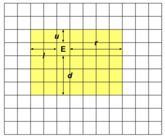

然后边上一圈红色的如果没有被就gg了。

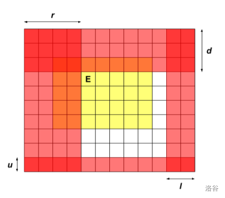

然后考虑扩展这个矩形。显然向右扩展的贡献就是绿色部分，向下扩展的贡献就是紫色部分。上和左同理。

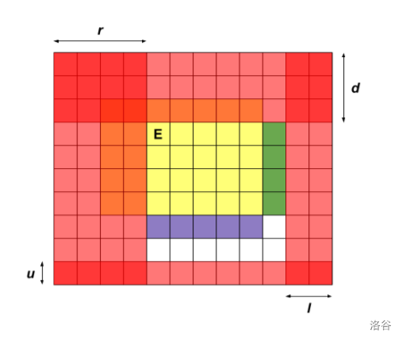

然后写个 $\rm dp$ 就好了。可能空间比较紧张可以用 `short`。

## [AT2046 [AGC004F] Namori](https://www.luogu.com.cn/problem/AT2046)

神仙思维题。

首先 $n$ 肯定是偶数，奇数毛估估就不可能。

先来考虑树🌲，这个同色翻转就非常麻烦，考虑先二分图染色，然后同色一定转化成颜色不同，一次操作就是反转两个相邻节点的颜色，就像下面这张图：

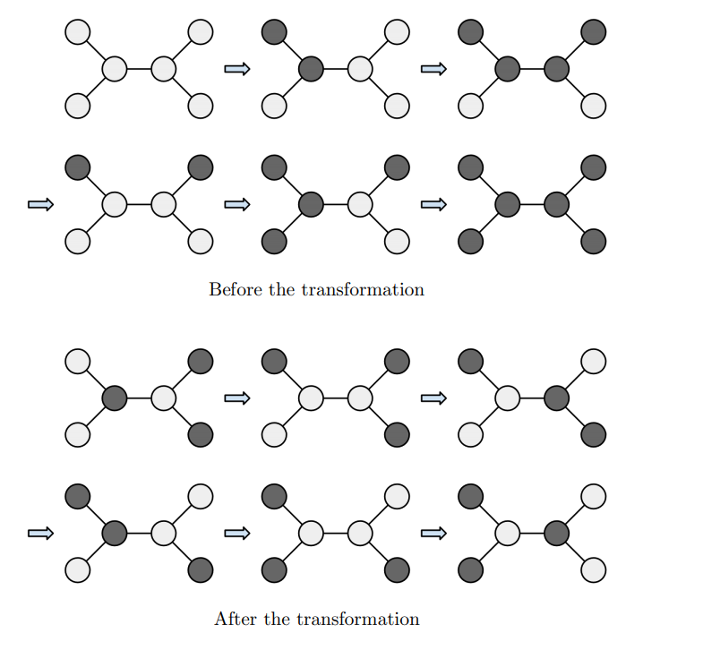

不难发现目标就是要黑白反色。那么有个条件是黑点 = 白点，然后让黑点为 $-1$ 白点是 $1$，一棵子树 $u$ 那么 $u\to fa$ 这条边交换次数至少为 $u$ 子树内部权值之和，记为 $a_i$ 的绝对值。可以证明这个下界是能被构造的。

然后是基环树，需要分类讨论。

- 如果是偶环，那么二分图的结论不变，设环上有一条边 $A\to B$ 且根据 $\rm dfs$ 知道 $B$ 一定是 $A$ 的祖先，然后如果 $A\to B$ 这条非树边转移了 $x$ 个黑点那么 $B\to A$ 这条链上都会少 $x$，然后就变成了一个绝对值的式子要求最小值：

$$
\sum |a_i-x|+|x|
$$

-  如果是奇环，那么在环边上操作一次能够让黑点增加 $2$ 或减少 $2$，然后这条边上的操作次数就确定了，再跑树即可。

## [AT2061 [AGC005C] Tree Restoring](https://www.luogu.com.cn/problem/AT2061)

首先找到最大的 $a_i$ 就是直径，那么 $a_i$ 实际上就是 $i$到两个端点距离的较大值，显然最小是 $\lceil\frac {mx}2\rceil$。然后如果直径是奇数那么最小的点有且仅有两个，否则只有一个中心点也就是只有一个。然后大于 $mn$ 的点都至少出现两次。然后剩下的点直接挂到直径上总是有方法的。

## [AT2062 [AGC005D] ~K Perm Counting](https://www.luogu.com.cn/problem/AT2062)

首先这个东西看上去不太好做，而且 $n\le 2000$ 看上去 $\mathcal O(n^2)$ 可以过，所以容斥，然后画一下图，发现就相当于 $2k$ 条链⛓，每条链上不能选相邻的，问钦定 $i$ 条的方案数。然后对于一条长度为 $m-1$ 有 $m$ 个点的链，选 $i$ 条就是 $\binom{m-i}i$ ，就相当与再 $m$ 个点选 $i$ 个『黑白』剩下的是白点，然后所有的卷起来就是答案。

最后容斥一波就好了。

## [AT2064 [AGC005F] Many Easy Problems](https://www.luogu.com.cn/problem/AT2064)

考虑统计每一个点的贡献，记与 $u$ 连接的连通块大小为 $sz_{v}$，那么 $u$ 对 $i$ 的贡献就是：
$$
\binom ni-\sum_{(u,v)\in E}\binom{sz_v}i
$$
意义显然，就是只要不要全部选在一棵子树内那么就会对答案造成 $1$ 的贡献，然后就可以做到 $\mathcal O(n^2)$。然后考虑优化到能过的。复杂度主要是再后面，不妨记 $cnt_i$ 表示为 $sz_v$ 为 $i$ 的个数，那么就显然有：
$$
ans_k=n\binom ni-\sum cnt_i\binom ik=n\binom ni-\frac1{k!}\sum\frac{cnt_ii!}{(i-k)!}
$$
不妨记 $a_{n-i}=cnt_ii!,b_i=\frac1{i!}$，然后卷积的形式就很显然了：
$$
\sum a_{n-i}b_{i-k}
$$

## [AT2063 [AGC005E] Sugigma: The Showdown](https://www.luogu.com.cn/problem/AT2063)

首先考虑无限循环，如果红树有一条 $u\to v$ 并且蓝树 $u\to v$ 的距离大于等于 $3$，那么先手到 $u$ 或 $v$ 游戏就All last了。

然后不考虑这样的边，那么先手每一步的距离在后手的树上就是 $\le 2$ 的。记一个点在红树上的深度为 $depr_u$，在蓝树上的深度为 $depb_u$，然后每一步就是 $depr_u<depb_u$。因为在这样的情况下，一定不存在先手绕过后手的情况，否则一定会被抓。所以先手就往子树内走，后手去追他。

## [AT2163 [AGC006B] Median Pyramid Easy](https://www.luogu.com.cn/problem/AT2163)

可以证明形如 $\le x\ x\ \ge x$ 的形式，到下一层还是满足这样的形式。

然后直接就中间 $x-1,x,x+1$ 就好了。

## [AT2164 [AGC006C] Rabbit Exercise](https://www.luogu.com.cn/problem/AT2164)

首先不妨假设 $i,i+1,i-1$ 的期望位置分别是 $x,y,z$，那么 $x'=\frac{2y-x+2z-x}2=y+z-x$

也就是维护一个数组 $E$，然后 $a$ 就相当于把 $E_a\leftarrow E_{a+1}+E_{a-1}-E_a$，如果您参加过 $\rm noip2021$ 的话就相当于交换两个差分数组。

然后就直接维护这个置换，然后在一个环上向前走 $k$ 步就好了，然后非常好写。

## [AT2165 [AGC006D] Median Pyramid Hard](https://www.luogu.com.cn/problem/AT2165)

$\rm B$ 题的 $\rm SPJ$ 是紫的/jy

首先让 $\ge x$ 的变成 $1$ 否则是 $0$ 然后跑这个中位数得到最小的，然后找到最小的 $x$ 满足最后剩下的数是 $1$ 就是答案。

然后就变成 $01$ 序列这个问题就好做一些了，然后发现如果出现了连续相同的数就一直不会变了。所以连续 $\ge 2$ 的把序列分成了若干个部分，中间夹着一些 $010101$ 形式，每次这样的形式会翻转，然后长度减二。然后推一推就可以得到最上面是什么了。可能有一些 $\rm border\ case$ 需要特判。

## [AT2166 [AGC006E] Rotate 3x3](https://www.luogu.com.cn/problem/AT2166)

首先把一些特别显然的情况判掉，比如一列中三个不是连续的或者原来在奇数列现在在偶数列。

然后就是大胆猜结论的时间，把奇数列上的数字排到原来的位置，发现次数的奇偶性是一定的，然后偶数列上的数字反者的个数的奇偶性是一定的，如果是奇数显然就不幸。

可以证明满足这样条件肯定可以构造方案反正我不会。

## [P4721 【模板】分治 FFT](https://www.luogu.com.cn/problem/P4721)

其实就是 $\rm W \color{red}YHAK$ 最喜欢的 $\rm CDQ$ 分治。

首先计算 $[l,mid]$，然后用卷积计算 $[l,mid]$ 对 $[mid+1,r]$ 的贡献，最后计算 $[mid+1,r]$ 内部的贡献就好了。

## [LOJ#575. 「LibreOJ NOI Round #2」不等关系](https://loj.ac/p/575)

首先不考虑 `>` 那么序列被分成了若干个段，每个段都是上升，方案数就是：
$$
\frac{(n+1)!}{\prod a_i!}
$$
然后钦定若干个 `>` 不满足即变成 `<` 那么再乘上容斥系数 $(-1)^{\text(个数)}$ 就是答案。然后就可以 $\rm dp$了：
$$
dp_{i}=\sum_{j< i}[s_j\ne \text{<}](-1)^{cnt_{i-1}-cnt_j}\times dp_{j}\times\frac1{(i-j)!}
$$
其中 $cnt_i$ 表示 $s[1:i]$ 中 `>` 的数量。然后最后的答案就是 $dp_{n+1}\times(n+1)!$。

看上去就可以分治 $\rm NTT$ 优化做到 $\mathcal O(n\log^2n)$。

## [ZROI#2172. 【2022省选十连测 Day 1】01串](http://zhengruioi.com/problem/2172)

在考试时候发现 $010101$ 形式的串是交错排列。但是不知道为为什么。

首先考虑倒着看问题：

- 在开头插入一个 $1$
- 在结尾插入一个 $0$
- 把 $0$ 或 $1$ 替换成 $01$

可以证明这样能保证不重不漏。我们在开头补一个 $0$，在结尾补一个 $1$，那么就可以每次选择一个 $01$ 删去其中的一个。我们在每个 $01$ 之间插入分割符，删去的时候顺便删去分隔符，然后分隔符被删去的时间就构成了一个 $0\sim n$ 的排列，如果 $s_i$ 为 $0$ 那么右边先删除否则左边先删除。

$s_i$ 为 $?$ 时左右没有限制，就相当于把序列分成了若干段，每一段跑 $\rm LOJ\#575$ 即可。

## [ZROI#2174. 【2022省选十连测 Day 1】树上路径](http://zhengruioi.com/problem/2174)

如果没有看错题目的话有一个非常显然的 $\rm dp$ 就是设 $dp_{u,i}$ 表示 $u$ 拖了一根长度为 $i$ 的链的最大值，最后的答案就是 $dp_{rt,0}$。

然后考虑怎么合并，$k=4$ 看上去更复杂一些直接讨论 $k=4$。

首先在 $u$ 处的合并有两种情况 $1-3$ 和 $2-2$，我们可以设一个 $\rm dp$ 数组 $f_{x,y}$ 表示 $1$ 的条数减取 $3$ 的条数的数量是 $x$，$2$ 奇偶性是 $y$，那么 $dp_{u,0}=f_{0,0},dp_{u,1}=f_{1,0},dp_{u,2}=f_{0,1},dp_{u,3}=f_{-1,0}$。转移也是显然的。

问题是现在的复杂度是 $\mathcal O(n^2)$ 的，但是一个随机序列 $x$ 应该是不会超过 $\sqrt n$ 的，因此只 $\rm dp$  $\pm 1000$ 项就能过了。

## [AT2167 [AGC006F] Blackout](https://www.luogu.com.cn/problem/AT2167)

看到 $\rm AT$ 的神仙题第一感觉是图论。

然后就相当于如果 $x\to y,y\to z$，那么 $z\to x$。然后每个弱连通块显然是独立的每一个考虑加起来就好了。

讨论一个弱连通块，如果可以分到两个集合且只有第一个集合到第二个集合的边，那么就不可能增加新的边。

否则考虑分成三个集合 $\{0\},\{1\},\{2\}$，那么最后有且仅有三种边 $\{0\}\to \{1\}$，$\{1\}\to \{2\}$，$\{2\}\to\{0\}$。证明可以考虑归纳地来证明，考虑一章这样的图，然后挂一条 $\{0\}\to p$，然后 $\{2\}\to \{0\}\to p$，因此 $p\to\{2\}$，然后 $p\to \{2\}\to\{0\}$，因此 $\{0\}\to p$，加点之后的图还是满的。$p\to \{0\}$ 的情况类似。并且一条链 $u\to v\to w$ 是成立所以是对的。

否则如果分不成就把使得分不成的边删掉强行染色，现在是 $\{0\}\to\{1\}\to\{2\}\to\{0\}$，然后加入一条非法的边必定可以出现 $\{x\}\to\{x\}$ 这样的情况，然后就可以得到变成了完全图。

## [AT2169 [AGC007B] Construct Sequences](https://www.luogu.com.cn/problem/AT2169)

如果要全部相等就直接 $a_i=i,b_i=n-i+1$，然后为了满足第三个性质我们给 $a_{p_i}$ 加上 $i$ 但是此时可能 $a$ 就不递增。给 $a,b$ 都乘上 $n+1$ 然后再执行后面的操作就对了。

 ## [AT2171 [AGC007D] Shik and Game](https://www.luogu.com.cn/problem/AT2171)

考虑Shik的最优方案一定是先搜集完 $j$，然后走到 $i>j$，再到 $j+1$，再到 $i$ 搜集完所有 $j+1\sim i$ 的金币，所以有 $\rm dp$：
$$
f_{i}=\min_{j<i}\{f_j+x_i-x_j+\max(T,2(x_i-x_{j+1}))\}
$$
后面的柿子的含义是走回 $j+1$ 如果已经有金币了那么以后都可以吃到金币然后时间就是 $2(x_i-x_{j+1})$，否则要再 $j+1$ 等完 $T$ 然后再不等待地吃 $j+1\sim i$ 所有的金币。

大可以写一个数据结构但是没有必要。不妨令 $g_i=f_i-x_i$ 那么：
$$
g_i=\min\{g_{j}+\max(T,2(x_i-x_{j+1}))\}
$$
可以维护一个转折点 $l$，再 $\le l$ 的位置上是 $2(x_i-x_{j+1})$，所以维护 $g_{j}-2_{j+1}$ 的最小值，之后看看就是 $g_{l+1}$ 最小直接取 $g_{l+1}+T$ 即可。

## [AT2172 [AGC007E] Shik and Travel](https://www.luogu.com.cn/problem/AT2172)

首先显然是满足二分的，直接枚举一个 $up$ 满足所有的都不能超过。

有一个显然的性质是只有把一个子树所有叶子遍历完才能出去。

再一个节点上有一个 $\rm dp$ 数组 $f_{u,i,j}$ 表示在 $u$ 进入的长度是 $i$ 出去的长度是 $j$ 是否可行。我们发现如果  $a>b,c>d$，如果 $f_{b,d}$ 可行，$f_{a,c}$ 就一定是没用的。

我们可以开一个 `vector` 来维护所有可行的状态，满足第一维递增，根据刚才的结论第二维肯定递减，然后在左子树枚举一个状态，然后在右子树找第一维尽可能长也就是第二维尽可能短的状态，然后合并。右到左同理。

考虑为什么复杂度是正确的，假设左儿子的状态数较少，那么路径只有两类，在左儿子开始的和在左儿子结束的，因此状态数最大是左儿子的两倍，经过一些高妙的分析就可以知道一次check的复杂度是 $\mathcal O(n\log n)$。

## [AT2173 [AGC007F] Shik and Copying String](https://www.luogu.com.cn/problem/AT2173)

考虑最优的方案一定是一段段折线：

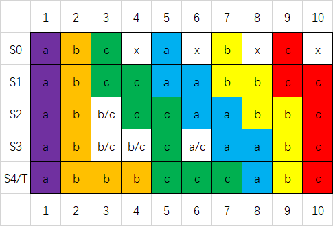

然后实际上贪心地从左往右看，每个字符和谁匹配也是确定的，因此我们只需要维护这一堆折线就好了。

发现新增一条折线，原来折线大于当前位置的拐点都没有用了，然后其它的点向左下移动一格。如果两个起点有间隙还会新增一个拐点。可以用队列维护，向左下移动打一个全局标记即可。

## [AT2264 [AGC008B] Contiguous Repainting](https://www.luogu.com.cn/problem/AT2264)

需要一点点智慧

必然有一段长度为 $k$ 的颜色相同，除了这一段其它颜色任意。

然后枚举这一段就好了。

## [AT2265 [AGC008C] Tetromino Tiling](https://www.luogu.com.cn/problem/AT2265)

发现 T,S,Z 是没用的，合法的只有 II,LL,JJ,O 或 ILJ 。然后 IJL 可以只出现一次因为出现两次可以变成 II,LL,JJ。

然后枚举有没有 IJL 就做完了。

## [AT2266 [AGC008D] K-th K](https://www.luogu.com.cn/problem/AT2266)

条件就等价于 $[1,p_i-1]$ 有 $i-1$ 个 $i$，$[p_i+1,n\times n]$ 有 $n-i$ 个 $i$。那么考虑第一个构造就直接从 $p_i$ 小到大选，把第一个限制满足，然后再从大往小，把第二个限制满足。

只看前面一半有一个很显然的贪心就是尽可能往前面放，然后可以证明对后一半问题也是最优的。

## [AT2267 [AGC008E] Next or Nextnext](https://www.luogu.com.cn/problem/AT2267)

首先如果告诉 $p$，那么 $i\to p_i$ 形成了若干个环。考虑每个点跳一步或者两步得到题目中的 $a_i$。分情况讨论：

1. 全部取 $p_i$ 那么环不变：

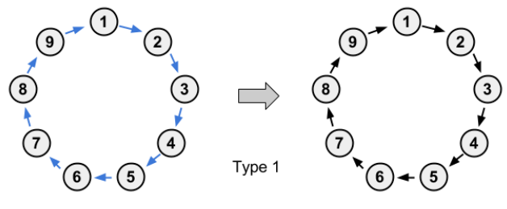

2. 全部取 $p_{p_{i}}$ 并且环为奇环，那么形成一个同构的环。

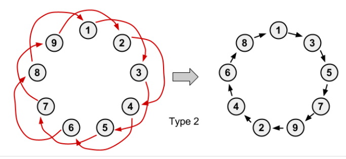

3. 全部取 $p_{p_i}$ 并且环为偶环，那么形成两个环。

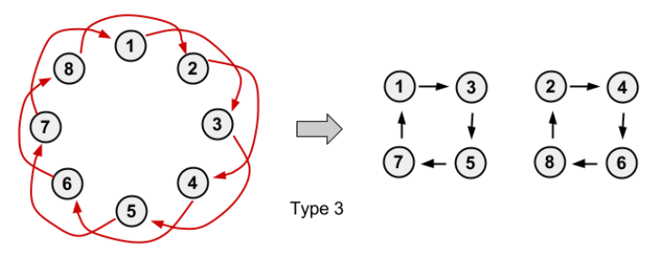

4. 有的跳一步有的跳两步形成一棵基环树，并且环上每个点最多挂一条链。

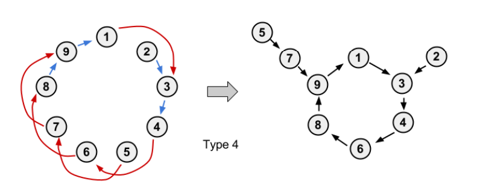

然后就是计数了，显然环和基环树是独立的可以分别计数。然后每一个长度的环也是独立的。考虑长度 $i$ 的环有 $cnt$ 个那么可以钦定 $2j$ 个是互相匹配得到的，那么这 $2j$ 个的方案数是 $\binom{cnt}{2j}\binom{2j}{j}j!/2^j\times i^j$。就是先选 $2j$ 个，然后算匹配的方案数，然后匹配确定后第二个环还可以转。如果 $i$ 是奇数，剩下的 $cnt-2j$ 个环可能没变，也可能是全部两步，所以再 $2^{cnt-2j}$。

然后就是基环树的计数。加入比如下面伸出来一条链，像下面这样就会有两种情况。根据边数多少也有可能是 $1$ 或 $0$。

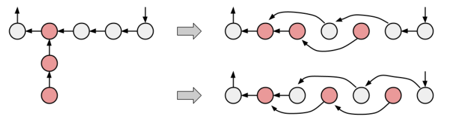

然后根据乘法原理乘起来就好了。

## [AT2268 [AGC008F] Black Radius](https://www.luogu.com.cn/problem/AT2268)

神仙题。

首先考虑全部喜欢的情况。记 $f(x,d)$ 表示距离 $x$ $\le d$ 的集合，强制不考虑 $f(x,d)$ 为全集的情况，最后再加上即可。

在这样的限制下，如果 $f(u,d_1)=f(v,d_2)$，肯定有 $d_1\ne d_2$，因此我们可以在 $d$ 最小的时候统计一次贡献。

首先不能超过树因此 $x$ 的 $d$ 要小于以 $x$ 为根的最长链。然后不能有一个和它相同的集合但是比 $x$ 小，也就是 $f(y,d-1)\ne f(x,d)$，那么 $y$ 子树内部的肯定是一样的，但是外面为了不一样，一个可以走 $d$ 步，一个只能走 $d-2$ 步，那么排除 $y$ 以后最长链肯定要大于 $d-2$，也就是 $d-2<$ 以 $x$ 为根的次长链。可以通过换根 $\rm dp$ 求出。

然后考虑有不喜欢的情况，对于一个不喜欢的点 $x$，如果 $f(x,d)$ 且 $d$ 是最小并且可以被喜欢的点 $y$ 表示出来，那么一定把 $y$ 所在的子树全部覆盖，也就是给 $d$ 再限制了一个最小值。

证明考虑下面一张图：

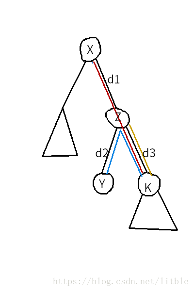

如果 $f(x,d_1+d_3)=f(y,d_2+d_3)$，$k$ 以下的点没有被覆盖，那么此时 $f(z,d_3)=f(x,d_1+d_3)$ 与 $f(x,d)$ 是最优矛盾。因此如果 $f(x,d)$ 能被喜欢的点表示出来一定要把一棵有喜欢的点的子树全部覆盖。

于是我们就得到了每个 $d$ 的上界和下界，然后就做完了。

## [AT2291 [AGC009B] Tournament](https://www.luogu.com.cn/problem/AT2291)

就是要让最大深度最小

首先把 $i$ 打败的人挂在 $i$ 的儿子，然后就是 $dp_i$ 表示 $i$ 最后最小的深度，加入一个儿子 $x$ 就是 $dp_{i}\leftarrow \max(dp_i+1,dp_x+1)$。毛估估就是 $dp_x$ 从小到大转移最优。

## [AT2292 [AGC009C] Division into Two](https://www.luogu.com.cn/problem/AT2292)

不妨令 $A\ge B$，那么如果 $s_{i+2}-s_i<B$ 那么 $i,i+1,i+1$ 一定是无法分配的。于是把 $0$ 特判掉。

然后就有一个 $\rm dp$，$f_i$ 表示 $i$ 划分到 $A$ 集合的方案数，考虑转移的时候只需要考虑 $s_i-s_j\ge A$ 并且 $[j+1,i-1]$ 中的 $s$ 都符合 $B$ 的限制。不用管端点处是否符合因为隔一个点肯定 $\ge B$。

然后这个就可以直接 `two-pointer` 加前缀和维护了。

## [AT2293 [AGC009D] Uninity](https://www.luogu.com.cn/problem/AT2293)

题目就等价于深度最小淀粉树。

等价于给每一个点一个标号，最后使得最大标号最小，并且两个相同的标号之间一定要有一个标号更大的。

根据一些高妙的分析知道题目是满足最优子结构的，也就是从叶子往上贪心是正确的。

那么考虑节点 $u$ 的选什么，首先根据已经贪心完成的子树我们可以处理出子树内部没有匹配的节点，然后现在的值就不能在这些值里面取。然后还要找一找有没有 $k$ 在两颗子树内都没有匹配那么现在的就至少比 $k$ 大。

然后因为淀粉树深度是 $\log n$ 的因此可以用 `int` 存状态，然后用 `__builtin_` 优化到 $\mathcal O(n)$。

## [AT2294 [AGC009E] Eternal Average](https://www.luogu.com.cn/problem/AT2294)

可以看作是一棵 $k$ 叉树，然后每个叶子上有 $0/1$，不妨设 $n$ 个 $0$ 的深度为 $x_i$，$m$ 个 $1$ 的深度为 $y_i$，根节点的树就是 $\sum_{i=1}^m\left(\frac1{k}\right)^{y_i}$。而且我们还知道如果所有都是 $1$ 那么根节点也是 $1$，所以 $\sum_{i=1}^n\left(\frac1{k}\right)^{x_i}+\sum_{i=1}^m\left(\frac1{k}\right)^{y_i}=1$。而且这个是充要的。也就是转化成，有多少 $Z$ 可以被表示成 $\sum_{i=1}^n\left(\frac1k\right)^{x_i}$ 并且 $1-Z$ 可以被表示成 $\sum_{i=1}^m\left(\frac1k\right)^{y_i}$。不妨让 $Z=(0.z_1z_2\dots z_l)_k$，那么考虑还原就是让一位减 $1$，后一位加 $k$，因此 $\sum_{i=1}^l{z_i}\equiv n \pmod{k-1}$。并且进位过程中和是减小的，因此 $\sum_{i=1}^l{z_i}\le n$。然后满足这两点就一定能构造出一组 $\{x_i\}$。然后此时 $1-Z$ 的各个数位也确定了，最后一位是 $k-z_l$ 其它是 $k-1-z_i$。然后同样要满足 $1+\sum_{i=1}^l k-1-z_i\equiv m\pmod{k-1}$ ，$1+\sum_{i=1}^l k-1-z_i\le m$。

然后就可以 $\rm dp$ 了，直接让 $f_{i,j,0/1}$ 表示前 $i$ 位和为 $j$ 最后一位为 $0$ 或非 $0$。然后在结尾非 $0$ 出判断这个和 $j$ 是否合法即可。

然后把两个不等式加起来就不难得出 $l$ 最大是 $\frac{n+m-1}{k-1}$ 了。

## [AT2305 [AGC010D] Decrementing](https://www.luogu.com.cn/problem/AT2305)

- 首先如果有 $1$ 那么有奇数个偶数则先手必胜，否则后手必胜。
- 然后如果有奇数个偶数也是先手必胜，因为先手每次只需要取偶数变成奇数，后首不管操作什么都还是奇数个偶数，先手一直是必胜，直到出现 $1$ 然后是先手必胜。
- 如果有偶数个偶数，然后有大于一个奇数，后手必胜，因为不管先手取什么都达到了一个后手的必胜态。
- 否则就是有偶数个偶数和一个奇数，那么先手的最优策略肯定是删去奇数，否则白白给后手送了一个必胜态然后白给。

然后就做完了。第 $4$ 种显然次数是 $\log$ 次暴力就好了。

## [AT2306 [AGC010E] Rearranging](https://www.luogu.com.cn/problem/AT2306)

把所有不互质的数连边那么这些数在排列里相对位置不会改变。

然后对于每一个连通块我们可以贪心地给每条边定向，也就是拉出一棵字典序尽可能小的生成树，局部最优也是全局最优。

然后后手就直接拓扑排序使得最大就好了。

## [AT2307 [AGC010F] Tree Game](https://www.luogu.com.cn/problem/AT2307)

有一个结论是如果你现在在 $u$，那么不会去 $v$ 如果 $v$ 的值比 $u$ 大，因为如果 $a_v\ge a_u$ 那么后手再回来，先手就白白浪费了一次机会。

就每次往 $a_v<a_u$ 的点走，显然后手不会走回头路，然后就可以直接在树上 处理必胜点/必败点了。

$\mathcal O(n^2)$ 非常好写。

## [AT2339 [AGC011C] Squared Graph](https://www.luogu.com.cn/problem/AT2339)

感受到智商被碾压/ll

首先如果 $(a,b)$ 与 $(c,d)$ 联通，就的等价于 $a\to c$ 的奇偶性与 $b\to d$ 的奇偶性相同。然后考虑二分图染色。分成三类连通块。

1. 单点，个数为 $a$。不会与任何东西连边，然后就是 $(x,*)$ 和 $(*,x)$ 的形式，于是就是 $a\times n+(n-a)\times a$。
2. 二分图，个数为 $b$。二分图上一种同种颜色的边是偶数，异种颜色的边是奇数，所以钦定两个二分图 $A$ 和 $B$，那么 $(A\text{黑},B\text{黑})$，$(A\text{白},B\text{白})$ 全部是联通的，$(A\text{黑},B\text{白})$，$(A\text{白},B\text{黑})$ 也是全部联通的。贡献为 $2b^2$
3. 有奇环的图，个数为 $c$。两个点的路径可奇可偶。只有 $3$ 的贡献显然只有 $c^2$，然后 $3$ 与 $2$ 可以 $(3,2)$ 或 $(2,3)$ 因此方案数是 $2bc$。

## [AT2340 [AGC011D] Half Reflector](https://www.luogu.com.cn/problem/AT2340)

首先手玩一下发现有两种情况：

- $s_1=A$，那么直接反弹然后结束。

- $s_1=B$，那么可以把所有遍历一遍，最终结果是全部取反然后循环左移。对于第 $i$ 个元素，如果遍历到，上一个肯定是 $A$ 因为你刚刚经过。

- - 如果 $s_i=A$，那么会反弹一遍，经过之后让前一个变成 $B$，这个还是 $A$。
  - 如果 $s_i=B$ 就直接取反变成 $A$

  然后我们就知道每次把 $B$ 变 $A$，原来 $A$ 前面的变 $B$。进一步手玩就可以得到上面的结论。

然后如果写得比较好看 $\mathcal O(k)$ 就可以通过了。然后发现如果出现了一个 $...BABA$ 的后缀就一定不会改变了，而且每一次第二种操作至少让长度增加 $1$。于是就模拟前 $2n$ 步，如果是偶数就一定是 $BABA\dots BA$，如果是奇数就是 $xBABA\dots BA$，然后每次对 $x$ 取反。

## [AT2341 [AGC011E] Increasing Numbers](https://www.luogu.com.cn/problem/AT2341)

非常巧妙的题目。

首先一个上升数可以用 $9$ 个 $11\dots1$ 构成，如果不足 $9$ 个认为 $0$ 也满足刚才的形式，假如有 $k$ 个上升数，一定能找出 $\{r_i\}_{i=1}^{9k}$ 满足：
$$
N=\sum\frac{10^{r_i}-1}{9}\\
9N+9k=\sum 10^{r_i}
$$
因此只需要 $9N+9k$ 的数位和小于等于 $9k$ 即可。可以从 $1$ 开始枚举 $k$ 每次加 $9$，然后 $k$ 的上界是 $L$ 级别的，然后进位次数也是 $L$ 级别的，然后就是能过的。

