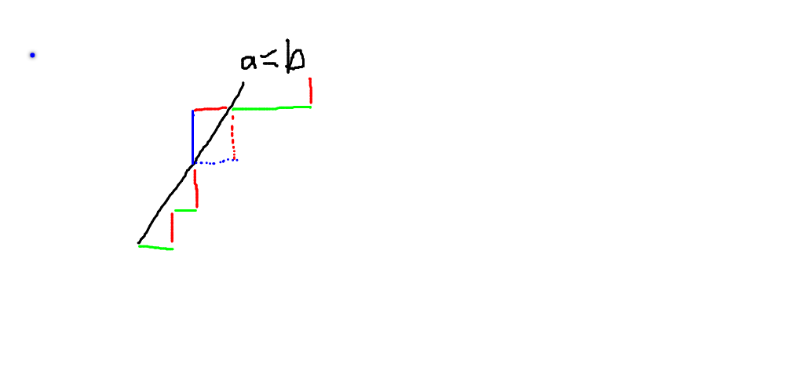
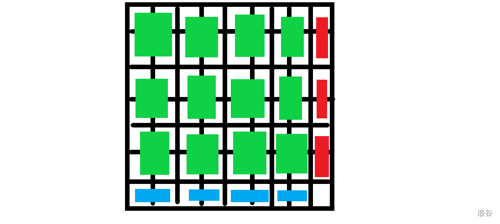
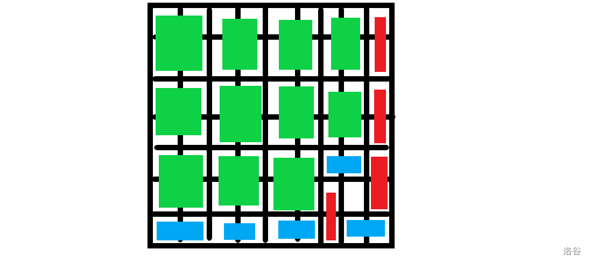

[TOC]

## [AT2342 [AGC011F] Train Service Planning](https://www.luogu.com.cn/problem/AT2342)

首先这个题意又臭又长赶紧形式化然后把题面扔进垃圾桶。

相当于有两个数列 $\{p_i\}_{i=1}^n,\{q_i\}_{i=1}^n$ 然后规定 $p_0$ 为上行的火车出发的时间，$q_0$ 为下行的火车到达的时间的相反数，然后 $p_i$ 的前缀和 $P_i$ 就是在 $i$ 出发的等待时间，$q_i$ 的前缀和 $Q_i$ 就是在 $i$ 出发的等待时间。然后就：
$$
(P_{i-1}+A_{i-1}+c\times k,P_{i-1}+A_i+c\times k)\cap (-Q_{i-1}+A_n-A_i,-Q_{i-1}+A_n-A_{i-1})=\emptyset
$$
然后这个 $A_n$ 非常难受就直接加到 $q_0$ 就好了。然后移项得到：

$P_{i-1}+Q_{i-1}+c\times k\in(-\infty,-2A_{i}]\cup [-2A_{i-1},+\infty)$

所以就相当于一个数列，第一个数随便取，每次可以加上一个数，有一些限制，要求加的数和最少。

然后就可以 $\rm dp$ 了，如果现在有 $x$，如果 $x$ 没有被上一个区间包含，就肯定是从上一个区间右端点转移过来，否则就看上上个区间。

因此暂时我们只需要求出 $dp_i$ 表示取第 $i$ 个区间右端点的答案，然后用线段树维护最大的没有包含当前数的区间即可。

最后肯定走到一个左端点所以所有左端点取最小值就是最小等待时间和。

然后无解就是 $2a_i>k$ 肯定会撞车。

## [AT2364 [AGC012D] Colorful Balls](https://www.luogu.com.cn/problem/AT2364)

首先如果两个点可以交换就连边形成了若干个连通块。每一个连通块互相独立所以看单独一个连通块的方案数：
$$
\frac{(\sum cnt_i)!}{\prod cnt_i!}
$$
其中 $cnt_i$ 表示颜色 $i$ 的个数，而总方案数就是所有乘起来。

但是现在边数的 $\mathcal O(n^2)$ 的，考虑优化。

首先同色的连边就只需要连最小值的边显然不影响联通性。

然后异色的边，考虑每一种颜色有一个最小重量，不妨让颜色 $1$ 的最小重量最小，颜色 $2$ 的最小重量次小，假如现在有异色点 $x,y$ 要连边，满足 $w_x+w_y<Y$：

- $c_x\ne1,c_y\ne1$，那么有边 $(x,mn_1),(y,mn_1)$
- $c_x=1$，那么有边 $(x,mn_2),(y,mn_1),(mn_1,mn_2)$

因此只需要向最小值和次小值连边，边数是 $\mathcal O(n)$ 的，总复杂度也是 $\mathcal O(n)$ 的。

## [AT2365 [AGC012E] Camel and Oases](https://www.luogu.com.cn/problem/AT2365)

首先只能跳 $\log_2 v$ 次。

然后考虑 $\left\lfloor\frac v{2^k}\right\rfloor$ 把序列分割成了若干线段，每个线段内部可以随便乱跳，然后要到其他线段必须要用跳跃。

然后第一层是钦定的，是一个区间 $[l,r]$ 然后考虑之后怎么解决，考虑 $dpl_{S}$ 表示用 $S$ 这些层向右最多扩展到哪里，$dpr_S$ 同理。转移直接从 $dpl_S+1$ 往右跳。然后一段区间可行就等价于：
$$
[1,dpl_{S}]\cup[l,r]\cup [dpr_{U\setminus S},n]=[1,n]
$$
然后枚举 $S$ 是 $\mathcal O(v)$ 的，乍一看复杂度是 $\mathcal O(nv)$ 的，但是如果第一层的线段数大于 $\log_2 v$ 那么之后的容量更小线段更多是不可能走完的。

所以复杂度是 $\mathcal O(v\log v)$ 的。

## [AT2366 [AGC012F] Prefix Median](https://www.luogu.com.cn/problem/AT2366)

首先对 $a_i$ 排序，然后有一个结论是 $a_i$ 只能成为 $b_{1\dots \min(i,2\times n-i)}$ 。换句话说，就是 $b_i$ 的取值只能是 $a_{i}\dots a_{2\times n-i}$。

但是这个条件还不够，因为你每次加两个数中位数只能移动一位，所以 $i<j$ 并且 $b_i\in(\min(b_j,b_{j+1}),\max(b_j,b_{j+1}))$ 说明 $b_j$ 不是跳到前驱后继是肯定不行。

然后满足以上条件的 $\{b_i\}$ 就一定能被构造出来了。记 $f_{i,l,r}$ 表示到第 $i$ 位有 $l$ 个不同的数比 $b_i$ 小 $r$ 个不同的数比 $b_i$ 大。然后转移的时候先看看左右不同的数有没有增加，然后枚举向左/向右移动到了哪个位置，然后两个位置中间的数就不能再取了。

复杂度 $\mathcal O(n^4)$。

## [AT2368 [AGC013B] Hamiltonish Path](https://www.luogu.com.cn/problem/AT2368)

首先我们维护一条路径 $\{a_1,\dots,a_k\}$，然后看 $a_k$ 有没有全部连完，如果有一个点没有再路径上，就把哪个点加入路径。对 $a_1$ 同理。

拿一个双端队列维护一下就好了。

## [AT2369 [AGC013C] Ants on a Circle](https://www.luogu.com.cn/problem/AT2369)

首先蚂蚁撞倒一起可以看作交换编号继续爬。然后就能得到所有最终的位置。

然后发现相对位置不变，因为碰撞之后反弹所以 $1$ 的后继肯定是 $2$ 也就是说我们只需要知道 $1$ 最终去了那里就好了。

然后发现一只蚂蚁逆时针经过 $0$ 然后 $1$ 的排名就会减 $1$ 否则顺时针排名加 $1$，然后就只需要算有几次顺时针穿过几次逆时针穿过就可以得到 $1$ 最后的排名了。

## [AT2370 [AGC013D] Piling Up](https://www.luogu.com.cn/problem/AT2370)

考虑一个序列 $\{x_0,\dots,x_m\}$ 其中 $x_i$ 表示第 $i$ 次操作后的红色个数，一次操作有几种可能：

1. `RR`，要求 $x_{i-1}\ge 1$，操作后 $x_i\leftarrow x_{i-1}-1$
2. `RB`，要求 $x_{i-1}\ge 1$，操作后 $x_i\leftarrow x_{i-1}$
3. `BB`，要求 $x_{i-1}<n$，操作后 $x_{i}\leftarrow x_{i-1}+1$
4. `BR`，要求 $x_{i-1}<n$，操作后 $x_{i}\leftarrow x_{i-1}$

然后有一个 $\rm Naive$ 的想法就是 $f_{i,j}$ 表示 $x_i=j$ 的方案数，但是一个序列会被计数多次。

然后用 $g_{i,j}$ 表示 $x_i=j$ 并且到达过最低点的方案数，到达最低点指再 $x_{i-1}=1$ 时进行操作 $1$ 或操作 $2$，$f_{i,j}$ 表示没有达到过最低点，发现一个合法序列在 $g_{i,j}$ 中被计数一遍。然后就好了。

## [AT2371 [AGC013E] Placing Squares](https://www.luogu.com.cn/problem/AT2371)

首先考虑组合意义，就是先插板，然后每两块板中间可以放一个黑点和一个白点。

然后就可以 $\rm dp$ 了，$dp_{i,0/1/2}$ 表示到了位置 $i$ 已经有 $0/1/2$ 个点的方案数，然后如果 $i\to i+1$ 没有被 $\rm ban$ 掉就可以：
$$
\begin{aligned}
&dp_{i+1,0}\leftarrow dp_{i,0}+dp_{i,2}\\
&dp_{i+1,1}\leftarrow 2dp_{i,0}+dp_{i,1}+2dp_{i,2}\\
&dp_{i+1,2}\leftarrow dp_{i,0}+dp_{1,1}+2dp_{i,2}
\end{aligned}
\Rightarrow
\begin{bmatrix}
dp_{i+1,0}\\
dp_{i+1,1}\\
dp_{i+1,2}
\end{bmatrix}=
\begin{bmatrix}
1&0&1\\
2&1&2\\
1&1&2
\end{bmatrix}\times
\begin{bmatrix}
dp_{i,0}\\
dp_{i,1}\\
dp_{i,2}
\end{bmatrix}
$$
然后如果不能插板就是：
$$
\begin{aligned}
&dp_{i+1,0}\leftarrow dp_{i,0}\\
&dp_{i+1,1}\leftarrow 2dp_{i,0}+dp_{i,1}\\
&dp_{i+1,2}\leftarrow dp_{i,0}+dp_{1,1}+dp_{i,2}
\end{aligned}
\Rightarrow
\begin{bmatrix}
dp_{i+1,0}\\
dp_{i+1,1}\\
dp_{i+1,2}
\end{bmatrix}=
\begin{bmatrix}
1&0&0\\
2&1&0\\
1&1&1
\end{bmatrix}\times
\begin{bmatrix}
dp_{i,0}\\
dp_{i,1}\\
dp_{i,2}
\end{bmatrix}
$$
然后矩阵快速幂算一下就可以了。

## [AT2372 [AGC013F] Two Faced Cards](https://www.luogu.com.cn/problem/AT2372)

先让 $n$ 加上 $1$，然后就可以把 $X$ 中的数离散到 $[1,n+1]$。

首先考虑两个数组 $A,B$ 如何判断是否有匹配，当然可以直接排序，但是非常菜。考虑另一种做法，对每个 $A_i$ 就让 $[A_i,n]$ 加上 $1$，一个 $B_i$ 就让 $[B_i,n]$ 减去 $1$。然后序列非负就说明有匹配。

然后就先让 $A_i$ 加，然后就再让 $C_i$ 减，如果 $B_i<A_i$ 可以花费一次代价让 $[B_i,A_i)$ 加上一，每次询问就相当于问让 $x=D_i\ \text{or}\ E_i$，满足 $x$ 之前 $\ge 0$，$x$ 之后 $\ge -1$ 最少需要多少的代价。

首先从后往前贪心使得每个数都 $\ge-1$，然后再从前往后贪心计算每个前缀都 $\ge 0$ 最少需要多少多少代价。

## [AT2376 [AGC014D] Black and White Tree](https://www.luogu.com.cn/problem/AT2376)

如果这棵树有完美匹配显然是后手必胜。

如果没有就是先手。考虑每次选一个叶子，然后先手选叶子连接的那个点，此时后手必须选叶子。如果没有完美匹配那么最后会剩下点，先手选了就胜利了。

## [AT2377 [AGC014E] Blue and Red Tree](https://www.luogu.com.cn/problem/AT2377)

相当于再给定的 $n-1$ 条路径上每条选一条。

那么考虑一条边被路径覆盖的次数，如果没有一条边被覆盖一次，那么现在就没有边可以删除，就无解。否则把那条只被覆盖一次的边删除，再把覆盖它的路径删除就可以了。

然后用树剖维护 $(u,fa_u)$ 的覆盖次数和覆盖边的编号的异或就好了。

## [AT2378 [AGC014F] Strange Sorting](https://www.luogu.com.cn/problem/AT2378)

就挺神仙的。

首先删去 $1$，然后去考虑 $[2,N]$ 需要多少次。

假设 $[2,N]$ 需要 $T$ 次。

如果 $T=0$，那么如果 $1$ 在开头就是 $0$ 否则就是 $1$。

如果 $T\ge 1$，然后就需要考虑在 $T$ 步之后 $1$ 的位置，如果恰好在开有就是 $T$ 否则是 $T+1$。

如何判断 $1$ 是否在开头就比较麻烦。考虑 $T-1$ 步时，只考虑 $[2,N]$ 开头一定不是 $2$。可以假设是 $2$，然后再运行一次 $2$ 就不在开头了，显然不大行。设开头元素为 $f>2$。

如果在 $T-1$ 步之后 $1$ 在 $f$ 与 $2$ 之间那么再操作一次 $1$ 就会出现在开头1否则就不会。

然后我们就需要判断 $1$ 的位置是否在 $f$ 与 $2$ 之间。有一个结论是 $1,2,f$ 的『循环顺序』是 $(f,1,2)$ 那么 $1$ 最终一定在 $f$ 和 $2$ 之间。『循环顺序』下 $(a,b,c),(b,c,a),(c,a,b)$ 是等价的。

然后考虑证明循环顺序不变。有一个结论是忽略 $1$，如果 $f$ 不在最前面就不会是 high 因为如果是  high 那么始终无法变成开头然后就寄了。开始讨论：

- $f$ 开头，那么只有 $f$ 为 high『循环顺序』不变
- $2$ 开头，那么只有 $2$ 为 high『循环顺序』 不变
- $1$ 开头
- - $f$ 是第二个，$1,f$ 为 high 而 $2$ 为 low 『循环顺序』不变
  - $2$ 是第二个，$1,2$ 为 high，$f$ 为 low 『循环顺序』不变
  - 否则 $1,2$ 都是 low 也不变
- 否则 $1,2,f$ 都是 low 不变

然后这样就可以从 $[2,N]$ 推到 $[1,N]$ 了，可以类似地加点从 $N$ 一直推到 $1$，需要维护一个时间 $T_i$ 和 $T_{i}-1$ 是第一个元素 $f_i$。

## [AT2381 [AGC015C] Nuske vs Phantom Thnook](https://www.luogu.com.cn/problem/AT2381)

感觉这玩意儿挺经典的，因为每个连通块都是树，所以就直接点数减去边数就可以了。

直接用三个前缀和分别是点数，横的边，竖的边，然后就可以 $\mathcal O(1)$ 查询了。

## [AT2382 [AGC015D] A or...or B Problem](https://www.luogu.com.cn/problem/AT2382)

首先 $l$ 和 $r$ 相同的情况先特判，然后如果 $l$ 和 $r$ 前缀相同的位就不用管了。第一位不相同的，肯定 $l$ 是 $0$ $r$ 是 $1$。不妨让 $m$ 表示这一位为 $1$：
$$
l= 0\ ...\\
r= 1\ ...\\
m= 1000\\
$$
大概就是这样。然后考虑 $[l,m)$ 之间互相或最后的结果肯定还是在 $[l,m)$ ，然后 $[m,r]$ 互相找到 $r$ 除第二个 $1$ 然后这个 $1$ 后面不管是什么都是可以或出来的。然后是 $[l,m)$ 与 $[m,r]$ 之间或，首先不会变小，所以至少是 $m|l$，而最大值显然是可以到 $2m-1$ 的。

然后把这些区间并起来就好了。

## [AT2383 [AGC015E] Mr.Aoki Incubator](https://www.luogu.com.cn/problem/AT2383)

挺巧妙的一个题，考虑把一个人看作一个点 $(V_i,X_i)$，那么 $i,j$ 两点间的斜率  $K_{i,j}$ 的相反数就是相遇时间。

然后考虑对于一个 $i$，如果选了它，最终能染色的是怎样的。考虑这样如果有 $x>y>i$，那么如果 $K_{i,x}\le 0$，$y$ 一定是能被染色的，因为如果 $K_{i,y}\le 0$ 直接被染色，否则可以间接被 $x$ 染色。因此能被染色的一定是一段连续的区间，就可以 $\rm dp$ 了。

## [AT2384 [AGC015F] Kenus the Ancient Greek](https://www.luogu.com.cn/problem/AT2384)

众所周知 $\rm gcd$ 的复杂度是 $\log$ 的所以第一问答案应该不会很大。不妨令 $x<y$，满足 $F(i,j)=k,i<j$ 的 $(i,j)$ 称为good pair of k。那么最小的good pair of 1就是 $(1,2)$ 最小的good pair of 2就是 $(2,3)$，最小的good pair of k就是 $(f_{k},f_{k+1})$，其中 $f_i$ 表示 $f_0=f_1=1$ 的斐波那契数列的第 $i$ 项。

但是good pair of k的数量还是很大，但是发现很多good pair of k操作一次之后就会变得相同。对于每类变得相同的，我们不妨只考虑最小的 。我们把 $i<j\le 2i$ 的 $(i,j)$ 称为excellent pair of k。然后 $(i,j+k\times i)$ 都是good pair of k。

然后处理excellent pair of k+1首先每个excellent pair of k都可以扩展，$(i,j)\to (j,i+j)$，然后还会新增一个 $(f_k,f_k+f_{k+1})$ 的扩展也就是 $(f_{k+2},f_{k}+f_{k+2})$。

然后询问直接考虑每个excellent pair的贡献即可。

## [AT2385 [AGC016A] Shrinking](https://www.luogu.com.cn/problem/AT2385)

首先枚举最后剩下那一个字符，然后贪心地模拟就好了。

 ## [AT2386 [AGC016B] Colorful Hats](https://www.luogu.com.cn/problem/AT2386)

如果颜色总数是 $x$ 种，那么如果一只猫猫有重复就还是 $x$ 种否则是 $x-1$ 种。所以我们求出 $\{a_i\}$ 的最大值 $max$ 和最小值 $min$，那么有解必然有 $max-min\le 1$。

然后先考虑 $max=min$ 的情况，要么全部是独一无二的，也就是 $min=n-1$，要么全部都是有猫猫和它相同也就是 $2min\le n$。

然后再考虑 $max=min+1$ 的情况，令 $cnt$ 为 $a_i=min$ 的个数，那么有 $cnt$ 种是独一无二的，剩下 $max-cnt$ 种每种至少两遍，也就是说 $cnt<max,2(max-cnt)\le n-cnt$。

## [AT2387 [AGC016C] +/- Rectangle](https://www.luogu.com.cn/problem/AT2387)

神仙构造。首先如果 $H\bmod h=0,W\bmod w=0$ 肯定无解。

考虑让满足 $i\bmod h=0,j\bmod w=0$ 的 $(i,j)$ 是 $-k\times (wh-1)-1$，否则填 $k$，那么每个矩形的和就是 $-1$，然后现在的和是 $-\lfloor\frac Hh\rfloor\times \lfloor\frac Ww\rfloor$，因为不满足一开始的无解条件，所以肯定会至少多出一行/一列，于是只要 $\min(H,W)\times k$ 比 $\lfloor\frac Hh\rfloor\times \lfloor\frac Ww\rfloor$ 大就好了。

## [AT2388 [AGC016D] XOR Replace](https://www.luogu.com.cn/problem/AT2388)

考虑用异或和去替换一个数之后，异或和变成着一个数，所以就相当于交换 $a_i$ 和 $a_{n+1}$，其中 $a_{n+1}$ 是原来的异或和。然后如果 $\{b_1,\dots,b_n\}\not\subseteq\{a_1,\dots,a_{n+1}\}$ 就无解，否则肯定有解。然后就对于 $a_i\ne b_i$，那么就把 $a_i$ 和 $b_i$ 这两个数连起来，如果 $a_{n+1}$ 是孤立点就是 边数加连通块数量否则可以再减 $1$。

## [AT2389 [AGC016E] Poor Turkeys](https://www.luogu.com.cn/problem/AT2389)

$\rm W\color{red}YHAK$很早就过了只能膜拜

考虑一只 wyh 如果有一次操作 wyh,xzm 那么我们为了保护 wyh 不被杀掉我们必须把 xzm 杀掉，然后之前我们就要保护 wyh 和 xzm，然后如果一次操作要把两个保护的人都杀掉就不行。

然后就处理出一个 wyh 对应的要保护的集合 $S_{wyh}$，然后如果 $S_{wyh}\cap S_{xzm}=\varnothing$ 就说明 wyh 和 xzm 可以一起留下来。

 ## [AT2665 [AGC017B] Moderate Differences](https://www.luogu.com.cn/problem/AT2665)

考虑枚举 $n-1$ 各种多少个是 $[C,D]$，多少个是 $[-D,-C]$，然后就可以有范围了。假设有 $i$ 个是加的那么范围就是 $[A+i\times C-(n-i-1)\times D,A+i\times D-(n-i-1)\times C]$ 。判断 $B$ 是否在即可。

## [AT5620 [AGC039F] Min Product Sum](https://www.luogu.com.cn/problem/AT5620)

这玩意当年是一个提高组模拟题/jy

首先考虑给了每行的最小值 $\{x_i\}$ 和每列的最小值 $\{y_i\}$ 怎么做，考虑把 $x$ 和 $y$ 扔到一个序列里面排序，然后从小往大取，假设现在取到了 $t$ 然后之前已经有 $i$ 行 $j$ 列，那么如果 $t$ 是行，那么贡献就是 $t^{m-j}$ 否则是 $t^{n-i}$。

然后考虑对这个序列 $\rm dp$，记 $f_{t,i,j}$ 表示处理完了 $\le t$ 的所有数，已经有 $i$ 行 $j$ 列。但是这样无法保证每一行和列的最小值恰好就是我们 $\rm dp$ 得到的东西。

再考虑一个容斥，钦定 $c$ 行 $d$ 列是大于我们的钦定的值，其它的是大于等于，容斥系数为 $(-1)^{c+d}$，那么这样容斥一波得到的结果就是我们希望的每行列的最小值恰好是我们钦定的结果了。然后我们就可以列出转移方程了：
$$
\begin{aligned}
&f[t][i+a][j]\leftarrow \binom{n-i}{a}\times t^{a(m-j)}\times (k-t+1)^{aj}\times g[i][j]\\
&f[t][i][j+a]\leftarrow \binom{m-j}{a}\times t^{a(n-i)}\times (k-t+1)^{ai}\times g[i][j]\\
&f[t][i+a][j]\leftarrow \binom{n-i}{a}\times t^{a(m-j)}\times (k-t)^{aj}\times (-1)^a\times g[i][j]\\
&f[t][i][j+a]\leftarrow \binom{m-j}{a}\times t^{a(n-i)}\times (k-t)^{ai}\times (-1)^a\times g[i][j]
\end{aligned}
$$
然后直接做就可以了，反正时限是 $6s$。

## [AT2666 [AGC017C] Snuke and Spells](https://www.luogu.com.cn/problem/AT2666)

一根数轴上面有 $0,1,\dots,n$，一个 $a_i$ 就再 $a_i$ 上多挂一根长度为 $1$ 的绳子，然后向左拉直，然后如果能完全覆盖 $[0,n]$ 说明不需要动可以一次操作完否则就需要那些重复覆盖的绳子移到没有覆盖的地方就好了。维护有多少个 $[i,i+1]$ 被覆盖即可。

## [AT2667 [AGC017D] Game on Tree](https://www.luogu.com.cn/problem/AT2667)

首先是如果可以拆成多棵树的博弈，然后再一个点上面接一个根 $\rm sg$ 值加一，然后 $\rm dfs$ 一遍求出所有的 $\rm sg$ 值即可。

## [AT2668 [AGC017E] Jigsaw](https://www.luogu.com.cn/problem/AT2668)

考虑一个左接口如果 $c=0$ 就是 $a$ 否则是 $-c$，然后一个右接口如果 $d=0$ 就是 $-b$ 否则是 $d$，然后两个接口值相等就可以插。

然后就相当于有 $2h$ 个点，然后 $n$ 条边，要求分割成若干从正值开始，负值结束的路径。但是一个环是不合法的因为wyh暂时不能自己插自己。因此合法的必要条件是：

- 正值出度 $\ge $ 入度
- 负值入度 $\ge$ 出度
- 每个弱连通块至少有一个点入度不等于出度

然后毛估估也是充分的。

## [AT2669 [AGC017F] Zigzag](https://www.luogu.com.cn/problem/AT2669)

首先是一个 $\mathcal O(4^nm)$ 的暴力 $\rm dp$

然后可以用类似插头 $\rm dp$ 的做法，一次转移一个状态。但是这样除了需要知道轮廓线之外，还需要知道上一条现在再哪个位置。复杂度 $\mathcal O(2^nn^2m)$

但是我们发现下面两条线是完全等价的：

因此只需要保留一条轮廓线即可。

## [AT2670 [AGC018A] Getting Difference](https://www.luogu.com.cn/problem/AT2670)

首先求出 $d=\gcd(a_1,\dots,a_n),mx=\max(a_1,\dots,a_n)$ 然后能出现 $k$ 就等价于 $k\bmod d=0,k\le mx$

## [AT2671 [AGC018B] Sports Festival](https://www.luogu.com.cn/problem/AT2671)

虽然是要求最大的最小但是不是二分而是直接贪心。

考虑现在最大值是 $mx$，那么如果不把当前活动鸽掉那么最大值一定不会比 $mx$ 小所以直接贪心模拟就好了。

## [AT2672 [AGC018C] Coins](https://www.luogu.com.cn/problem/AT2672)

首先有三维很难受，不妨让 $e_i=a_i-c_i,f_i=b_i-c_i$，那么就相当于选 $x$ 个 $f_i$ 和 $j$ 个 $e_i$ 使得和最大。

然后然后假设 $i$ 为 $e_i$ $j$ 为 $f_j$，如果不交换更优，那么 $e_i+f_j>e_j+f_i$ 即 $e_i-f_i>e_j-f_j$，也就是按 $a_i-f_i$ 降序排序肯定全部选的 $e$ 都在 $f$ 左边。因此只需要用优先队列算出每一个前缀最大的符合条件的 $e_i$ 的和和每一个后缀 $f_i$ 的和，取一个最大的就好了。

好像模拟费用流也可以做但是看起来很麻烦。

## [CF1280C Jeremy Bearimy](https://www.luogu.com.cn/problem/CF1280C)

~~混入一道CF~~

首先是最小值，如果一条边两边都是偶数，显然这条边上不会选，否则至少贡献一次。

然后是最大值，最大的贡献次数是两边点数的较小值。

然后都是可以通过构造取到的。

## [AT2673 [AGC018D] Tree and Hamilton Path](https://www.luogu.com.cn/problem/AT2673)

首先考虑如果是哈密顿回路怎么做，就像上一题一样一条边的次数的上界是两边大小的较小值的两倍。

然后我们需要去掉一条路径。根据  [ARC087D](https://www.luogu.com.cn/problem/AT3728) 我们知道需要取到最大值每一条路径不能在重心同一棵子树内，所以肯定是删去一条重心到一个子树的边。如果有两个重心一定是删去中间的边。

## [AT2674 [AGC018E] Sightseeing Plan](https://www.luogu.com.cn/problem/AT2674)

调了半天只是因为把 `y6` 打成 `y5` /tuu

首先记 $F(x,y)$ 表示从 $(0,0)$ 到 $(x,y)$ 的方案数，显然就是 $\binom{x+y}{x}$

然后记 $G(x1,y1,x2,y2)$ 表示从 $(0,0)$ 到矩形 $(x1,y1)-(x2,y2)$ 内部的方案数。这个东西就是对 $F(x,y)$ 求和。然后我们发现 $F(x,y)=\sum_{j\le y}F(x-1,j)$ 也就是前缀和，所以 $G(x1,y1,x2,y2)=\sum_{x1+1\le i\le x2+1}F(i,y2)-F(i,y1-1)$。然后刚刚的柿子行和列显然是等价的因此可以进一步化简到 $F(x2+1,y2)-F(x1,y2)-F(x2+1,y1)+F(x1,y1)$。

然后枚举第二个矩形内部的点显然会超时，我们考虑枚举进入的点是那一个，复杂度是 $\mathcal O(n)$ 的。但是我们这样无法区分一条路径休息点是那一个。我们需要对一条路径乘上在第二个矩形中的长度，也就是曼哈顿距离，然后可以在进入时乘上 $x+y$，出去是乘上 $x+y+1$，两者做差，那么一条路径被统计的次数就是在矩形中的点数。

## [AT2701 [AGC019B] Reverse and Compare](https://www.luogu.com.cn/problem/AT2701)

本来yy了一个很菜的方法看有多少个是回文，剩下的不是回文一定翻转是不同的。

但是题解非常高妙，就直接统计 $(i,j)$ 并且 $s_i\ne s_j$ 的数量，因为不相等肯定翻转得到不同，相等的话还不如去 $(i+1,j-1)$。

## [AT2702 [AGC019C] Fountain Walk](https://www.luogu.com.cn/problem/AT2702)

一个比较符合直觉的想法是不会走回头路，只会一直往目标的方向走。

然后发现正常的拐弯是 $20$，而用喷泉只需要 $5\pi$，所以尽可能走喷泉。

最多的喷泉等价于一个最长上升子序列。

如果每一行和列都有喷泉那么需要再多走 $5\pi$ 

## [AT2703 [AGC019D] Shift and Flip](https://www.luogu.com.cn/problem/AT2703)

思维难度小于实现难度。

想法很简单，就是枚举最终匹配的位置，然后处理出每一个右移的距离至少需要再左移多少，因为对于一个需要改动的 $i$，如果右移的距离小于 $r_i$ 就至少需要左移 $l_i$，实际上也就是一个前缀，然后就只需要在 $r_i-1$ 上更改再求后缀最值就可以知道要左移多少了。

## [AT2704 [AGC019E] Shuffle and Swap](https://www.luogu.com.cn/problem/AT2704)

首先如果都是 $0$ 那么这个位置就没有意义了。然后考虑 $A,B$ 都有 $k$ 个 $1$，只有 $A$ 有的位置个数为 $diff$。

我们先不重排 $\{a_i\}$，只重排 $\{b_i\}$，然后在 $a_i\to b_i$ 连单向边，那么现在的图有 $k-diff$ 个入度和出度均为 $1$ 的点，$diff$ 个入度为 $1$ ·的点和 $diff$ 个出度为 $1$ 的点，也就是若干个环加上 $diff$ 条链。现在要对 $k$ 条边钦定操作顺序，首先每个连通块是独立的所以我们可以最后乘 $k!$，然后一条链内部的操作顺序是固定的只有 $1$ 种所以要乘上 $\frac{1}{\text{边数}!}$，然后一个环内部的方案数是任意的所以直接乘 $1$。

然后考虑再计数，首先钦定 $diff$ 个入度为 $1$ 的点和 $diff$ 个出度为 $1$ 的点如何匹配，方案数显然是 $diff!$，然后考虑入度和初度均为 $1$ 的点构成链和环的 $\bf EGF$：

-  链：一条有 $i$ 个入度和出度为 $1$ 的点的链有 $i+1$ 条边，然后有 $i!$ 种排列方式，所以 $\sum_{i=0}\frac{i!x^i}{i!(i+1)!}=\frac{e^x-1}x$

- 环：一个环钦定一个起始位置后有 $(i-1)!$ 种方案，所以 $\sum_{i=0}\frac{(i-1)!x^i}{i!}=-\ln(1-x)$

然后环是无差别的要 $\exp$，链是有差别的所以直接取幂，因此最后的答案就是 
$$
diff!k!(k-diff)![x^{k-diff}]\frac1{1-x}\left(\frac{e^x-1}x\right)^{diff}
$$
$\mathcal O(n\log^2n)$ 就能过了。

## [AT2705 [AGC019F] Yes or No](https://www.luogu.com.cn/problem/AT2705)

看了 EI 的题解认识到 “组合意义天地灭，代数推导保平安”不一定是对的。

考虑你的策略是什么，一个很符合直觉的策略是如果剩下 `YES` 的数量 $a$ 大于剩下 `NO` 的数量 $b$ 就选 `YES`，如果 $a<b$ 就选 `NO`，否则爱选啥选啥。

不妨假设 $n>m$。

然后考虑问题的设置是一张折线图，从 $(n,m)$ 到 $(0,0)$，往下走或者往左走。然后如果在 $a=b$ 下方就预测往左走，在 $a=b$ 上方就预测往下走，在 $a=b$ 上随便。然后考虑不在 $a=b$ 上预测正确的和

发现就是蓝线和绿线的长度和，然后把蓝线翻转，就惊奇地发现就是 $n$。

所以我们的出结论，所有在 $a\ne b$ 是的预测，个数一定是 $n$。

所以我们现在只需要统计当 $a=b$ 是预测的期望就好了。对于一条路径，到一次 $a=b$ 预测正确的期望是 $\frac12$，所以只需要统计 $\binom{n+m}m$ 条路径中一共经过了多少次 $a=b$ 就好了。进一步我们可以转化到每一个 $(0,0)\to(i,i)\to(n,m)$ 的经过次数和。

然后就做完了。

## [AT3856 [AGC020B] Ice Rink Game](https://www.luogu.com.cn/problem/AT3856)

题目看错想了半天。

一个想法是对于一个后缀计算保留人数的区间 $[L,R]$，然后现在操作是 $a$ 求操作前的人数范围，显然就是 $[\lceil\frac La\rceil a,(\lfloor\frac Ra\rfloor+1)a)$

如果区间不存在就无解。

## [AT3858 [AGC020D] Min Max Repetition](https://www.luogu.com.cn/problem/AT3858)

首先 $l=\lceil\frac{\max(a,b)}{\min(a,b)+1}\rceil$ 显然就是最小的连续长度。

$l=1$ 这样平凡的情况可以先判断掉。

然后手玩一下发现字符串一定是这样的：
$$
\overbrace{\boxed{A\dots A}}^lB\overbrace{\boxed{A\dots A}}^lB\dots B\boxed{A\dots A}\Bigg|\boxed{B\dots B}A\overbrace{\boxed{B\dots B}}^lA\dots A\overbrace{\boxed{B\dots B}}^l
$$
然后假设前面有 $x$ 段 $\boxed{A\dots A}$，那么后面剩下的 `B` 的个数 $resb=B-x+1$，然后左半部分至少需要 $(x-1)l+1$ 个 `A` 所以右边最多还剩 $resa=A-l(x-1)-1$ 个 `A` 来插在中间。

然后有：
$$
resb\le (resa+1)l\iff x_{\max}=\left\lfloor\frac{l(A+l)-B-1}{l^2-1}\right\rfloor
$$
然后后面 `B` 的个数 $resb$ 就知道了，用掉的 `A` 也就知道了。然后就求出了分界线，直接模拟就好了。

## [AT3860 [AGC020F] Arcs on a Circle](https://www.luogu.com.cn/problem/AT3860)

挺神仙的。

首先固定最长的一条，然后变成一条链。我们发现这个题是连续的变量不方便 $\rm dp$ 所以我们希望变成离散的，具体的方案就是枚举小数部分的相对大小。

一共 $(n-1)!$ 种排列，每种出现的概率是相等的。然后我们就可以离散到 $nc$ 个点，然后就可以 $\rm dp$ 了。$dp[i][S]$ 表示到覆盖了位置 $[1,i]$ 用了 $S$ 中的线段。然后转移是 $\mathcal O(1)$ 的。

最后复杂度就是 $\mathcal O(n!2^n(nc)^2)$。

但是有一种更高妙的方法就是把圆分成 $m$ 段得到的结果 $f(m)$ 是一个关于 $m$ 的 $n$ 次多项式，希望的值是 $\lim_{m\to+\infty}f(m)/m^n$，然后只需要插 $n$ 个值就好了，可以把 $n!$ 扔掉。

## [AT3868 [AGC021B] Holes](https://www.luogu.com.cn/problem/AT3868)

一个方法是求出凸包，然后凸包上的一个点概率就是两条邻边的垂直平分线的夹角除以 $2\pi$

但是写起来很慢，没有用到 $n\le 100$。比较菜的做法是直接暴力算每一个点的两条邻边，也就是用 `atan2` 计算斜率然后排序，找到使得这个角为凸的两个点，如果找不到答案显然是 $0$ 否则就是 $\pi-\text{这个角}$ 再除 $2\pi$ 。虽然跑得慢但是写得快。

## [AT3869 [AGC021C] Tiling](https://www.luogu.com.cn/problem/AT3869)

首先 $n,m$ 都为偶数的情况就是分成 $\frac n2\times \frac m2$ 个小正方形，然后里面放两个 $1\times 2$ 或 $2\times 1$。

然后只有一个是奇数那么就是多的一行或列单独摆。

最后如果都是奇数有两种情况：

## [AT3871 [AGC021E] Ball Eat Chameleons](https://www.luogu.com.cn/problem/AT3871)

首先如果 $n>k$ 可以直接输出 $0$ 跑路了。

考虑一只变成红色有两种可能：

- 红色严格大于蓝色
- 相等并且最后一次操作是蓝色

然后枚举红色的个数 $r$ 那么蓝色的个数就是 $b=k-r$

- $r<b$ 就是 $0$

- $r\ge b+n$ 就是 $\binom{r+b}b$ 因为已经严格大于了顺序无关紧要

- $b\le r<b+n$，也就是有 $r-b$ 个是红色大于蓝色，还有 $n-r+b$ 个是相等。

  首先如果 $r=b$ 最后肯定是蓝色可以让 $b$ 减 $1$。

  然后你相等感觉肯定是 `RB` 最好的，因此只需要满足有 $n-r+b$ 组`RB`就好了。把一个 `RB` 看作一次匹配，那么一个前缀没有匹配的 `B` 的数量不能超过 $b-(n-r+b)=r-n$，否则就没有人和这些匹配然后数量就不达标。所以我们的目标就是统计折线的数量，折线不能超过 $y=x+r-n$，起点 $(0,0)$ 终点 $(r,b)$。然后可以把超过线的翻过来得到计数，最后就是：
  $$
  \binom{r+b}r-\binom{r+b}{2r-n+1}
  $$

## [AT3947 [AGC022B] GCD Sequence](https://www.luogu.com.cn/problem/AT3947)

首先让第一个是 $2$ 第二个是 $3$ 就可以满足 $\gcd(a_1,\dots,a_n)=1$ 了。但是为了满足 $\gcd(a_i,S-a_i)\ne 1$ 即 $\gcd(a_i,S)\ne 1$ 我们必须保证和是 $6$ 的倍数。一个比较玄学的做法是先放 $n-1$ 个 $2$ 或 $3$ 的倍数进去，然后再找一个 $x$ 使得和是 $6$ 的倍数并且 $\gcd(x,sum)\ne 1$。可以证明一定找得到这样的 $x$。

## [AT3948 [AGC022C] Remainder Game](https://www.luogu.com.cn/problem/AT3948)

看到 $2^k$ 这种奇怪的代价就知道肯定可以从高位往低位贪心了。

具体贪心就是强制不选第 $i$ 位，然后 $\rm dp$ 处理一下每个 $a_i$ 再只用 $<i$ 的和强制要选的能不能变成 $b_i$，如果不能那么 $i$ 就是强制要选的。

然后裸的 $\rm dp$ 是 $\mathcal O(n^3)$ 级别的，可以用 `bitset` 优化到 $\mathcal O(\frac{n^3}w)$。

## [AT3950 [AGC022E] Median Replace](https://www.luogu.com.cn/problem/AT3950)

看到这样有 `?` 的题一般是先考虑没有问号怎么判断。

我们维护一个单调栈，从栈底到栈顶为一段 $1$ 再一段 $0$，考虑现在新增加了一个：

- 加入 $0$
  - 如果栈为空那么直接加
  - 如果栈顶为 $0$ 能合并就合并否则直接加入
  - 如果栈顶为 $1$ 就直接加入
- 加入 $1$
  - 如果栈为空直接加
  - 如果栈顶为 $0$  那么形成 $01$ 能合并成什么只和下一个有关可以直接删掉
  - 否则直接加

那么最后只需要 $1$ 的个数比 $0$ 的个数多就一定可行。发现这个过程中 $0$ 的个数不超过 $2$ 所以如果 $1$ 的个数超过 $3$ 就没有意义了。所以单调栈的状态数是 $4\times 3$ 的。

## [AT3951 [AGC022F] Checkers](https://www.luogu.com.cn/problem/AT3951)

神仙计数/kk

感觉那些转化成树的看上去都十分意识流还是官方题解的形式化比较简单。

假如我们现在手上有 $N$ 个 $N$ 元组其中第 $i$ 个 $N$ 元组 $(0,,\dots,\overbrace{\boxed{1}}^{第i位},\dots,0)$，那么一次操作 $A$ 关于 $B$ 对称就相当于 $2B-A$。然后因为 $x\gg 2^n$ 所以我们认为最后的 $N$ 元组不一样得到的记过就肯定不一样。

然后我们当成是 $N$ 个可重集初始是 $\{2^0\}$，然后一次合并就相当于 $2B\cup -A$，最后得到了一个可重集，再把 $1\sim n$ 填进去。对于一个重复的数次数为 $i$ 就要乘上 $\frac1{i!}$ 最后再对答案乘 $n!$。

然后有一些观察：

- $\forall x\in A$，$x$ 可以写成 $\pm 2^k$ 的形式。$\pm1\in A$ 并且只出现一次。
  - 证明：显然。
- 对于一个 $A$ 设 $|A|=\sum_{x\in A}x$，那么 $|A|=1$
  - 证明：$|2B\cup -A|=2|B|-A=1$
- 若 $\pm2^i\in A$，那么 $\pm 2^{i-1}\in A$
  - 证明：模拟一下合并过程也是显然的。
- 若 $A$ 合法 $\forall i$，任意改变 $2^i$ 的符号有办法满足 $\sum_{x\in A,|x|\le i}x=1$。
  - 证明：对于一个 $2B\cup-A$，我们可以操作 $B$ 的 $2^{i-1}$ 使得小于等于 $2^{i-1}$ 的部分和为 $1$，乘 $2$ 之后是 $2$，然后操作 $A$ 的 $2^i$ 使得变成 $1$ 两个一减就得到了 $1$。这是必要性。然后这个条件也是充分的大概可以拆分来归纳地证明但是我不太会。

然后就是满足以上条件的 $A$ 的个数，我们有有一个 $\rm Naive$ 的 $\rm dp$ 是用 $dp_{i,j,k}$ 表示用 $i$ 个数，每个数是 $\pm2^0,\dots,\pm2^{k-1}$，然后和是 $1+j\times 2^{k}$。然后考虑现在选了 $x$ 个 $2^k$ 和 $y$ 个 $-2^k$，能够转移的充分必要条件是 $x-y\equiv j\pmod 2$ 并且 $x+y\ge |j|$，转移十分显然：
$$
dp_{i+x+y,\frac{j+x-y}2,k+1}\leftarrow dp_{i,j,k}
$$
发现这个 $k$ 没有 $p$ 用直接扔掉就好了。最终复杂度 $\mathcal O(n^4)$。

## [AT3953 [AGC023B] Find Symmetries](https://www.luogu.com.cn/problem/AT3953)

首先有一个 $\mathcal O(n^4)$ 的暴力。

发现如果 $(A,0)$ 可行，那么 这一条对角线 都可行。

所以只要枚举有 $(A,0)$ 然后判断即可。

## [AT3955 [AGC023D] Go Home](https://www.luogu.com.cn/problem/AT3955)

需要一些智慧。作为一个正常人类肯定是没有『员工』聪明的，所以正着去考虑他们的决策十分困难。考虑我们倒着来模拟。

首先有一个结论是如果 $X_1<S<X_n$，如果 $P_1\ge P_n$ 那么车会先到 $1$ 然后一路送过去，否则就先到 $n$。证明大概一归纳证明是这样：

- 如果 $N=2$，那么显然成立
- 如果 $N\ge 3$ 并且 $X_{n-1}<S<X_n$ 那么肯定往左开消掉 $n-1$
- 如果 $S<X_{n-1}$ 那么考虑再到达一之前有没有到第 $n+1$ 幢楼，如果到了就变成情况 $2$ 否则显然没有到 $n$

对于 $P_1<P_n$ 的情况同理。

因此对于 $P_1\ge P_n$ 的情况，$n$ 里面的人就和 $1$ 里面的人站在了同一条战线上，  我们完全可以强制让 $n$ 里面的人搬家到 $1$ 然后变成一个 $n-1$ 的子问题。

然后模拟一下就可以知道最后的时间了。

## [AT3956 [AGC023E] Inversions](https://www.luogu.com.cn/problem/AT3956)

令 $cnt[k]$ 表示 $\sum [A_i\ge k]-(n-k)$ ，也就是数字 $k$ 还剩下的合法位置数，最后的合法序列数就是 $S=\prod_{1\le i\le n}cnt[i]$。如果有一个 $cnt[i]$ 为 $0$ 就可以直接输出 $0$ 跑路了。

否则我们可以统计每一对 $i<j$ 的贡献。

首先考虑 $A_i\le A_j$ 的的答案，我们希望 $i$ 位置上的数大于 $j$ 位置上的数，因此我们可以先强制让 $A_j\leftarrow A_i$，然后发现 $i$ 比 $j$ 大和 $i$ 比 $j$ 小的方案数是一样多的，并且会发现 $k\in[A_i+1,A_j]$ 的 $cnt[k]$ 都会减 $1$。因此我们不妨设 $D[k]=\sum_{i=1}^n(cnt[i]-1)/cnt[i]$，然后贡献就是 $\frac12S\times D[A_j]/D[A_i]$。

我们枚举 $j$，然后维护一个前缀的 $1/D[A_i]$ 之和，然后查询的时候就直接询问 $[1,A_j]$ 就可以得到 $\sum D[A_j]/D[A_i]$ 了。但是还有一个问题是可能 $D[A_i],D[A_j]$ 的值都是 $0$ 但是其实 $[A_i+1,A_j]$ 的积是不为 $0$ 的。为了解决这个问题，我们可以把 $D[k]$ 写成 $D[k]\times 0^{x[k]}$，然后 $[l+1,r]$ 的积不为 $0$ 就等价于 $x[l]=x[r]$。而 $x[k]$ 显然又是单调不降的，所以我们可以只查询与 $x[A_j]$ 相等的这一部分，$x[A_i]<x[A_j]$ 也就意味着 $[A_i+1,A_j]$ 会出现 $0$，然后就肯定没有合法方案。

现在来考虑 $A_i>A_j$ 的情况，我们发现我们刚刚的分析有些就没法用了。考虑正难则反，让 $A_i\leftarrow A_j$ 然后跑上面的算法就是 $i,j$ 是顺序对的情况，用 $S$ 减去这个就是逆序对的贡献数了。

## [AT3962 [AGC024E] Sequence Growing Hard](https://www.luogu.com.cn/problem/AT3962)

比较巧妙的计数。

考虑给你一个 $S$，你现在想要删去一个位置使得字典序变小，你会怎么做？首先，如果有一段是连续的，肯定是操作最后一个来避免重复计数。然后你发现你删去 $i$ 要字典序变小的充要条件就是 $s_i>s_{i+1}$ 或 $i$ 是最后一个位置。

然后这个结论其实挺强的了。现在有一个长度为 $i$ 的串，包含了范围是 $[1,j]$，我们考虑枚举第一个 $1$ 出现的位置 $k$，再枚举第一个 $1$ 删去的时间 $p$，然后我们发现前后两段就独立了，并且后面 $i-k$ 个必须再 $p-1$ 步以内删完，而前面没有任何限制。于是列出转移方程：
$$
f_{i,j}=\sum_{k=1}^i\sum_{p=i-k+1}^if_{k-1,j-1}f_{i-k,j}\binom{p-1}{i-k}=\sum_{k=1}^i f_{k-1,j-1}f_{i-k,j}\sum_{p=i-k+1}^i\binom{p-1}{i-k}
$$
发现后面的一坨只与 $i,k$ 有关，可以直接 $\mathcal O(n^3)$ 预处理每一个 $i,k$ 对应的值，然后再暴力转移就好了。

如果没有 $1$ 就是从 $f_{i,j-1}$ 转移。

## [AT3963 [AGC024F] Simple Subsequence Problem](https://www.luogu.com.cn/problem/AT3963)

因为长度很小我们完全可以枚举这个答案然后判断。

考虑一个『子序列自动机』：对于一个状态 $(A|B)$，我们可以转移 $B$ 的第一个 $1$ 到 $A$ 的最后面，然后把这些位置之前删除，也可以把第一个 $0$ 填到最后面，或者直接结束匹配到 $(A|\empty)$。

然后这个过程有一个好处是一个串只会对 $A$ 进行 $0/1$ 次的贡献。然后我们就可以 $\rm dp$ 了，大概就是 $dp_{A|B}$，转移的时候就直接暴力模拟刚刚的『子序列自动机』就好了。因为 $A+B\le n$ 所以状态数是 $\mathcal O(n2^n)$ 的。

但是我们现在转移还是需要 $\mathcal O(n)$ 的。我们可以预处理出每一个 $B$ 的匹配 $0/1$ 时的后继状态然后就可以做到 $\mathcal O(1)$ 转移了。如果用 `__builtin_` 好像也能做只不过可能有一些细节。

