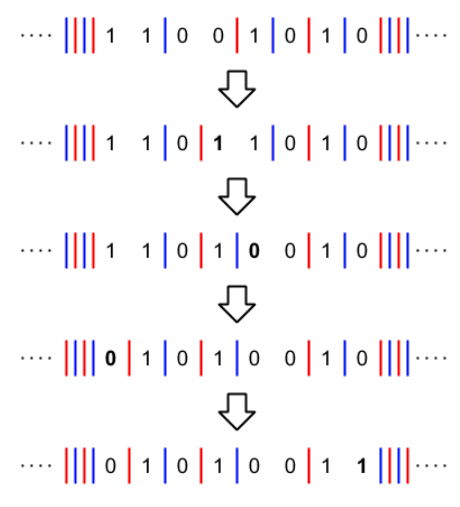
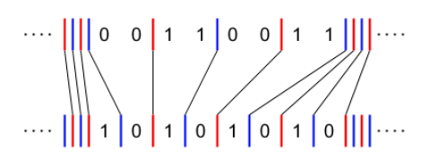
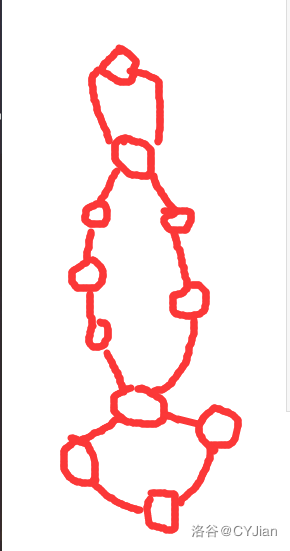
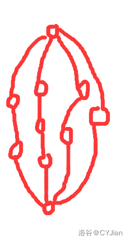
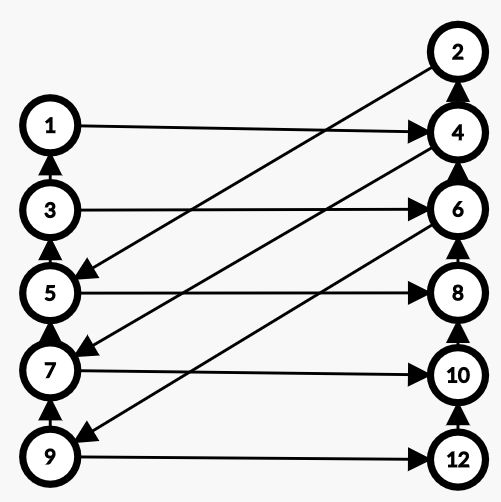

[TOC]

## [AT3966 [AGC025C] Interval Game](https://www.luogu.com.cn/problem/AT3966)

首先如果你是 $A$，那么你的策略很简单，就是走到两个端点较近的一个，显然是不亏的。

那么后手的想法就是让 $A$ 反复横跳，交替跳到 $R$ 最小的和 $L$ 最大的。然后只需要枚举第一步是向左还是向右就可以了。

## [AT3969 [AGC025F] Addition and Andition](https://www.luogu.com.cn/problem/AT3969)

考虑答案有一个上界，考虑每一条边经过了 $c_i$ 次，答案就是 $\sum \min(2,c_i)$。

考虑如何构造上界。首先找到一片叶子，然后找到它的父亲节点 $v$ 和到 $v$ 的边 $id$，考虑：

- $c_{id}=0$，直接删除没有影响
- $c_{id}=1$，可以直接把这条覆盖的边 $(u,x)$ 变成 $(v,x)$，肯定可以覆盖 $id$
- $c_{id}=2$，可以找到两条路径 $(u,a)$ 和 $(b,u)$，然后公共部分就直接满足要求了，然后剩下可以等价于 $(b,a)$ 或 $(a,b)$ 把这条两条路径合并扔给，然后把剩下的路径扔到 $v$。

这样操作显然时可以到上界的。

然后因为 $N\le 2000$ 可以直接暴力模拟。但是模拟可能不是很好写，我们可以用 $res_i$ 表示这条路径时正的还是反的，然后合并路径 $(u,a)$ 和 $(u,b)$ 就等价于说 $(u,b)$ 的正反和 $(b,a)$ 相反，$(u,a)$ 的正反和 $(b,a)$ 相同，可以直接把 $(u,a)$ 改成 $(b,a)$ 然后把 $(u,b)$ 挂到 $(b,a)$ 上。

## [AT3969 [AGC025F] Addition and Andition](https://www.luogu.com.cn/problem/AT3969)

首先考虑模拟这个过程，首先设 $x_i$ 表示 $x$ 从低到高第 $i$ 位的值，$y_i$ 同理，那么一次操作实际上是这样的：

- 从大到小枚举 $i$
- 如果 $x_i=y_i=1$，那么 $x_i,y_i\leftarrow 0$，$x_{i+1}\leftarrow x_{i+1}+1,y_{i+1}\leftarrow y_{i+1}+1$
- 然后从第 $i+1$ 位开始进位

然后利用一些人类智慧可以发现，操作第 $j<i$ 个位值产生的进位不会波及到 $i$ 位的进位，也就是说，如果我们操作 $i,j,i,j,i,j,\dots$ 和操作 $i,i,i,\dots,j,j,j,\dots$ 是等价的，所以我们可以把上面的算法变成下面的算法：

- 从大到小枚举 $i$
- 设计数器变量 $z=k$，然后枚举 $j=i,i+1,\dots$
  - 如果 $x_{j}=y_{j}=1$ 且 $z>0$ 就让 $x_{j},y_{j}\leftarrow 0$，$x_{j+1}\leftarrow x_{j+1}+1,y_{j+1}\leftarrow y_{j+1}+1,z\leftarrow z-1$
  - 如果 $x_{j}=2\lor y_{j}=2$ 就进位
  - 否则就退出。

然后除了 $x_{i}=y_{i}=1,x_{i+1}=y_{i+1}=0$ 以外，其它操作都会使 $1$ 的数量减少，所以只要维护下一个有 $1$ 的位值，然后跳过 $11$ 向前移动的过程，复杂度就是 $\mathcal O(n)$ 的了。

## [AT3971 [AGC026B] rng_10s](https://www.luogu.com.cn/problem/AT3971)

首先特判几个情况，如果 $A<B$ 或 $D<B$ 就直接有限了。

然后考虑如果不无限，也就是意味着会出现 $(C,B)$ 也就是这次不补下次又不够，也就是 $C<A-Bx+Dy<B\Rightarrow A-B<Bx-Dy<A-C$ ，然后就看看 $(A-B,A-C)$ 有没有 $\gcd(B,D)$ 的倍数就好了，如果有就是不无限，否则必定无限。

## [AT3974 [AGC026E] Synchronized Subsequence](https://www.luogu.com.cn/problem/AT3974)

考虑把 $b$ 当作 $1$ $a$ 当作 $-1$ 然后可以分成若干个和为 $0$ 的段，每一个段显然都是互相独立的。考虑一个段 $s$ 使得字典序最大。

- $a$ 开头，那么肯定是每一个 $a$ 匹配的 $b$ 都在后面，所以最后的字符串一定是 $abab\dots$ 的形式，我们希望最长就直接贪心就好了
- $b$ 开头，那么记最大的前缀和为 $mx$，那么肯定是先 $mx$ 个 $b$ 然后再 $mx$ 个 $a$，并且所有的 $b$ 都在 $a$ 前面，那么可以发现再 $mx$ 个 $a$ 中间的$b$ 肯定是要选的，进一步地，我们可以推导出对于前 $x$ 个字符使得前缀和为 $mx$，那么后面 $[x+1,n]$ 是全部要选的。然后模拟

这样可以求出每一段的最大字典序。然后从后往前贪心就可以得到最大的答案了。

## [AT4376 [AGC027B] Garbage Collector](https://www.luogu.com.cn/problem/AT4376)

首先一次捡 $a<b<c<d$，肯定顺序是 $d,c,b,a$，那么你就是 $d+4(d-c)+9(c-b)+16(b-a)+25a$，化简一下就是 $5d+5c+7b+9a$。然后我们不妨枚举次数 $k$，那么最远的 $2k$ 个系数是 $5$，然后分别是 $7,9,11,\dots$。然后这个调和级数复杂度就是 $\mathcal O(n\log n)$ 的。

## [AT4377 [AGC027C] ABland Yard](https://www.luogu.com.cn/problem/AT4377)

首先你不会走到一个点没有 $A$ 出或没有 $B$ 出。

然后就很 $\rm Naive$ 了，直接维护出边有没有没有 $A$ 或者没有 $B$ 的，然后删除，然后看一看有没有新的点要删除，如果有就入队。

## [AT4379 [AGC027E] ABBreviate](https://www.luogu.com.cn/problem/AT4379)

首先如果不能操作就直接输出 $1$ 跑路就好了。

否则考虑一个 $t$ 能否被构造。 $t$ 中的一个字符对应 $s$ 中的一个区间。然后我们发现把 $\texttt a$ 当作 $1$ 把 $\texttt b$ 当作 $2$ 那么操作后一个字符串 $\bmod 3$ 下的和是不变的。然后这是一个必要条件，还有一个必要条件就是 $s$ 可以操作或不用操作。因此 $s$ 能变成 $\texttt a$ 的必要条件是 $p(s)=p(\texttt a)$ 并且 『$|s|=1$ 或 $s$ 中有相邻的两个相等』。然后分析一波也是充分的。

然后考虑贪心匹配 $t$，对于 $t$ 的开头，找到 $s$ 的最短前缀使得和相等并且有相邻两个相等。但是这样可能会剩下一个后缀，首先要满足 $p(s)\equiv0\pmod 3$，然后可以通过一些证明得到肯定有一种分隔方式使得分成 $t$。

然后就可以 $\rm dp$ 了，设一个 $f_i$ 表示这个后缀的答案，用 $nx_{i,0/1}$ 表示从当前位置开始找到满足 $\texttt a/\texttt b$ 要求的最短前缀，然后模拟就好了。因为是贪心所以不会计算重复。

## [AT4437 [AGC028C] Min Cost Cycle](https://www.luogu.com.cn/problem/AT4437)

首先边权是取 $\min$，答案也是取 $\min$，两个是同向的，所以第一个转换是每条边两个随便选，最后的答案显然就是原题的答案。

然后有一个集合 $T$ 是你选的数，然后把一个点分成 $4$ 类：

- `00`，$a_i,b_i\notin T$
- `11`，$a_i,b_i\in T$
- `01`，$b_i\notin T,a_i\in T$
- `10`，$b_i\in T,a_{i}\notin T$

然后一个结论是 $|T|=n$，并且如果第 $i$ 个是 `*0` 那么下一个就是 `1*`。然后就分类：

- 全是 `01`/`10`
- 有 `11 `和 `00`

可以发现就这两种情况。第一种是平凡的，考虑第二种。首先把全部 $a_i,b_i$ 丢进去排序，然后把前 $n$ 个当作 $T$，如果全部是 `01`/`10` 或者出现过 `11`，那么就是合法的。

否则考虑把 $n$ 换成 $n+1$，如果出现了 `11` 也就是 $n$ 和 $n+1$ 来自不同的 $i$ 或者全部 `01`/`10` 了就合法了。

然后如果 $n$ 和 $n+1$ 来自同一个 $i$ 那么现在有两种抉择：

-  用 $n+1$ 替换 $n$
- 用 $n$ 替换 $n-1$

然后就没有然后了。

## [AT4438 [AGC028D] Chords](https://www.luogu.com.cn/problem/AT4438)

首先让 $n$ 乘二。

这个环看上去就很烦，考虑断环为连直接变成链，然后$[L_1,R_1],[L_2,R_2]$ 有交叉但不包含就说明再环上有交点。

然后考虑一个很经典的计数方法，就是枚举一个联通块统计了多少次。可以发现，钦定 $[i,j]$ 在同一个联通块内部，然后里面的点都不能往外面连边所以内外方案数独立。不妨记 $c(i,j)$ 表示 $[i,j]$ 可以自由支配的点的数量，$g(x)$ 表示 $x$ 个点两两匹配的方案数，也就是 $1\times 3\times\dots\times (x-1)$。

那么对于 $[i,j]$ 我们希望强制 $i,j$ 在同一个联通块内部的方案数，但是并不好求。考虑容斥，如果 $i,j$ 不在同一个联通块内部，那么枚举联通块 $[i,k](k<j)$，然后剩下的点就可以放任自流，然后就有了 $\rm dp$：
$$
f_{i,j}=g(c(i,j))-\sum_{i\le k<j}f_{i,k}\times g(c(k+1,j))
$$
最后一个 $f_{i,j}$ 对答案的贡献是 $f_{i,j}\times g(n-2k-c(i,j))$

## [AT4439 [AGC028E] High Elements](https://www.luogu.com.cn/problem/AT4439)

首先肯定是按位贪心，然后检查后面可行性，能放 $1$ 就放 $1$。

把原来的前缀最大值叫做旧的，否则就是新的。首先旧的最大值不会消失。然后既然只需要判断可行性，我们有一个结论是可以通过调整一个使得全部都是旧的。证明就考虑如果两个都有新的，那么可以把一个新的放到另一个序列，那么这两个新的就都没了。

然后就稍微好做一点了，考虑现在 $x$ 的上升数量是 $cx$，$y$ 的上升位数量是 $cy$，在 $[i+1,n]$ 有 $c$ 个旧的最大值，假设 $x$ 全部是旧的，$y$ 有 $k$ 个旧的和 $m$ 个新的，那么：
$$
cx+c-k=cy+k+m\iff 2k+m=c+cx-cy
$$
然后就相当于能不能在 $[i+1,n]$ 找到一个递增序列，旧的权值为 $2$，新的权值为 $1$，权值和为 $c+cx-cy$。

维护这个东西线段树就可以做了。然后发现如果能凑出权值 $w$ 那么一定能凑出权值 $w-2$ 所以对奇偶分别维护一颗线段树即可。

## [AT4440 [AGC028F] Reachable Cells](https://www.luogu.com.cn/problem/AT4440)

首先有一个非常 $\rm Naive$ 的 $\mathcal O(n^4)$，因为太 $\rm Naive$ 了所以对答案一点贡献也没有。

我们首先从下往上，从右往左便利每一个点，然后可以处理出一个点 $i,j$ 到第 $k$ 行最左端的点 $L_{i,j,k}$ 和最右端的点 $R_{i,j,k}$。这个 $\rm dp$ 显然是可以做到 $\mathcal O(n^3)$，但是这个不能直接拿来用，因为这一段区间里面不是所有点都能走到的。

然后考虑对于一个点开始走，如果这个点左和上都是障碍，那么这个点对只会的答案就没用过了，可以直接当做障碍。然后我们还能发现，如果一个点还没有被标记成障碍，并且 $y\in[L_{i,j,x},R_{i,j,x}]$，那么 $(x,y)$ 就一定能被访问到。

这样就是对的，直接用 $\rm dfs$ 暴力模拟这个过程就可以了。

## [AT4501 [AGC029B] Powers of two](https://www.luogu.com.cn/problem/AT4501)

首先，对于一个 $x$，满足 $x+y=2^i,y\le x$ 的 $y$ 是唯一的。

然后从大到小枚举 $x$，尽可能匹配那一个唯一的 $y$，随便用一个 `map` 维护一下就好了。

## [AT4514 [AGC030E] Less than 3](https://www.luogu.com.cn/problem/AT4514)

常规做法非常不好做，题解给出了一个绝妙的转化，对于一个位置 $s_i\ne s_{i+1}$，就放一个隔板，每一次可以让隔板移动一位，大概是这样：

然后隔板的匹配确定后次数的下界也就确定了，就是每一个的距离和。

然后这个下界很明显是能取到的。然后只需要枚举 $\mathcal O(n)$ 种匹配就对了，复杂度 $\mathcal O(n^2)$。

## [AT4515 [AGC030F] Permutation and Minimum](https://www.luogu.com.cn/problem/AT4515)

首先如果 $A_{2i-1}$ 和 $A_{2i}$ 都不是 $-1$ 那么实际上 $B_{i}$ 就确定了，然后直接扔掉就好了。

然后实际上 $(-1,-1)$ 这样的对值是可以随便换的，所以可以先不考虑他们的顺序最后直接乘数量的阶乘即可。

所以现在的问题变成是 $n$ 个数要匹配，匹配的值是左端点的值，然后如果 $i$ 在一开始的序列中就出现了就 $v_i=1$ 否则就是 $0$，那么一个匹配如果两端的 $v_i$ 都是 $0$，那么顺序是无关的，因为我们最后乘阶乘，但是如果有一端是 $v_i=1$ 那么顺序就有关了因为一定出现在特定的位置上。当然不会出现两个 $v_i$ 都是 $1$。

然后就可以 $\rm dp$ 了。从大到小 $\rm dp$，记 $f_{i,j,k}$ 表示处理了 $\ge i$ 的数，有 $j$ 个是 $v_x=1$ 的未匹配，$k$ 个 $v_x=0$ 的未匹配，然后可以转移：

- $v_i=1$
  - $f_{i,j+1,k}\leftarrow f_{i+1,j,k}$
  - $f_{i,j,k-1}\leftarrow f_{i+1,j,k}$
- $v_i=0$
  - $f_{i,j,k-1}\leftarrow f_{i+1,j,k}$
  - $f_{i,j-1,k}\leftarrow j\times f_{i+1,j,k}$
  - $f_{i,j,k+1}\leftarrow f_{i+1,j,k}$

然后就做完了，复杂度 $\mathcal O(n^3)$。

## [AT4693 [AGC031C] Differ by 1 Bit](https://www.luogu.com.cn/problem/AT4693)

比较有意思的构造。

首先这个 $A,B$ 只需要一个就够了，你可以强制 $A'\leftarrow 0,B'\leftarrow A\oplus B$，构造完最后再异或上 $A$。下面只考虑 $A=0$ 的构造。

然后有一个很显然的不合法情况是如果 $\rm{popcount}(B)$ 是偶数那么一定是不合法的。我们考虑证明是奇数一定有构造方案。找到 $B$ 有一位 $j$ 是 $1$，那么把所有数的第 $j$ 位与第 $n$ 位交换，然后让前 $2^{n-1}$ 个最高位是 $0$，后 $2^{n-1}$ 个最高位是 $1$，然后变成了两个子问题，第一段以 $1$ 结尾，第二段以 $1+2^{n-1}$ 开头操作过的 $B$ 结尾。 $n=1$ 时显然是合法的，因此构造是正确的。

代码就模拟一下就好了。

## [AT4694 [AGC031D] A Sequence of Permutations](https://www.luogu.com.cn/problem/AT4694)

首先一个排列也可以看做一个函数，$p(i)$ 表示第 $i$ 位上的值，那么函数就可以符合，$p=a\circ b$ 也就是说 $p_i=a_{b_i}$。那么 $f(p,q)\circ p=q\Rightarrow f(p,q)=q\circ p^{-1}$。排列显然是有逆的。于是：
$$
a_1=p\\
a_2=q\\
a_3=q\circ p^{-1}\\
a_4=q\circ p^{-1}\circ  q^{-1}\\
a_5=q\circ p^{-1}\circ q^{-1}\circ p\circ q^{-1}\\
a_6=q\circ p^{-1}\circ q^{-1}\circ p\circ q^{-1} \circ q\circ p^{-1}\circ q^{-1}
$$
然后可以发现每一步都是：

- $p$ 换成 $q$，$p^{-1}$ 换成 $q^{-1}$
- $q$ 换成 $q\circ p^{-1}$，$q^{-1}$ 换成 $p\circ q^{-1}$

然后发现 $L=q\circ p^{-1}\circ q^{-1}\circ p$ 在上面的变换下是不变的，而且经过 $6$ 次操作 $p\to L\circ  p\circ L^{-1}$，$q\to L\circ q\circ L^{-1}$，$p^{-1}\to L\circ p^{-1}\circ L^{-1}$，$q^{-1}\to L\circ q^{-1}\circ L^{-1}$。

于是 $a_n=L\circ a_{n-6}\circ L^{-1}$。

快速幂即可 $\mathcal O(n\log k)$，找环可以做到 $\mathcal O(n)$。

## [AT4695 [AGC031E] Snuke the Phantom Thief](https://www.luogu.com.cn/problem/AT4695)

先考虑一维的情况，枚举一共选的个数 $k$，那么对 $x$ 排序，那么第 $i$ 个，对限制 $t,a,b$

- $t=\texttt{L}$，那么如果 $i>b$，则 $x_i>a$
- $t=\texttt{R}$，那么如果 $i\le k-b$，则 $x_i<a$

然后就可以得到第 $i$ 个的取值范围。

两维的情况就跑最大费用最大流即可。

这样不一定第 $i$ 个横坐标一定排在第 $i$ 个，但是跑出来符合条件就一定不会超出限制。

## [AT4696 [AGC031F] Walk on Graph](https://www.luogu.com.cn/problem/AT4696)

首先发现正着走需要记录长度很不方便，可以倒着走，一开始在 $t$，有一个数字 $0$，然后如果当前在 $u$ 上数字为 $x$，经过一条边 $(u,v,w)$ 变成 $2x+w$，问能不能走到 $s$ 数字为 $r$。不妨记 $(u,x)$ 表示在 $u$ 手上的数字为 $x$ 的状态。

然后一个重要结论是对于 $(u,x)$ 可以 $(u,x)\to(v,2x+w)\to(u,4x+3w)\to\dots$，因为 $mod$ 是奇数所以经过 $\varphi(mod)$ 次之后又会回到 $(u,x)$，这就形成了一个环。也就是说，这种关系是双向的。因此我们可以对所有可以达到的状态连边，然后看 $(t,0)$ 与 $(s,r)$ 在不在同一个连通块内即可。

但是状态还是太多。考虑现在在 $(u,x)$ 有两条边权分别为 $a,b$ 的边，那么 $(u,x)\Leftrightarrow (u,4x+3a)$，$(u,x)\Leftrightarrow(u,4x+3b)$，也就是说我们可以在 $u$ 加上 $3(a-b)$。不妨记这个循环节为 $t_u$，那么一开始 $t_u$ 就是最大的正整数使得所有与 $u$ 相连的边膜 $t_u$ 同余，并且 $t_u$ 是 $mod$ 的因子。然后对于 $(u,v,w)$，$(u,x)$ 和 $(u,x+3t_u)$ 是等价的，$(v,2x+w)$ 和 $(v,2x+6t_u+w)$ 是等价的，因此新的循环节 $t_v'=\gcd(t_v,2t_u)=\gcd(t_u,t_v)$，不停这样下去，最后所有的 $t$ 应当都是相等的，就是找到最大的 $g$ 使得所有边膜 $g$ 同余，$t$ 就是 $\gcd(3g,mod)$。我们不妨把这个循环节当做 $mod$。

于是我们可以把边写成 $kg+z$ 的形式。考虑手上还有一个红色的整数是原来整数加 $z$，即 $(u,{\color{red}{x}})=(u,x-z)$。然后经过一条边 $kg+z$ 就变成 $(x-z)\times 2+kg+z+z=2x+kg$。我们如果有可以把所有的边都减去 $z$ 得到的结果不变。

我们从 $(u,{\color{red}X})$ 开始走，那么我们能走到的点一定满足 $(v,{\color{red}2^pX+qg})$ 的形式。因为 $mod$ 是 $3g$ 的因数所以 $q=0,1,2$。

然后走一条边 $kg$ 过去再回来就得到了 $(v,{\color{red}2^{p+2}X+qg})，$  本来还有 $3kg$ 膜 $mod$ 就直接没了。因此我们只需要考虑 $p=0,1$ 的情况。

所以状态数只剩下 $6n$ 了。然后考虑 $(t,{\color{red}z})$ 与 $(s,{\color{red}r+z})$ 在不在同一个连通块内，首先枚举 $p,q$ 满足 $(t,{\color{red}z})$ 与 $(s,{\color{red}2^pz+qg})$ 在同一个连通块内。然后因为 $2^p$ 可以任意乘 $4$ 所以相当于说 $2^{p+2k}z=r+z-qg$，可以预处理出 $2^{p+2k}z$ 所有的值然后就可以判断了。

复杂度看上去是 $\mathcal O(mod+n\alpha(n))$ 的。

## [AT4516 [AGC032A] Limited Insertion](https://www.luogu.com.cn/problem/AT4516)

倒着模拟。

首先如果 $b_i>i$ 肯定无解。

否则最后一次操作肯定是在最大的 $i$ 满足 $a_i=i$ 插入 $i$。撤销这次操作，然后继续模拟。

## [AT4517 [AGC032B] Balanced Neighbors](https://www.luogu.com.cn/problem/AT4517)

有实力的洛谷题面是错的，不需要边数最少。

然后可以先构造原图的补图，要求是自己和所有的相连的点加起来和相同。如果是偶数，就直接 $1\leftrightarrow n,2\leftrightarrow n-1,\dots$，取补图显然联通。如果是奇数，就 $1\leftrightarrow n-1,2\leftrightarrow n-2,\dots$，补图满足条件。

## [AT4518 [AGC032C] Three Circuits](https://www.luogu.com.cn/problem/AT4518)

首先分成若干个环肯定所有度数都是偶数。

然后如果有一个点度数大于等于 $6$ 可以前两个环每个使这个度数 $-2$ 最后一个环就把剩下全部跑完。

然后如果所有点度数都小于等于 $2$ 那么只有一个环显然不合法。

然后就是 $2,4$ 都有，首先如果只有一个 $4$ 是不行的，超过两个 $4$ 必然可行。然后就是有且仅有两个 $4$，有两种情况：

第一种可行，第二种不可行，写一个 $\rm dfs$ 判断一下即可。

## [AT4519 [AGC032D] Rotation Sort](https://www.luogu.com.cn/problem/AT4519)

首先有一个结论是一个数只会移动一次，移动两次就是白给。

考虑一个钦定一个极长上升子序列（中间不能加数），那么剩下的每个数的方向也就确定了。于是就可以 $\rm dp$ 了，记 $dp_i$ 表示以 $i$ 结尾的最小代价，随便转移一下就好了。

## [AT4926 [AGC033C] Removing Coins](https://www.luogu.com.cn/problem/AT4926)

原题的操作非常麻烦，但是稍微转化一下发现操作 $u$ 就等价于删除除了 $u$ 以外的所有叶子。

那么如果操作的是直径的端点，那么直径点数少 $1$，否则少 $2$。

然后就变成一个非常简单的博弈了，边界是 $1$ 个点先手必胜，$2$ 个点后手必胜。

## [AT4927 [AGC033D] Complexity](https://www.luogu.com.cn/problem/AT4927)

比较套路的 $\rm dp$ 优化题。首先有一个状态数 $n^4$ 复杂度 $\mathcal O(n^5)$ 的 $\rm dp$ 肯定是过不了的，考虑优化。

首先一个显然的性质是加一行/列凌乱度会上升。然后我们可以知道凌乱度不会超过 $\lceil \log_2n\rceil+\lceil\log_2m\rceil$ 的。这样状态数比值域大我们可以考虑交换状态。记 $dp_{i,j,k,x}$ 表示左上角为 $(i,j)$，左下角为 $(k,j)$ ，凌乱度为 $x$ 最远能转移到的列。 但是这样还有一个问题是凌乱度恰好为 $x$ 时我们还需要枚举两边的凌乱度才能转移，我们把状态改成凌乱度**不超过** $x$，这样就不需要枚举两边的具体值，只要两边都不超过 $x-1$，新的就一定不会超过 $x$，而且还可以滚动数组优化。

转移就分两种情况转移，如果是两块竖的拼起来，就直接跳两遍就好了。如果是两条横的拼起来，就枚举分界点 $i\le w<k$，那么就是 $\min(dp_{i,j,w,x-1},dp_{w+1,j,k,x-1})$，发现随 $x$ 增大一个增加一个减少可以二分得到分界点然后求出最大值。

复杂度 $\mathcal O(n^3\log^2n)$

## [AT4928 [AGC033E] Go around a Circle](https://www.luogu.com.cn/problem/AT4928)

首先红和蓝是等价的，不妨设 $S_1=\texttt{R}$。

- 如果 $S$ 所有都是 $\texttt{R}$，那么就等价于不能有两个连续的 $\texttt B$，直接 $\rm dp$ 即可。
- 否则至少有一个 $\texttt B$，并且不能出现两个 $\texttt B$ 相邻。不妨设 $S$ 中第一段连续的 $\texttt R$ 长度为 $L$，那么发现在环上两个 $\texttt B$ 中间的 $\texttt R$ 的个数是奇数，不然两边同时是奇数和同时是偶数必然都会出现，那么就会有的位置不能满足 $L$ 然后就不合法。并且每一段的长度都不能超过 $L+1$。而且是奇数之后，行为就固定了，一开始首先走到一个 $\texttt B$，然后走掉一段 $\texttt B$，然后如果接下来 $\texttt R$ 的个数是奇数就走到下一个 $\texttt B$ 否则就反复横跳。有了这个过程之后我们知道长度也不能超过长度是奇数的极长连续段。于是我们得到了最长的长度 $mx$，并且一定是奇数，那么我们就相当于把不大于 $(mx+1)/2$ 的放在一个 $n/2$ 的环上的方案数，首先先求出序列，然后一个序列放到环上的方案数还需要乘上第一段的长度，设置成初始值即可。

## [AT4929 [AGC033F] Adding Edges](https://www.luogu.com.cn/problem/AT4929)

神仙题。

考虑如果限制说必须是 $a,b,c$ 的顺序才能加边 $(a,c)$ 怎么做。那么一条边 $(u,v)$ 能够出现当且仅当 $u,v_1,v_2,\dots,v_k,v$ 在树上是一条链，并且在图上联通，$\rm dfs$ 一遍就能得到一个点能到的位置。

然后转化成不在乎顺序，那么我们需要修一修原题给出的边。更具体地，如果顺次在链上的 $(a,b,c)$，满足 $(a,b),(a,c)\in G_0$，那么我们可以把 $(a,c)$ 缩短成 $(b,c)$。我们希望维护这个缩短。

按顺序加入边并缩短，考虑现在的边缩到极短之后是 $(u,v)$，我们考虑维护 $T$ 以 $1,2,\dots,n$ 为根时的有根树 $T_1,T_2,\dots,T_n$，加边时给 $T_u$ 的 $v$ 子树所有点打上标记 $v$，表示以后加边 $(u,x)$ 可以缩成 $(v,x)$。考虑标记冲突的维护，如果 $T_a$ 的 $b$ 上已经有了 $c$ 标记，现在想打上 $d$ 标记，那么这条链的顺序是 $a,d,c,b$，那么原来的 $(a,c)$ 需要被缩短成 $(d,c)$，然后以后加入 $(a,b)$ 会缩短到 $(c,b)$ 所以子树内部标记不需要更改。

分析一下复杂度是 $\mathcal O(n(n+m))$

## [AT4991 [AGC034A] Kenken Race](https://www.luogu.com.cn/problem/AT4991)

如果出现了 `##` 那么一定不可行。

如果 $c<d$ 那么可以第二个先走肯定可行。

否则需要换位置至少要 `...`

## [AT4993 [AGC034C] Tests](https://www.luogu.com.cn/problem/AT4993)

首先这个 $s$ 显然可二分的，$s$ 越大式子的最大值就越大。

然后其实 $a_i<b_i$，那么 $c_i=l_i$ 否则就是 $r_i$。

然后就是只有一个值是 $s\bmod x$，剩下的不是 $0$ 就是 $x$。然后只需要枚举哪一个是 $s\bmod x$ 剩下的贪心就好了。复杂度 $\mathcal O(n\log (nx))$

## [AT4994 [AGC034D] Manhattan Max Matching](https://www.luogu.com.cn/problem/AT4994)

有一个比较显然的费用流做法，可惜边数是 $n^2$ 的。

考虑曼哈顿距离 $|x_1-x_2|+|y_1-y_2|=max\{  x_1-x_2+y_1-y_2, x_1-x_2-y_1+y_2, -x_1+x_2+y_1-y_2, -x_1+x_2-y_1+y_2 \}$

可以把两个点分离开 $|x_1-x_2|+|y_1-y_2|=max\{ (x_1+y_1)+(-x_2-y_2), (x_1-y_1)+(-x_2+y_2), (-x_1+y_1)+(x_2-y_2), (-x_1-y_1)+(x_2+y_2) \}$

然后这个式子和我们要求的都是 $\max$，所以我们只需要对对应情况分别连边，然后跑最大费用最大流，因为最大所以肯定选择曼哈顿距离。

然后边数就是 $\mathcal O(n)$ 的了。

## [AT4996 [AGC034F] RNG and XOR](https://www.luogu.com.cn/problem/AT4996)

设 $P_i=\frac{A_i}{\sum_{j=0}^{2^n-1} A_j}$，$E_i$ 表示 $i$ 变成 $0$ 的期望次数（和 $0$ 变成 $i$ 显然是相同的），那么有：
$$
E_i=\begin{cases}0&,&i=0\\\sum_{j=0}^{2^n-1}E_{j}\times P_{i\oplus j}+1&,&i\ne 0\end{cases}
$$
于是不妨记 $P(x)$ 为 $\{P_i\}$ 的集合幂级数，$E(x)$ 为 $\{E_i\}$ 的集合幂级数，$I(x)$ 为 $\{1,1,1,\dots,1\}$ 的集合幂级数，乘法运算为 $x^i\times x^j=x^{i\oplus j}$ 那么有：
$$
E(x)=E(x)\times P(x)+I(x)+c
$$
其中 $c$ 为一修正 $[x^0]E(x)$ 的常数。带入 $x=1$ 得到 $c=-2^n$。然后对两边同时 $\rm FWT$：
$$
\mathrm{FWT}(E(x))=\mathrm{FWT}(E(x))\times \mathrm{FWT}(P(x))+\mathrm{FWT}(I(x)-2^n)\\
\mathrm{FWT}(E(x))_i=\mathrm{FWT}(I(x)-2^n)_i/(1-\mathrm{FWT}(P(x))_i)
$$
然后发现 $i\ne 0$ 时 $\mathrm{FWT}(P(x))_i\ne 1$ 所以分母有意义。但是 $i=0$ 时 $\mathrm{FWT}(P(X))_0=1$ 所以我们没有办法得到 $\mathrm{FWT}(E(x))_0$ 具体的值。但是考虑更改 $\mathrm{FWT}(E(x))_0$ 之后所有 $[x^i]E(x)$ 都会改变相同的值，又知道 $[x^0]E(x)=0$，所以整体偏移就是答案了。

## [AT5139 [AGC035B] Even Degrees](https://www.luogu.com.cn/problem/AT5139)

第一次见挺神仙的第二次见就是套路题了。

首先 $m$ 是奇数无解，否则拉出一棵生成树，非树边随便连，在树上用 $u\leftrightarrow fa_u$ 调整奇偶即可。

## [AT5141 [AGC035D] Add and Remove](https://www.luogu.com.cn/problem/AT5141)

假设我们用天顶星科技使时光倒流，那么考虑每个数对答案的贡献，加入现在要在 $a_i$ 和 $a_i+1$ 中间插入一个数，那么对答案贡献的次数就是 $i$ 和 $i+1$ 贡献的次数之和。初始条件是 $a_1$ 和 $a_n$ 分别贡献 $1$。

然后就可以 $\rm dp$ 了，记 $dp_{l,r,cl,cr}$ 表示区间 $[l,r]$ 其中 $l$ 的贡献次数是 $cl$，$r$ 的贡献次数是 $cr$ 不考虑 $l,r$ 的最小贡献，那么有转移：
$$
dp_{l,r,cl,cr}=\min_{l<i<r}dp_{l,i,cl,cl+cr}+dp_{i,r,cl+cr,cr}+a_i\times (cl+cr)
$$
然后答案就是 $dp_{1,n,1,1}+a_1+a_n$。分析一下复杂度可以知道是 $\mathcal O(2^n)$ 的。

好像爬山也能过但是代码比正解长。

## [AT5142 [AGC035E] Develop](https://www.luogu.com.cn/problem/AT5142)

首先连边 $x\to x-2,x\to x+k$，然后就相当于选出一些不要的数，按照拓扑序删除，如果有环就不合法。

先考虑 $k$ 是偶数的情况，那么奇数和偶数是独立的，可以分开计算然后乘起来。一个限制是不能超过 $\frac k2$ 个数字同时选中，不然出现了环。然后 $\mathcal O(n^2)$ $\rm dp$ 即可。

然后对于 $k$  是奇数的情况，把奇数放一列，偶数放一列，$a$ 和 $a+k$ 在同一行，大概长这样：

然后发现**最小环**的形式是从一个奇数出发，往上走，往右走，往上走，再回来。那么也就意味着我们选中的点往上-往右-往上的长度不能超过 $k+1$。然后就可以在图上 $\rm dp$ 了，记 $f[i][j][k]$ 表示到 $i$ 这一层，右边的选中的长度为 $j$，当前路径最长为 $k$，转移只需要枚举当前层怎么选即可。

## [AT5143 [AGC035F] Two Histograms](https://www.luogu.com.cn/problem/AT5143)

首先有一个结论如果存在 $k_i=j-1,l_j=i$ 那么换成 $k_i=j,l_j=i-1$ 是不变的，并且两个方案都不存在 $k_i=j-1,l_j=i$ 那么如果不一样那么图就一定不同构。

然后我们只需要钦定 $i$ 个拐角存在 $k_i=j-1,l_j=i$，乘上容斥系数 $(-1)^i$ 就做完了。
$$
\sum_{i=0}^{\min(n,m)}\binom ni\binom mii!(n+1)^{m-i}(m+1)^{n-i}
$$

## [AT5144 [AGC036A] Triangle](https://www.luogu.com.cn/problem/AT5144)

考虑一个点先固定在 $(0,0)$，剩下两个点分别为 $(x_1,y_1),(x_2,y_2)$，那么 $S=|x_1y_2-x_2y_1|$，可以取 $x_1=10^9,y_2=\lceil\frac S{x_1}\rceil,x_2=1,y_1=x_1y_2-S$

## [AT5145 [AGC036B] Do Not Duplicate](https://www.luogu.com.cn/problem/AT5145)

考虑第一个是 $x$，那么下次出现 $x$ 时候会把栈弹空。因此是有循环节的，可以让 $k$ 对循环节取模。

然后剩下的 $k$ 不会很大，就暴力跳直到 $k\le 5$ 然后跑暴力。

## [AT5146 [AGC036C] GP 2](https://www.luogu.com.cn/problem/AT5146)

首先有三个必要条件：

- $\sum_{i=1}^na_i=3m$
- $\max_{i=1}^na_i\le 2m$
- $\sum_{i=1}^na_i\bmod 2\le m$

然后大概可以证明也是充分的。然后就可以做了。首先忽略第二个条件，那么可以枚举奇数的个数 $i$ ，然后 $3m-i$ 如果是偶数那么就相当于 $\frac{3m-i}2$ 个数分给 $n$ ，答案就是 $\binom ni\binom{(3m-i)/2+n-1}{n-1}$

然后就是违反了第二条的要减掉。因为最多只有一个数违反第二条，所以可以假装是 $a_1$ 然后再乘上 $n$。可以枚举这个值是多少，剩下的数已经 $\le m-1$ 所以奇数的个数一定满足第三条限制。

## [AT5147 [AGC036D] Negative Cycle](https://www.luogu.com.cn/problem/solution/AT5147)

首先没有负环等价于差分约束系统有解。那么倒过来说，我们只需要确定一组解 $\{x_i\}$，那么就可以知道最多能保留那些边。因为初始的边不能删去，所以 $x_i\ge x_{i+1}$。设 $q_i=x_i-x_{i+1}$，那么一定有 $q_i\ge 0$。

假设保留一条边权为 $-1$ 的边 $i\to j$，也就是 $i<j$，那么 $x_1-x_j\ge 1$ 即 $q_i+q_{i+1}+\dots+q_{j-1}\ge 1$

假设保留一条边权为 $1$ 的边 $i\to j$，也即是 $i>j$，那么 $x_j-x_i\le 1$ 即 $q_j+q_{j+1}+\dots+q_{i-1}\le 1$

因此一条被删去的 $i\to j,i<j$ 的条件是 $q_i+q_{i+1}+\dots+q_{j-1}=0$

一条被删去的 $i\to j,i>j$ 的条件是 $q_j+q_{j+1}+\dots+q_{i-1}\ge 2$

然后就可以 $\rm dp$ 了，$dp(i,j)$ 表示上一个 $1$ 在 $i$，上上一个 $1$ 在 $j$ 的已经确定的值的最小值。 $i<j<k$，那么 $dp(i,j)$ 可从 $dp(j,k)$ 转移过来，新增的值是 $[j+1,i]$ 内部的边和 $[1,j]\to [i+1,n]$ 的边。

## [AT5148 [AGC036E] ABC String](https://www.luogu.com.cn/problem/AT5148)

首先把连续的同一字母缩成一段，然后考虑 `A`,`B`,`C`  的个数分别为 $c_A,c_B,c_C$，不妨设 $c_A\le c_B\le c_C$。答案有一个上界是 $3c_A$，可以这道题不一定能取到。

那么我们的目标首先是 $c_C=c_B$，也就是让 $c_C$ 减小。`A` 把字符串分成了若干段，每一段都是 `CB` 交替出现。一个方法是 `CBCB...` 可以删去开头的 `C`，`..BCBC` 可以删去结尾的 `C`，在两个 `A` 之间的不能删空，直到 $c_B=c_C$

但是可能没有办法删到 $c_B=c_C$，比如 `ACACABCBCBCBA`， 那么在这种情况下我们不得不删除 `AC` 来使 $c_C$ 的数量减少。可以证明经过这一步肯定有 $c_B=c_C$。

然后就是让 $c_A=c_B=c_C$，那么我们只需要删 `BC` 即可。可以证明一定是可以删的。

然后就输出最后的方案即可。

## [AT5149 [AGC036F] Square Constraints](https://www.luogu.com.cn/problem/AT5149)

首先 $P_i$ 有上界 $R_i=\min(\lfloor\sqrt{4\times n^2-i^2}\rfloor,2\times n-1)$，下界 $L_i=\max(\lceil\sqrt{n^2-i^2}\rceil,0)$

然后先不考虑下界，那么方案数是很好算的，就是把 $R_i$ 从小大大排序得到 $R'_i$，然后就是：
$$
\prod_{i=0}^{2n-1}R_i+1-i
$$
但是现在有了下界，我们可以钦定 $k$ 个违反下界，也就是 $\le L_i-1$，那么乘上容斥系数 $(-1)^k$ 加起来就是答案。钦定 $k$ 个违反下界可以 $\rm dp$。首先对于所有的 $(L_i,R_i)$，如果没有下界就是 $R_i$ 否则就是 $L_i-1$ 从从小到大排序。设 $f_{i,j}$ 表示前 $i$ 个，已经钦定了 $j$ 个 $<L_i$ 的方案数。那么考虑转移：

- 当前的数字下界是 $0$

  那么这个数字无法被钦定。并且任意下界非 $0$ 的，上界一定 $\ge$ 这个数的上界。记前面下界为 $0$ 的个数是 $c_1$，那么贡献就是 $R_i+1-c_1-j$
  $$
  f_{i+1,j}\leftarrow f_{i,j}\times(R_i+1-c_1-j)
  $$

- 当前数字下界非 $0$

  - 钦定小于下界

    可以选的数字本来是 $L_i$，前面下界为 $0$ 的都会占用一个位置，然后钦定小于下界的也会占用一个位置，所以贡献为 $L_i-c_1-j$
    $$
    f_{i+1,j+1}\leftarrow f_{i,j}\times(L_i-c_1-j)
    $$

  - 放任自流

    可以选的数字个数本来是 $R_i+1$，下界为 $0$ 的都会占用 $n$ 个位置，钦定小于下界的都会占用 $k$ 个位置，前面下界不为 $0$ 的个数为 $c_2$，那么放任自流的 $c_2-j$ 个也会占用位置，于是：
    $$
    f_{i+1,j}\leftarrow f_{i,j}\times(R_i+1-n-k-c_2+j)
    $$

然后我们就可以在 $\mathcal O(n^2)$ 的时间内求出一个 $k$，在 $\mathcal O(n^3)$ 时间解决本题。

